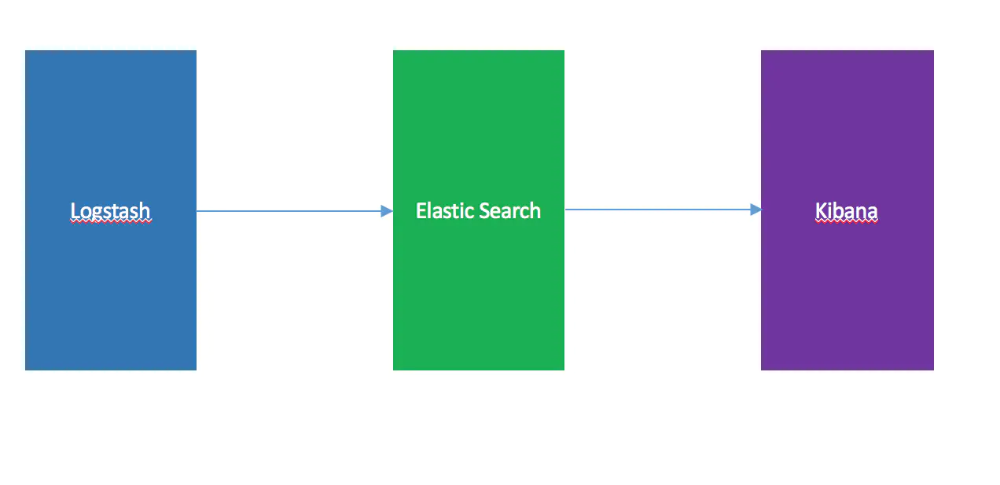
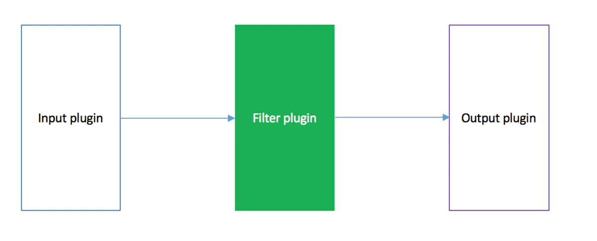
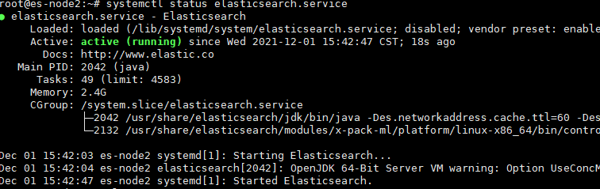
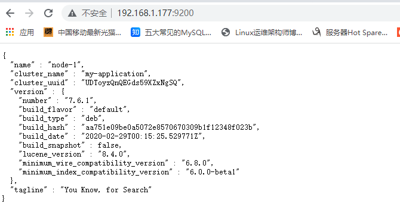
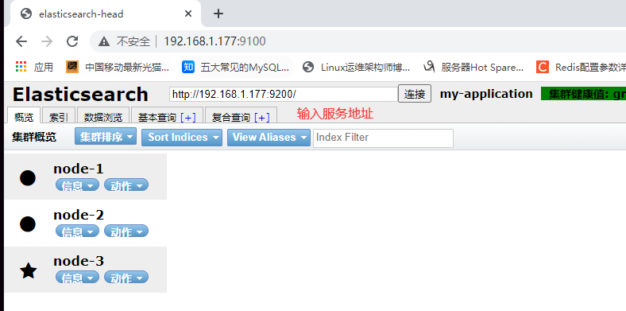
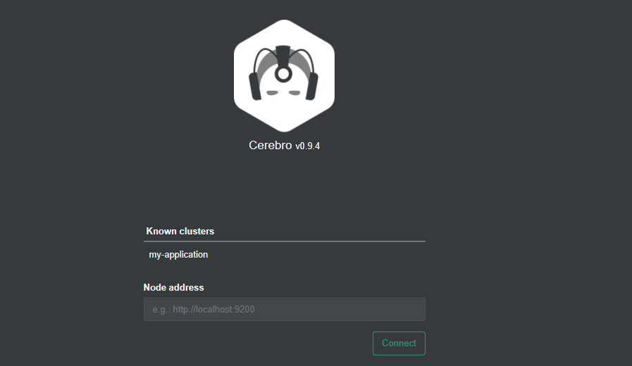
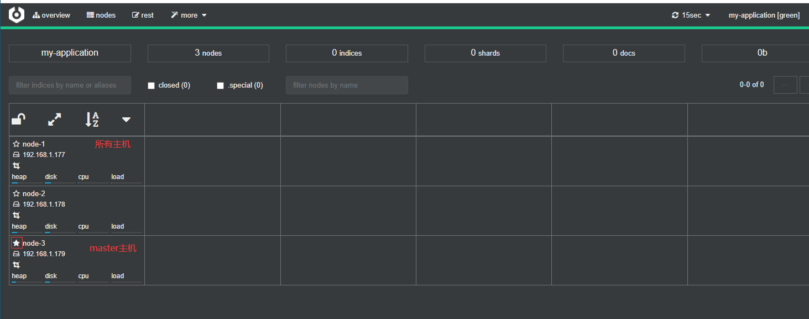
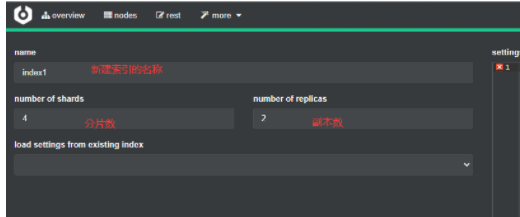

# 简介

  通俗来讲，ELK 是由 Elasticsearch、Logstash、Kibana 三个开源软件的组成的一个组合体，ELK 是 elastic 公司研发的一套完整的日志收集、分析和展示的企业级解决方案，在这三个软件当中，每个软件用于完成不同的功能，ELK 又称为 ELK stack，官方域名为 elastic.co，ELK stack 的主要优点有如下几个：

- 处理方式灵活： elasticsearch 是实时全文索引，具有强大的搜索功能
- 配置相对简单：elasticsearch 的 API 全部使用 JSON 接口，logstash 使用模块配 置，kibana 的配置文件部分更简单。
- 检索性能高效：基于优秀的设计，虽然每次查询都是实时，但是也可以达到百亿级数据的查询秒级响应。
- 集群线性扩展：elasticsearch 和 logstash 都可以灵活线性扩展
- 前端操作绚丽：kibana 的前端设计比较绚丽，而且操作简单

其实 Logstash 的作用就是一个数据收集器，将各种格式各种渠道的数据通过它收集解析之后格式化输出到 Elasticsearch ，最后再由 Kibana 提供的比较友好的 Web 界面进行汇总、分析、搜索。



## 什么是Elasticsearch(elasticstack)

是一个高度可扩展的开源全文搜索和分析引擎，它可实现数据的实时全文搜索搜索、支持分布式可实现高可用、提供 API 接口，可以处理大规模日志数据，比如 Nginx、Tomcat、系统日志等功能。 

Elasticsearch 使用 Java 语言开发，是建立在全文搜索引擎 Apache Lucene 基础之上的搜索引擎，https://lucene.apache.org/。

Elasticsearch 的特点：

- 实时搜索、实时分析
- 分布式架构、实时文件存储
- 文档导向，所有对象都是文档
- 高可用，易扩展，支持集群，**分片与复制**
- 接口友好，支持 json

Elasticsearch写入的日志要求json格式的,否则后期无法画图分析。

### 分片

服务器将要写入的数据拆分成N分，然后同时写入到集群中不同的服务器，能够加快写入和读取的速度，之前默认是5片，7.0之后默认为1个。

### 副本（复制）

可以给分片设置副本分片，可以同步主分片的数据，用于当主分片损坏时，提升为主分片，实现高可用。主分片和副本不能同时放在一个主机上。


## **什么是** **Logstash** 

Logstash 是一个具有实时传输能力的数据收集引擎，其可以通过插件实现日志收集和转发，支持日志过滤，支持普通 log、自定义 json 格式的日志解析，最终把经过处理的日志发送给 elasticsearch。

### 工作流程：

Logstash 内部是管道的方式进行数据的搜集、处理、输出。在 Logstash 中，包括了三个阶段:
输入 input --> 处理 filter（不是必须的） --> 输出 output




Logstash支持多种插件对日志进行处理，可以单独安装。如：input-file 、output-elasticsearch 

Logstash会先通过插件对日志进行正则匹配，例如使用grok将匹配的日志转换成json格式，然后在输出到Elasticsearch中进行储存。

注意：

1. 由于正则匹配在转换成json效率不高，建议将程序输出的日志直接设置成json格式。
2. 当产生日志的服较多时，由于elasticsearch集群写入能力有限，一般Logstash 会先将日志写入到redis或kafka等缓存服务器中，避免日志写入超时，造成日志丢失。然后在使用Logstash 读取缓存的日志，在写入到elasticsearch中。

其他日志工具：logstash,filebeat(不需要java环境，但功能少)，beats

## 什么是 kibana

Kibana 为 elasticsearch 提供一个查看数据的 web 界面，其主要是通过elasticsearch 的 API 接口进行数据查找，并进行前端数据可视化的展现，另外还可以针对特定格式的数据生成相应的表格、柱状图、饼图等


# 二、Elasticsearch部署

Elasticsearch5.0版本之后已经更名为elasticstack，装新版本要找elasticstack的安装包，否所找不到。

[官方文档](https://www.elastic.co/guide/en/elasticsearch/reference/7.16/index.html)：提供包含jdk和不包含jdk的包，目前只有7版本以上才会带jdk，7一下均需要自己安装jdk环境。

 [清华下载地址](https://mirrors.tuna.tsinghua.edu.cn/elasticstack/7.x/apt/pool/main/e/elasticsearch/):清华提供的包都含jdk环境的包，如果希望单独安装jdk需要去官方站点或其他源下载。


## 安装：

系统：ubuntu20.04LTS

es版本：elasticsearch-7.6.1-amd64.deb

```
dpkg -i elasticsearch-7.6.1-amd64.deb
```

### 配置文件

[Elasticsearch 服务配置属性 - IBM 文档](https://www.ibm.com/docs/zh/bpm/8.5.6?topic=service-elasticsearch-configuration-properties)

[官方 Elasticsearch7.16](https://www.elastic.co/guide/en/elasticsearch/reference/7.16/important-settings.html)

```
vim /etc/elasticsearch/elasticsearch.yml

# 集群相关
cluster.name: my-application	# 集群名称，同一个集群需要配置相同的名称
node.name: node-1	# 同一个集群内不能重复


# 存储相关
path.data: /data/esdata	# 数据保存位置
path.logs: /data/eslog	# 日志位置


# 内存相关
bootstrap.memory_lock: true 	# 内存锁定，服务启动时，是否直接占用分配的内存


# 网络相关
network.host: 0.0.0.0	# 监听地址
http.port: 9200	# 监听端口，默认9200


# 集群发现
# 服务器以单播的方式发现集群主机，会启用9300端口进程搜索
discovery.seed_hosts: ["192.168.1.177", "192.168.1.178", "192.168.1.179"] 
# 竞选master的节点有哪些
cluster.initial_master_nodes: ["192.168.1.177", "192.168.1.178", "192.168.1.179"]	
# 当集群中多少台机器启动后，才允许进行数据处理（一般是一半以上）
gateway.recover_after_nodes: 2
	


# 安全相关

# 设置是否可以通过正则或者_all删除或者关闭索引库，默认true表示必须需要显式指定索引库名称，生产环境建议设置为 true，删除索引库的时候必须指定，否则可能会误删索引库中的索引库。
action.destructive_requires_name: true


# 这两个选项如果不开，将无法通过插件访问es集群
http.cors.enabled: true			# 允许跨域访问
http.cors.allow-origin: "*"		# 允许所有地址
```


### 优化设置

```
vim config/jvm.options
# 最好占用宿主机的50%
-Xms2g
-Xmx2g 

# 内核限制和文件描述符占用一定要调大

# 官方建议30G以上
```

#### [内存锁定不生效问题](https://discuss.elastic.co/t/memory-lock-not-working/70576)

```
# 报错信息
Unable to lock JVM Memory: error=12, reason=Cannot allocate memory
his can result in part of the JVM being swapped out.
Increase RLIMIT_MEMLOCK, soft limit: 65536, hard limit: 65536

# 修改pam_limits模块配置文件
vim /etc/security/limits.conf
elasticsearch soft memlock unlimited
elasticsearch hard memlock unlimited

# 修改启动脚本
LimitMEMLOCK=infinity	# 添加这行

```

启动服务

```
mkdir /data/{esdata,eslog} -p
chown elasticsearch.elasticsearch -R /data/*

systemctl start elasticsearch.service 
```



### 日志位置

配置文件中的设置的日志目录，生成 <u>集群名.log</u>的日志文件

```
ls /data/eslog/
my-application_audit.json
my-application_deprecation.json  
my-application_deprecation.log  
my-application_index_indexing_slowlog.json 
my-application_index_indexing_slowlog.log  
my-application_index_search_slowlog.json  
my-application_index_search_slowlog.log  
my-application.log  # 启动日志文件
my-application_server.json
```


查看服务器状态




内存不足可能会杀掉进程,日志：/var/log/syslog


## **head**插件

插件是为了完成不同的功能，官方提供了一些插件但大部分是收费的，head插件是一款免费的管理工具，可以实现对 elasticsearch 集群的状态监控与管理配置等功能。

在 elasticsearch 5.x 版本以后不再支持直接安装 head 插件，而是需要通过启动一个服务方式，git 地址：https://github.com/mobz/elasticsearch-head

### 以docker方式启动插件

```
# 安装docker
apt-get -y install docker-ce
systemctl start docker && systemctl enable docker

# 启动镜像
docker run -d -p 9100:9100 mobz/elasticsearch-head:5
```




## **cerebro**插件

新开源的 elasticsearch 集群 web 管理程序，需要 java1.8 或者更高版本，

https://github.com/lmenezes/cerebro

安装版本：cerebro_0.9.4_all.deb

```
dpkg -i cerebro_0.9.4_all.deb
```

编辑配置

```
vim /etc/cerebro/application.conf 
hosts = [
  {
    host = "http://localhost:9200"
    name = "my-application"
  }
]

# 先安装java,我装的服务器已经装过了
ln -s /usr/share/elasticsearch/jdk/bin/java /bin/

# 启动服务
systemctl start cerebro
systemctl enable cerebro
```

默认监听在9000端口：





新建分片

number of shareds 分片书

number of  replicas 副本分片数



每个创建一个index（索引）都会创建一个文件夹，会大量占用硬盘inode号，造成资源枯竭，可以将index按天、周或者月创建，将数据直接写入索引，而不是创建新索引。

root@es-node1:/data/esdata/nodes/0/indices# ll /data/esdata/nodes/0/indices

drwxr-xr-x 7 elasticsearch elasticsearch 4096 Dec  1 20:02 XalfBSNrRKSg3ir4R6LiXw/


## 集群状态：

[官方文档](https://www.elastic.co/guide/cn/elasticsearch/guide/current/_cluster_health.html)

绿色：一切正常，无数据丢失

黄色：部分副本节点已经失去链接

红色：存在数据丢失情况

es服务提供了api能够返回监控服务器状态

```
root@es-node2:~# curl -sXGET http://192.168.1.177:9200/_cluster/health?pretty=true
{
  "cluster_name" : "my-application",
  "status" : "green",
  "timed_out" : false,
  "number_of_nodes" : 3,
  "number_of_data_nodes" : 3,
  "active_primary_shards" : 4,
  "active_shards" : 12,
  "relocating_shards" : 0,
  "initializing_shards" : 0,
  "unassigned_shards" : 0,
  "delayed_unassigned_shards" : 0,
  "number_of_pending_tasks" : 0,
  "number_of_in_flight_fetch" : 0,
  "task_max_waiting_in_queue_millis" : 0,
  "active_shards_percent_as_number" : 100.0
}


# 编写自定义脚本
获取到的是一个 json 格式的返回值，那就可以通过 python 对其中的信息进行分析，例如对 status 进行分析，如果等于 green(绿色)就是运行在正常，等于yellow(黄色)表示副本分片丢失，red(红色)表示主分片丢失

#!/usr/bin/env python
# coding:utf-8
# 测试服务器状态
import smtplib
from email.mime.text import MIMEText
from email.utils import formataddr
import subprocess
body = ""
false="false"
obj = subprocess.Popen(("curl -sXGET 
http://192.168.15.211:9200/_cluster/health?pretty=true"),shell=True, 
stdout=subprocess.PIPE)
data = obj.stdout.read()
data1 = eval(data)
status = data1.get("status")
if status == "green":
 print("50")
else:
 print("100")
```


# 三、logstash 部署


日志位置：/var/log/logstash/logstash*log

codec => 标准输出里边要写


配置文件

```
 cat /etc/logstash/conf.d/system-log.conf
input {
  file {
    path => "/var/log/messages" #日志路径
    type => "systemlog" #事件的唯一类型
    start_position => "beginning" #第一次收集日志的位置
    stat_interval => "3" #日志收集的间隔时间
  }
   file {
     path => "/var/log/secure"
     type => "securelog"
     start_position => "beginning"
     stat_interval => "3"
   }
}
output { 
  if [type] == "systemlog" {
    elasticsearch {
      hosts => ["192.168.15.11:9200"]
      index => "system-log-%{+YYYY.MM.dd}"
    }
  }
  if [type] == "securelog" {
    elasticsearch {
      hosts => ["192.168.15.11:9200"]
      index => "secury-log-%{+YYYY.MM.dd}"
    }
  }
}

logstash -f 配置文件 -t	# 检测配置文件
```


# 四、kibana **部署及日志收集**

配置文件：

监听端口和地址

elasticsearch.hosts: es服务器地址

语言设置

zh-CN


management 添加数据


input-codec模块读取json数据

codec => json


修改tomcat日志为json格式

```
prefix="tomcat_access_log" suffix=".log"
pattern="{&quot;clientip&quot;:&quot;%h&quot;,&quot;ClientUser&quot;:&quot;%l
&quot;,&quot;authenticated&quot;:&quot;%u&quot;,&quot;AccessTime&quot;:&qu
ot;%t&quot;,&quot;method&quot;:&quot;%r&quot;,&quot;status&quot;:&quot;%s&
quot;,&quot;SendBytes&quot;:&quot;%b&quot;,&quot;Query?string&quot;:&quot;
%q&quot;,&quot;partner&quot;:&quot;%{Referer}i&quot;,&quot;AgentVersion&quo
t;:&quot;%{User-Agent}i&quot;}"
```


java日志多行合并


upstreamtime	# 后端服务器响应时间

responsetime	# 总响应时间

url	后端地址


商业存储：NAS


tcp收集

input {

 tcp {

 port => 9889

host = >192.168.1.177

 type => "tcplog"

 mode => "server" 

 } 

}


# Filebeat 

Filebeat 如何区分不同日志来源

https://blog.csdn.net/weixin_30443747/article/details/95537417


不支持多途径输出