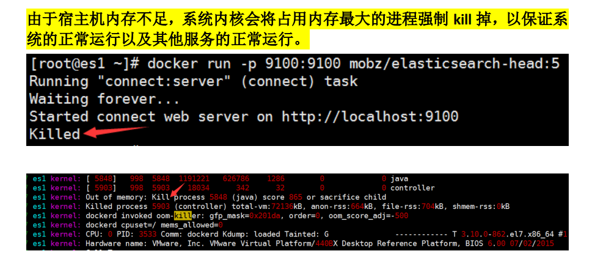

# 一、简介

  通俗来讲，ELK 是由 Elasticsearch、Logstash、Kibana 三个开源软件的组成的一个组合体，ELK 是 elastic 公司研发的一套完整的日志收集、分析和展示的企业级解决方案，在这三个软件当中，每个软件用于完成不同的功能，ELK 又称为 ELK stack，官方域名为 elastic.co，ELK stack 的主要优点有如下几个：

- 处理方式灵活： elasticsearch 是实时全文索引，具有强大的搜索功能
- 配置相对简单：elasticsearch 的 API 全部使用 JSON 接口，logstash 使用模块配 置，kibana 的配置文件部分更简单。
- 检索性能高效：基于优秀的设计，虽然每次查询都是实时，但是也可以达到百亿级数据的查询秒级响应。
- 集群线性扩展：elasticsearch 和 logstash 都可以灵活线性扩展
- 前端操作绚丽：kibana 的前端设计比较绚丽，而且操作简单

其实 Logstash 的作用就是一个数据收集器，将各种格式各种渠道的数据通过它收集解析之后格式化输出到 Elasticsearch ，最后再由 Kibana 提供的比较友好的 Web 界面进行汇总、分析、搜索。


## 什么是Elasticsearch(elasticstack)

是一个高度可扩展的开源全文搜索和分析引擎，它可实现数据的实时全文搜索搜索、支持分布式可实现高可用、提供 API 接口，可以处理大规模日志数据，比如 Nginx、Tomcat、系统日志等功能。 

Elasticsearch 使用 Java 语言开发，是建立在全文搜索引擎 Apache Lucene 基础之上的搜索引擎，https://lucene.apache.org/。

Elasticsearch 的特点：

- 实时搜索、实时分析
- 分布式架构、实时文件存储
- 文档导向，所有对象都是文档
- 高可用，易扩展，支持集群，**分片与复制**
- 接口友好，支持 json

Elasticsearch写入的日志要求json格式的,否则后期无法画图分析。

### 分片

服务器将要写入的数据拆分成N分，然后同时写入到集群中不同的服务器，能够加快写入和读取的速度，之前默认是5片，7.0之后默认为1个。

### 副本（复制）

可以给分片设置副本分片，可以同步主分片的数据，用于当主分片损坏时，提升为主分片，实现高可用。主分片和副本不能同时放在一个主机上。


## **什么是** **Logstash** 

Logstash 是一个具有实时传输能力的数据收集引擎，其可以通过插件实现日志收集和转发，支持日志过滤，支持普通 log、自定义 json 格式的日志解析，最终把经过处理的日志发送给 elasticsearch。

### 工作流程：

Logstash 内部是管道的方式进行数据的搜集、处理、输出。在 Logstash 中，包括了三个阶段:
输入 input --> 处理 filter（不是必须的） --> 输出 output


Logstash支持多种插件对日志进行处理，可以单独安装。如：input-file 、output-elasticsearch 

Logstash会先通过插件对日志进行正则匹配，例如使用grok将匹配的日志转换成json格式，然后在输出到Elasticsearch中进行储存。

注意：

1. 由于正则匹配在转换成json效率不高，建议将程序输出的日志直接设置成json格式。
2. 当产生日志的服较多时，由于elasticsearch集群写入能力有限，一般Logstash 会先将日志写入到redis或kafka等缓存服务器中，避免日志写入超时，造成日志丢失。然后在使用Logstash 读取缓存的日志，在写入到elasticsearch中。

其他日志工具：logstash,filebeat(不需要java环境，但功能少)，beats

## 什么是 kibana

Kibana 为 elasticsearch 提供一个查看数据的 web 界面，其主要是通过elasticsearch 的 API 接口进行数据查找，并进行前端数据可视化的展现，另外还可以针对特定格式的数据生成相应的表格、柱状图、饼图等


# 二、Elasticsearch部署

Elasticsearch5.0版本之后已经更名为elasticstack，装新版本要找elasticstack的安装包，否所找不到。

[官方文档](https://www.elastic.co/guide/en/elasticsearch/reference/7.16/index.html)：提供包含jdk和不包含jdk的包，目前只有7版本以上才会带jdk，7一下均需要自己安装jdk环境。

 [清华下载地址](https://mirrors.tuna.tsinghua.edu.cn/elasticstack/7.x/apt/pool/main/e/elasticsearch/):清华提供的包都含jdk环境的包，如果希望单独安装jdk需要去官方站点或其他源下载。


## 安装：

系统：ubuntu20.04LTS

es版本：elasticsearch-7.6.1-amd64.deb

```
dpkg -i elasticsearch-7.6.1-amd64.deb
```

### 配置文件

[Elasticsearch 服务配置属性 - IBM 文档](https://www.ibm.com/docs/zh/bpm/8.5.6?topic=service-elasticsearch-configuration-properties)

[官方 Elasticsearch7.16](https://www.elastic.co/guide/en/elasticsearch/reference/7.16/important-settings.html)

```
vim /etc/elasticsearch/elasticsearch.yml

# 集群相关
cluster.name: my-application	# 集群名称，同一个集群需要配置相同的名称
node.name: node-1	# 同一个集群内不能重复


# 存储相关
path.data: /data/esdata	# 数据保存位置
path.logs: /data/eslog	# 日志位置


# 内存相关
bootstrap.memory_lock: true 	# 内存锁定，服务启动时，是否直接占用分配的内存


# 网络相关
network.host: 0.0.0.0	# 监听地址
http.port: 9200	# 监听端口，默认9200


# 集群发现
# 服务器以单播的方式发现集群主机，会启用9300端口进程搜索
discovery.seed_hosts: ["192.168.1.177", "192.168.1.178", "192.168.1.179"] 
# 竞选master的节点有哪些
cluster.initial_master_nodes: ["192.168.1.177", "192.168.1.178", "192.168.1.179"]	
# 当集群中多少台机器启动后，才允许进行数据处理（一般是一半以上）
gateway.recover_after_nodes: 2
	

# 安全相关

# 设置是否可以通过正则或者_all删除或者关闭索引库，默认true表示必须需要显式指定索引库名称，生产环境建议设置为 true，删除索引库的时候必须指定，否则可能会误删索引库中的索引库。
action.destructive_requires_name: true


# 这两个选项如果不开，将无法通过插件访问es集群
http.cors.enabled: true			# 允许跨域访问
http.cors.allow-origin: "*"		# 允许所有地址
```


### 优化设置

```
vim config/jvm.options
# 最好占用宿主机的50%
-Xms2g
-Xmx2g 

# 内核限制和文件描述符占用一定要调大

# 官方建议30G以上
```

#### [内存锁定不生效问题](https://discuss.elastic.co/t/memory-lock-not-working/70576)

```
# 报错信息
Unable to lock JVM Memory: error=12, reason=Cannot allocate memory
his can result in part of the JVM being swapped out.
Increase RLIMIT_MEMLOCK, soft limit: 65536, hard limit: 65536

# 修改pam_limits模块配置文件
vim /etc/security/limits.conf
elasticsearch soft memlock unlimited
elasticsearch hard memlock unlimited

# 修改启动脚本
LimitMEMLOCK=infinity	# 添加这行

```

启动服务

```
mkdir /data/{esdata,eslog} -p
chown elasticsearch.elasticsearch -R /data/*

systemctl start elasticsearch.service 
```


### 日志位置

配置文件中的设置的日志目录，生成 <u>集群名.log</u>的日志文件

```
ls /data/eslog/
my-application_audit.json
my-application_deprecation.json  
my-application_deprecation.log  
my-application_index_indexing_slowlog.json 
my-application_index_indexing_slowlog.log  
my-application_index_search_slowlog.json  
my-application_index_search_slowlog.log  
my-application.log  # 启动日志文件
my-application_server.json
```


查看服务器状态


内存不足可能会杀掉进程,日志：/var/log/syslog




## **head**插件

插件是为了完成不同的功能，官方提供了一些插件但大部分是收费的，head插件是一款免费的管理工具，可以实现对 elasticsearch 集群的状态监控与管理配置等功能。

在 elasticsearch 5.x 版本以后不再支持直接安装 head 插件，而是需要通过启动一个服务方式，git 地址：https://github.com/mobz/elasticsearch-head

### 以docker方式启动插件

```
# 安装docker
apt-get -y install docker-ce
systemctl start docker && systemctl enable docker

# 启动镜像
docker run -d -p 9100:9100 mobz/elasticsearch-head:5
```


## cerebro插件

新开源的 elasticsearch 集群 web 管理程序，需要 java1.8 或者更高版本，

https://github.com/lmenezes/cerebro

安装版本：cerebro_0.9.4_all.deb

```
dpkg -i cerebro_0.9.4_all.deb
```

编辑配置

```
vim /etc/cerebro/application.conf 
hosts = [
  {
    host = "http://localhost:9200"
    name = "my-application"
  }
]

# 先安装java,我装的服务器已经装过了
ln -s /usr/share/elasticsearch/jdk/bin/java /bin/

# 启动服务
systemctl start cerebro
systemctl enable cerebro
```

默认监听在9000端口：


### 创建索引

number of shareds 分片书

number of  replicas 副本分片数


## 索引

每个创建一个index（索引）都会创建一个文件夹，会大量占用硬盘inode号，造成资源枯竭，可以将index按天、周或者月创建，将数据直接写入索引，而不是创建新索引。

索引保存位置：

```
root@es-node1:/data/esdata/nodes/0/indices# ll /data/esdata/nodes/0/indices

drwxr-xr-x 7 elasticsearch elasticsearch 4096 Dec  1 20:02 XalfBSNrRKSg3ir4R6LiXw/
```


### 索引删除

es服务器删除index索引，签完不要直接去磁盘删除，应为其他服务会有副本，服务器会自动恢复，需要使用es服务器的api进行删除，或者使用插件去服务器删除

#### 使用cerebro删除


### 使用API定期进行删除

```
#!/bin/bash
# 获取2天前的日期
DATE=`date -d "2 days ago" +%Y.%m.%d`
index="
linux39-nginx-acceslog
tomcat-accesslog-2.105
tomcat-accesslog-2.105
tomcat-accesslog-2.104
tcplog-2.107
syslog-linux39-2.107
"
for NAME in  ${index};do
  FULL_NAME="$NAME-$DATE"	# 拼接完整索引
  echo $FULL_NAME
  #echo linux39-nginx-errorlog-2020.03.18
  curl -XDELETE http://172.31.7.248:9200/${FULL_NAME}
done

```


## 集群状态：

[官方文档](https://www.elastic.co/guide/cn/elasticsearch/guide/current/_cluster_health.html)

绿色：一切正常，无数据丢失

黄色：部分副本节点已经失去链接

红色：存在数据丢失情况

es服务提供了api能够返回监控服务器状态

```
root@es-node2:~# curl -sXGET http://192.168.1.177:9200/_cluster/health?pretty=true
{
  "cluster_name" : "my-application",
  "status" : "green",
  "timed_out" : false,
  "number_of_nodes" : 3,
  "number_of_data_nodes" : 3,
  "active_primary_shards" : 4,
  "active_shards" : 12,
  "relocating_shards" : 0,
  "initializing_shards" : 0,
  "unassigned_shards" : 0,
  "delayed_unassigned_shards" : 0,
  "number_of_pending_tasks" : 0,
  "number_of_in_flight_fetch" : 0,
  "task_max_waiting_in_queue_millis" : 0,
  "active_shards_percent_as_number" : 100.0
}


# 编写自定义脚本
获取到的是一个 json 格式的返回值，那就可以通过 python 对其中的信息进行分析，例如对 status 进行分析，如果等于 green(绿色)就是运行在正常，等于yellow(黄色)表示副本分片丢失，red(红色)表示主分片丢失

#!/usr/bin/env python
# coding:utf-8
# 测试服务器状态
import smtplib
from email.mime.text import MIMEText
from email.utils import formataddr
import subprocess
body = ""
false="false"
obj = subprocess.Popen(("curl -sXGET 
http://192.168.15.211:9200/_cluster/health?pretty=true"),shell=True, 
stdout=subprocess.PIPE)
data = obj.stdout.read()
data1 = eval(data)
status = data1.get("status")
if status == "green":
 print("50")
else:
 print("100")
```


# 三、logstash 部署

Logstash 是一个开源的数据收集引擎，可以水平伸缩，而且 logstash 整个 ELK当中拥有最多插件的一个组件，其可以接收来自不同来源的数据并统一输出到指定的且可以是多个不同目的地。


官方文档：https://www.elastic.co/guide/en/logstash/7.6/index.html


## 安装

安装版本：logstash-7.6.1.de

logstash需要使用java环境，且只需要java11和java8

```
# 安装java环境
 apt install openjdk-11-jdk
# 安装logstash
dpkg -i logstash-7.6.1.deb 
```

日志位置：/var/log/logstash/logstash*log

配置文件位置：/etc/logstash/conf.d/system-log.conf

安装位置： /usr/share/logstash/bin/

logstash启动默认使用logstash用户，但是当收集一些系统日志时可能没有读权限，需要将logstash启动使用root或者root组， 或者将系统日志改正所有用户可读

启动脚本：

```
root@localhost:~# vim /etc/systemd/system/logstash.service 
[Unit]
Description=logstash

[Service]
Type=simple
User=logstash	# 启动用户
Group=logstash
# Load env vars from /etc/default/ and /etc/sysconfig/ if they exist.
# Prefixing the path with '-' makes it try to load, but if the file doesn't
# exist, it continues onward.
EnvironmentFile=-/etc/default/logstash
EnvironmentFile=-/etc/sysconfig/logstash
ExecStart=/usr/share/logstash/bin/logstash "--path.settings" "/etc/logstash"
Restart=always
WorkingDirectory=/
Nice=19
LimitNOFILE=16384

[Install]
WantedBy=multi-user.target
```


## 配置

logstash的功能是由自身插件提供的，实现不同的功能需要在配置文件中调用不同的插件。


### 使用标准输入输出测试

```
vim /etc/logstash/conf.d/stdin-out.conf
input{
    stdin {}	# 接受标准输入的插件
}
output{
    stdout {
        codec => rubydebug
    }
}

# 检测配置文件
/usr/share/logstash/bin/logstash -f /etc/logstash/conf.d/stdin-out.conf -t
# -f指定配置文件
# -t进行测试
```

启动服务

```
 /usr/share/logstash/bin/logstash -f /etc/logstash/conf.d/stdin-out.conf

/usr/share/logstash/vendor/bundle/jruby/2.5.0/gems/awesome_print-1.7.0/lib/awesome_print/formatters/base_formatter.rb:31: warning: constant 
ceshi
{
    "@timestamp" => 2021-12-07T01:16:32.773Z,
      "@version" => "1",
       "message" => "ceshi",
          "host" => "localhost"
}
```

**logstash接收数据后会封装一些信息，然后用json格式进行输出**


### 将数据写入文件

```
vim /etc/logstash/conf.d/stdin-tofile.conf
input{
    stdin{}
}
output{
    file{
        path => "/tep/log-%{+YYYY.MM.dd}message"
    }
}


/usr/share/logstash/bin/logstash -f /etc/logstash/conf.d/stdin-tofile.conf
[INFO ] 2021-12-07 09:28:28.709 [Api Webserver] agent - Successfully started Logstash API endpoint {:port=>9600}
stdin to file
[INFO ] 2021-12-07 09:29:00.202 [[main]>worker3] file - Opening file {:path=>"/tep/log-2021.12.07message"}
[INFO ] 2021-12-07 09:29:00.205 [[main]>worker3] file - Creating directory {:directory=>"/tep"}
[INFO ] 2021-12-07 09:29:17.590 [[main]>worker2] file - Closing file /tep/log-2021.12.07message

```

验证是否写入成功

```
root@localhost:/etc/logstash# cat /tep/log-2021.12.07message
{"@timestamp":"2021-12-07T01:28:59.767Z","message":"stdin to file","@version":"1","host":"localhost"}
```


### 将文件数据写入Elasticsearch

```
vim /etc/logstash/conf.d/stdin-toes.conf

input{
	file {
    	path => "/var/log/syslog" # 日志路径
    	type => "systemlog" # 事件的类型，后边可以进行判断
    	start_position => "beginning" # 第一次收集日志的位置（beginning|end）
    	stat_interval => "3" # 日志收集的间隔时间
    }
}

output{
	elasticsearch {
    	hosts => ["192.168.1.177:9200"]
    	index => "syslog-%{+YYYY.MM.dd}"
    }
}

# 启动测试
/usr/share/logstash/bin/logstash -f /etc/logstash/conf.d/stdin-toes.conf 
```


### 一次收集多个日志文件

```
vim /etc/logstash/conf.d/stdin-toes.conf

input{
	file {
    	path => "/var/log/syslog" # 日志路径
    	type => "systemlog" # 事件的类型，后边可以进行判断
    	start_position => "beginning" # 第一次收集日志的位置（beginning|end）
    	stat_interval => "3" # 日志收集的间隔时间
    }
    
    file {
    	path => "/data/logs/nginx/access.log" # 日志路径
    	type => "nginx-access" # 事件的类型，后边可以进行判断
    	start_position => "beginning" # 第一次收集日志的位置（beginning|end）
    	stat_interval => "3" # 日志收集的间隔时间
    }
}

output{
    if [type] == "systemlog"{	# 对日志类型判断
        elasticsearch {
            hosts => ["192.168.1.177:9200"]
            index => "syslog-%{+YYYY.MM.dd}"	# 写入到不同的index
        }
    }

    if [type] == "nginx-access"{
        elasticsearch {
            hosts => ["192.168.1.177:9200"]
            index => "nginx-access-%{+YYYY.MM.dd}"
        }
    }
}

# 重启服务测试

```


## 收集json格式的日志

web访问日志等信息，需要先转换成json格式后，kibana在能够进行画图，因此nginx和tomcat等服务器，需要先把日志配置成json格式

### tomcat日志配置

```
 vim conf/server.xml
 <Valve className="org.apache.catalina.valves.AccessLogValve" 
directory="logs" prefix="tomcat_access_log" suffix=".log"
pattern="{&quot;clientip&quot;:&quot;%h&quot;,&quot;ClientUser&quot;:&quot;%l
&quot;,&quot;authenticated&quot;:&quot;%u&quot;,&quot;AccessTime&quot;:&qu
ot;%t&quot;,&quot;method&quot;:&quot;%r&quot;,&quot;status&quot;:&quot;%s&
quot;,&quot;SendBytes&quot;:&quot;%b&quot;,&quot;Query?string&quot;:&quot;
%q&quot;,&quot;partner&quot;:&quot;%{Referer}i&quot;,&quot;AgentVersion&quo
t;:&quot;%{User-Agent}i&quot;}"/>
```


### nginx配置

```
vim conf/nginx.conf
log_format access_json '{"@timestamp":"$time_iso8601",'
 '"host":"$server_addr",'
 '"clientip":"$remote_addr",'
 '"size":$body_bytes_sent,'
 '"responsetime":$request_time,'
 '"upstreamtime":"$upstream_response_time",'
 '"upstreamhost":"$upstream_addr",'
 '"http_host":"$host",'
 '"url":"$uri",'
 '"domain":"$host",'
 '"xff":"$http_x_forwarded_for",'
 '"referer":"$http_referer",'
 '"status":"$status"}';
 access_log /var/log/nginx/access.log access_json;
```


验证json格式：http://www.kjson.com/


### 收集json日志

如果写入的index之前已有日志，但是不是json或者只格式不一致，需要先删除之前的index重新写入，否则写入的数据kabana无法识别

```
input{
    file {
        path => "/data/logs/nginx/access.log" 
        type => "nginx-access" 
        start_position => "beginning" 
        stat_interval => "3" 
        codec => json	# json格式的日志，需要先进行序列化一下
    }
}

output{
    if [type] == "nginx-access"{
        elasticsearch {
            hosts => ["192.168.1.177:9200"]
            index => "nginx-access-%{+YYYY.MM.dd}"
        }
    }
}

```

查看数据


upstreamtime	# 后端服务器响应时间

responsetime	# 总响应时间

可以统计后端服务的相应时间

## 收集java日志

java日志不太规则，会将一行日志信息拆分成多行输出，logstash默认会将每一行日志当做一条进行收集，因此在查看的时候会造成不方便。

```
[2021-12-07T11:44:58,545][DEBUG][o.e.a.a.c.n.i.TransportNodesInfoAction] [node-1] failed to execute on node [77mNYjt3RxWtWkZwNP8CFA]
org.elasticsearch.transport.NodeNotConnectedException: [node-2][192.168.1.178:9300] Node not connected
    at org.elasticsearch.transport.ConnectionManager.getConnection(ConnectionManager.java:191) ~[elasticsearch-7.6.1.jar:7.6.1]
    at org.elasticsearch.transport.TransportService.getConnection(TransportService.java:618) ~[elasticsearch-7.6.1.jar:7.6.1]
    at org.elasticsearch.transport.TransportService.sendRequest(TransportService.java:590) [elasticsearch-7.6.1.jar:7.6.1]
    at org.elasticsearch.action.support.nodes.TransportNodesAction$AsyncAction.start(TransportNodesAction.java:182) 
    ...
```


使用 codec 的 multiline 插件可以实现多行匹配，这是一个可以将多行进行合并的插件，而且可以使用 what 指定将匹配到的行与前面的行合并还是和后面的行合并

https://www.elastic.co/guide/en/logstash/current/plugins-codecs-multiline.html

```
vim /etc/logstash/conf.d/java.conf
input{
    file {
    	path => "/data/logs/my-application.log" 
    	type => "es" # 事件的类型，后边可以进行判断
    	start_position => "beginning" 
    	stat_interval => "3"
    	codec => multiline {
    	 pattern => "^\["  # 当遇到[开头的行时候将多行进行合并
         negate => true    # true 为匹配成功进行操作，false 为不成功进行操作
         what => "previous" # 与以前的行合并，如果是下面的行合并就写next
    	}
    }
}

output{
    if [type] == "es"{
        elasticsearch {
            hosts => ["192.168.1.177:9200"]
            index => "javalog-%{+YYYY.MM.dd}"	# 写入到不同的index
        }
    }
}

# 重启服务测试

```

查看kibana，已经成功收集为一行


## **收集** **TCP/UDP** **日志** 

通过 logstash 的 tcp/udp 插件收集日志，通常用于在向 elasticsearch 日志补录丢失的部分日志，可以将丢失的日志写到一个文件，然后通过 TCP 日志收集方式直接发送给 logstash 然后再写入到 elasticsearch 服务器。

https://www.elastic.co/guide/en/logstash/5.6/input-plugins.html

配置文件

```
vim /etc/logstash/conf.d/tcp.con
input{
    tcp{
        port => 9889
        type => "tcp1"
        mode => "server"
    }
    # 可以监听多个端口
    tcp{
        port => 9890
        type => "tcp2"
        mode => "server"
    }
}

output{
    if [type] == "tcp1"{
    elasticsearch{
        hosts => ["192.168.1.177:9200"]
        index => "tcp-syslog-%{+YYYY.MM.dd}"
    } }

    if [type] == "tcp2"{
    elasticsearch{
        hosts => ["192.168.1.177:9200"]
        index => "tcp-authlog-%{+YYYY.MM.dd}"
    } }
}


root@localhost:/data/logs# ss -ntl | grep 9889
LISTEN  0       1024                      *:9889               *:*              
root@localhost:/data/logs# ss -ntl | grep 9890
LISTEN  0       1024                      *:9890               *:*  
```


### 通过nc命令发送日志

NetCat 简称 nc，在网络工具中有“瑞士军刀”美誉，其功能实用，是一个简单、可靠的网络工具，可通过 TCP 或 UDP 协议传输读写数据，另外还具有很多其他功能

```
# ubuntu
apt install netcat-traditional

# centos
yum instll nc –y
```


发送日志

```
nc 192.168.1.44 9889 < /var/log/syslog
nc 192.168.1.44 9890 < /var/log/auth.log
```


查看写入的日志


### **通过伪设备的方式发送消息：**

在类 Unix 操作系统中，块设备有硬盘、内存的硬件，但是还有设备节点并不一定要对应物理设备，我们把没有这种对应关系的设备是伪设备，比如/dev/null，/dev/zero，/dev/random 以及/dev/tcp 和/dev/upd 等，Linux 操作系统使用这些伪设备提供了多种不通的功能，tcp 通信只是 dev 下面众多伪设备当中的一种设备。

```
[root@linux-host1 ~]# cat /var/log/syslog > /dev/tcp/192.168.1.44/9889
```


## 通过rsyslog收集日志

rsyslog 提供高性能，高安全性功能和模块化设计。 虽然它最初是作为常规系统日志开发的，但是 rsyslog ，可以接受来自各种来源的输入，转换它们，并将结果输出到不同的目的地。SYSLOG 每秒可以向本地目的地传送超过一百万条消息。

rsyslog 常用于无法安装logstash的交换机、路由器等，可以将日志通过SYSLOG 发送给logstash进行统一收集

这里通过harproxy日志收集来模拟路由器等网络设备

将harproxy日志通过rsyslog写入es

```
 cat /etc/haproxy/haproxy.cfg 
log 127.0.0.1 local7 info	# 将日志写入syslog的local6

# 添加状态页
listen stats
mode http
bind 0.0.0.0:9999
stats enable
log global
stats uri /haproxy-status
stats auth haadmin:123456

```

==haproxy会在 /etc/rsyslog.d/49-haproxy.conf生成一个配置文件，先给他删了，之前赔了好久都不生效，结果发现里边有个这个配置文件==

**编辑** **rsyslog** 服务配置文件：

```
vim /etc/rsyslog.conf 

# 使syslog服务监听tcp和udp 514端口
 # provides UDP syslog reception
module(load="imudp")
input(type="imudp" port="514")

# provides TCP syslog reception
module(load="imtcp")
input(type="imtcp" port="514")

# 添加自定义日志
local7.* /var/log/haproxy.log # 测试可以正常将日志写入本地自定义文件
local7.* @@192.168.1.44:516

# 重启服务
systemctl restart rsyslog.service
```


编辑logstash

```
vim /etc/logstash/conf.d/rsyslog.conf
input {
    syslog{
        port => "516"
        type => "dev1"
    }

    syslog{
        port => "517"
        type => "dev2"
    }
}
output{
    if [type] == "dev1"{
    elasticsearch{
        hosts => ["192.168.1.177:9200"]
        index => "dev1log-%{+YYYY.MM.dd}"
    } }

    if [type] == "dev2"{
    elasticsearch{
        hosts => ["192.168.1.177:9200"]
        index => "dev2log-%{+YYYY.MM.dd}"
    } }
}

```

写入了dev1的日志


## 使用redis缓存

 web 服务器产生大量日志的场景，如果直接写入es可能速度过慢导致日志收集出现阻塞，一般写陷入redis缓存服务器,然后通过logstash读取后再写入es服务器

### 安装并启动redis

```
apt install redis

# 修改配置文件
bind 0.0.0.0
protected-mode yes
port 6379
tcp-backlog 511
timeout 0
tcp-keepalive 300
daemonize yes
supervised no
pidfile /var/run/redis_6379.pid
loglevel notice
logfile ""
databases 16
save ""	# 关闭数据持久化
rdbcompression no #是否压缩
rdbchecksum no #是否校验

systemctl start redis

# 设置临时密码
[root@linux-host2 redis]# redis-cli
127.0.0.1:6379> config set requirepass 123456 #动态设置，重启后无效
OK
```

### 使用logstash写入redis

将 tomcat 服务器的 logstash 收集之后的 tomcat 访问日志写入到 redis 服务器，然后通过另外的 logstash 将 redis 服务器的数据取出在写入到 elasticsearch 服务器。

官 方 文 档 ： https://www.elastic.co/guide/en/logstash/current/plugins-outputs-redis.html

配置我呢见

```
vim /etc/logstash/conf.d/toredis.conf
input {
    file {
    path => "/data/logs/nginx/access.log"
    type => "nginx-accesslog"
    start_position => "beginning"
    stat_interval => "2"
    codec => "json" #对 json 格式日志进行 json 解析
    }
    
    file {
    path => "/data/logs/nginx/access.log"
    type => "tomcat-accesslog"
    start_position => "beginning"
    stat_interval => "2"
    codec => "json" #对 json 格式日志进行 json 解析
    }
 }

output {
    if [type] == "nginx-accesslog" {
        redis {
        data_type => "list"	# 使用列表格式
        key => "nginx-accesslog"	# 取数据的时候也要用这个key
        host => "192.168.1.195"
        port => "6379"
        db => "0"
        password => "123456"
        }
    }
        if [type] == "tomcat-accesslog" {
        redis {
        data_type => "list"
        key => "tomcat-accesslog"
        host => "192.168.1.195"
        port => "6379"
        db => "0"
        password => "123456"
        }
    }
}
```

更新一下数据，不知道有时候文件不更新，logstash不从头开始读数据。

head -n 100 access.log >> access.log 


查看redis数据是否写入

```
root@redis-node1:~# redis-cli 
127.0.0.1:6379> auth 123456
OK
127.0.0.1:6379> keys *
1) "tomcat-accesslog"	# 已经有了index
2) "nginx-accesslog"

# 查看你一下长度，看来之后新添加的100
127.0.0.1:6379> llen tomcat-accesslog
(integer) 100

```

### 从redis读取数据

```
vim /etc/logstash/conf.d/redistoes.conf
input {
 redis {
 data_type => "list"
 key => "tomcat-accesslog"
 host => "192.168.1.195"
 port => "6379"
 db => "0"
 password => "123456"
 codec => "json" #json 解析
 }
 redis {
 data_type => "list"
 key => "nginx-accesslog"
 host => "192.168.1.195"
 port => "6379"
 db => "0"
 password => "123456"
 codec => "json" #json 解析
 }}
 
output {
 if [type] == "nginx-accesslog" {
 elasticsearch {
 hosts => ["192.168.1.177:9200"]
 index => "redis-nginx-accesslog-%{+YYYY.MM.dd}"
}}
# 应为第一次往redis里写的时候加了type，所以可以判断

 if [type] == "tomcat-accesslog" {
 elasticsearch {
 hosts => ["192.168.1.177:9200"]
 index => "redis-tomcat-accesslog-%{+YYYY.MM.dd}"
}}
}
```

再次查看redis里边已经清空了


### **监控** **redis** **数据长度：**

实际环境当中，可能会出现 reids 当中堆积了大量的数据而 logstash 由于种种原因未能及时提取日志，此时会导致 redis 服务器的内存被大量使用，甚至出现如下内存即将被使用完毕的情景

```
# 安装python3-redis库
apt install python3-redis

#!/usr/bin/env python3
import redis
def redis_conn():
 
pool=redis.ConnectionPool(host="192.168.1.195",port=6379,db=0,password=123456)
 conn = redis.Redis(connection_pool=pool)
 data = conn.llen('tomcat-accesslog-1512')
 print(data)
redis_conn()
```


## 日志写入数据库

logstash需要安装插件

install logstash-output-jdbc

# 四、kibana

Kibana 是一款开源的数据分析和可视化平台，它是 Elastic Stack 成员之一，设计用于和 Elasticsearch 协作,可以使用 Kibana 对 Elasticsearch 索引中的数据进行搜索、查看、交互操作,您可以很方便的利用图表、表格及地图对数据进行多元化的分析和呈现。

官方文档：https://www.elastic.co/guide/en/kibana/7.6/index.html


### 安装

版本：kibana-7.6.1-amd64.deb

```
dpkg -i kibana-7.6.1-amd64.deb
```


#### 配置文件：

```
vim /etc/kibana/kibana.yml
server.port: 5601
server.host: "0.0.0.0"
elasticsearch.hosts: ["http://192.168.1.177:9200"]	# 可以配置负载均衡的地址
i18n.locale: "zh_CN"	# 支持中文
```


#### 启动服务

```
root@localhost:/usr/local/src# systemctl start kibana
root@localhost:/usr/local/src# systemctl enable kibana

# 查看日志

# 查看端口
root@localhost:/usr/local/src# ss -tnl | grep 5601
LISTEN  0        511              0.0.0.0:5601           0.0.0.0:*
```


状态页：http://192.168.1.69:5601/status

kibana没有登录认证，任何人都可以进行操作，可以配合nginx进行登录认证


索引管理：

点击Management，会出现2个索引管理。

kibana要展示es收集到的数据，需要先向kibana添加索引，然后kibana会使用添加的索引去es服务器查询。


### 添加索引

Management-索引模式-创建索引


### 查看数据

点击Discover,从右侧选择添加的索引


### 登录认证

将 nginx 作为反向代理服务器，并增加登录用户认证的目的，可以有效避免其 他人员随意访问 kibana 页面。

```
apt install nginx -y
sudo apt-get install apache2-utils 
```

#### 配置nginx代理 kibana

```
vim /etc/nginx/sites-available/kibana.conf 
upstream kibana_server {
 server 127.0.0.1:5601 weight=1 max_fails=3 fail_timeout=60;
}
server {
 listen 80;
 server_name www.kibana.com;
 auth_basic "Restricted Access";	# 认证文件
 auth_basic_user_file /etc/nginx/htpasswd.users; 
 location / {
 proxy_pass http://kibana_server;
 proxy_http_version 1.1;
 proxy_set_header Upgrade $http_upgrade;
 proxy_set_header Connection 'upgrade';
 proxy_set_header Host $host;
 proxy_cache_bypass $http_upgrade;
 } }
 
 
 systemctl restart nginx.service
 systemctl enable nginx.service
```

创建密码文件

```
htpasswd -bc /etc/nginx/htpasswd.users kibana 123456
```


# 五、Bites

这个公司出了好多小的轻量化工具，适合在机器配置较低或者容器内使用


## Filebeat 

Filebeat 是轻量级单用途的日志收集工具，用于在没有安装 java 的服务器上专门收集日志，可以将日志转发到 logstash、elasticsearch 或 redis 及 kafka 等场景中进行下一步处理。

官网下载地址：https://www.elastic.co/downloads/beats/filebeat

官方文档：https://www.elastic.co/guide/en/beats/filebeat/7.6/logstash-output.html#loadbalance


### 安装filebeat

版本要和efk全套保持高度一致，小版本最好都一样。

 ```
dpkg -i filebeat-7.6.1-amd64.deb
 ```


配置filebeat收集多日志

==yml格式的配置文件，一定要注意换行==

```
# 保存一下默认的配置文件
cp  /etc/filebeat/filebeat.yml{,.bak} 

filebeat.inputs:
- type: log	# log是插件名，不是自己定义的
  paths:
    - /var/log/syslog
    - /var/log/auth.log
  fields:
    type: "syslog"
- type: log
  paths:
    - /data/access.log
  fields:	# 这个是自己定义的
    type: "nginx-access"

output.logstash:
  hosts: ["192.168.1.44:5044"]

  # 支配配置多个地址做负载均衡
  #hosts: ["localhost:5044", "localhost:5045"]
  #loadbalance: true


systemctl start filebeat.service 
```

应为filebeat不支持if判断和多途径输出，当希望将日志输出到不同的index中时，需要先将filebeat输入到logstash中进行判断


### logstash接收并分类

```
input {
  beats {
    port => 5044
  }
}

output {
    if [fields][type] == "syslog"{
        elasticsearch {
            hosts => ["192.168.1.177:9200"]
            index => "filebeat-syslog-%{+YYYY.MM.dd}"
        }
    }
    if [fields][type] == "nginx-access"{
        elasticsearch {
            codec => "json"
            hosts => ["192.168.1.177:9200"]
            index => "filebeat-nginx-accesslog-%{+YYYY.MM.dd}"
        }
    }
}

```

查看索引是否分类写入成功


查看是否json是否解析成功


## 通过坐标地图统计客户IP所在城市

通过客户端IP地址，通过GeoLite2-City库获取用户地理坐标，然后再kibana上使用地图工具进行画图

官方地址：https://www.maxmind.com/en/geoip2-city

下载地址https://dev.maxmind.com/geoip/geolite2-free-geolocation-data?lang=en

需要先注册账号，然后才能下载


配置logstash

==其中 elasticsearch 的索引名称必须必须必须以 logstash开头,否则会画图失败==

```
input{
    file {
        path => "/data/logs/nginx/access.log" 
        type => "nginx-access" 
        start_position => "beginning" 
        stat_interval => "3" 
        codec => json	# json格式的日志，需要先进行序列化一下
    }
}

filter {
	if [type] == "nginx-access" { 
		geoip {	# Maxmind GeoLite2 数据库中的插件
			source => "clientip" 
			target => "geoip"
			database => "/etc/logstash/GeoLite2-City.mmdb"
			# 添加经纬度
			add_field => [ "[geoip][coordinates]", "%{[geoip][longitude]}" ]
			add_field => [ "[geoip][coordinates]", "%{[geoip][latitude]}" ]
			}
		mutate {
		# 将经纬度转化成浮点数
		convert => [ "[geoip][coordinates]", "float"]
		}
	}
}

output{
    if [type] == "nginx-access"{
        elasticsearch {
            hosts => ["192.168.1.177:9200"]
            index => "logstash-nginx-access-%{+YYYY.MM.dd}"
        }
    }
}
```

查看写入的数据


点击左侧geoip.location字段，点击可视化


