[Kubernetes 文档 | Kubernetes](https://kubernetes.io/zh/docs/home/)


# 管理服务：


## kube-apiserver：

[kube-apiserver | Kubernetes](https://kubernetes.io/zh/docs/reference/command-line-tools-reference/kube-apiserver/)

Kubernetes API server部署在master管理主机上，是整个k8s集群的数据总线和操作中心，是所有请求的入口， 对etcd数据的写入和查询都是有-apiserver进行的。

所有对象包括 pods、 services、replicationcontrollers 和其它 api 对象,的数据配置，集群状态等查询，数据交互等，都需要通过API server进行验证和执行。

```
# 提供了集群管理的REST API接口(包括认证授权、数据校验以及集群状态变更)； 

# 提供其他模块之间的数据交互和通信的枢纽（其他模块通过API Server查询或修改数据，只有API Server才直接操作 etcd）; 

# 是资源配额控制的入口； 

# 拥有完备的集群安全机制. 

# curl 127.0.0.1:8080/apis 	# 分组api 
# curl 127.0.0.1:8080/api/v1 	# 带具体版本号的api 
# curl 127.0.0.1:8080/ 	# 返回核心api列表 
# curl 127.0.0.1:8080/version 	# api 版本信息 
# curl 127.0.0.1:8080/healthz/etcd 	# 与etcd的心跳监测 
# curl 127.0.0.1:8080/apis/autoscaling/v1 	# api的详细信息 
# curl 127.0.0.1:8080/metrics 	# 指标数据
```


### kube-apiserver服务端口

apiserver在master监听两个端口


通过参数 --insecure-port int ，监听一个非安全的127.0.0.1本地端口(默认为8080)：

```
# 该端口用于接收HTTP请求，该端口默认值为8080，可以通过API Server的启动参数“--insecure-port”的值来修改默认值；

# 默认监听的IP地址为“localhost”，可以通过启动参数“--insecure-bind-address”的值来修改该IP地址；

# 非认证或未授权的HTTP请求（本地服务）通过该端口访问API Server(如：kube-controller-manager、kube-scheduler)。
```


通过参数--bind-address=192.168.7.101，监听一个对外访问且安全(https)的端口(默认为6443)： 

```
# 该端口默认值为6443，可通过启动参数“--secure-port”的值来修改默认值，默认IP地址为非本地（Non-Localhost）网络端口，通过启动参数“--bind-address”设置该值；

# 该端口用于接收客户端、dashboard等外部HTTPS请求，用于基于Tocken文件或客户端证书及HTTP Base的认证；

用于基于策略的授权；
```


## kube-controller-manager：

[kube-controller-manager | Kubernetes](https://kubernetes.io/zh/docs/reference/command-line-tools-reference/kube-controller-manager/)

Controller Manager 作为集群内部的管理控制中心，非安全默认端口10252，,负责集群内的Node、Pod 副本、服务端点（Endpoint）、命名空间（Namespace）、服务账号（ServiceAccount）、资源定额（ResourceQuota）的管理，当某个 Node 意外宕机时，Controller Manager 会及时发现并执行自动化修复流程，确保集群始终处于预期的工作状态。

```
--horizontal-pod-autoscaler-sync-period duration
# 检测pod资源占用情况间隔 The period for syncing the number of pods in horizontal pod autoscaler. (default 15s)

```


## kube-scheduler :

[kube-scheduler | Kubernetes](https://kubernetes.io/zh/docs/reference/command-line-tools-reference/kube-scheduler/)

kube-scheduler是一个拥有丰富策略、能够感知拓扑变化、支持特定负载的功能组件，它对集群的可用性、性能表现以及容量都影响巨大。scheduler 需要考虑独立的和集体的资源需求、服务质量需求、硬件/软件/策略限制、亲和与反亲和规范、数据位置、内部负载接口、截止时间等等。如有必要，特定的负载需求可以通过 API 暴露出来。


#### 调度流程

Scheduler负责Pod调度，在整个系统中起"承上启下"作用.

1.负责接收Controller Manager创建的新的Pod的指令。

2.在所有的Node节点上挑选符合要求的节点，根据算法筛选后确定node，然后将数据写入etcd

3.将操作请求转交给Node上的kubelet接管Pod的生命周期。（Node节点上kubelet通过API Server监听到kubernetes Scheduler产生的Pod绑定信息，然后获取对应的Pod清单，下载Image，并启动容器。 ）


#### 优选策略 

1. LeastRequestedPriority :优先从备选节点列表中选择资源消耗最小的节点（CPU+内存）。 
2. CalculateNodeLabelPriority :优先选择含有指定Label的节点。 
3. BalancedResourceAllocation :优先从备选节点列表中选择各项资源使用率最均衡的节点。


## kubelet

在kubernetes集群中，每个Node节点都会启动kubelet进程，用来处理Master节点下发到本节点的任务，管理Pod和其中的容器。kubelet会在API Server上注册节点信息，定期向Master汇报节点资源使用情况，并通过cAdvisor(顾问)监控容器和节点资源，可以把kubelet理解成Server/Agent架构中的agent，kubelet是Node上的pod管家。


## kube-proxy

[kube-proxy | Kubernetes](https://kubernetes.io/zh/docs/reference/command-line-tools-reference/kube-proxy/)

Kubernetes 网络代理在每个节点上运行。网络代理反映了每个节点上 Kubernetes API 中定义的服务，并且可以执行简单的 TCP、UDP 和 SCTP 流转发，或者在一组后端进行 循环 TCP、UDP 和 SCTP 转发。 当前可通过 Docker-links-compatible 环境变量找到服务集群 IP 和端口， 这些环境变量指定了服务代理打开的端口。 有一个可选的插件，可以为这些集群 IP 提供集群 DNS。 用户必须使用 apiserver API 创建服务才能配置代理。


kube-proxy有三种调度模型：

• userspace：k8s 1.1之前

• iptables：k8s1.10之前

• ipvs：k8s 1.11之后，如果没有开启ipvs，则自动降级为iptables

```
1.9引入到1.11正式版本，需要安装ipvsadm、ipset 工具包和加载 ip_vs 内核模块


lsmod| grep ip_vs

apt install ipvsadm 	# 执行ipvsadm 一下，自动加载内核
```


指定调度算法

```
--proxy-mode=ipvs
--ipvs-scheduler=rr
```


# 安装部署

安装部署k8s有三种方式，

1.是通过手动部署所有二进制包的方式，配置较为复杂

2.使用官方提供的kubeadm工具自动安装快速部署

3.使用批量部署工具如(ansible/ saltstack)批量安装。


**确保每个节点上 MAC 地址和 product_uuid 的唯一性** 

- 你可以使用命令 `ip link` 或 `ifconfig -a` 来获取网络接口的 MAC 地址
- 可以使用 `sudo cat /sys/class/dmi/id/product_uuid` 命令对 product_uuid 校验

一般来讲，硬件设备会拥有唯一的地址，但是有些虚拟机的地址可能会重复。 Kubernetes 使用这些值来唯一确定集群中的节点。 如果这些值在每个节点上不唯一，可能会导致安装 [失败](https://github.com/kubernetes/kubeadm/issues/31)。


**允许 iptables 检查桥接流量**

确保 `br_netfilter` 模块被加载。这一操作可以通过运行 `lsmod | grep br_netfilter` 来完成。若要显式加载该模块，可执行 `sudo modprobe br_netfilter`。

为了让你的 Linux 节点上的 iptables 能够正确地查看桥接流量，你需要确保在你的 `sysctl` 配置中将 `net.bridge.bridge-nf-call-iptables` 设置为 1。例如：

```bash
cat <<EOF | sudo tee /etc/modules-load.d/k8s.conf
br_netfilter
EOF

cat <<EOF | sudo tee /etc/sysctl.d/k8s.conf
net.bridge.bridge-nf-call-ip6tables = 1
net.bridge.bridge-nf-call-iptables = 1
EOF
sudo sysctl --system
```


## kubeadm方式快速部署

[官方介绍 kubeadm ](https://kubernetes.io/zh/docs/reference/setup-tools/kubeadm/)

[如何安装](https://kubernetes.io/zh/docs/reference/setup-tools/kubeadm/#如何安装)

ubeadm 是一个提供了 `kubeadm init` 和 `kubeadm join` 的工具， 作为创建 Kubernetes 集群的 “快捷途径” 的最佳实践。

kubeadm 通过执行必要的操作来启动和运行最小可用集群。 按照设计，它只关注启动引导，而非配置机器。同样的， 安装各种 “锦上添花” 的扩展，例如 Kubernetes Dashboard、 监控方案、以及特定云平台的扩展，都不在讨论范围内。相反，我们希望在 kubeadm 之上构建更高级别以及更加合规的工具， 理想情况下，使用 kubeadm 作为所有部署工作的基准将会更加易于创建一致性集群。

```
1:基础环境准备
2:部署harbor及 haproxy高可用反向代理
3:在所有 master 安装指定版本的 kubeadm 、kubelet、kubectl、docker
4:在所有 node 节点安装指定版本的 kubeadm 、kubelet、docker，在 node 节点 kubectl 为可选安装，看是否需要在 node 执行 kubectl 命令进行集群管理及 pod 管理等操作。 5、master 节点运行kubeadm init 初始化命令
6:验证 master 节点状态
7:在 node 节点使用 kubeadm 命令将自己加入 k8s master(需要使用 master 生成 token 认 证) 8、验证 node 节点状态
9:创建 pod 并测试网络通信
10:部署 web 服务
```

需要在 master 和 node 节点安装 kubeadm 、kubelet、kubectl、docker 等软件。

系统环境

==经过测试ubuntu20.04LTS如果不关掉swap内存，就会报The HTTP call equal to 'curl -sSL http://localhost:10248/healthz' failed wit错误==

| 主机                | ip           | 系统               |
| ------------------- | ------------ | ------------------ |
| harbor-server-node1 | 192.168.1.47 | Ubuntu 20.04.3 LTS |
| k8s-haproxy-node1   | 192.168.1.48 | Ubuntu 20.04.3 LTS |
| k8s-haproxy-node2   | 192.168.1.49 | Ubuntu 20.04.3 LTS |
| k8s-master-node1    | 192.168.1.50 | Ubuntu 20.04.3 LTS |
| k8s-master-node2    | 192.168.1.51 | Ubuntu 20.04.3 LTS |
| k8s-master-node3    | 192.168.1.52 | Ubuntu 20.04.3 LTS |
| k8s-worker-node1    | 192.168.1.53 | Ubuntu 20.04.3 LTS |
| k8s-worker-node2    | 192.168.1.54 | Ubuntu 20.04.3 LTS |
| k8s-worker-node3    | 192.168.1.55 | Ubuntu 20.04.3 LTS |

k8s=17.2


### 配置haproxy高可用

#### 配置keepalived

```
apt install haproxy keepalived -y

vim /etc/keepalived/keepalived.conf
vrrp_instance VI_1 {
  state MASTER
  interface eth0
  garp_master_delay 10
  smtp_alert
  virtual_router_id 51
  priority 100
  advert_int 1
  authentication {
  auth_type PASS
  auth_pass 1111
  }
  virtual_ipaddress {
  192.168.1.10 dev eth0 label eth0:1
  }
}      

# 重启服务
root@k8s-haproxy-node1:~# systemctl restart keepalived.service 
root@k8s-haproxy-node1:~# systemctl enable keepalived

# 查看是否获取到vip
root@k8s-haproxy-node1:~# ip a | grep eth0
2: eth0: <BROADCAST,MULTICAST,UP,LOWER_UP> mtu 1500 qdisc fq_codel state UNKNOWN group default qlen 1000
    inet 192.168.1.48/24 brd 192.168.1.255 scope global eth0
    inet 192.168.1.10/32 scope global eth0:1
```


#### 配置harpoxy

```
apt install haproxy -y

vim /etc/haproxy/haproxy.cfg 
listen stats
  mode http
  bind 0.0.0.0:9999
  stats enable
  log global
  stats uri /haproxy-status
  stats auth haadmin:q1w2e3r4ys

listen k8s-api-6443
  bind 192.168.1.10:6443
  mode tcp	# 相当重要
  balance roundrobin
  server k8s-master-node1 192.168.1.50:6443 check inter 2s fall 3 rise 5
  server k8s-master-node2 192.168.1.51:6443 check inter 2s fall 3 rise 5
  server k8s-master-node3 192.168.1.52:6443 check inter 2s fall 3 rise 5
  
root@k8s-haproxy-node1:~# systemctl restart haproxy.service
root@k8s-haproxy-node1:~# systemctl enable haproxy
```


### 安装docker

==每个版本的k8s需要使用不同版本的docker，需要查看官方文档安装指定版本的docker。==

以17.2版本为例[kubernetes/CHANGELOG-1.17.md at master · kubernetes/kubernetes (github.com)](https://github.com/kubernetes/kubernetes/blob/master/CHANGELOG/CHANGELOG-1.17.md#downloads-for-v1174)

```
Update the latest validated version of Docker to 19.03 
# 需要安装19.03版本docker
```


使用阿里源安装,在所有的master和work节点上都安装

```
#!/bin/bash

# setp 1:清除旧版本
sudo apt purge -y docker-ce  docker-ce-cli docker-ce-rootless-extras docker-scan-plugin
sudo apt-get autoremove -y --purge docker-ce  docker-ce-cli docker-ce-rootless-extras docker-scan-plugin
sudo groupdel docker
sudo rm -rf /var/lib/docker /etc/docker
sudo rm /etc/apparmor.d/docker
sudo groupdel docker
sudo rm -rf /var/run/docker.sock

# step 2: 安装必要的一些系统工具
sudo apt-get update
sudo apt-get -y install apt-transport-https ca-certificates curl software-properties-common

# step 3: 安装GPG证书
curl -fsSL https://mirrors.aliyun.com/docker-ce/linux/ubuntu/gpg | sudo apt-key add -
# Step 4: 写入软件源信息
sudo add-apt-repository "deb [arch=amd64] https://mirrors.aliyun.com/docker-ce/linux/ubuntu $(lsb_release -cs) stable"


# Step 5: 更新并安装Docker-CE
sudo apt-get -y update
sudo apt-get -y install docker-ce
apt install docker-ce=5:19.03.15~3-0~ubuntu-focal -y --allow-downgrades

# step 6 ：镜像加速
sudo mkdir -p /etc/docker
sudo tee /etc/docker/daemon.json <<-'EOF'
{
  "registry-mirrors": ["https://eok13p7x.mirror.aliyuncs.com"]
}
EOF
sudo systemctl daemon-reload
sudo systemctl restart docker
```


查看版本

docker version

```
Server: Docker Engine - Community
 Engine:
  Version:          19.03.15
  API version:      1.40 (minimum version 1.12)
  Go version:       go1.13.15
  Git commit:       99e3ed8919
  Built:            Sat Jan 30 03:15:30 2021
  OS/Arch:          linux/amd64
  Experimental:     false
 containerd:
  Version:          1.4.12
  GitCommit:        7b11cfaabd73bb80907dd23182b9347b4245eb5d
 runc:
  Version:          1.0.2
  GitCommit:        v1.0.2-0-g52b36a2
 docker-init:
  Version:          0.18.0
  GitCommit:        fec3683

```


#### 给docker配置镜像加速器

阿里云有镜像加速器，需要先登录，然后再获取地址

服务搜索镜像-选择容器镜像服务

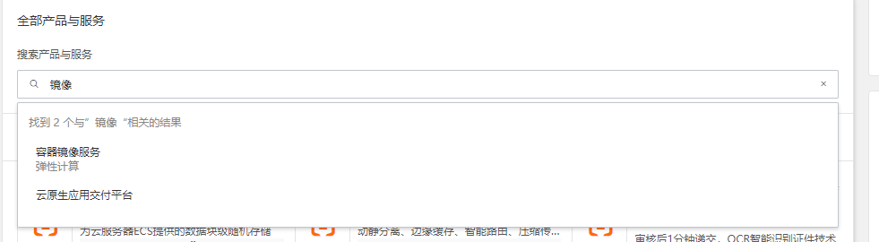

选择镜像加速器-会给一个地址，而且下边有配置好的文档，自己添加以下

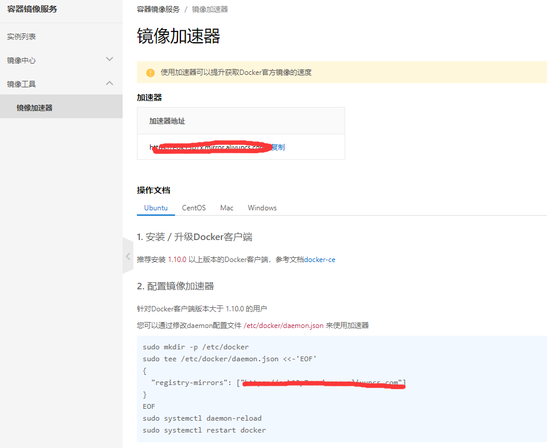

在所有的节点上都配置一下

```
#! /bin/bash
sudo mkdir -p /etc/docker
sudo tee /etc/docker/daemon.json <<-'EOF'
{
  "registry-mirrors": ["https://eok13p7x.mirror.aliyuncs.com"]
}
EOF
sudo systemctl daemon-reload
sudo systemctl restart docker
```


### 安装 kubelet kubeadm kubectl

[安装 kubeadm | Kubernetes](https://kubernetes.io/zh/docs/setup/production-environment/tools/kubeadm/install-kubeadm/)

worker-node 节点可以不安装 kubectl

使用阿里镜像安装[kubernetes镜像-kubernetes下载地址-kubernetes安装教程-阿里巴巴开源镜像站 (aliyun.com)](https://developer.aliyun.com/mirror/kubernetes?spm=a2c6h.13651102.0.0.3e221b11JXALy6)

```

apt-get update && apt-get install -y apt-transport-https
curl https://mirrors.aliyun.com/kubernetes/apt/doc/apt-key.gpg | apt-key add - 
cat <<EOF >/etc/apt/sources.list.d/kubernetes.list
deb https://mirrors.aliyun.com/kubernetes/apt/ kubernetes-xenial main
EOF
apt-get update
apt-get install -y kubeadm=1.17.3-00 kubectl=1.17.3-00 kubelet=1.17.3-00
```

### **kubeadm** **命令使用：** 

```
kubeadm  -h
...
Available Commands:
  alpha       Kubeadm experimental sub-commands	# 测试阶段命令
  completion  Output shell completion code for the specified shell (bash or zsh)
  			  #bash 命令补全，需要安装 bash-completion
  
  config      # 管理 kubeadm 集群的配置，该配置保留在集群的 ConfigMap 中
  			  # kubeadm config print init-defaults 显示默认配置
  help        Help about any command
  init        # 启动一个 Kubernetes 主节点
  join        # 将节点加入到已经存在的 k8s master
  reset       # 还原使用 kubeadm init 或者 kubeadm join 对系统产生的环境变化
  token       # 管理 token
  upgrade     # 升级 k8s 版本
  version     # 查看版本信息
```

#### kubeadm completion命令补全功能

```
kubeadm completion bash > /etc/profile.d/kubeadm-completion.sh && source /etc/profile.d/kubeadm-completion.sh
```


#### kubeadm init 

[kubeadm init | Kubernetes](https://kubernetes.io/zh/docs/reference/setup-tools/kubeadm/kubeadm-init/)

```
kubeadm init --help 

--apiserver-advertise-address string #K8S API Server 将要监听的监听的本机 IP

--apiserver-bind-port int32 #API Server # 绑定的端口,默认为 6443

--apiserver-cert-extra-sans stringSlice #可选的证书额外信息，用于指定 API Server 的服务器证书。可以是 IP 地址也可以是 DNS 名称。

--cert-dir string #证书的存储路径，缺省路径为 /etc/kubernetes/pki

--certificate-key string #定义一个用于加密 kubeadm-certs Secret 中的控制平台证书的密钥

--config string #kubeadm #配置文件的路径

--control-plane-endpoint string #为控制平台指定一个稳定的 IP 地址或 DNS 名称，即配置一个可以长期使用切是高可用的 VIP 或者域名，k8s 多 master 高可用基于此参数实现

--cri-socket string #要连接的 CRI(容器运行时接口，Container Runtime Interface, 简称 CRI)套接字的路径，如果为空，则 kubeadm 将尝试自动检测此值，"仅当安装了多个 CRI 或具有非标准 CRI 插槽时，才使用此选项"

--dry-run #不要应用任何更改，只是输出将要执行的操作，其实就是测试运行。

--experimental-kustomize string #用于存储 kustomize 为静态 pod 清单所提供的补丁的路径。

--feature-gates string #一组用来描述各种功能特性的键值（key=value）对，选项是：
IPv6DualStack=true|false (ALPHA - default=false)

--ignore-preflight-errors strings #可以忽略检查过程 中出现的错误信息，比如忽略 swap，如
果为 all 就忽略所有

--image-repository string #设置一个镜像仓库，默认为 k8s.gcr.io

--kubernetes-version string #指定安装 k8s 版本，默认为 stable-1

--node-name string #指定 node 节点名称

--pod-network-cidr #设置 pod ip 地址范围

--service-cidr #设置 service 网络地址范围

--service-dns-domain string #设置 k8s 内部域名，默认为 cluster.local，会有相应的 DNS 服务(kube-dns/coredns)解析生成的域名记录。

--skip-certificate-key-print #不打印用于加密的 key 信息

--skip-phases strings #要跳过哪些阶段

--skip-token-print #跳过打印 token 信息

--token #指定 token

--token-ttl #指定 token 过期时间，默认为 24 小时，0 为永不过期

--upload-certs #更新证书

# 全局可选项：
--add-dir-header #如果为 true，在日志头部添加日志目录
--log-file string #如果不为空，将使用此日志文件
--log-file-max-size uint #设置日志文件的最大大小，单位为兆，默认为 1800 兆，0 为没有限制
--rootfs #宿主机的根路径，也就是绝对路径
--skip-headers #如果为 true，在 log 日志里面不显示标题前缀
--skip-log-headers #如果为 true，在 log 日志里里不显示标题
```


## 初始化集群

在三台 master 中任意一台 master 进行集群初始化，而且集群初始化只需要初始化一次。

### 配置初始化文件

```
# 使用默认的配置进行修改
kubeadm config print init-defaults >  kubeadm-init.yaml

root@k8s-master-node1:~# vim kubeadm-init.yaml 
apiVersion: kubeadm.k8s.io/v1beta2
bootstrapTokens:
- groups:
  - system:bootstrappers:kubeadm:default-node-token
  token: abcdef.0123456789abcdef
  ttl: 24h0m0s
  usages:
  - signing
  - authentication
kind: InitConfiguration
localAPIEndpoint:
  advertiseAddress: 192.168.1.50	# 本机地址
  bindPort: 6443
nodeRegistration:
  criSocket: /var/run/dockershim.sock
  name: k8s-master-node1
  taints:
  - effect: NoSchedule
    key: node-role.kubernetes.io/master
---
apiServer:
  timeoutForControlPlane: 4m0s
apiVersion: kubeadm.k8s.io/v1beta2
certificatesDir: /etc/kubernetes/pki
clusterName: kubernetes
controlPlaneEndpoint: 192.168.1.10:6443	# vip地址
controllerManager: {}
dns:
  type: CoreDNS
etcd:
  local:
    dataDir: /var/lib/etcd
imageRepository: registry.cn-hangzhou.aliyuncs.com/google_containers	# 仓库地址
kind: ClusterConfiguration
kubernetesVersion: v1.17.3
networking:
  dnsDomain: cluster.local
  podSubnet: 10.10.0.0/16	# pod地址段
  serviceSubnet: 172.26.0.0/16	# service的地址段
scheduler: {}

```


kubeadm中配置了需要安装的镜像列表，可以在在 master 节点提前下载镜像以减少安装等待时间

```
root@k8s-master-node1:~# kubeadm config images list --kubernetes-version v1.17.3
k8s.gcr.io/kube-apiserver:v1.17.3
k8s.gcr.io/kube-controller-manager:v1.17.3
k8s.gcr.io/kube-scheduler:v1.17.3
k8s.gcr.io/kube-proxy:v1.17.3
k8s.gcr.io/pause:3.1
k8s.gcr.io/etcd:3.4.3-0
k8s.gcr.io/coredns:1.6.5


#!/bin/bash
docker pull registry.cn-hangzhou.aliyuncs.com/google_containers/kube-apiserver:v1.17.3
docker pull registry.cn-hangzhou.aliyuncs.com/google_containers/kube-controller-manager:v1.17.3
docker pull registry.cn-hangzhou.aliyuncs.com/google_containers/kube-scheduler:v1.17.3
docker pull registry.cn-hangzhou.aliyuncs.com/google_containers/kube-proxy:v1.17.3
docker pull registry.cn-hangzhou.aliyuncs.com/google_containers/pause:3.1
docker pull registry.cn-hangzhou.aliyuncs.com/google_containers/etcd:3.4.3-0
docker pull registry.cn-hangzhou.aliyuncs.com/google_containers/coredns:1.6.5
```


### kubeadm init 初始化

```
kubeadm init --config kubeadm-init.yaml --ignore-preflight-errors=swap	# 忽略交换分区问题

# --config 指定配置文件
```

==经过测试ubuntu20.04LTS如果不关掉swap内存，就会报The HTTP call equal to 'curl -sSL http://localhost:10248/healthz' failed wit错误==

```
swapoff -a
vi /etc/fstab
# 注释掉swap
```


kubeadm init 也可以使用参数的方式初始化

```
kubeadm init --apiserver-advertise-address=192.168.1.50 --control-plane-endpoint=192.168.1.10 --apiserver-bind-port=6443 --kubernetes-version=v1.17.3 --pod-network-cidr=10.10.0.0/16 --service-cidr=172.26.0.0/16 --service-dns-domain=cluster.local --image-repository=registry.cn-hangzhou.aliyuncs.com/google_containers --ignore-preflight-errors=swap
```


安装失败如何清理：

```
kubeadm reset
rm -rf /etc/cni/net.d
rm -rf $HOME/.kube/config
rm -rf /etc/kubernetes/
```


#### 安装成功显示如下：

```
addons] Applied essential addon: CoreDNS
[addons] Applied essential addon: kube-proxy

Your Kubernetes control-plane has initialized successfully!

To start using your cluster, you need to run the following as a regular user:
# 配置管理端的认证信息
  mkdir -p $HOME/.kube
  sudo cp -i /etc/kubernetes/admin.conf $HOME/.kube/config
  sudo chown $(id -u):$(id -g) $HOME/.kube/config

# 安装网络插件
You should now deploy a pod network to the cluster.
Run "kubectl apply -f [podnetwork].yaml" with one of the options listed at:
  https://kubernetes.io/docs/concepts/cluster-administration/addons/

# 添加管理节点
You can now join any number of control-plane nodes by copying certificate authorities
and service account keys on each node and then running the following as root:

  kubeadm join 192.168.1.10:6443 --token 8yfu45.20mllt6toz9hobkj \
    --discovery-token-ca-cert-hash sha256:1f3c0a996ea5ff73f7b5f70fbbd7ed6aa89dc261acc7928f92e1fa84e33e55c1 \
    --control-plane 

# 添加worker节点
Then you can join any number of worker nodes by running the following on each as root:

kubeadm join 192.168.1.10:6443 --token 8yfu45.20mllt6toz9hobkj \
    --discovery-token-ca-cert-hash sha256:1f3c0a996ea5ff73f7b5f70fbbd7ed6aa89dc261acc7928f92e1fa84e33e55c1 

```


#### 根据提示配置管理端认证文件

如果没有认证的证书，就会没有权限使用kubectl连接服务器

```
mkdir -p $HOME/.kube
  sudo cp -i /etc/kubernetes/admin.conf $HOME/.kube/config
  sudo chown $(id -u):$(id -g) $HOME/.kube/config
 
 
  
# 里边是vip的认证信息，还admin用户的token
root@k8s-master-node2:~# vim /etc/kubernetes/admin.conf 
apiVersion: v1
clusters:
- cluster:
    certificate-authority-data: LS0tLS1CRUdJTiBDRVJUSUZJQ0FURS0tLS0tCk1JSUN5RENDQWJDZ0F3SUJBZ0lCQURBTkJna3Foa2lHOXcwQkFRc0ZBREFWTVJNd0VRWURWUVFE
RXdwcmRXSmwKY201bGRHVnpNQjRYRFRJeE1USXhOREEzTXpNME5sb1hEVE14TVRJeE1qQTNNek0wTmxvd0ZURVRNQkVHQTFVRQpBeE1LYTNWaVpYSnVaWFJsY3pDQ0FTSXdEUVlKS29aSWh2
Y05BUUVCQlFBRGdnRVBBRENDQVFvQ2dnRUJBTms0CkZyaHA5a01vbG1wbCt2ZXlqV1QrV2ZqZUNiYk16dWRwRW5iQUhmcXF6TmZPRG9JSERzbElncmtBSXZJUkI4L2IKbzZkT2RLL2NkWkZs
dDZJOVdjeUc1b1RaZUI1MFVvTFZMUHJVUU1pYk5QT3JwQzhVak1DalFzYk1ib1l0dU43UQpQRFVJdUluWG1hL3REZndCN1JkWnFjeklnU0k5azB6dGxjSTM0Zkw2dXZlWDJTN0FzenNyaXF2
emI1ZXgwR09uCkRaaGRmbnptb0N5TDh4OC9rUjdtaE5CZzI0UERmMEJ5WStUblkyU0FoOXZhS0piZDE3Z3BXanE5ZjF4UElZZTgKU3BzR0FxajJzOTFsZXE5a2s5eTFCamwxL2s1VDhYbkZR
MS9nWnBsSFdkTUYxdWl6VTVXbW9vZFR6TEhBN1FIVwp3Y1cwQXNpYjJZTFBTdTlpOFQ4Q0F3RUFBYU1qTUNFd0RnWURWUjBQQVFIL0JBUURBZ0trTUE4R0ExVWRFd0VCCi93UUZNQU1CQWY4
d0RRWUpLb1pJaHZjTkFRRUxCUUFEZ2dFQkFEUHVwdDMzbytGRFBKSlRaTi9mT1FUSlVqMzkKUE1XaVV5Z2xPcXpVSWswRkZZdUZ5NGRIbGk4Tm9FVitsQVgrb25uMUlKZUdpaGw1WFNyVVR0
NUUweDJZUUFYKwpNbE4rNC96bENqZjZmREJPMlN0Q2l1Ni9rSUx2bzZyc0RzUUFhWU1NNEZ5dmhObXlubjNqRkFnVVBNekdnbEJkCnZ3d2NFWG5zNHphalJ4RjlWQ2tOSWFFaFh2Um1hTHB4
eFBrdHZ6U1Z1Q0xON1N1a1B0ZGUrZ2lFa1NZQzkyeWYKYWRjZDVzYXM4MGp1RWdhanlxVllibGRZZ2VxV1BHNHhVT05kL3RGZW5rQ200Q3l3aUZtcm1PQXNlN1JnUVB1Mwp5UjRBOXFiNko0
REpzZXFoWGFEajUvWU95K3p5QzFHRFVkR0IzYU5wMWNVc2tTVGw2MHI0V3Rsb0ZrMD0KLS0tLS1FTkQgQ0VSVElGSUNBVEUtLS0tLQo=
    server: https://192.168.1.10:6443
  name: kubernetes
contexts:
- context:
    cluster: kubernetes
    user: kubernetes-admin
  name: kubernetes-admin@kubernetes
current-context: kubernetes-admin@kubernetes
kind: Config
preferences: {}
users:
- name: kubernetes-admin
  user:
...                   
```


### 添加管理节点

在master生成证书用于添加新控制节点

```
root@k8s-master-node2:~#  kubeadm init phase upload-certs --upload-certs
I1214 15:48:57.404151   17744 version.go:251] remote version is much newer: v1.23.0; falling back to: stable-1.17
W1214 15:48:58.157300   17744 validation.go:28] Cannot validate kube-proxy config - no validator is available
W1214 15:48:58.157393   17744 validation.go:28] Cannot validate kubelet config - no validator is available
[upload-certs] Storing the certificates in Secret "kubeadm-certs" in the "kube-system" Namespace
[upload-certs] Using certificate key:
9adcdb2b1149e84cb9706b5ab6c4167adc024a610714adf8cf77885457d1d77e

```

添加新 master 节点：

```
kubeadm join 192.168.1.10:6443 --token 8yfu45.20mllt6toz9hobkj \
    --discovery-token-ca-cert-hash sha256:1f3c0a996ea5ff73f7b5f70fbbd7ed6aa89dc261acc7928f92e1fa84e33e55c1 \
    --control-plane --certificate-key 9adcdb2b1149e84cb9706b5ab6c4167adc024a610714adf8cf77885457d1d77e
    
# --certificate-key 刚才生成的秘钥


# 会自动拉取镜像之后初始化
# 加入成功够提示如下
This node has joined the cluster and a new control plane instance was created:

* Certificate signing request was sent to apiserver and approval was received.
* The Kubelet was informed of the new secure connection details.
* Control plane (master) label and taint were applied to the new node.
* The Kubernetes control plane instances scaled up.
* A new etcd member was added to the local/stacked etcd cluster.

To start administering your cluster from this node, you need to run the following as a regular user:

# 照着做一遍，要不然没法使用kubectl管理集群
	mkdir -p $HOME/.kube
	sudo cp -i /etc/kubernetes/admin.conf $HOME/.kube/config
	sudo chown $(id -u):$(id -g) $HOME/.kube/config

Run 'kubectl get nodes' to see this node join the cluster.
```

查看当前节点

```
root@k8s-master-node2:~# kubectl get nodes
NAME               STATUS     ROLES    AGE     VERSION
k8s-master-node2   NotReady   master   21m     v1.17.3
k8s-master-node3   NotReady   master   3m35s   v1.17.3

# 状态显示NotReady，应为网络插件还没装，装上就好了
```


### 安装网络组件

根据提示：可选用的组件有 https://kubernetes.io/docs/concepts/cluster-administration/addons/

我这里安装的是flannel 

**Deploying flannel manually**

Flannel can be added to any existing Kubernetes cluster though it's simplest to add `flannel` before any pods using the pod network have been started.

For Kubernetes v1.17+ `kubectl apply -f https://raw.githubusercontent.com/coreos/flannel/master/Documentation/kube-flannel.yml`

See [Kubernetes](https://github.com/flannel-io/flannel/blob/master/Documentation/kubernetes.md) for more details.

```
wget https://raw.githubusercontent.com/coreos/flannel/master/Documentation/kube-flannel.yml
# 先给下载下来
vim kube-flannel.yml
  net-conf.json: |
    {
      "Network": "10.10.0.0/16",	# 修改成和当前pod地址段一致
      "Backend": {
        "Type": "vxlan"
      }
    }
```


执行文件安装,在一个master节点执行就行了，其他节点会自动安装

```
root@k8s-master-node1:~# kubectl apply -f flannel.yml 
podsecuritypolicy.policy/psp.flannel.unprivileged created
clusterrole.rbac.authorization.k8s.io/flannel created
clusterrolebinding.rbac.authorization.k8s.io/flannel created
serviceaccount/flannel created
configmap/kube-flannel-cfg created
daemonset.apps/kube-flannel-ds-amd64 created
daemonset.apps/kube-flannel-ds-arm64 created
daemonset.apps/kube-flannel-ds-arm created
daemonset.apps/kube-flannel-ds-ppc64le created
daemonset.apps/kube-flannel-ds-s390x created


# 启动成功
root@k8s-master-node1:~# kubectl get nodes
NAME               STATUS   ROLES    AGE   VERSION
k8s-master-node1   Ready    master   13m   v1.17.3
k8s-master-node2   Ready    master   40m   v1.17.3
k8s-master-node3   Ready    master   22m   v1.17.3
```

如果镜像无法下载需要修改镜像源，指定本地镜像

```
vim kube-flannel.yml
initContainers:
      - name: install-cni
        image: quay.io/coreos/flannel:v0.12.0-amd64
        # 修改成本地镜像
        command:
```


### 添加worker节点

直接使用master初始化时候给的命令就行了，必须使用root命令

```
kubeadm join 192.168.1.10:6443 --token 8yfu45.20mllt6toz9hobkj \
    --discovery-token-ca-cert-hash sha256:1f3c0a996ea5ff73f7b5f70fbbd7ed6aa89dc261acc7928f92e1fa84e33e55c1 
    
    
root@k8s-master-node2:~# kubectl get nodes
NAME               STATUS   ROLES    AGE   VERSION
k8s-master-node1   Ready    master   36m   v1.17.3
k8s-master-node2   Ready    master   64m   v1.17.3
k8s-master-node3   Ready    master   46m   v1.17.3
k8s-worker-node1   Ready    <none>   17m   v1.17.3
k8s-worker-node2   Ready    <none>   16m   v1.17.3
k8s-worker-node3   Ready    <none>   14s   v1.17.3
```


## 创建容器测试

kubectl run

```
root@k8s-master-node1:~# kubectl run test2 --image=alpine --replicas=3 sleep 360000
kubectl run --generator=deployment/apps.v1 is DEPRECATED and will be removed in a future version. 
# 有个警告信息说是这个api快被移除了，以后用下边这个命令创建
Use kubectl run --generator=run-pod/v1 or kubectl create instead.deployment.apps/test1 created

test2	# 容器名称
--image=alpine	# 镜像名
--replicas=5	# 创建个数
```


删除容器

容器是无法直接删除的，直接删除后。控制器会按照配置文件再次创建容器，需要直接删除控制器

```
root@k8s-master-node1:~# kubectl get deployment
NAME    READY   UP-TO-DATE   AVAILABLE   AGE
nginx   1/1     1            1           5h33m
test2   3/3     3            3           20h	# test2的控制器
kubectl delete -n default deployment test2
```


查看创建的节点

```
# 根据worker节点，创建到了不同的node节点
NAME                     READY   STATUS             RESTARTS   AGE     IP          NODE               NOMINATED NODE   READINESS GATES
test2-84cc4d9b4f-8z5dl   1/1     Running            0          88s   10.10.4.4   k8s-worker-node2 
test2-84cc4d9b4f-n48zr   1/1     Running            0          88s   10.10.3.3   k8s-worker-node1 
test2-84cc4d9b4f-nb2td   1/1     Running            0          88s   10.10.5.4   k8s-worker-node3
```


测试网络是否正常

```
root@k8s-master-node1:~# kubectl exec -it test2-84cc4d9b4f-8z5dl sh	# 进入容器

# ping 其他pod能否成功
root@k8s-master-node1:~# kubectl exec -it test2-84cc4d9b4f-8z5dl sh
/ # ping 10.10.3.3
PING 10.10.3.3 (10.10.3.3): 56 data bytes
64 bytes from 10.10.3.3: seq=0 ttl=62 time=1.295 ms
64 bytes from 10.10.3.3: seq=1 ttl=62 time=1.377 ms
64 bytes from 10.10.3.3: seq=2 ttl=62 time=1.575 ms

# 检测能否ping同网关，我第一没通过，应为flannel地址配错了，需要删除flannel重新安装
root@k8s-master-node1:~# kubectl delete -f flannel.yml 	# 删除完毕后重新安装
root@k8s-master-node1:~# kubectl apply -f flannel.yml


# ping主机网关
root@k8s-master-node1:~# kubectl exec -it test2-84cc4d9b4f-8z5dl sh
/ # ping 192.168.1.1
PING 192.168.1.1 (192.168.1.1): 56 data bytes
64 bytes from 192.168.1.1: seq=0 ttl=63 time=1.550 ms
64 bytes from 192.168.1.1: seq=1 ttl=63 time=1.473 ms
64 bytes from 192.168.1.1: seq=2 ttl=63 time=1.327 ms


# ping外网域名，检测dns功能是否正常
/ # ping www.baidu.com
PING www.baidu.com (39.156.66.14): 56 data bytes
64 bytes from 39.156.66.14: seq=0 ttl=54 time=5.282 ms
64 bytes from 39.156.66.14: seq=1 ttl=54 time=5.913 ms
64 bytes from 39.156.66.14: seq=2 ttl=54 time=6.179 ms

```


测试DNS服务

```
/ # cat /etc/resolv.conf 
nameserver 172.26.0.10	# DNS服务指向172.26.0.10，这个是什么东西呢


查看service
root@k8s-master-node1:~# kubectl get service -A
NAMESPACE     NAME         TYPE        CLUSTER-IP    EXTERNAL-IP   PORT(S)                  AGE
default       kubernetes   ClusterIP   172.26.0.1    <none>        443/TCP                  3h50m
kube-system   kube-dns     ClusterIP   172.26.0.10   <none>        53/UDP,53/TCP,9153/TCP   3h49m
# 看来172.26.0.10是kube-dns服务，是由coredns提供的
```


### 更新到期更新

通过 `kubeadm`部署`k8s`，默认生成的证书有效期是`一年`.需要每年更新证书.否则到期后无法使用

```
# 查看证书有效期
kubeadm alpha certs check-expiration


# 更新证书
kubeadm alpha certs renew all


# 通过crontab定时更新证书
0 0 15 10 * kubeadm alpha certs renew all

# 证书过期kubectl命令无法使用
# 更新客户端配置
sudo cp -i /etc/kubernetes/admin.conf $HOME/.kube/config
sudo chown $(id -u):$(id -g) $HOME/.kube/config
```


**也可以通过修改源码增加证书有效期** 

略过


### kubeadm内部初始化流程

https://kubernetes.io/zh/docs/reference/setup-tools/kubeadm/implementation-details/

https://kubernetes.io/zh/docs/reference/setup-tools/kubeadm/kubeadm-init/#init-workflow

1.kubeadm init 先会对系统环境做一些检查项目，有的仅仅触发警告，其它的则会被视为错误并且退出 kubeadm，除非问题得到解决或者用户指定了 `--ignore-preflight-errors=<list-of-errors>` 参数。

2.生成一个自签名的 CA 证书 (或者使用现有的证书，如果提供的话) 来为集群中的每一个组件建立身份标识。如果用户已经通过 --cert-dir 配置的证书目录（默认为 /etc/kubernetes/pki）提供了他们自己的 CA 证书以及/或者密钥， 那么将会跳过这个步骤，正如文档使用自定义证书所述。如果指定了 --apiserver-cert-extra-sans 参数, APIServer 的证书将会有额外的 SAN 条目，如果必要的话，将会被转为小写。

```
# init 初始化的证书
root@k8s-master-node1:~# ll /etc/kubernetes/pki/
drwxr-xr-x 3 root root 4096 Dec 14 16:01 ./
drwxr-xr-x 4 root root 4096 Dec 14 16:02 ../
-rw-r--r-- 1 root root 1245 Dec 14 16:01 apiserver.crt
-rw-r--r-- 1 root root 1090 Dec 14 16:01 apiserver-etcd-client.crt
-rw------- 1 root root 1679 Dec 14 16:01 apiserver-etcd-client.key
-rw------- 1 root root 1679 Dec 14 16:01 apiserver.key
-rw-r--r-- 1 root root 1099 Dec 14 16:01 apiserver-kubelet-client.crt
-rw------- 1 root root 1679 Dec 14 16:01 apiserver-kubelet-client.key
-rw------- 1 root root 1025 Dec 14 16:01 ca.crt
-rw------- 1 root root 1679 Dec 14 16:01 ca.key
drwxr-xr-x 2 root root 4096 Dec 14 16:01 etcd/
-rw------- 1 root root 1038 Dec 14 16:01 front-proxy-ca.crt
-rw------- 1 root root 1675 Dec 14 16:01 front-proxy-ca.key
-rw-r--r-- 1 root root 1058 Dec 14 16:01 front-proxy-client.crt
-rw------- 1 root root 1679 Dec 14 16:01 front-proxy-client.key
-rw------- 1 root root 1675 Dec 14 16:01 sa.key
-rw------- 1 root root  451 Dec 14 16:01 sa.pub
```

3.将 kubeconfig 文件写入 `/etc/kubernetes/` 目录以便 kubelet、控制器管理器和调度器用来连接到 API 服务器，它们每一个都有自己的身份标识，同时生成一个名为 `admin.conf` 的独立的 kubeconfig 文件，用于管理操作。

4.为 API server、controller manager和scheduler调度器生成静态 Pod 的清单文件。如果没有设置外部的 etcd 服务的话，也会为 etcd 生成一份额外的静态 Pod 清单文件。静态 Pod 的清单文件被写入到`/etc/kubernetes/manifests` 目录.

```
root@k8s-master-node1:~# ll /etc/kubernetes/manifests/
-rw------- 1 root root 1935 Dec 14 16:02 etcd.yaml
-rw------- 1 root root 3312 Dec 14 16:01 kube-apiserver.yaml
-rw------- 1 root root 3240 Dec 14 16:01 kube-controller-manager.yaml
-rw------- 1 root root 1161 Dec 14 16:01 kube-scheduler.yaml
```

kubelet 会监视这个目录以便在系统启动的时候创建 Pod。一旦控制平面的 Pod 都运行起来， `kubeadm init` 的工作流程就继续往下执行。

5.将标签和taint应用到master节点上，以便不会在它上面运行其它的工作负载。

```
# 使用 kubectl label 给节点打标签，让master节点不会分配创建容器的任务
# node节点的亲和性等特性都可以设置
```

6.生成令牌，将来其他节点可使用该令牌向控制平面注册自己。 如 [kubeadm token](https://kubernetes.io/zh/docs/reference/setup-tools/kubeadm/kubeadm-token/) 文档所述， 用户可以选择通过 `--token` 提供令牌，如果不提供会自动生成

```
kubeadm token list
# 显示以前发的token 和有效期
```

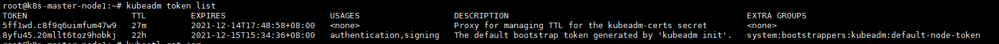

7.创建所有必须的配让node能够遵照[Bootstrap Tokens](https://kubernetes.io/zh/docs/reference/access-authn-authz/bootstrap-tokens/) 和 [TLS Bootstrap](https://kubernetes.io/zh/docs/reference/command-line-tools-reference/kubelet-tls-bootstrapping/) 这两份文档中描述的机制加入到集群中，kubeadm 会执行所有的必要配置：

- 创建一个 ConfigMap 提供添加集群节点所需的信息，并为该 ConfigMap 设置相关的 RBAC 访问规则。
- 允许Bootstrap Tokens访问 CSR 签名 API。允许管理端进行远程安装
- 配置自动签发新的 CSR 请求。

节点接入的申请请求

```
root@k8s-master-node1:~# kubectl get csr
NAME        AGE   REQUESTOR                 CONDITION
csr-2d5c4   82m   system:bootstrap:8yfu45   Approved,Issued
csr-4bl5k   45m   system:bootstrap:8yfu45   Approved,Issued
csr-frrvl   62m   system:bootstrap:8yfu45   Approved,Issued
csr-rszt7   62m   system:bootstrap:8yfu45   Approved,Issued
```

8.通过 API 服务器安装一个 DNS 服务器 (CoreDNS) 和 kube-proxy 附加组件。 在 Kubernetes 版本 1.11 和更高版本中，CoreDNS 是默认的 DNS 服务器。 请注意，尽管已部署 DNS 服务器，但直到安装 CNI 时才调度它。


# 部署Dashboard

git站点：[kubernetes/dashboard: General-purpose web UI for Kubernetes clusters (github.com)](https://github.com/kubernetes/dashboard)

不同版本k8s和dashbord存在兼容问题

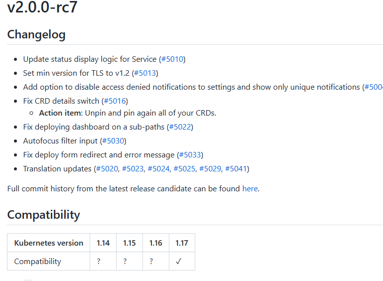

需要找到支持的版本，我这安装的1.17需要使用[v2.0.0-rc7](https://github.com/kubernetes/dashboard/releases/tag/v2.0.0-rc7)

Dashboard安装需要使用两个镜像


**Kubernetes Dashboard**

```
kubernetesui/dashboard:v2.0.0
```

**Metrics Scraper**

```
kubernetesui/metrics-scraper:v1.0.4	# 用于node节点收集指标数据
```

官方配合文件： https://raw.githubusercontent.com/kubernetes/dashboard/v2.0.0-rc7/aio/deploy/recommended.yaml

```
# 配置文件使用了国外的镜像层库，出现镜像拉取失败的问题，建议修改为国内地址
spec:
      containers:
        - name: kubernetes-dashboard
          image: kubernetesui/dashboard:v2.0.0-rc6	# 修改成自己的harbor地址
          imagePullPolicy: Always
          ports:
            - containerPort: 8443
              protocol: TCP
spec:
      containers:
        - name: dashboard-metrics-scraper
          image: kubernetesui/metrics-scraper:v1.0.3 # 2个镜像
          

# 添加外网访问入口
vim dash_board-2.0.0-rc6.yml
# 找到下边字段修改
spec:
  type: NodePort
  ports:
    - port: 443
      targetPort: 8443
      nodePort: 30002
  selector:
    k8s-app: kubernetes-dashboard

```


创建用户：https://github.com/kubernetes/dashboard/blob/master/docs/user/access-control/creating-sample-user.md

ad_min-user.yml 

```
root@k8s-master-node1:~# vim ad_min-user.yml 
apiVersion: v1
kind: ServiceAccount
metadata:
  name: admin-user
  namespace: kubernetes-dashboard

---
apiVersion: rbac.authorization.k8s.io/v1
kind: ClusterRoleBinding
metadata:
  name: admin-user
roleRef:
  apiGroup: rbac.authorization.k8s.io
  kind: ClusterRole
  name: cluster-admin
subjects:
- kind: ServiceAccount
  name: admin-user
  namespace: kubernetes-dashboard
```


创建Dashboard

```
kubectl apply -f dash_board-2.0.0-rc6.yml  -f ad_min-user.yml 

# 查看状态
kubectl  get pod -A
kubernetes-dashboard   dashboard-metrics-scraper-7b8b58dc8b-rbcsj   1/1     Running            0          2m19s
kubernetes-dashboard   kubernetes-dashboard-5f5f847d57-tnhx6        1/1     Running            0          2m19s
```


登录任意master节点登录：https://192.168.1.50:30002/#/login

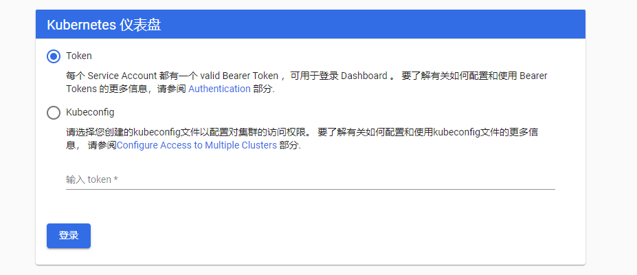

### 使用Token登录

```
# 查找对当前秘钥信息
root@k8s-master-node1:~# kubectl get secret -A | grep admin-user
kubernetes-dashboard   admin-user-token-tw6mj   kubernetes.io/service-account-token   3      5m30s


# 显示具体秘钥信息
oot@k8s-master-node1:~# kubectl describe secret admin-user-token-tw6mj -n kubernetes-dashboard
Name:         admin-user-token-tw6mj
Namespace:    kubernetes-dashboard
Labels:       <none>
Annotations:  kubernetes.io/service-account.name: admin-user
              kubernetes.io/service-account.uid: 07cdff6c-6e97-431c-891a-ac89bd228498

Type:  kubernetes.io/service-account-token

Data
====
ca.crt:     1025 bytes
namespace:  20 bytes
token:      eyJhbGciOiJSUzI1NiIsImtpZCI6Inh1RHhLRzVmcUN4NUpvNGozQXAtZXd3QmJpU3VlVUEtU0J3Wnh5Z1RiNVUifQ.eyJpc3MiOiJrdWJlcm5ldGVzL3NlcnZpY2VhY2NvdW50Iiwia3ViZXJuZXRlcy5pby9zZXJ2aWNlYWNjb3VudC9uYW1lc3BhY2UiOiJrdWJlcm5ldGVzLWRhc2hib2FyZCIsImt1YmVybmV0ZXMuaW8vc2VydmljZWFjY291bnQvc2VjcmV0Lm5hbWUiOiJhZG1pbi11c2VyLXRva2VuLXR3Nm1qIiwia3ViZXJuZXRlcy5pby9zZXJ2aWNlYWNjb3VudC9zZXJ2aWNlLWFjY291bnQubmFtZSI6ImFkbWluLXVzZXIiLCJrdWJlcm5ldGVzLmlvL3NlcnZpY2VhY2NvdW50L3NlcnZpY2UtYWNjb3VudC51aWQiOiIwN2NkZmY2Yy02ZTk3LTQzMWMtODkxYS1hYzg5YmQyMjg0OTgiLCJzdWIiOiJzeXN0ZW06c2VydmljZWFjY291bnQ6a3ViZXJuZXRlcy1kYXNoYm9hcmQ6YWRtaW4tdXNlciJ9.dlzI3v40Izy7IVAfTzNDGYnuwwGsGIVRbo2P7Rt2vtnESaTKSVTmmAKmeIDkecFMqUIzqPlL6FmuX-zTW12i8VQ1eupBwbFoNe4KyGwGlVyWrD9T9VThwgUd6BhjZEx1C4dS7rpM9FIdf8D_Z-hPT_d-7_WlQyTnFjOZsWP_0RZ36j3xtF7aR70N-wpP5aK_XZNYhlvpAvpAEGlX6t4c4ocvpgNbHkOI-IBsoHOrBjPNsBsRfh2TpcPitu6EHbJKQrCY7_qcjr-JI6MGjeLoi_KKJZtAuK570evvY3e32yzw29e9j_8MHE-2t4FQzs56nd9BoE6w_JJndzQED7WpAQ
```

#### 使用Kubeconfig

每次都去查询有点麻烦，创建Kubeconfig登录

```
# 将刚才查询tonken复制一下
vim /etc/kubernetes/admin.conf

# 贴到最下边
  user:
  # 系统的一些证书信息
  token: eyJhbGciOiJSUzI1NiIsImtpZCI6Inh1RHhLRzVmcUN4NUpvNGozQXAtZXd3QmJpU3VlVUEtU0J3Wnh5Z1RiNVUi
fQ.eyJpc3MiOiJrdWJlcm5ldGVzL3NlcnZpY2VhY2NvdW50Iiwia3ViZXJuZXRlcy5pby9zZXJ2aWNlYWNjb3VudC9uYW1lc3Bh
Y2UiOiJrdWJlcm5ldGVzLWRhc2hib2FyZCIsImt1YmVybmV0ZXMuaW8vc2VydmljZWFjY291bnQvc2VjcmV0Lm5hbWUiOiJhZG1
pbi11c2VyLXRva2VuLXR3Nm1qIiwia3ViZXJuZXRlcy5pby9zZXJ2aWNlYWNjb3VudC9zZXJ2aWNlLWFjY291bnQubmFtZSI6Im
FkbWluLXVzZXIiLCJrdWJlcm5ldGVzLmlvL3NlcnZpY2VhY2NvdW50L3NlcnZpY2UtYWNjb3VudC51aWQiOiIwN2NkZmY2Yy02Z
Tk3LTQzMWMtODkxYS1hYzg5YmQyMjg0OTgiLCJzdWIiOiJzeXN0ZW06c2VydmljZWFjY291bnQ6a3ViZXJuZXRlcy1kYXNoYm9h
cmQ6YWRtaW4tdXNlciJ9.dlzI3v40Izy7IVAfTzNDGYnuwwGsGIVRbo2P7Rt2vtnESaTKSVTmmAKmeIDkecFMqUIzqPlL6FmuX-
zTW12i8VQ1eupBwbFoNe4KyGwGlVyWrD9T9VThwgUd6BhjZEx1C4dS7rpM9FIdf8D_Z-hPT_d-7_WlQyTnFjOZsWP_0RZ36j3xt
F7aR70N-wpP5aK_XZNYhlvpAvpAEGlX6t4c4ocvpgNbHkOI-IBsoHOrBjPNsBsRfh2TpcPitu6EHbJKQrCY7_qcjr-JI6MGjeLo
i_KKJZtAuK570evvY3e32yzw29e9j_8MHE-2t4FQzs56nd9BoE6w_JJndzQED7WpAQ

# 最后将这个文件导出到桌面，使用这个文件就可以登录了
```


# kubectl 常用命令

kubectl-操作-对象类型-name -n namespace


## 自动补全

```
sudo apt install bash-completion	# 已安装可以忽略
source /usr/share/bash-completion/bash_completion

# 测试一下
source <(kubectl completion bash)

# 如果没问题将此文件放入环境变量里
kubectl completion bash > /etc/profile.d/kubectl-completion.sh
```


## 基础管理命令

### kubectl get

kubectl get node	# 显示节点信息

```
root@k8s-master-node1:~# kubectl get node -o wide    # [wide |json|yaml]以不同的格式输出
NAME               STATUS   ROLES    AGE    VERSION   INTERNAL-IP    EXTERNAL-IP   OS-IMAGE             KERNEL-VERSION     CONTAINER-RUNTIME
k8s-master-node1   Ready    master   110m   v1.17.3   192.168.1.50   <none>        Ubuntu 20.04.3 LTS   5.4.0-90-generic   docker://19.3.15
k8s-master-node2   Ready    master   138m   v1.17.3   192.168.1.51   <none>        Ubuntu 20.04.3 LTS   5.4.0-90-generic   docker://19.3.15
k8s-master-node3   Ready    master   120m   v1.17.3   192.168.1.52   <none>        Ubuntu 20.04.3 LTS   5.4.0-90-generic   docker://19.3.15
k8s-worker-node1   Ready    <none>   91m    v1.17.3   192.168.1.53   <none>        Ubuntu 20.04.3 LTS   5.4.0-90-generic   docker://19.3.15
k8s-worker-node2   Ready    <none>   90m    v1.17.3   192.168.1.54   <none>        Ubuntu 20.04.3 LTS   5.4.0-90-generic   docker://19.3.15
k8s-worker-node3   Ready    <none>   74m    v1.17.3   192.168.1.55   <none>        Ubuntu 20.04.3 LTS   5.4.0-90-generic   docker://19.3.15

```


kubectl get pod -A 	# 显示所有节点的pod

```
NAMESPACE     NAME                       READY   STATUS    RESTARTS   AGE
kube-system   coredns-7f9c544f75-48tmr   1/1     Running   0          135m
kube-system   coredns-7f9c544f75-nzjcp   1/1     Running   0          135m
kube-system   etcd-k8s-master-node1      1/1     Running   0          108m
kube-system   etcd-k8s-master-node2      1/1     Running   0 

# NAMESPACE  用于区分不同的业务
```


kubectl get service -A	# 显示所有的server信息

```
root@k8s-master-node1:~# kubectl get service -A
NAMESPACE     NAME         TYPE        CLUSTER-IP    EXTERNAL-IP   PORT(S)                  AGE
default       kubernetes   ClusterIP   172.26.0.1    <none>        443/TCP                  137m
kube-system   kube-dns     ClusterIP   172.26.0.10   <none>        53/UDP,53/TCP,9153/TCP   137m


```

kubectl get pods -o  [wide |json|yaml]  # 以不同的格式输出

kubectl get endpoints	# 查看打开的端口


导出配置文件

```
kubectl get deployment my-nginx -o yaml > /tmp/nginx.yaml
vim /tmp/nginx.yaml


kubectl apply -f /tmp/nginx.yaml
deployment.apps/my-nginx configured
```


### kubectl describe

kubectl describe service  名字  -n Namespace	# 查看更具体的信息

```
root@k8s-master-node1:~# kubectl describe service kube-dns -n kube-system
Name:              kube-dns
Namespace:         kube-system
Labels:            k8s-app=kube-dns
                   kubernetes.io/cluster-service=true
                   kubernetes.io/name=KubeDNS
Annotations:       prometheus.io/port: 9153
                   prometheus.io/scrape: true
Selector:          k8s-app=kube-dns
Type:              ClusterIP
IP:                172.26.0.10
Port:              dns  53/UDP
TargetPort:        53/UDP
Endpoints:         10.10.1.2:53,10.10.2.2:53
Port:              dns-tcp  53/TCP
TargetPort:        53/TCP
Endpoints:         10.10.1.2:53,10.10.2.2:53
Port:              metrics  9153/TCP
TargetPort:        9153/TCP
Endpoints:         10.10.1.2:9153,10.10.2.2:9153
Session Affinity:  None
Events:            <none>
```


当pod没有成功运行的时候，可以使用describe 查看pod具体信息，也可以找到pod所在的宿主机，查看syslog日志


### kubectl logs

用于查看容器的日志

kubectl logs 容器名称

```
root@k8s-master-node1:~# kubectl logs nginx-6db489d4b7-plvp8
/docker-entrypoint.sh: /docker-entrypoint.d/ is not empty, will attempt to 
...
2021/12/15 02:11:20 [notice] 1#1: using the "epoll" event method
2021/12/15 02:11:20 [notice] 1#1: nginx/1.21.4
2021/12/15 02:11:20 [notice] 1#1: built by gcc 10.2.1 20210110 (Debian 10.2.1-6) 
2021/12/15 02:11:20 [notice] 1#1: OS: Linux 5.4.0-90-generic
2021/12/15 02:11:20 [notice] 1#1: getrlimit(RLIMIT_NOFILE): 1048576:1048576
2021/12/15 02:11:20 [notice] 1#1: start worker processes
2021/12/15 02:11:20 [notice] 1#1: start worker process 30
2021/12/15 02:11:20 [notice] 1#1: start worker process 31
2021/12/15 02:11:20 [notice] 1#1: start worker process 32
2021/12/15 02:11:20 [notice] 1#1: start worker process 33

```


### kubectl exec

用于进入容器内部，无论在哪个节点都能直接进去

```
root@k8s-master-node1:~# kubectl exec -it  nginx-6db489d4b7-plvp8 bash -n default
root@nginx-6db489d4b7-plvp8:/# 

```


### kubectl scale

容器弹性伸缩使用

```
# 手动扩容
kubectl scale deployment project1-tomcat-app1-deployment --replicas=3 -n project1
deployment.apps/project1-tomcat-app1-deployment scaled

# 自动扩容
kubectl autoscale deployment  -n project1 --min=2 --max=5 project1-tomcat-app1-deployment --cpu-percent=60

```


### kubectl explain

显示当前版本的api对象，详细的配置格式和帮助信息

```
root@k8s-master-node1:~# kubectl explain pod
KIND:     Pod
VERSION:  v1

DESCRIPTION:
     Pod is a collection of containers that can run on a host. This resource is
     created by clients and scheduled onto hosts.

FIELDS:
   apiVersion	<string>
     APIVersion defines the versioned schema of this representation of an
     object. Servers should convert recognized schemas to the latest internal
     value, and may reject unrecognized values. More info:
     https://git.k8s.io/community/contributors/devel/sig-architecture/api-conventions.md#resources

   kind	<string>
     Kind is a string value representing the REST resource this object
     represents. Servers may infer this from the endpoint the client submits
     requests to. Cannot be updated. In CamelCase. More info:
     https://git.k8s.io/community/contributors/devel/sig-architecture/api-conventions.md#types-kinds

   metadata	<Object>
     Standard object's metadata. More info:
     https://git.k8s.io/community/contributors/devel/sig-architecture/api-conventions.md#metadata

   spec	<Object>
     Specification of the desired behavior of the pod. More info:
     https://git.k8s.io/community/contributors/devel/sig-architecture/api-conventions.md#spec-and-status

   status	<Object>
     Most recently observed status of the pod. This data may not be up to date.
     Populated by the system. Read-only. More info:
     https://git.k8s.io/community/contributors/devel/sig-architecture/api-conventions.md#spec-and-status


# 每个api对象里边的属性都可以使用.继续查看
kubectl explain pod.spec
```


## 对象配置命令

### kubectl label

[标签和选择算符 | Kubernetes](https://kubernetes.io/zh/docs/concepts/overview/working-with-objects/labels/)

给worker节点添加标签，后期可以根据标签，在特定节点上创建pod容器，实现node节点亲和性

```
# kubectl label 对象 名称 标签
root@k8s-master-node2:~# kubectl label node k8s-worker-node1 group=weixin

root@k8s-master-node2:~# kubectl describe node k8s-worker-node1
Name:               k8s-worker-node1
Roles:              <none>
Labels:             beta.kubernetes.io/arch=amd64
                    beta.kubernetes.io/os=linux
                    group=weixin	# 添加的标签
                    kubernetes.io/arch=amd64
                    kubernetes.io/hostname=k8s-worker-node1
                    kubernetes.io/os=linux

```


### kubectl apply

依照yaml配置文件生成api对象，支持对yaml文件多次修改后可以动态生效.

变更后只需要修改完成后重新执行kubectl apply -f file.yaml

```
# 等代码更新完毕重新打镜像后，只需要在yaml文件image字段直接重新拉取镜像即可
image:v1-v2

# create 创建的对象需要先删除才能重新创建,很少用
kubectl delete -f file.yaml
修改file.yaml
kubectl create -f file.yaml
```


### kubectl edit

用于编辑资源对象，可以编辑pod service等，命令会将配置以yaml格式展开

```
kubectl edit namespace mynamespace
apiVersion: v1
kind: Namespace
metadata:
  creationTimestamp: "2021-12-15T01:44:25Z"
  name: mynamespace
  resourceVersion: "188783"
  selfLink: /api/v1/namespaces/mynamespace
  uid: 13c53921-5449-4f65-812c-fe33d4350d20
spec:
  finalizers:
  - kubernetes
status:
  phase: Active
```


支持回滚历时版本记录

```
```

## 集群管理命令

### kubectl  top |cluster-info

用于查看集群工作状态


kubectl top pod

```
root@k8s-master-node2:~# kubectl top pod
# 需要访问heapster服务的数据，我这没装
Error from server (NotFound): the server could not find the requested resource (get services http:heapster:

# 需要使用heapster服务收集状态，目前已经不用了,目前已经替换成了Metrics Server

root@k8s-master-node1:/opt/kube/bin# kubectl top pod
NAME                                CPU(cores)   MEMORY(bytes)   
nginx-deployment-7f95d9fcf8-8kpmd   0m           6Mi             
nginx-deployment-7f95d9fcf8-8rz2z   0m           6Mi             
nginx-deployment-7f95d9fcf8-hsl8w   0m           6Mi             
nginx-deployment-7f95d9fcf8-nv7qr   0m           27Mi            
nginx-deployment-7f95d9fcf8-pjqch   0m           6Mi             
nginx-deployment-7f95d9fcf8-qhttx   0m           6Mi             
test2                               0m           1Mi 
```


kubectl cluster-info

显示出当前k8s服务访问方式

```
root@k8s-master-node2:~# kubectl cluster-info
Kubernetes master is running at https://192.168.1.10:6443
KubeDNS is running at https://192.168.1.10:6443/api/v1/namespaces/kube-system/services/kube-dns:dns/proxy

To further debug and diagnose cluster problems, use 'kubectl cluster-info dump'
```


### kubectl cordon|uncordon

警戒线，被标记node将不参与调度，一般都给master打上此标记

```
# kubectl cordon node

root@k8s-master-node2:~# kubectl cordon k8s-master-node1
node/k8s-master-node1 cordoned
root@k8s-master-node2:~# kubectl  get node
NAME               STATUS                     ROLES    AGE   VERSION
k8s-master-node1   Ready,SchedulingDisabled   master   19h   v1.17.3
k8s-master-node2   Ready                      master   19h   v1.17.3
k8s-master-node3   Ready                      master   19h   v1.17.3
k8s-worker-node1   Ready                      <none>   19h   v1.17.3
k8s-worker-node2   Ready                      <none>   19h   v1.17.3
k8s-worker-node3   Ready                      <none>   18h   v1.17.3

# 被标记的SchedulingDisabled
```


### kubectl drain

[安全地清空一个节点 | Kubernetes](https://kubernetes.io/zh/docs/tasks/administer-cluster/safely-drain-node/)

将指定节点上的pod迁移到其他接待上，一般用于node下线等场景

```
root@k8s-master-node2:~# kubectl get pods -o wide
NAME                     READY   STATUS   IP          NODE               
nginx-6db489d4b7-plvp8   1/1     Running  10.10.4.5   k8s-worker-node2 
test2-84cc4d9b4f-8z5dl   1/1     Running  10.10.4.4   k8s-worker-node2
test2-84cc4d9b4f-n48zr   1/1     Running  10.10.3.3   k8s-worker-node1 
test2-84cc4d9b4f-nb2td   1/1     Running  10.10.5.4   k8s-worker-node3 

# kubectl drain 节点 [可选项]
root@k8s-master-node2:~# kubectl drain k8s-worker-node2
node/k8s-worker-node2 cordoned
evicting pod "nginx-6db489d4b7-plvp8"
evicting pod "test2-84cc4d9b4f-8z5dl"
pod/nginx-6db489d4b7-plvp8 evicted

# node2已经没有服务了
root@k8s-master-node2:~# kubectl get pods -o wide
NAME                     READY   STATUS   IP          NODE             
nginx-6db489d4b7-sn28x   1/1     Running  10.10.5.6   k8s-worker-node3  
test2-84cc4d9b4f-n48zr   1/1     Running  10.10.3.3   k8s-worker-node1
test2-84cc4d9b4f-nb2td   1/1     Running  10.10.5.4   k8s-worker-node3
test2-84cc4d9b4f-zlwrl   1/1     Running  10.10.3.5   k8s-worker-node1
```


### kubect taint

[污点和容忍度 | Kubernetes](https://kubernetes.io/zh/docs/concepts/scheduling-eviction/taint-and-toleration/)

给node标记污点，实现反亲pod与node反亲和性


### kubect api-resources/api-versions/version

查看当前版本api资源，k8s每个版本的api变化都挺大的，如果不一样是不兼容的

```
kubect api-resources
```


# yaml配置文件

k8s配置文件有yaml和json两种格式。

yaml和json对比，在线yaml与json编辑器：http://www.bejson.com/validators/yaml_editor/

一般配置文件使用yaml，apiserver返回数据使用json格式


## yaml格式特点：

- 方便阅读
- 可以注释
  - 使用”#” 表示注释，从这个字符一直到行尾，都会被解析器忽略 
- 大小写敏感 
- 使用缩进表示层级关系 
  - 缩进时不允许使用Tal键，只允许使用空格
  - 缩进的空格数目不重要，只要相同层级的元素左侧对齐即可 


## 文件详解

以Nginx 业务yaml为例

```
cat nginx.yaml
kind: Deployment # 类型，是deployment控制器，kubectl explain Deployment
apiVersion: extensions/v1beta1 #API版本，# kubectl explain Deployment.apiVersion
metadata: # pod的元数据信息，kubectl explain Deployment.metadata
  labels: # 自定义pod的标签，# kubectl explain Deployment.metadata.labels
    app: linux36-nginx-deployment-label # 标签名称为app值为linux36-nginx-deployment-label， 后面会用到此标签
  name: linux36-nginx-deployment # pod的名称
  namespace: linux36 # pod的namespace，默认是defaule
spec: #定义deployment中容器的详细信息，kubectl explain Deployment.spec
  replicas: 1 #创建出的pod的副本数，即多少个pod，默认值为1
  selector: #定义标签选择器
    matchLabels: #定义匹配的标签，必须要设置
      app: linux36-nginx-selector #匹配的目标标签，
  template: #定义模板，必须定义，模板是起到描述要创建的pod的作用
    metadata: #定义模板元数据
      labels: #定义模板label，Deployment.spec.template.metadata.label
        app: linux36-nginx-selector #定义标签，等于Deployment.spec.selector.matchLabels
    spec: #定义pod信息
      containers:#定义pod中容器列表，可以多个至少一个，pod不能动态增减容器
      - name: linux36-nginx-container # 容器名称
        image: harbor.magedu.net/linux36/nginx-web1:v1 #镜像地址
        #command: ["/apps/tomcat/bin/run_tomcat.sh"] #容器启动执行的命令或脚本
        #imagePullPolicy: IfNotPresent	# 只有本地没有镜像才会拉取
        imagePullPolicy: Always #拉取镜像策略，always表示总是会拉取镜像
        ports: #定义容器端口列表
        - containerPort: 80 #定义一个端口
          protocol: TCP #端口协议
          name: http #端口名称
        - containerPort: 443 #定义一个端口
          protocol: TCP #端口协议
          name: https #端口名称
        env: #配置环境变量
        - name: "password" #变量名称。必须要用引号引起来
          value: "123456" #当前变量的值
        - name: "age" #另一个变量名称
          value: "18" #另一个变量的值
        resources: #对资源的请求设置和限制设置
          limits: #资源限制设置，上限
            cpu: 2 #cpu的限制，单位为core数，可以写0.5或者500m等CPU压缩值，1000毫核
            memory: 2Gi #内存限制，单位可以为Mib/Gib，将用于docker run --memory参数
          requests: #资源请求的设置，master控制会根据此处要求，去筛选合适的node节点
            cpu: 1 #cpu请求数，容器启动的初始可用数量,可以写0.5或者500m等CPU压缩值
            memory: 512Mi #内存请求大小，容器启动的初始可用数量，用于调度pod时候使用

# 分割线            
---
kind: Service #类型为service
apiVersion: v1 #service API版本， service.apiVersion
metadata: #定义service元数据，service.metadata
  labels: #自定义标签，service.metadata.labels
    app: linux36-nginx #定义service标签的内容
  name: linux36-nginx-spec #定义service的名称，此名称会被DNS解析
  namespace: linux36 #该service隶属于的namespaces名称，即把service创建到哪个namespace里面
spec: #定义service的详细信息，service.spec
  type: NodePort #service的类型，定义服务的访问方式，默认为ClusterIP， service.spec.type
  ports: #定义访问端口， service.spec.ports
  - name: http #定义一个端口名称
    port: 80 #service 80端口
    protocol: TCP #协议类型
    targetPort: 80 #目标pod的端口
    nodePort: 30001 #node节点暴露的端口
  - name: https #SSL 端口
    port: 443 #service 443端口
    protocol: TCP #端口协议
    targetPort: 443 #目标pod端
    nodePort: 30043 #node节点暴露的SSL端口
  selector: # service的标签选择器，定义要访问的目标pod
    app: linux36-nginx #将流量路到选择的pod上，须等于Deployment.spec.selector.matchLabels 
  
```


# k8s各类对象及概念

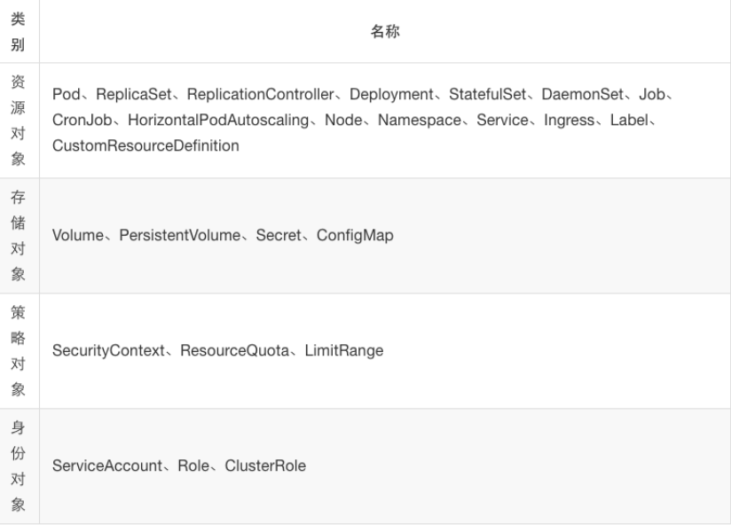


## Namespaces 命名空间

[Kubernetes Namespaces _ Kubernetes(K8S)中文文档_Kubernetes中文社区](http://docs.kubernetes.org.cn/242.html)

当团队或项目中，可以考虑使用Namespace来区分

Namespace为名称提供了一个范围。资源的Names在Namespace中具有唯一性。

Namespace是一种将集群资源划分为多个用途(通过 [resource quota](https://kubernetes.io/docs/concepts/policy/resource-quotas/))的方法。

对于稍微不同的资源没必要使用多个Namespace来划分，例如同意软件的不同版本，可以使用[labels(标签)](http://docs.kubernetes.org.cn/247.html)来区分同一Namespace中的资源。

```
# 创建namespace
kubectl create namespace 名字

# 基于yaml文件创建namespace
vim test-nc.yaml
apiVersion: v1 #API版本 
kind: Namespace #类型为namespac
metadata: #定义元数据 
  name: test #namespace名称
# 创建
kubectl apply -f test-nc.yaml


# 删除namespace 
kubectl delete namecpace 名字
```


## POD

[Kubernetes Pod概述 _ Kubernetes(K8S)中文文档_Kubernetes中文社区](http://docs.kubernetes.org.cn/312.html)

- pod是k8s中的最小单元
- 一个pod中可以运行一个容器，也可以运行多个容器
-  运行多个容器的话，这些容器是一起被调度的
- Pod的生命周期是短暂的，不会自愈，是用完就销毁的实体
-  一般我们是通过Controller来创建和管理pod的


### 第一阶段： 

Pending: 

正在创建Pod但是Pod中的容器还没有全部被创建完成，处于此状态的Pod应该检查Pod依赖的存储是否有权限挂 载、镜像是否可以下载、调度是否正常等。 

Failed 

\#Pod中有容器启动失败而导致pod工作异常。 

Unknown 

\#由于某种原因无法获得pod的当前状态，通常是由于与pod所在的node节点通信错误。 

Succeeded 

\#Pod中的所有容器都被成功终止即pod里所有的containers均已terminated。 

### 第二阶段： 

Unschedulable： 

```
# Pod不能被调度，kube-scheduler没有匹配到合适的node节点 。
1.物理资源不能满足pod设置要求，未能匹配到合适node
2.lable标签设置错误，无法知道相应的主机
```

PodScheduled 

```
# pod正处于调度中，在kube-scheduler刚开始调度的时候，还没有将pod分配到指定的pid，在筛选出合适的节点后就会更新etcd数据，将pod分配到指定的pod 
```

Initialized 

```
所有pod中的初始化容器已经完成了 
```

ImagePullBackOff

```
# Pod所在的node节点下载镜像失败 
1.网络问题，node节点无法下载
2.镜像地址错误
3.harbor权限设置错误
```

Running

```
#Pod内部的容器已经被创建并且启动。 
```

Ready

```
 # 表示pod中的容器已经可以提供访问服务
```


### 探针

探针是由 kubelet 对容器执行的定期诊断，以保证Pod的状态始终处于运行状态，要执行诊断，kubelet 调用由容

器实现的Handler，有3种类型的处理程序：

```
ExecAction 
# 在容器内执行指定命令，如果命令退出时返回码为0则认为诊断成功。 
redis、mysql等服务探测，执行客户端命令查看是否成功

TCPSocketAction 
#对指定端口上的容器的IP地址进行TCP检查，如果端口打开，则诊断被认为是成功的。 

HTTPGetAction 
#对指定的端口和路径上的容器的IP地址执行HTTPGet请求，如果响应的状态码大于等于200且小于 400，则诊断被认 为是成功的

每次探测都将获得以下三种结果之一：
成功：容器通过了诊断
失败：容器未通过诊断。
未知：诊断失败，因此不会采取任何行动。
```


#### 探针类型

```
livenessProbe
# 存活探针，检测容器容器是否正在运行，如果存活探测失败，则kubelet会杀死容器，并且容器将受到其重启策略的 影响，如果容器不提供存活探针，则默认状态为 Success，livenessProbe用户控制是否重启pod。

readinessProbe
# 就绪探针，如果就绪探测失败，端点控制器将从与Pod匹配的所有Service的端点中删除该Pod的IP地址，初始延迟之 前的就绪状态默认为Failure，如果容器不提供就绪探针，则默认状态为 Success，readinessProbe用于控制pod 是否添加至service。


```


#### 探针配置：

https://kubernetes.io/zh/docs/tasks/confifigure-pod-container/confifigure-liveness-readiness-startup-probes/

探针有很多配置字段，可以使用这些字段精确的控制存活和就绪检测的行为：

```
initialDelaySeconds: 120
#初始化延迟时间，告诉kubelet在执行第一次探测前应该等待多少秒，默认是0秒，最小值是0

periodSeconds: 60
#探测周期间隔时间，指定了kubelet应该每多少秒秒执行一次存活探测，默认是 10 秒。最小值是 1

timeoutSeconds: 5
#单次探测超时时间，探测的超时后等待多少秒，默认值是1秒，最小值是1。

successThreshold: 1
#从失败转为成功的重试次数，探测器在失败后，被视为成功的最小连续成功数，默认值是1，存活探测的这个值必须是 1，最小值是 1。

failureThreshold： 3
#从成功转为失败的重试次数，当Pod启动了并且探测到失败，Kubernetes的重试次数，存活探测情况下的放弃就意味 着重新启动容器，就绪探测情况下的放弃Pod 会被打上未就绪的标签，默认值是3，最小值是1。


# HTTP 探测器可以在 httpGet 上配置额外的字段

host: 
#连接使用的主机名，默认是Pod的 IP，也可以在HTTP头中设置 “Host” 来代替。

scheme: http 
#用于设置连接主机的方式（HTTP 还是 HTTPS），默认是 HTTP。

path: /monitor/index.html
#访问 HTTP 服务的路径

httpHeaders:
#请求中自定义的 HTTP 头,HTTP 头字段允许重复。

port: 80
#访问容器的端口号或者端口名，如果数字必须在 1 ～ 65535 之间
```


探针示例：

```
apiVersion: apps/v1
kind: Deployment
metadata:
  name: nginx-deployment
spec:
  replicas: 1
  selector:
    matchLabels: #rs or deployment
      app: ng-deploy-80
    template:
      metadata:
        labels:
          app: ng-deploy-80
      spec:
        containers:
        - name: ng-deploy-80
          image: nginx:1.17.5
          ports:
          - containerPort: 80
          #readinessProbe:	# 2中探针类型
          livenessProbe:
            httpGet:	# http探针
              #path: /monitor/monitor.html
              path: /index.html
              port: 80
              initialDelaySeconds: 5
              periodSeconds: 3
              timeoutSeconds: 5
              successThreshold: 1
              failureThreshold: 3
            tcpSocket:
              port: 80
              initialDelaySeconds: 5
              periodSeconds: 3
              timeoutSeconds: 5
              successThreshold: 1
              failureThreshold: 3
            exec:	# ExecAction探针
              command:
              - /usr/local/bin/redis-cli
              - quit
              initialDelaySeconds: 5
              periodSeconds: 3
              timeoutSeconds: 5
              successThreshold: 1
              failureThreshold: 3
```

如果端口检测连续超过指定的三次都没有通过，则Pod状态被标记为CrashLoopBackOff

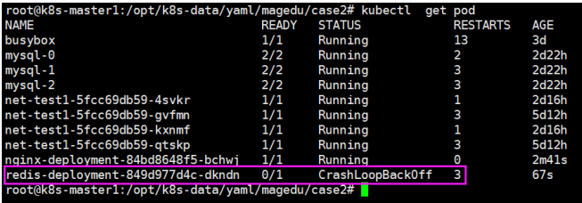


livenessProbe和readinessProbe的对比

```
livenessProbe :
1.连续探测失败会重启、重建pod，readinessProbe不会执行重启或者重建Pod操作
2.连续检测指定次数失败后会将容器置于(Crash Loop BackOff)切不可用，readinessProbe不会

readinessProbe:
1.连续探测失败会从service的endpointd中删除该Pod，livenessProbe不具备此功能但是 会将容器挂起livenessProbe

livenessProbe用户控制是否重启pod，readinessProbe用于控制pod是否添加至service
```

==建议：两个探针同时配置== 


Pod重启策略：

k8s在Pod出现异常的时候会自动将Pod重启以恢复Pod中的服务。

```
restartPolicy： 
Always：当容器异常时，k8s自动重启该容器，ReplicationController/Replicaset/Deployment。 
OnFailure：当容器失败时(容器停止运行且退出码不为0)，k8s自动重启该容器。 
Never：不论容器运行状态如何都不会重启该容器,Job或CronJob。
```

```
containers:
- name: magedu-tomcat-app1-container
  image: harbor.magedu.local/magedu/tomcat-app1:v1
  imagePullPolicy: Always
  ports:
  - containerPort: 8080
    protocol: TCP
    name: http
restartPolicy: Always 
```


### 单个POD内部署多个容器


## Controller：控制器

在 Kubernetes 中，控制器负责监控pod容器的运行状态，用于POD容器的创建，删除与管理并致力于将当前状态转变为期望的状态。

pod的创建需要配合Controller来进行创建

k8s中存在多种控制器

- Replication Controller（目前基本不在使用）
- ReplicaSet（Replication Controller的加强版，被Deployment取代）
- Deployment（官方推荐，一般用于无状态服务，如nginx）
-  Statefulse(一般用于有状态的服务，如mysql)
-  Daemonset（确保集群中每个节点都运行此相同的pod，如日志收集）
-  Job


### Replication Controller

选择器功能较少，仅支持= !=的匹配


### ReplicaSet

[ReplicaSet | Kubernetes](https://kubernetes.io/zh/docs/concepts/workloads/controllers/replicaset/)

选择器增加了更多的匹配模式（selector 支持in notin等集合）


### Deployments

[Deployments | Kubernetes](https://kubernetes.io/zh/docs/concepts/workloads/controllers/deployment/)

[Kubernetes Deployment _ Kubernetes(K8S)中文文档_Kubernetes中文社区](http://docs.kubernetes.org.cn/317.html)

比rs更高一级的控制器，除了有rs的功能之外，还有很多高级功能,，比如说最重要的：滚动升级、回滚等


### Statefulse（有状态服务）

[StatefulSets | Kubernetes](https://kubernetes.io/zh/docs/concepts/workloads/controllers/statefulset/)

StatefulSet 是用来管理有状态应用的工作负载 API 对象。


### DaemonSet（无状态服务）

[DaemonSet | Kubernetes](https://kubernetes.io/zh/docs/concepts/workloads/controllers/daemonset/)

*DaemonSet* 确保全部（或者某些）节点上运行一个 Pod 的副本。 当有节点加入集群时， 也会为他们新增一个 Pod 。 当有节点从集群移除时，这些 Pod 也会被回收。删除 DaemonSet 将会删除它创建的所有 Pod。

DaemonSet 的一些典型用法：

- 在每个节点上运行集群守护进程
- 在每个节点上运行日志收集守护进程
- 在每个节点上运行监控守护进程

一种简单的用法是为每种类型的守护进程在所有的节点上都启动一个 DaemonSet。 一个稍微复杂的用法是为同一种守护进程部署多个 DaemonSet；每个具有不同的标志， 并且对不同硬件类型具有不同的内存、CPU 要求。


### HPA控制器

kubectl autoscale 自动控制在k8s集群中运行的pod数量(水平自动伸缩)，需要提前设置pod范围及触发条件。

k8s从1.1版本开始增加了名称为HPA(Horizontal Pod Autoscaler)的控制器，用于实现基于pod中资源(CPU/Memory)利用率进行对pod的自动扩缩容功能的实现，早期的版本只能基于Heapster组件实现对CPU利用率做为触发条件，但是在k8s 1.11版本开始使用Metrices Server完成数据采集，然后将采集到的数据通过API（Aggregated API，汇总API），例如metrics.k8s.io、custom.metrics.k8s.io、external.metrics.k8s.io，然后再把数据提供给HPA控制器进行查询，以实现基于某个资源利用率对pod进行扩缩容的目的。

```
控制管理器默认每隔15s（可以通过–horizontal-pod-autoscaler-sync-period修改）查询metrics的资源使用情况
支持以下三种metrics指标类型：
	->预定义metrics（比如Pod的CPU）以利用率的方式计算
	->自定义的Pod metrics，以原始值（raw value）的方式计算
	->自定义的object metrics
支持两种metrics查询方式：
->Heapster
->自定义的REST API 
支持多metric
```


准备metrics-server

```
https://github.com/kubernetes-incubator/metrics-server
git clone https://github.com/kubernetes-incubator/metrics-server.git
cd metrics-server/

# 准备image
# 里边的给的imgage地址时google的，无法下载可以使用国内镜像
docker pull k8s.gcr.io/metrics-server-amd64:v0.3.5 #google镜像仓库
docker pull registry.cn-hangzhou.aliyuncs.com/google_containers/metrics-server- amd64:v0.3.5 #阿里云镜像仓库

# 修改yml文件镜像
vim ./manifests/base/deployment.yaml
# 改一下镜像

kubectl apply -f ./manifests/base/deployment.yaml
```

测试是否能够收到数据

```
root@k8s-master-node1:/opt/kube/bin# kubectl top pod
NAME                                CPU(cores)   MEMORY(bytes)   
nginx-deployment-7f95d9fcf8-8kpmd   0m           6Mi             
nginx-deployment-7f95d9fcf8-8rz2z   0m           6Mi             
nginx-deployment-7f95d9fcf8-hsl8w   0m           6Mi             
nginx-deployment-7f95d9fcf8-nv7qr   0m           27Mi            
nginx-deployment-7f95d9fcf8-pjqch   0m           6Mi             
nginx-deployment-7f95d9fcf8-qhttx   0m           6Mi     

# 没问题下一步
```


修改controller-manager启动参数：

```
kube-controller-manager --help | grep horizontal-pod-autoscaler-sync-period
--horizontal-pod-autoscaler-sync-period duration 
#  The period for syncing the number of pods in horizontal pod autoscaler. (default 15s)
# 定义pod数量水平伸缩的间隔周期，默认15秒

vim /etc/systemd/system/kube-controller-manager.service
--horizontal-pod-autoscaler-use-rest-clients=true \ # 是否使用其他客户端数据
--horizontal-pod-autoscaler-sync-period=10s \ # 可选项目，定义数据采集周期间隔时间

# 重启服务

```

用于autoscale命令自动pod自动伸缩

```
# 手动创建自动扩容
kubectl autoscale deployment  -n project1 --min=2 --max=5 project1-tomcat-app1-deployment --cpu-percent=60


# 系统会创建一个HPA控制器
kubectl get horizontalpodautoscalers.autoscaling -A
NAMESPACE   NAME                              REFERENCE                                    TARGETS   MINPODS   MAXPODS   REPLICAS   AGE
project1    project1-tomcat-app1-deployment   Deployment/project1-tomcat-app1-deployment   1%/60%    2         5         2          36m
```


HPA控制器优先级高于Deployments，副本数将按照HPA设置的数量进行变化，不在按照Deployments副本数部署


使用yaml文件创建HPA控制器

```
apiVersion: autoscaling/v1 #定义API版本
kind: HorizontalPodAutoscaler #对象类型
metadata: #定义对象元数据
  namespace: linux36 #创建后隶属的namespace
  name: linux36-tomcat-app1-podautoscaler #对象名称
  labels: 这样的label标签
    app: linux36-tomcat-app1 #自定义的label名称
    version: v2beta1 #自定义的api版本
spec: #定义对象具体信息
  scaleTargetRef: #定义水平伸缩的目标对象，Deployment、ReplicationController/ReplicaSet
    apiVersion: apps/v1
    #API版本，HorizontalPodAutoscaler.spec.scaleTargetRef.apiVersion
    kind: Deployment #目标对象类型为deployment
    name: linux36-tomcat-app1-deployment #deployment 的具体名称
  minReplicas: 2 #最小pod数
  maxReplicas: 5 #最大pod数
  targetCPUUtilizationPercentage：60 	# cpu阀值

# 一下是老版本，现在已经废弃
metrics: #调用metrics数据定
- type: Resource #类型为资源
  resource: #定义资源
    name: cpu #资源名称为cpu
    targetAverageUtilization: 80 #CPU使用率
  - type: Resource #类型为资源
    resource: #定义资源
      name: memory #资源名称为memory
      targetAverageValue: 1024Mi #memory使用率
```


## Service 

[Kubernetes Service _ Kubernetes(K8S)中文文档_Kubernetes中文社区](http://docs.kubernetes.org.cn/703.html)

Service 服务可以通过pod设置的标记进项关联，通过标签查找对指定的pod，并且提供了负载调度功能，可以解耦符合应用

 不同服务的pods需要注册到不同server上，server负责pods的动态发现，负载调度等，起到了pods的负载均衡的作用。当需要扩容某类型的pods时，我们无法预知会在在哪台主机上创建，也无法知道ip地址。这时候servers能够根据扩容的pods的标签自动发现属于自己的pods，并迅能够进行调度提供服务。1.11之前使用的iptables来实现的，之后可以使用ipvs来实现，可以使用多种调度算法。

k8s不会对pod进行直接访问，应为pod随时都在动态的创建和注销，没有确定的地址，需要借助server服务在对pod进行转发。


调用server默认不能跨namespace，如果需要跨域调用，需要写完整的域名

project1-tomcat-app1-service.project1.svc.cluster.local

==service名.namespace名.svc.k8s集群域名后缀==

### kube-proxy和service的关系

kube-proxy监听着k8s-apiserver，一旦service资源发生变化（调k8s-api修改service信息），kube-proxy

就会生成对应的负载调度的调整，创建和调整访问规则，就保证service的最新状态。


### Service  type

Service 有多重类型，默认的type是 ClusterIP，

还可以指定为 ExternalName, ClusterIP, NodePort, and LoadBalancer


#### type：ClusterIP

服务只能够在集群内部可以访问，这也是默认的 ServiceType。

```
apiVersion: v1
kind: Service
metadata:
  name: ng-deploy-80 
  namespace: linux
spec:
  ports:
  - name: http
    port: 80
    targetPort: 80
    protocol: TCP
  type: ClusterIP
  selector:	
    app: ng-deploy-80	# 筛选后端pods的标签

```


#### type：NodePort

可以从集群的外部访问一个 NodePort 服务，node节点可以对外暴露IP和端口

```
apiVersion: v1
kind: Service
metadata:
  name: ng-deploy-80 
  namespace: linux
spec:
  ports:
  - name: http
    port: 81	# service监听的端口
    targetPort: 80	# 容器的端口
    nodePort: 30012	# 宿主机暴露的端口
    protocol: TCP
  type: NodePort
  selector:
    app: ng-deploy-80
    
# 如果设置 type 的值为 "NodePort"，Kubernetes master 将从给定的配置范围内（默认：30000-32767）分配端口，也可以进行指定端口。    
```


##### NodePort使用管理：

顺序使用：==每个service使用的NodePort要记录清除，避免重复，使用的端口号不得超过api-server中配置的范围==

划分范围：不同的项目分配不同的端口范围


#### LoadBalancer：

使用云提供商的负载局衡器，可以向外部暴露服务。外部的负载均衡器可以路由到 NodePort 服务和 ClusterIP 服务。


### endpoints

https://www.cnblogs.com/pu20065226/p/10647775.html

endpoint是k8s集群中的一个资源对象，存储在etcd中，用来记录一个service对应的所有pod的访问地址。service配置selector，endpoint controller才会自动创建对应的endpoint对象；否则，不会生成endpoint对象.

例如，k8s集群中创建一个名为hello的service，就会生成一个同名的endpoint对象，ENDPOINTS就是service关联的pod的ip地址和端口。

```
root@k8s-master-node1:~# kubectl get endpoints -A
NAMESPACE              NAME                        ENDPOINTS                                               AGE
default                kubernetes                  192.168.1.50:6443,192.168.1.51:6443,192.168.1.52:6443   31h
kube-system            kube-controller-manager     <none>                                                  31h
kube-system            kube-dns                    10.10.1.2:53,10.10.2.2:53,10.10.1.2:53 + 3 more...      31h
kube-system            kube-scheduler              <none>                                                  31h
kubernetes-dashboard   dashboard-metrics-scraper   10.10.5.5:8000                                          27h
kubernetes-dashboard   kubernetes-dashboard        10.10.3.4:8443
```


## Volume 数据卷

[Volumes | Kubernetes](https://kubernetes.io/docs/concepts/storage/volumes/)

用于容器数据的持久化保存及pod件数据共享

有一下4中数据卷：

- emptyDir：本地临时卷（pod删除后也会随着删除）
- hostPath：本地卷（pod删除后，数据会保存下来，仅在node本地保存，无法共享）
- nfs等：共享卷
- configmap: （用于从外部导入配置信息）

==`一个配置文件中可以挂载多个数据卷`==

### emptyDir

[临时卷 | Kubernetes](https://kubernetes.io/zh/docs/concepts/storage/ephemeral-volumes/)

当 Pod 被分配给节点时，首先创建 emptyDir 卷，并且只要该 Pod 在该节点上运行，该卷就会存在。正如卷的名字所述，它最初是空的。Pod中的容器可以读取和写入emptyDir 卷中的相同文件，尽管该卷可以挂载到每个容器中的相同或不同路径上。当出于任何原因从节点中删除 Pod 时，emptyDir 中的数据将被永久删除。

临时目录，一般用作日系统日志挂载，使用日志收集工具监听目录。

```
#apiVersion: extensions/v1beta1
apiVersion: apps/v1
kind: Deployment
metadata:
  name: nginx-deployment
  namespace: linux39
spec:
  replicas: 1
  selector:
    matchLabels: #rs or deployment
      app: ng-deploy-80
  template:
    metadata:
      labels:
        app: ng-deploy-80
    spec:
      containers:
      - name: ng-deploy-80
        image: nginx 
        ports:
        - containerPort: 80
        volumeMounts:
        - mountPath: /cache	# 挂载点
          name: cache-volume	# 引用的数据卷名
      volumes:
      - name: cache-volume	# 卷名
        emptyDir: {}	# 类型


# 本地保存位置
/var/lib/kubelet/pods/db083002-c2b3-4347-b043-048e33634408/volumes/kubernetes.io~empty-dir/cache-volume/1

# 目录中使用容器编号，为随机的目录，一般使用匹配模式进行监控。
```


### hostPath

hostPath卷将主机节点的文件系统中的文件或目录挂载到集群中，pod删除的时候，卷不会被删除

```
#apiVersion: extensions/v1beta1
apiVersion: apps/v1
kind: Deployment
metadata:
  name: nginx-deployment
  namespace: linux39
spec:
  replicas: 1
  selector:
    matchLabels: #rs or deployment
      app: ng-deploy-80
  template:
    metadata:
      labels:
        app: ng-deploy-80	
	spec:
      containers:
      - name: ng-deploy-80
        image: nginx 
        ports:
        - containerPort: 80
        volumeMounts:
        - mountPath: /data/mysql	# 挂载点
          name: data-volume		# 引用的数据卷名
      volumes:
      - name: data-volume		# 卷名
        hostPath:
          path: /data/mysql		# 本机数据目录
```


### nfs等共享存储

[示例/暂存/卷/nfs 在 master ·kubernetes/examples (github.com)](https://github.com/kubernetes/examples/tree/master/staging/volumes/nfs)

nfs 卷允许将现有的 NFS（网络文件系统）共享挂载到您的容器中。不像emptyDir，当删除 Pod 时，nfs 卷的内容被保留，卷仅仅是被卸载。这意味着 NFS 卷可以预填充数据，并且可以在 pod 之间“切换”数据。 NFS 可以被多个写入者同时挂载。

```
#apiVersion: extensions/v1beta1
apiVersion: apps/v1
kind: Deployment
metadata:
  name: nginx-deployment
  namespace: linux39
spec:
  replicas: 1
  selector:
    matchLabels: #rs or deployment
      app: ng-deploy-80
  template:
    metadata:
      labels:
        app: ng-deploy-80
	spec:
      containers:
      - name: ng-deploy-81
        image: nginx 
        ports:
        - containerPort: 80
        volumeMounts:
        - mountPath: /usr/share/nginx/html/mysite	# 挂载点
          name: my-nfs-volume	# 数据卷名
      volumes:
      - name: my-nfs-volume	# 数据卷名
        nfs:
          server: 172.31.3.104	# nfs服务器地址
          path: /data/k8sdata	# 需要挂载的共享目录
```

==nfs数据目录会被k8s先挂载到node节点上，然后再被挂载到pod上，因此宿主机需要有nfs的挂载权限，否则容器无法启动==


### configmap

[ConfigMap | Kubernetes](https://kubernetes.io/zh/docs/concepts/configuration/configmap/)

使用 ConfigMap 来将你的配置数据和应用程序代码分开，其实一般配置文件都会打包在镜像当中

```
# 创建configmap对象
apiVersion: v1
kind: ConfigMap
metadata:
  name: nginx-config	# 给configmap对象起个名字
data:
  # 类属性键；每一个键都映射到一个简单的值
  player_initial_lives: "3"
  ui_properties_file_name: "user-interface.properties"
 
 # 类文件键 default 是key ，“|”后边的是值
  default: |
    server {
       listen       80;
       server_name  www.mysite.com;
       index        index.html;

       location / {
           root /data/nginx/html;
           if (!-e $request_filename) {
               rewrite ^/(.*) /index.html last;
           }
       }
    }

---
# 挂在到pod中
#apiVersion: extensions/v1beta1
apiVersion: apps/v1
kind: Deployment
metadata:
  name: nginx-deployment
spec:
  replicas: 1
  selector:
    matchLabels:
      app: ng-deploy-80
  template:
    metadata:
      labels:
        app: ng-deploy-80
    spec:
      containers:
      - name: ng-deploy-80
        image: nginx 
         env:
        # 定义环境变量
        - name: PLAYER_INITIAL_LIVES # 请注意这里和 ConfigMap 中的键名是不一样的
          valueFrom:
            configMapKeyRef:
              name: nginx-config           # 这个值来自 ConfigMap
              key: player_initial_lives # 需要取值的键
        - name: UI_PROPERTIES_FILE_NAME
          valueFrom:
            configMapKeyRef:
              name: nginx-config
              key: ui_properties_file_name
        ports:
        - containerPort: 80
        volumeMounts:
        - name: nginx-config	# 数据卷名称，要和volumes里定义的一样
          mountPath:  /etc/nginx/conf.d
      volumes:
      - name: nginx-config	# 创建一个数据卷，给起个名
        configMap:	# 类型
          name: nginx-config	# 要写上边创建的configmap对象名称
          items:
             - key: default	# data里边的key
               path: mysite.conf	# 挂载在容器里显示的文件名

```


### PV和PVC

管理存储是管理计算的一个明显问题。该PersistentVolume子系统为用户和管理员提供了一个API，用于抽象如何根据消费方式提供存储的详细信息。为此，我们引入了两个新的**API资源**：PersistentVolume和PersistentVolumeClaim

　　PersistentVolume（**PV**）是集群中由管理员配置的**一段网络存储**。 它是集群中的资源，就像节点是集群资源一样。 PV是容量插件，如Volumes，但其生命周期独立于使用PV的任何单个pod。 此API对象捕获存储实现的详细信息，包括NFS，iSCSI或特定于云提供程序的存储系统。

　　PersistentVolumeClaim（**PVC**）是由**用户进行存储的请求**。 它类似于pod。 Pod消耗节点资源，PVC消耗PV资源。Pod可以请求特定级别的资源（CPU和内存）。声明可以请求特定的大小和访问模式（例如，可以一次读/写或多次只读）。

　　虽然PersistentVolumeClaims允许用户使用抽象存储资源，但是PersistentVolumes对于不同的问题，用户通常需要具有不同属性（例如性能）。群集管理员需要能够提供各种PersistentVolumes不同的方式，而不仅仅是大小和访问模式，而不会让用户了解这些卷的实现方式。对于这些需求，有**StorageClass 资源。**

　　StorageClass为管理员提供了一种描述他们提供的存储的“类”的方法。 不同的类可能映射到服务质量级别，或备份策略，或者由群集管理员确定的任意策略。 Kubernetes本身对于什么类别代表是不言而喻的。 这个概念有时在其他存储系统中称为“配置文件”。

　　**PVC和PV是一一对应的。**

#### **生命周期**

　PV是群集中的资源。PVC是对这些资源的请求，并且还充当对资源的检查。PV和PVC之间的相互作用遵循以下生命周期：

Provisioning ——-> Binding ——–>Using——>Releasing——>Recycling

- 供应准备Provisioning

  ---通过集群外的存储系统或者云平台来提供存储持久化支持。

  -  \- 静态提供Static：集群管理员创建多个PV。 它们携带可供集群用户使用的真实存储的详细信息。 它们存在于Kubernetes API中，可用于消费
  -  \- 动态提供Dynamic：当管理员创建的静态PV都不匹配用户的PersistentVolumeClaim时，集群可能会尝试为PVC动态配置卷。 此配置基于StorageClasses：PVC必须请求一个类，并且管理员必须已创建并配置该类才能进行动态配置。 要求该类的声明有效地为自己禁用动态配置。

-  **绑定Binding**---用户创建pvc并指定需要的资源和访问模式。在找到可用pv之前，pvc会保持未绑定状态。

-  **使用Using**---用户可在pod中像volume一样使用pvc。

-  **释放Releasing**---用户删除pvc来回收存储资源，pv将变成“released”状态。由于还保留着之前的数据，这些数据需要根据不同的策略来处理，否则这些存储资源无法被其他pvc使用。

- 回收Recycling

  ---pv可以设置三种回收策略：保留（Retain），回收（Recycle）和删除（Delete）。

  -  \- 保留策略：允许人工处理保留的数据。
  -  \- 删除策略：将删除pv和外部关联的存储资源，需要插件支持。
  -  \- 回收策略：将执行清除操作，之后可以被新的pvc使用，需要插件支持。

 注：目前只有NFS和HostPath类型卷支持回收策略，AWS EBS,GCE PD,Azure Disk和Cinder支持删除(Delete)策略。

### PV类型

支持N多种存储，我这里使用nfs作为测试

-  GCEPersistentDisk
-  AWSElasticBlockStore
-  AzureFile
-  AzureDisk
-  FC (Fibre Channel)
-  Flexvolume
-  Flocker
-  NFS
-  iSCSI
-  RBD (Ceph Block Device)
-  CephFS
-  Cinder (OpenStack block storage)
-  Glusterfs
-  VsphereVolume
-  Quobyte Volumes
-  HostPath (Single node testing only – local storage is not supported in any way and WILL NOT WORK in a multi-node cluster)
-  Portworx Volumes
-  ScaleIO Volumes
-  StorageOS

下面我们定义一个PV的YAML文件：

```
apiVersion: v1
kind: PersistentVolume
metadata:
  name: my-pv01
  labels:
    storage: pv
spec:
  accessModes:	# 访问模式
  - ReadWriteOnce	# 表示具有读写权限，但是只能被一个node挂载一次
  # ReadOnlyMany 表示具有只读权限，可以被多个node多次挂载
  # ReadWriteMany：表示具有读写权限，可以被多个node多次挂载
  capacity:	# 持久卷资源和容量的描述，存储大小是唯一可设置或请求的资源
    storage: 1Gi	# 存储大小
  persistentVolumeReclaimPolicy: Recycle	# 回收策略，也就是释放持久化卷时的策略，一共有一下几种
  # Retain：保留数据，如果要清理需要手动清理数据，默认的策略；
  # Delete：删除，将从Kubernetes中删除PV对象，以及外部基础设施中相关的存储资产，比如AWS EBS, GCE PD, Azure Disk, 或Cinder volume；
  # Recycle：回收，清楚PV中的所有数据，相当于执行rm -rf /pv-volume/*；
  nfs:	# 协议
    path: /data/k8s	# 存储共享的目录
    server: 172.16.1.128	# nfs服务器地址

kubectl create -f pv01-daemo.yaml
```


然后观察其PV：

```
root@k8s-master-node1:~# kubectl get persistentvolume
NAME                     CAPACITY   ACCESS MODES   RECLAIM POLICY   STATUS      CLAIM                              STORAGECLASS   REASON   AGE
my-pv01                  10Gi       RWO            Recycle          Available                                                              4s
zookeeper-datadir-pv-1   20Gi       RWO            Retain           Bound       project1/zookeeper-datadir-pvc-1                           4h51m
zookeeper-datadir-pv-2   20Gi       RWO            Retain           Bound       project1/zookeeper-datadir-pvc-2                           4h51m
zookeeper-datadir-pv-3   20Gi       RWO            Retain           Bound       project1/zookeeper-datadir-pvc-3                           4h51m
```

PV的状态说明：

- Available（可用）：表示可用状态，还未被任何 PVC 绑定
- Bound（已绑定）：表示 PVC 已经被 PVC 绑定
- Released（已释放）：PVC 被删除，但是资源还未被集群重新声明
- Failed（失败）： 表示该 PV 的自动回收失败


### PVC

于上节创建的PV，我们来创建PVC，创建PVC所用的类型是PersistentVolumeClaim，其apiVersion为v1，具体帮助文档可以通过kubectl explain PersistentVolumeClaim来查看。


我们定义PVC的YAML文件，如下：

```
apiVersion: v1
kind: PersistentVolumeClaim
metadata:
  name: pvc-test
spec:
  accessModes:
  - ReadWriteOnce	# 表示具有读写权限，但是只能被一个node挂载一次
  # ReadOnlyMany 表示具有只读权限，可以被多个node多次挂载
  # ReadWriteMany：表示具有读写权限，可以被多个node多次挂载
  resources:	# 主要定义卷应该拥有的最小资源
    requests:
      storage: 1Gi
      
spec参数说明：
（3）、dataSource：定义如果提供者具有卷快照功能，就会创建卷，并将数据恢复到卷中，反之不创建
（4）、selector：定义绑定卷的标签查询
（5）、storageClassName：定义的storageClass的名字，PV 与 PVC 的 storageclass 类名必须相同（或同时为空）。
（6）、volumeMode：主要定义 volume 是文件系统（FileSystem）类型还是块（Block）类型，PV 与 PVC 的 VolumeMode 标签必须相匹配。
（7）、volumeName：需要绑定的PV的名称链接
```

默认情况下pvc会根据requests的磁盘大小自动去寻找适合大小的pv并进行绑定，并且会占据pv所有磁盘空间，一个PV只能允许一个PVC绑定。


pvc绑定pv

```
apiVersion: v1
kind: PersistentVolumeClaim
metadata:
  name: pvc-test
spec:
  accessModes:
  - ReadWriteOnce
  volumeName: pvc-test	# 绑定pv的名字
  resources:
    requests:
      storage: 1Gi
```


### Storageclass

https://zhuanlan.zhihu.com/p/104555373

上面介绍的PV和PVC模式是需要运维人员先创建好PV，然后开发人员定义好PVC进行一对一的Bond，但是如果PVC请求成千上万，那么就需要创建成千上万的PV，对于运维人员来说维护成本很高，Kubernetes提供一种自动创建PV的机制，叫StorageClass，它的作用就是创建PV的模板。

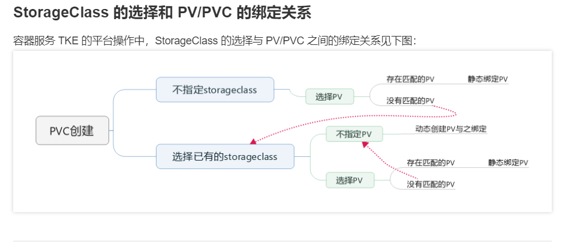


# NODE 标签

```
root@pi-PowerEdge-R620:~# kubectl label node 192.168.1.53 project=project1
node/192.168.1.53 labeled
root@pi-PowerEdge-R620:~# kubectl label node 192.168.1.54 project=project1
node/192.168.1.54 labeled

```

通过筛选器选择指定的node节点

```
# 添加位置deployments.spec.template.spec.nodeSelector
nodeSelector:
  project: project1
```


删除标签

```
kubectl label nodes 192.168.1.54 project-
node/192.168.1.54 labeled
```


# 升级和回滚


代码升级

```
# 通过重新指定镜像
kubectl apply -f tomcat-app1/tomcat-app1.yaml --record=true	# 添加升级标签记录


# 之后升级可以直接重新指定镜像
root@k8s-master-node1:~# kubectl -n project1 set image deployment/project1-tomcat-app1-deployment project1-tomcat-app1-container=local.harbor.com/project1/tomcat-app1:v3
deployment.apps/project1-tomcat-app1-deployment image updated
#  kubectl 指定命名空间 set image 控制器类型/控制器名称 容器名称=镜像地址

# 或者直接修改yml对应的镜像版本文件
```


**查看历史版本信息：**

```
root@k8s-master-node1:/opt/k8s-data/yaml/project1# kubectl rollout history -n project1 deployment project1-tomcat-app1-deployment 
deployment.apps/project1-tomcat-app1-deployment 
REVISION  CHANGE-CAUSE
2         kubectl apply --filename=tomcat-app1.yaml --record=true
3         kubectl apply --filename=tomcat-app1.yaml --record=true
4         kubectl apply --filename=tomcat-app1/tomcat-app1.yaml --record=true
```


**回滚到上一个版本：**

```
kubectl rollout undo -n project1 deployment project1-tomcat-app1-deployment 

# 仅支持现在和之前2个版本来回切换
```

**回滚到指定版本：**

```
查看当前版本号：
root@k8s-master-node1:/opt/k8s-data/yaml/project1# kubectl rollout history -n project1 deployment project1-tomcat-app1-deployment 
deployment.apps/project1-tomcat-app1-deployment 
REVISION  CHANGE-CAUSE
2         kubectl apply --filename=tomcat-app1.yaml --record=true
3         kubectl apply --filename=tomcat-app1.yaml --record=true
4         kubectl apply --filename=tomcat-app1/tomcat-app1.yaml --record=true

kubectl rollout undo -n project1 deployment project1-tomcat-app1-deployment --to-revision=2
```


# ETCD数据库


数据备份和恢复

# k8s网络组件

## calico

官网：https://www.projectcalico.org/

Calico是一个纯三层的网络解决方案，为容器提供多node间的访问通信，calico将每一个node节点都当做为一个路由器(router)，各节点通过BGP(Border Gateway Protocol) 边界网关协议学习并在node节点生成路由规则，从而将不同node节点上的pod连接起来进行通信。

Calico是基于路由表转发数据，性能较高（比flannel速度快）


BGP是一个去中心化的协议，它通过自动学习和维护路由表实现网络的可用性，但是并不是所有的网络都支持BGP，另外为了跨网络实现更大规模的网络管理，calico 还支持IP-in-IP的叠加模型，简称IPIP。

IPIP可以实现跨不同网段建立路由通信，但是会存在安全性问题，其在内核内置，可以通过Calico的配置文件设置是否启用IPIP，在公司内部如果k8s的node节点没有跨越网段建议关闭IPIP。 

```
IPIP是一种将各Node的路由之间做一个tunnel，再把两个网络连接起来的模式。
启用IPIP模式时，Calico将在各 Node上创建一个名为"tunl0"的虚拟网络接口。
BGP模式则直接使用物理机作为虚拟路由路（vRouter），不再创建额外的tunnel
```

核心组件

```
Felix：calico的agent，运行在每一台node节点上，其主要是维护路由规则、汇报当前节点状态以确保pod的夸主机 通信。

BGP Client：每台node都运行，其主要负责监听node节点上由felix生成的路由信息，然后通过BGP协议广播至其他剩 余的node节点，从而相互学习路由实现pod通信。

Route Reflector：集中式的路由反射器，calico v3.3开始支持，当Calico BGP客户端将路由从其FIB(Forward Information dataBase，转发信息库)通告到Route Reflector时，Route Reflector会将这些路由通告给部署 集群中的其他节点，Route Reflector专门用于管理BGP网络路由规则，不会产生pod数据通信。

注：calico默认工作模式是BGP的node-to-node mesh，如果要使用Route Reflector需要进行相关配置。
https://docs.projectcalico.org/v3.4/usage/routereflector
https://docs.projectcalico.org/v3.2/usage/routereflector/calico-routereflector
```


[部署Kubernetes (tigera.io)](https://projectcalico.docs.tigera.io/getting-started/kubernetes/)

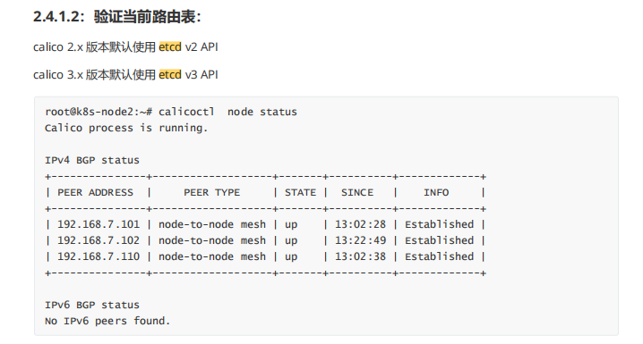

查看calico组件的数据流向：

开启ipip会创建tunl0网卡，所有pod路由地址都会写到路由表中

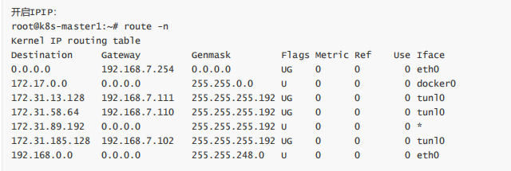

数据通过tunl0网卡进行转发，相比普通模式多了一层封装

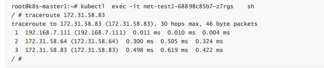


关闭ipip：

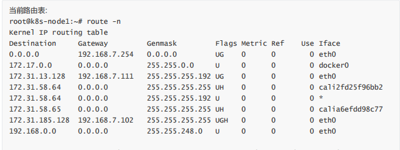

路由追踪：

```
root@k8s-master1:/etc/ansible# kubectl exec -it net-test1-68898c85b7-qrh7b sh
/ # traceroute 172.31.58.65
traceroute to 172.31.58.65 (172.31.58.65), 30 hops max, 46 byte packets
1 192.168.7.111 (192.168.7.111) 0.009 ms 0.008 ms 0.004 ms	# 从本地网卡直接发出
2 192.168.7.110 (192.168.7.110) 0.282 ms 0.344 ms 0.145 ms	# 到达目标node网卡
3 172.31.58.65 (172.31.58.65) 0.481 ms 0.363 ms 0.197 ms	# 直接到达目标pod地址
```


## flannel

官网：https://coreos.com/flflannel/docs/latest/

文档：https://coreos.com/flflannel/docs/latest/kubernetes.html

由CoreOS开源的针对k8s的网络服务，其目的为解决k8s集群中各主机上的pod相互通信的问题，其借助于etcd维

护网络IP地址分配，并为每一个node服务器分配一个不同的IP地址段。


flannel相关文件

```
root@k8s-worker-node1:~# find / -name flannel
/run/flannel
/opt/kube/bin/flannel
/var/lib/cni/flannel
/var/lib/docker/overlay2/37de864902f0a668d92580404bc4fa8ff14b06c8c241c2be05514dda19ae823f/diff/run/flannel
/var/lib/docker/overlay2/37de864902f0a668d92580404bc4fa8ff14b06c8c241c2be05514dda19ae823f/merged/run/flannel
```


flannel会把k8s中设置的pods网段进行划分，没个node会管理一个地址段

```
root@k8s-worker-node1:~# cat /run/flannel/subnet.env 
FLANNEL_NETWORK=172.20.0.0/16
FLANNEL_SUBNET=172.20.5.1/24	# 每个node节点都会分配一个网段，默认24掩码
FLANNEL_MTU=1450
FLANNEL_IPMASQ=true
```

**172.20.5.1/24地址被当前node节点上所有pod作为网关**

```
# 进入此node节点的pod，查看网关
root@nginx-deployment-7f95d9fcf8-nv7qr:/# ip route show
default via 172.20.5.1 dev eth0 
172.20.0.0/16 via 172.20.5.1 dev eth0 
172.20.5.0/24 dev eth0 proto kernel scope link src 172.20.5.9 
```

 cni0网卡：

是个桥接网卡，没个node上都有一个

```
7: cni0: <BROADCAST,MULTICAST,UP,LOWER_UP> mtu 1450 qdisc noqueue state UP group default qlen 1000
    link/ether 6e:5b:a2:5d:6b:06 brd ff:ff:ff:ff:ff:ff
    inet 172.20.5.1/24 brd 172.20.5.255 scope global cni0
       valid_lft forever preferred_lft forever
    inet6 fe80::6c5b:a2ff:fe5d:6b06/64 scope link 
       valid_lft forever preferred_lft forever

这个网卡作为桥接设备，将容器的网络流量转发给flannel，然后flannel对目标主机地址去etcd中查询，然后封装数据包使用VXLAN直接转发至目标主机位置
```


共有3中网络模型

```
FLANNEL_BACKEND: "host-gw" :也就是Host GateWay，通过在node节点上创建到达各目标容器地址的路由表而完成报文的转发，因此这种 方式要求各node节点本身必须处于同一个局域网(二层网络)中，因此不适用于网络变动频繁或比较大型的网络环境，但是 其性能较好。

FLANNEL_BACKEND: "vxlan" :Linux内核在在2012年底的v3.7.0之后加入了VXLAN协议支持，因此新版本的Flannel也有UDP转换为 VXLAN，VXLAN本质上是一种tunnel（隧道）协议，用来基于3层网络实现虚拟的2层网络，目前flannel 的网络模型已 经是基于VXLAN的叠加(覆盖)网络

FLANNEL_BACKEND: "UDP":早期版本的Flannel使用UDP封装完成报文的跨越主机转发，其安全性及性能略有不足。
```


vxlan模式通讯流程：


flannel.1网卡：

flannel.1是overlay网络的设备，用来进行vxlan报文的处理（封包和解包），不同node之间的pod数据流量都从 overlay设备以隧道的形式发送到对端。

```
root@k8s-worker-node1:~# ip link show type vxlan
5: flannel.1: <BROADCAST,MULTICAST,UP,LOWER_UP> mtu 1450 qdisc noqueue state UNKNOWN mode DEFAULT group default 
    link/ether 6a:6e:1f:0c:54:d1 brd ff:ff:ff:ff:ff:ff
```


数据转发过程

```
root@nginx-deployment-7f95d9fcf8-nv7qr:/# traceroute 172.20.3.9
traceroute to 172.20.3.9 (172.20.3.9), 30 hops max, 60 byte packets
# 数据包先到本机网关
 1  172.20.5.1 (172.20.5.1)  0.109 ms  0.038 ms  0.032 ms
 # flannel.1直接给封装通过隧道发送到了对方的flannel上，没有在使用物理机网卡进行封装
 2  172.20.3.0 (172.20.3.0)  1.352 ms  3.280 ms  2.386 ms
 3  172.20.3.9 (172.20.3.9)  2.787 ms  2.747 ms  2.715 ms
```

```
->: pod中产生数据，根据pod的路由信息，将数据发送到Cni0 
->: Cni0 根据节点的路由表，将数据发送到隧道设备flannel.1 
->: Flannel.1查看数据包的目的ip，从flanneld获得对端隧道设备的必要信息，封装数据包。 
->: Flannel.1将数据包发送到对端设备,对端节点的网卡接收到数据包 
->: 对端节点发现数据包为overlay数据包，解开外层封装，并发送到到本机flannel.1设备。 
->: Flannel.1设备查看数据包，根据路由表匹配，将数据发送给Cni0设备。 
->: Cni0匹配路由表，发送数据给网桥上对应的端口(pod)。
```


VxLAN Directrouting: Directrouting 为在同一个二层网络中的node节点启用直接路由机制，类似于host-gw模式。配合vxlan模式提升网络性能

```
"Type": "vxlan",
"Directrouting": true
```

工作区别

```
数据转发不在使用flannel.1网卡，而是直接使用物理网卡转发。
```


# 证书和RBAC授权

k8s所有的证书都保存在`/etc/kubernets/ssl/`文件夹中


给用户授权

kubectl create serviceaccount 名字  命名空间

创建授权文件


签发证书

```
cfssl  gencert -ca=/etc/kubernetes/ssl/ca.pem 
```


# 错误排查流程

1.当pod运行错误的时候，先试用descripti查看容器描述，然后找到pod所在的节点，然后去查看syslog.

2.使用kubectl logs查看容器内部日志


RBAC
