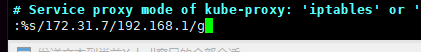

# 集群部署

使用[easzlab](https://github.com/easzlab)项目进行部署,使用ansible快速部署k8s二进制包


准备一部署节点，安装ansible及准备ssh免密登陆

```
# 注意pip 21.0以后不再支持python2和python3.5，需要如下安装
# To install pip for Python 2.7 install it from https://bootstrap.pypa.io/2.7/ :
curl -O https://bootstrap.pypa.io/pip/2.7/get-pip.py
python get-pip.py
python -m pip install --upgrade "pip < 21.0"
 
# pip安装ansible(国内如果安装太慢可以直接用pip阿里云加速)
pip install ansible -i https://mirrors.aliyun.com/pypi/simple/
```


对所有节点配置免秘钥登录

```
# 生成秘钥
ssh-keygen -t ed25519 -N '' -f ~/.ssh/id_ed25519

# 分发公钥
vim ssh-key-login.sh
#!/bin/bash
# 目标主机列表
if ! [ -x "$( -v sshpass)" ]; then
 apt install sshpass -y >&2
fi

IP="
192.168.1.47
192.168.1.48
192.168.1.49
192.168.1.50
192.168.1.51
192.168.1.52
192.168.1.53
192.168.1.54
192.168.1.55
"
for node in ${IP};do
  sshpass -p 101200 ssh-copy-id ${node} -o StrictHostKeyChecking=no
  if [ $? -eq 0 ]; then
    echo "${node} key登录完成"
  else
    echo "${node} key登录失败"
  fi
done
```


下载ezdown脚本并配置

```
# 下载工具脚本ezdown，举例使用kubeasz版本3.0.0
export release=3.0.0
wget https://github.com/easzlab/kubeasz/releases/download/${release}/ezdown
chmod +x ./ezdown


# 编辑ezdown,此文件中设置了要下载的k8s和组件的版本

# 使用工具脚本下载
./ezdown -D
```

上述脚本运行成功后，所有文件（kubeasz代码、二进制、离线镜像）均已整理好放入目录`/etc/kubeasz`


创建集群配置实例

```
cd /etc/kubeasz/
ezctl new k8s-01
2021-01-19 10:48:23 DEBUG generate custom cluster files in /etc/kubeasz/clusters/k8s-01
2021-01-19 10:48:23 DEBUG set version of common plugins
2021-01-19 10:48:23 DEBUG cluster k8s-01: files successfully created.
2021-01-19 10:48:23 INFO next steps 1: to config '/etc/kubeasz/clusters/k8s-01/hosts'
2021-01-19 10:48:23 INFO next steps 2: to config '/etc/kubeasz/clusters/k8s-01/config.yml'
```


后根据提示配置'/etc/kubeasz/clusters/k8s-01/hosts' 和 '/etc/kubeasz/clusters/k8s-01/config.yml'：根据前面节点规划修改hosts 文件和其他集群层面的主要配置选项；其他集群组件等配置项可以在config.yml 文件中修改。

修改集群配置

```
root@pi-PowerEdge-R620:/etc/kubeasz# vim /etc/kubeasz/clusters/k8s-01/hosts
# 将里边的主机设置成集群对应的ip地址
```


## 添加DNS服务

提供了多种dns服务，推荐使用coredns，新版本中kube-dns 已经不在支持

### kube-dns 

kube-dns 配置，由3个镜像实现

```
# 需要修改的地方

cluseterIP	# 进入pod看一下，dns默认执行的ip,改成哪个就行

limits	# 资源限制修改一下，默认的特别小，最少2G内存

--domain	# 当时部署时候service默认的后缀
# 所有的--PILLAR_DNS__DOMAIB__都换成自己的

image	# 镜像地址需要换成国内的或者自己私有的，一般有3个


# 将dns交给公司内部其他dns服务器解析
在dnsmasq下边找到
--server=/linxux.test/192.168.12.12#53	# 表示将linxux.test域名交给192.168.12.12的53端口解析
# 可以添加多个
```


### 添加coreDNS

https://github.com/coredns/coredns

k8s部署方式[deployment/kubernetes at master · coredns/deployment (github.com)](https://github.com/coredns/deployment/tree/master/kubernetes)这个部署方式需要使用脚本生成ymal配置文件，但是需要先使用kube-dns获取数据才能生成，不推荐。


k8s源码包内提供了coredns的部署yaml文件

https://github.com/kubernetes/kubernetes/blob/master/CHANGELOG/CHANGELOG-1.21.md#source-code-1

`\kubernetes\cluster\addons\dns\coredns`


```

# 修改域名地址
# corefile下边有个reday ，里边的域名改成自己的


# 内部域名转发,里边有个forward参数
forward . 自己的服务器ip

# 镜像地址改一下
imgage	# 改成本地的
```


DNS解释时，日过使用短域名默认只能解析自己namespace name内的service服务，日过跨namespace访问，需要使用完整的域名进行调用

==完整域名格式：server name.namespace name.svc.magedu.local==
dashboard-metrics-scraper.kubernetes-dashboard.svc.magedu.local


添加节点：


版本升级

二进制包下载：https://github.com/kubernetes/kubernetes/blob/master/CHANGELOG/CHANGELOG-1.21.md#node-binaries

升级程序有：

worknode：kubectl	kubelet	kube-proxy

masternode:kube-apiserver	kube-controller-manager kube-scheduler  kubectl	kubelet	kube-proxy


导入镜像

docker load -i 镜像名

修改tag

docker tag 镜像名 新的名字


批量替换




## Harbor部署

下载地址：https://github.com/goharbor/harbor/releases/tag/v2.3.5

安装daocker和docker-compose

```
#!/bin/bash

# setp 1:清除旧版本
sudo apt purge -y docker-ce  docker-ce-cli docker-ce-rootless-extras docker-scan-plugin
sudo apt-get autoremove -y --purge docker-ce  docker-ce-cli docker-ce-rootless-extras docker-scan-plugin
sudo groupdel docker
sudo rm -rf /var/lib/docker /etc/docker
sudo rm /etc/apparmor.d/docker
sudo groupdel docker
sudo rm -rf /var/run/docker.sock

# step 2: 安装必要的一些系统工具
sudo apt-get update
sudo apt-get -y install apt-transport-https ca-certificates curl software-properties-common
# step 3: 安装GPG证书
curl -fsSL https://mirrors.aliyun.com/docker-ce/linux/ubuntu/gpg | sudo apt-key add -
# Step 4: 写入软件源信息
sudo add-apt-repository "deb [arch=amd64] https://mirrors.aliyun.com/docker-ce/linux/ubuntu $(lsb_release -cs) stable"


# Step 5: 更新并安装Docker-CE
sudo apt-get -y update

apt install docker-ce=5:19.03.15~3-0~ubuntu-focal -y --allow-downgrades

# step 6 ：镜像加速
sudo mkdir -p /etc/docker
sudo tee /etc/docker/daemon.json <<-'EOF'
{
  "registry-mirrors": ["https://eok13p7x.mirror.aliyuncs.com"]
}
EOF

# set 7 
sudo apt install docker-compose -y

sudo systemctl daemon-reload
sudo systemctl restart docker
```


生成证书

GO 1.15 以上版本解决GRPC X509 Common Name field, use SANs or temporarily enable Common Name matching]

https://www.cnblogs.com/custer/p/13999946.html

```
# 跟着上边那个做


# 生成harbor的key
openssl genpkey -algorithm RSA -out server.key

# 申请文件
openssl req -new -nodes -key server.key -out server.csr -days 3650 -subj "/C=cn/OU=custer/O=custer/CN=local.harbor.com" -config ./openssl.cnf -extensions v3_req

# 签发证书
openssl x509 -req -days 3650 -in server.csr -out server.pem -CA ca.pem -CAkey ca.key -CAcreateserial -extfile ./openssl.cnf -extensions v3_req

# 将证书和key 复制到harbor服务器

```


编辑配置文件

```
cp harbor.yml.tmpl harbor.yml

vim harbor.yml
hostname: local.harbor.com
 certificate: /usr/local/src/harbor/certs/server.crt	# 证书位置
 private_key: /usr/local/src/harbor/certs/server.key	# 私钥
harbor_admin_password: 123456
database:
  password: root123
data_volume: /data

# 安装
./install.sh
```


harbor服务器时间与宿主机同步

```
# 安装完毕后文件夹内会有一个docker-compose.yml文件，在里边挂载本地时间文件到镜像内

# 在所有的镜像下边都添加这个
volumes:
 - /etc/localtime:/etc/localtime:ro
 
# 我把文件保存到文件夹内提供参考
```


修改hosts文件，并且分发key到k8s节点

```
mkdir /etc/docker/certs.d/local.harbor.com -p
cd /etc/docker/certs.d/local.harbor.com
cp ~/keys/server.pem  ./server.crt

systemctl restart docker

# 登录
docker login local.harbor.com
Username: admin
Password: 
WARNING! Your password will be stored unencrypted in /root/.docker/config.json.
Configure a credential helper to remove this warning. See
https://docs.docker.com/engine/reference/commandline/login/#credentials-store

Login Succeeded
```


分发证书到所有k8s的node节点

```
#! /bin/bash
  
IP="
192.168.1.47
192.168.1.48
192.168.1.49
192.168.1.50
192.168.1.51
192.168.1.52
192.168.1.53
192.168.1.54
192.168.1.55
"

for node in ${IP};do
  ssh ${node} "mkdir /etc/docker/certs.d/local.harbor.com -p"
  echo "Harbor 证书目录ok"
  scp /root/keys/server.pem ${node}:/etc/docker/certs.d/local.harbor.com/server.crt
  echo "证书ok"
done

```


# 搭建基础镜像


部署ubuntu基础镜像

```
# 拉取20.04镜像
root@k8s-master-node1:/opt/k8s-data# docker pull ubuntu:20.04
20.04: Pulling from library/ubuntu
Digest: sha256:626ffe58f6e7566e00254b638eb7e0f3b11d4da9675088f4781a50ae288f3322
Status: Downloaded newer image for ubuntu:20.04
docker.io/library/ubuntu:20.04

# 重打tag
docker tag ubuntu:20.04  local.harbor.com/base/ubuntu:20.04

# 登录harbor
root@k8s-master-node1:/opt/k8s-data# docker login local.harbor.com
Username: admin
Password: 
WARNING! Your password will be stored unencrypted in /root/.docker/config.json.
Configure a credential helper to remove this warning. See
https://docs.docker.com/engine/reference/commandline/login/#credentials-store
Login Succeeded

# 上传harbor
docker push local.harbor.com/base/ubuntu:20.04
```


```

apt install iproute2 ntpdate tcpdump  nfs-kernel-server nfs-common lrzsz libssl-dev libpcre3 libpcre3-dev zlib1g-dev  telnet traceroute gcc openssh-server tree openssl iotop unzip zip
```

