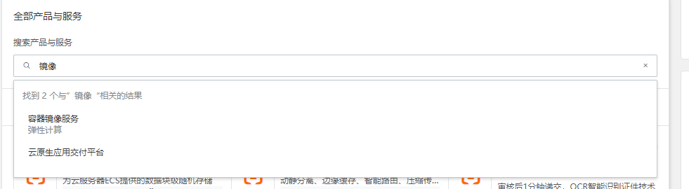
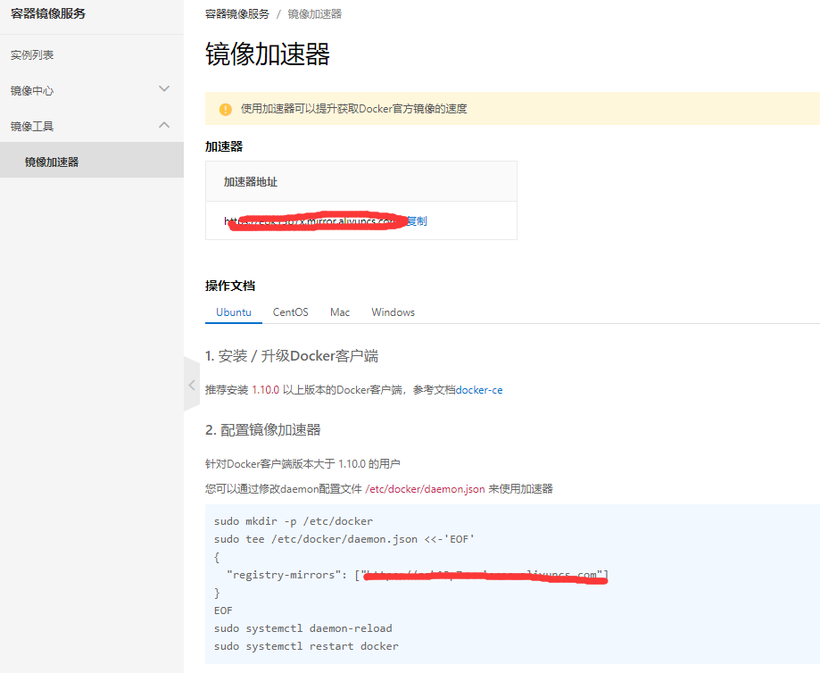
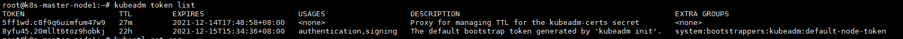
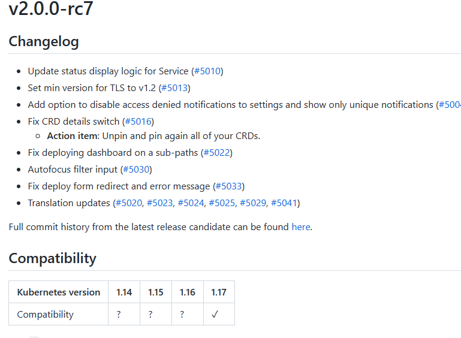
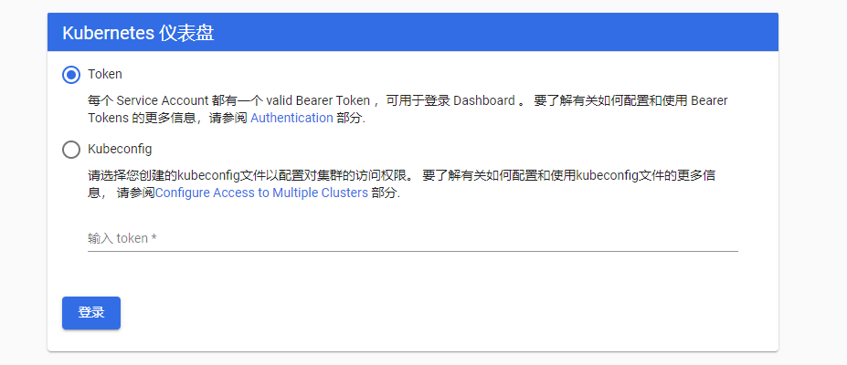

# 容器

# Docker

# kubernetes

[Kubernetes 文档 | Kubernetes](https://kubernetes.io/zh/docs/home/)


## master管理服务：


### kube-apiserver：

[kube-apiserver | Kubernetes](https://kubernetes.io/zh/docs/reference/command-line-tools-reference/kube-apiserver/)

Kubernetes API server 为 api 对象验证并配置数据，包括 pods、 services、replicationcontrollers 和其它 api 对象,API Server 提供 REST 操作和到集群共享状态的前端，所有其他组件通过它进行交互。

```
pods：每个pod只会分配一个地址，但是里边可以封装多个容器，并且使用法老等插件来控制内部不同容器的访问接口

servers：不同服务的pods需要注册到不同server上，server负责pods的动态发现，负载调度等，起到了pods的负载均衡的作用。当需要扩容某类型的pods时，我们无法预知会在在哪台主机上创建，也无法知道ip地址。这时候servers能够根据扩容的pods的标签自动发现属于自己的pods，并迅能够进行调度提供服务。1.11之前使用的iptables来实现的，之后可以使用ipvs来实现，可以使用多种调度算法。

replicationcontorellers：pods的控制器，确保pod的正常工作，如果检测到pods无法工作（如宿主机挂了），控制器就会通知Controller Manager，进行pods的创建。

deployment：用来代替replicationcontorellers
```


### kube-scheduler :

[kube-scheduler | Kubernetes](https://kubernetes.io/zh/docs/reference/command-line-tools-reference/kube-scheduler/)

kube-scheduler是一个拥有丰富策略、能够感知拓扑变化、支持特定负载的功能组件，它对集群的可用性、性能表现以及容量都影响巨大。scheduler 需要考虑独立的和集体的资源需求、服务质量需求、硬件/软件/策略限制、亲和与反亲和规范、数据位置、内部负载接口、截止时间等等。如有必要，特定的负载需求可以通过 API 暴露出来。

```
亲和：可以对宿主机节点进行分组，让指定业务的pods创建在指定node节点上。
```


### kube-controller-manager：

[kube-controller-manager | Kubernetes](https://kubernetes.io/zh/docs/reference/command-line-tools-reference/kube-controller-manager/)

Controller Manager 作为集群内部的管理控制中心，负责集群内的Node、Pod 副本、服务端点（Endpoint）、命名空间（Namespace）、服务账号（ServiceAccount）、资源定额（ResourceQuota）的管理，当某个 Node 意外宕机时，Controller Manager 会及时发现并执行自动化修复流程，确保集群始终处于预期的工作状态。

```
ResourceQuota：对物理资源限制

namespace：多个项目，不同业务的pod创建不同的namespace，进行逻辑隔离
```


## 安装方式

安装部署k8s有三种方式，

1.是通过手动部署所有二进制包的方式，配置较为复杂

2.使用官方提供的kubeadm工具自动安装快速部署

3.使用批量部署工具如(ansible/ saltstack)批量安装。


**确保每个节点上 MAC 地址和 product_uuid 的唯一性** 

- 你可以使用命令 `ip link` 或 `ifconfig -a` 来获取网络接口的 MAC 地址
- 可以使用 `sudo cat /sys/class/dmi/id/product_uuid` 命令对 product_uuid 校验

一般来讲，硬件设备会拥有唯一的地址，但是有些虚拟机的地址可能会重复。 Kubernetes 使用这些值来唯一确定集群中的节点。 如果这些值在每个节点上不唯一，可能会导致安装 [失败](https://github.com/kubernetes/kubeadm/issues/31)。


**允许 iptables 检查桥接流量**

确保 `br_netfilter` 模块被加载。这一操作可以通过运行 `lsmod | grep br_netfilter` 来完成。若要显式加载该模块，可执行 `sudo modprobe br_netfilter`。

为了让你的 Linux 节点上的 iptables 能够正确地查看桥接流量，你需要确保在你的 `sysctl` 配置中将 `net.bridge.bridge-nf-call-iptables` 设置为 1。例如：

```bash
cat <<EOF | sudo tee /etc/modules-load.d/k8s.conf
br_netfilter
EOF

cat <<EOF | sudo tee /etc/sysctl.d/k8s.conf
net.bridge.bridge-nf-call-ip6tables = 1
net.bridge.bridge-nf-call-iptables = 1
EOF
sudo sysctl --system
```


### kubeadm方式快速部署

[官方介绍 kubeadm ](https://kubernetes.io/zh/docs/reference/setup-tools/kubeadm/)

[如何安装](https://kubernetes.io/zh/docs/reference/setup-tools/kubeadm/#如何安装)

ubeadm 是一个提供了 `kubeadm init` 和 `kubeadm join` 的工具， 作为创建 Kubernetes 集群的 “快捷途径” 的最佳实践。

kubeadm 通过执行必要的操作来启动和运行最小可用集群。 按照设计，它只关注启动引导，而非配置机器。同样的， 安装各种 “锦上添花” 的扩展，例如 Kubernetes Dashboard、 监控方案、以及特定云平台的扩展，都不在讨论范围内。相反，我们希望在 kubeadm 之上构建更高级别以及更加合规的工具， 理想情况下，使用 kubeadm 作为所有部署工作的基准将会更加易于创建一致性集群。

```
1:基础环境准备
2:部署 harbor 及 haproxy 高可用反向代理
3:在所有 master 安装指定版本的 kubeadm 、kubelet、kubectl、docker
4:在所有 node 节点安装指定版本的 kubeadm 、kubelet、docker，在 node 节点 kubectl 为可选安装，看是否需要在 node 执行 kubectl 命令进行集群管理及 pod 管理等操作。 5、master 节点运行kubeadm init 初始化命令
6:验证 master 节点状态
7:在 node 节点使用 kubeadm 命令将自己加入 k8s master(需要使用 master 生成 token 认 证) 8、验证 node 节点状态
9:创建 pod 并测试网络通信
10:部署 web 服务
```

需要在 master 和 node 节点安装 kubeadm 、kubelet、kubectl、docker 等软件。

系统环境

==经过测试ubuntu20.04LTS如果不关掉swap内存，就会报The HTTP call equal to 'curl -sSL http://localhost:10248/healthz' failed wit错误==

| 主机                | ip           | 系统               |
| ------------------- | ------------ | ------------------ |
| harbor-server-node1 | 192.168.1.47 | Ubuntu 20.04.3 LTS |
| k8s-haproxy-node1   | 192.168.1.48 | Ubuntu 20.04.3 LTS |
| k8s-haproxy-node2   | 192.168.1.49 | Ubuntu 20.04.3 LTS |
| k8s-master-node1    | 192.168.1.50 | Ubuntu 20.04.3 LTS |
| k8s-master-node2    | 192.168.1.51 | Ubuntu 20.04.3 LTS |
| k8s-master-node3    | 192.168.1.52 | Ubuntu 20.04.3 LTS |
| k8s-worker-node1    | 192.168.1.53 | Ubuntu 20.04.3 LTS |
| k8s-worker-node2    | 192.168.1.54 | Ubuntu 20.04.3 LTS |
| k8s-worker-node3    | 192.168.1.55 | Ubuntu 20.04.3 LTS |

k8s=17.2


#### 配置haproxy高可用

##### 配置keepalived

```
apt install haproxy keepalived -y

vim /etc/keepalived/keepalived.conf
vrrp_instance VI_1 {
  state MASTER
  interface eth0
  garp_master_delay 10
  smtp_alert
  virtual_router_id 51
  priority 100
  advert_int 1
  authentication {
  auth_type PASS
  auth_pass 1111
  }
  virtual_ipaddress {
  192.168.1.10 dev eth0 label eth0:1
  }
}      

# 重启服务
root@k8s-haproxy-node1:~# systemctl restart keepalived.service 
root@k8s-haproxy-node1:~# systemctl enable keepalived

# 查看是否获取到vip
root@k8s-haproxy-node1:~# ip a | grep eth0
2: eth0: <BROADCAST,MULTICAST,UP,LOWER_UP> mtu 1500 qdisc fq_codel state UNKNOWN group default qlen 1000
    inet 192.168.1.48/24 brd 192.168.1.255 scope global eth0
    inet 192.168.1.10/32 scope global eth0:1
```


##### 配置harpoxy

```
apt install haproxy -y

vim /etc/haproxy/haproxy.cfg 
listen stats
  mode http
  bind 0.0.0.0:9999
  stats enable
  log global
  stats uri /haproxy-status
  stats auth haadmin:q1w2e3r4ys

listen k8s-api-6443
  bind 192.168.1.10:6443
  mode tcp	# 相当重要
  balance roundrobin
  server k8s-master-node1 192.168.1.50:6443 check inter 2s fall 3 rise 5
  server k8s-master-node2 192.168.1.51:6443 check inter 2s fall 3 rise 5
  server k8s-master-node3 192.168.1.52:6443 check inter 2s fall 3 rise 5
  
root@k8s-haproxy-node1:~# systemctl restart haproxy.service
root@k8s-haproxy-node1:~# systemctl enable haproxy
```


#### 安装docker

==每个版本的k8s需要使用不同版本的docker，需要查看官方文档安装指定版本的docker。==

以17.2版本为例[kubernetes/CHANGELOG-1.17.md at master · kubernetes/kubernetes (github.com)](https://github.com/kubernetes/kubernetes/blob/master/CHANGELOG/CHANGELOG-1.17.md#downloads-for-v1174)

```
Update the latest validated version of Docker to 19.03 
# 需要安装19.03版本docker
```


使用阿里源安装,在所有的master和work节点上都安装

```
#!/bin/bash

# setp 1:清除旧版本
sudo apt purge -y docker-ce  docker-ce-cli docker-ce-rootless-extras docker-scan-plugin
sudo apt-get autoremove -y --purge docker-ce  docker-ce-cli docker-ce-rootless-extras docker-scan-plugin
sudo groupdel docker
sudo rm -rf /var/lib/docker /etc/docker
sudo rm /etc/apparmor.d/docker
sudo groupdel docker
sudo rm -rf /var/run/docker.sock

# step 2: 安装必要的一些系统工具
sudo apt-get update
sudo apt-get -y install apt-transport-https ca-certificates curl software-properties-common

# step 3: 安装GPG证书
curl -fsSL https://mirrors.aliyun.com/docker-ce/linux/ubuntu/gpg | sudo apt-key add -
# Step 4: 写入软件源信息
sudo add-apt-repository "deb [arch=amd64] https://mirrors.aliyun.com/docker-ce/linux/ubuntu $(lsb_release -cs) stable"


# Step 5: 更新并安装Docker-CE
sudo apt-get -y update
sudo apt-get -y install docker-ce
apt install docker-ce=5:19.03.15~3-0~ubuntu-focal -y --allow-downgrades

# step 6 ：镜像加速
sudo mkdir -p /etc/docker
sudo tee /etc/docker/daemon.json <<-'EOF'
{
  "registry-mirrors": ["https://eok13p7x.mirror.aliyuncs.com"]
}
EOF
sudo systemctl daemon-reload
sudo systemctl restart docker
```


查看版本

docker version

```
Server: Docker Engine - Community
 Engine:
  Version:          19.03.15
  API version:      1.40 (minimum version 1.12)
  Go version:       go1.13.15
  Git commit:       99e3ed8919
  Built:            Sat Jan 30 03:15:30 2021
  OS/Arch:          linux/amd64
  Experimental:     false
 containerd:
  Version:          1.4.12
  GitCommit:        7b11cfaabd73bb80907dd23182b9347b4245eb5d
 runc:
  Version:          1.0.2
  GitCommit:        v1.0.2-0-g52b36a2
 docker-init:
  Version:          0.18.0
  GitCommit:        fec3683

```


##### 给docker配置镜像加速器

阿里云有镜像加速器，需要先登录，然后再获取地址

服务搜索镜像-选择容器镜像服务



选择镜像加速器-会给一个地址，而且下边有配置好的文档，自己添加以下



在所有的节点上都配置一下

```
#! /bin/bash
sudo mkdir -p /etc/docker
sudo tee /etc/docker/daemon.json <<-'EOF'
{
  "registry-mirrors": ["https://eok13p7x.mirror.aliyuncs.com"]
}
EOF
sudo systemctl daemon-reload
sudo systemctl restart docker
```


#### 安装 kubelet kubeadm kubectl

[安装 kubeadm | Kubernetes](https://kubernetes.io/zh/docs/setup/production-environment/tools/kubeadm/install-kubeadm/)

worker-node 节点可以不安装 kubectl

使用阿里镜像安装[kubernetes镜像-kubernetes下载地址-kubernetes安装教程-阿里巴巴开源镜像站 (aliyun.com)](https://developer.aliyun.com/mirror/kubernetes?spm=a2c6h.13651102.0.0.3e221b11JXALy6)

```

apt-get update && apt-get install -y apt-transport-https
curl https://mirrors.aliyun.com/kubernetes/apt/doc/apt-key.gpg | apt-key add - 
cat <<EOF >/etc/apt/sources.list.d/kubernetes.list
deb https://mirrors.aliyun.com/kubernetes/apt/ kubernetes-xenial main
EOF
apt-get update
apt-get install -y kubeadm=1.17.3-00 kubectl=1.17.3-00 kubelet=1.17.3-00
```

### **kubeadm** **命令使用：** 

```
kubeadm  -h
...
Available Commands:
  alpha       Kubeadm experimental sub-commands	# 测试阶段命令
  completion  Output shell completion code for the specified shell (bash or zsh)
  			  #bash 命令补全，需要安装 bash-completion
  
  config      # 管理 kubeadm 集群的配置，该配置保留在集群的 ConfigMap 中
  			  # kubeadm config print init-defaults 显示默认配置
  help        Help about any command
  init        # 启动一个 Kubernetes 主节点
  join        # 将节点加入到已经存在的 k8s master
  reset       # 还原使用 kubeadm init 或者 kubeadm join 对系统产生的环境变化
  token       # 管理 token
  upgrade     # 升级 k8s 版本
  version     # 查看版本信息
```

#### kubeadm completion命令补全功能

```
kubeadm completion bash > /etc/profile.d/kubeadm-completion.sh && source /etc/profile.d/kubeadm-completion.sh
```


#### kubeadm init 

[kubeadm init | Kubernetes](https://kubernetes.io/zh/docs/reference/setup-tools/kubeadm/kubeadm-init/)

```
kubeadm init --help 

--apiserver-advertise-address string #K8S API Server 将要监听的监听的本机 IP

--apiserver-bind-port int32 #API Server # 绑定的端口,默认为 6443

--apiserver-cert-extra-sans stringSlice #可选的证书额外信息，用于指定 API Server 的服务器证书。可以是 IP 地址也可以是 DNS 名称。

--cert-dir string #证书的存储路径，缺省路径为 /etc/kubernetes/pki

--certificate-key string #定义一个用于加密 kubeadm-certs Secret 中的控制平台证书的密钥

--config string #kubeadm #配置文件的路径

--control-plane-endpoint string #为控制平台指定一个稳定的 IP 地址或 DNS 名称，即配置一个可以长期使用切是高可用的 VIP 或者域名，k8s 多 master 高可用基于此参数实现

--cri-socket string #要连接的 CRI(容器运行时接口，Container Runtime Interface, 简称 CRI)套接字的路径，如果为空，则 kubeadm 将尝试自动检测此值，"仅当安装了多个 CRI 或具有非标准 CRI 插槽时，才使用此选项"

--dry-run #不要应用任何更改，只是输出将要执行的操作，其实就是测试运行。

--experimental-kustomize string #用于存储 kustomize 为静态 pod 清单所提供的补丁的路径。

--feature-gates string #一组用来描述各种功能特性的键值（key=value）对，选项是：
IPv6DualStack=true|false (ALPHA - default=false)

--ignore-preflight-errors strings #可以忽略检查过程 中出现的错误信息，比如忽略 swap，如
果为 all 就忽略所有

--image-repository string #设置一个镜像仓库，默认为 k8s.gcr.io

--kubernetes-version string #指定安装 k8s 版本，默认为 stable-1

--node-name string #指定 node 节点名称

--pod-network-cidr #设置 pod ip 地址范围

--service-cidr #设置 service 网络地址范围

--service-dns-domain string #设置 k8s 内部域名，默认为 cluster.local，会有相应的 DNS 服务(kube-dns/coredns)解析生成的域名记录。

--skip-certificate-key-print #不打印用于加密的 key 信息

--skip-phases strings #要跳过哪些阶段

--skip-token-print #跳过打印 token 信息

--token #指定 token

--token-ttl #指定 token 过期时间，默认为 24 小时，0 为永不过期

--upload-certs #更新证书

# 全局可选项：
--add-dir-header #如果为 true，在日志头部添加日志目录
--log-file string #如果不为空，将使用此日志文件
--log-file-max-size uint #设置日志文件的最大大小，单位为兆，默认为 1800 兆，0 为没有限制
--rootfs #宿主机的根路径，也就是绝对路径
--skip-headers #如果为 true，在 log 日志里面不显示标题前缀
--skip-log-headers #如果为 true，在 log 日志里里不显示标题
```


### 初始化集群

在三台 master 中任意一台 master 进行集群初始化，而且集群初始化只需要初始化一次。

#### 配置初始化文件

```
# 使用默认的配置进行修改
kubeadm config print init-defaults >  kubeadm-init.yaml

root@k8s-master-node1:~# vim kubeadm-init.yaml 
apiVersion: kubeadm.k8s.io/v1beta2
bootstrapTokens:
- groups:
  - system:bootstrappers:kubeadm:default-node-token
  token: abcdef.0123456789abcdef
  ttl: 24h0m0s
  usages:
  - signing
  - authentication
kind: InitConfiguration
localAPIEndpoint:
  advertiseAddress: 192.168.1.50	# 本机地址
  bindPort: 6443
nodeRegistration:
  criSocket: /var/run/dockershim.sock
  name: k8s-master-node1
  taints:
  - effect: NoSchedule
    key: node-role.kubernetes.io/master
---
apiServer:
  timeoutForControlPlane: 4m0s
apiVersion: kubeadm.k8s.io/v1beta2
certificatesDir: /etc/kubernetes/pki
clusterName: kubernetes
controlPlaneEndpoint: 192.168.1.10:6443	# vip地址
controllerManager: {}
dns:
  type: CoreDNS
etcd:
  local:
    dataDir: /var/lib/etcd
imageRepository: registry.cn-hangzhou.aliyuncs.com/google_containers	# 仓库地址
kind: ClusterConfiguration
kubernetesVersion: v1.17.3
networking:
  dnsDomain: cluster.local
  podSubnet: 10.10.0.0/16	# pod地址段
  serviceSubnet: 172.26.0.0/16	# service的地址段
scheduler: {}

```


kubeadm中配置了需要安装的镜像列表，可以在在 master 节点提前下载镜像以减少安装等待时间

```
root@k8s-master-node1:~# kubeadm config images list --kubernetes-version v1.17.3
k8s.gcr.io/kube-apiserver:v1.17.3
k8s.gcr.io/kube-controller-manager:v1.17.3
k8s.gcr.io/kube-scheduler:v1.17.3
k8s.gcr.io/kube-proxy:v1.17.3
k8s.gcr.io/pause:3.1
k8s.gcr.io/etcd:3.4.3-0
k8s.gcr.io/coredns:1.6.5


#!/bin/bash
docker pull registry.cn-hangzhou.aliyuncs.com/google_containers/kube-apiserver:v1.17.3
docker pull registry.cn-hangzhou.aliyuncs.com/google_containers/kube-controller-manager:v1.17.3
docker pull registry.cn-hangzhou.aliyuncs.com/google_containers/kube-scheduler:v1.17.3
docker pull registry.cn-hangzhou.aliyuncs.com/google_containers/kube-proxy:v1.17.3
docker pull registry.cn-hangzhou.aliyuncs.com/google_containers/pause:3.1
docker pull registry.cn-hangzhou.aliyuncs.com/google_containers/etcd:3.4.3-0
docker pull registry.cn-hangzhou.aliyuncs.com/google_containers/coredns:1.6.5
```


#### kubeadm init 初始化

```
kubeadm init --config kubeadm-init.yaml --ignore-preflight-errors=swap	# 忽略交换分区问题

# --config 指定配置文件
```

==经过测试ubuntu20.04LTS如果不关掉swap内存，就会报The HTTP call equal to 'curl -sSL http://localhost:10248/healthz' failed wit错误==

```
swapoff -a
vi /etc/fstab
# 注释掉swap
```


kubeadm init 也可以使用参数的方式初始化

```
kubeadm init --apiserver-advertise-address=192.168.1.50 --control-plane-endpoint=192.168.1.10 --apiserver-bind-port=6443 --kubernetes-version=v1.17.3 --pod-network-cidr=10.10.0.0/16 --service-cidr=172.26.0.0/16 --service-dns-domain=cluster.local --image-repository=registry.cn-hangzhou.aliyuncs.com/google_containers --ignore-preflight-errors=swap
```


安装失败如何清理：

```
kubeadm reset
rm -rf /etc/cni/net.d
rm -rf $HOME/.kube/config
rm -rf /etc/kubernetes/
```


##### 安装成功显示如下：

```
addons] Applied essential addon: CoreDNS
[addons] Applied essential addon: kube-proxy

Your Kubernetes control-plane has initialized successfully!

To start using your cluster, you need to run the following as a regular user:
# 配置管理端的认证信息
  mkdir -p $HOME/.kube
  sudo cp -i /etc/kubernetes/admin.conf $HOME/.kube/config
  sudo chown $(id -u):$(id -g) $HOME/.kube/config

# 安装网络插件
You should now deploy a pod network to the cluster.
Run "kubectl apply -f [podnetwork].yaml" with one of the options listed at:
  https://kubernetes.io/docs/concepts/cluster-administration/addons/

# 添加管理节点
You can now join any number of control-plane nodes by copying certificate authorities
and service account keys on each node and then running the following as root:

  kubeadm join 192.168.1.10:6443 --token 8yfu45.20mllt6toz9hobkj \
    --discovery-token-ca-cert-hash sha256:1f3c0a996ea5ff73f7b5f70fbbd7ed6aa89dc261acc7928f92e1fa84e33e55c1 \
    --control-plane 

# 添加worker节点
Then you can join any number of worker nodes by running the following on each as root:

kubeadm join 192.168.1.10:6443 --token 8yfu45.20mllt6toz9hobkj \
    --discovery-token-ca-cert-hash sha256:1f3c0a996ea5ff73f7b5f70fbbd7ed6aa89dc261acc7928f92e1fa84e33e55c1 

```


根据提示配置管理端认证文件

如果没有认证的证书，就会没有权限使用kubectl连接服务器

```
mkdir -p $HOME/.kube
  sudo cp -i /etc/kubernetes/admin.conf $HOME/.kube/config
  sudo chown $(id -u):$(id -g) $HOME/.kube/config
 
 
  
# 里边是vip的认证信息，还admin用户的token
root@k8s-master-node2:~# vim /etc/kubernetes/admin.conf 
apiVersion: v1
clusters:
- cluster:
    certificate-authority-data: LS0tLS1CRUdJTiBDRVJUSUZJQ0FURS0tLS0tCk1JSUN5RENDQWJDZ0F3SUJBZ0lCQURBTkJna3Foa2lHOXcwQkFRc0ZBREFWTVJNd0VRWURWUVFE
RXdwcmRXSmwKY201bGRHVnpNQjRYRFRJeE1USXhOREEzTXpNME5sb1hEVE14TVRJeE1qQTNNek0wTmxvd0ZURVRNQkVHQTFVRQpBeE1LYTNWaVpYSnVaWFJsY3pDQ0FTSXdEUVlKS29aSWh2
Y05BUUVCQlFBRGdnRVBBRENDQVFvQ2dnRUJBTms0CkZyaHA5a01vbG1wbCt2ZXlqV1QrV2ZqZUNiYk16dWRwRW5iQUhmcXF6TmZPRG9JSERzbElncmtBSXZJUkI4L2IKbzZkT2RLL2NkWkZs
dDZJOVdjeUc1b1RaZUI1MFVvTFZMUHJVUU1pYk5QT3JwQzhVak1DalFzYk1ib1l0dU43UQpQRFVJdUluWG1hL3REZndCN1JkWnFjeklnU0k5azB6dGxjSTM0Zkw2dXZlWDJTN0FzenNyaXF2
emI1ZXgwR09uCkRaaGRmbnptb0N5TDh4OC9rUjdtaE5CZzI0UERmMEJ5WStUblkyU0FoOXZhS0piZDE3Z3BXanE5ZjF4UElZZTgKU3BzR0FxajJzOTFsZXE5a2s5eTFCamwxL2s1VDhYbkZR
MS9nWnBsSFdkTUYxdWl6VTVXbW9vZFR6TEhBN1FIVwp3Y1cwQXNpYjJZTFBTdTlpOFQ4Q0F3RUFBYU1qTUNFd0RnWURWUjBQQVFIL0JBUURBZ0trTUE4R0ExVWRFd0VCCi93UUZNQU1CQWY4
d0RRWUpLb1pJaHZjTkFRRUxCUUFEZ2dFQkFEUHVwdDMzbytGRFBKSlRaTi9mT1FUSlVqMzkKUE1XaVV5Z2xPcXpVSWswRkZZdUZ5NGRIbGk4Tm9FVitsQVgrb25uMUlKZUdpaGw1WFNyVVR0
NUUweDJZUUFYKwpNbE4rNC96bENqZjZmREJPMlN0Q2l1Ni9rSUx2bzZyc0RzUUFhWU1NNEZ5dmhObXlubjNqRkFnVVBNekdnbEJkCnZ3d2NFWG5zNHphalJ4RjlWQ2tOSWFFaFh2Um1hTHB4
eFBrdHZ6U1Z1Q0xON1N1a1B0ZGUrZ2lFa1NZQzkyeWYKYWRjZDVzYXM4MGp1RWdhanlxVllibGRZZ2VxV1BHNHhVT05kL3RGZW5rQ200Q3l3aUZtcm1PQXNlN1JnUVB1Mwp5UjRBOXFiNko0
REpzZXFoWGFEajUvWU95K3p5QzFHRFVkR0IzYU5wMWNVc2tTVGw2MHI0V3Rsb0ZrMD0KLS0tLS1FTkQgQ0VSVElGSUNBVEUtLS0tLQo=
    server: https://192.168.1.10:6443
  name: kubernetes
contexts:
- context:
    cluster: kubernetes
    user: kubernetes-admin
  name: kubernetes-admin@kubernetes
current-context: kubernetes-admin@kubernetes
kind: Config
preferences: {}
users:
- name: kubernetes-admin
  user:
...                   
```


#### 添加管理节点

在master生成证书用于添加新控制节点

```
root@k8s-master-node2:~#  kubeadm init phase upload-certs --upload-certs
I1214 15:48:57.404151   17744 version.go:251] remote version is much newer: v1.23.0; falling back to: stable-1.17
W1214 15:48:58.157300   17744 validation.go:28] Cannot validate kube-proxy config - no validator is available
W1214 15:48:58.157393   17744 validation.go:28] Cannot validate kubelet config - no validator is available
[upload-certs] Storing the certificates in Secret "kubeadm-certs" in the "kube-system" Namespace
[upload-certs] Using certificate key:
9adcdb2b1149e84cb9706b5ab6c4167adc024a610714adf8cf77885457d1d77e

```

添加新 master 节点：

```
kubeadm join 192.168.1.10:6443 --token 8yfu45.20mllt6toz9hobkj \
    --discovery-token-ca-cert-hash sha256:1f3c0a996ea5ff73f7b5f70fbbd7ed6aa89dc261acc7928f92e1fa84e33e55c1 \
    --control-plane --certificate-key 9adcdb2b1149e84cb9706b5ab6c4167adc024a610714adf8cf77885457d1d77e
    
# --certificate-key 刚才生成的秘钥


# 会自动拉取镜像之后初始化
# 加入成功够提示如下
This node has joined the cluster and a new control plane instance was created:

* Certificate signing request was sent to apiserver and approval was received.
* The Kubelet was informed of the new secure connection details.
* Control plane (master) label and taint were applied to the new node.
* The Kubernetes control plane instances scaled up.
* A new etcd member was added to the local/stacked etcd cluster.

To start administering your cluster from this node, you need to run the following as a regular user:

# 照着做一遍，要不然没法使用kubectl管理集群
	mkdir -p $HOME/.kube
	sudo cp -i /etc/kubernetes/admin.conf $HOME/.kube/config
	sudo chown $(id -u):$(id -g) $HOME/.kube/config

Run 'kubectl get nodes' to see this node join the cluster.
```

查看当前节点

```
root@k8s-master-node2:~# kubectl get nodes
NAME               STATUS     ROLES    AGE     VERSION
k8s-master-node2   NotReady   master   21m     v1.17.3
k8s-master-node3   NotReady   master   3m35s   v1.17.3

# 状态显示NotReady，应为网络插件还没装，装上就好了
```


#### 安装网络组件

根据提示：可选用的组件有 https://kubernetes.io/docs/concepts/cluster-administration/addons/

我这里安装的是flannel 

**Deploying flannel manually**

Flannel can be added to any existing Kubernetes cluster though it's simplest to add `flannel` before any pods using the pod network have been started.

For Kubernetes v1.17+ `kubectl apply -f https://raw.githubusercontent.com/coreos/flannel/master/Documentation/kube-flannel.yml`

See [Kubernetes](https://github.com/flannel-io/flannel/blob/master/Documentation/kubernetes.md) for more details.

```
wget https://raw.githubusercontent.com/coreos/flannel/master/Documentation/kube-flannel.yml
# 这个网址俩边是个配置文件，里边有个默认的地址段需要修改成和当前pod地址段一致
# 先给下载下来
# 这个文件超级长
vim kube-flannel.yml
  net-conf.json: |
    {
      "Network": "10.10.0.0/16",
      "Backend": {
        "Type": "vxlan"
      }
    }
```


执行文件安装,在一个master节点执行就行了，其他节点会自动安装

```
root@k8s-master-node1:~# kubectl apply -f flannel.yml 
podsecuritypolicy.policy/psp.flannel.unprivileged created
clusterrole.rbac.authorization.k8s.io/flannel created
clusterrolebinding.rbac.authorization.k8s.io/flannel created
serviceaccount/flannel created
configmap/kube-flannel-cfg created
daemonset.apps/kube-flannel-ds-amd64 created
daemonset.apps/kube-flannel-ds-arm64 created
daemonset.apps/kube-flannel-ds-arm created
daemonset.apps/kube-flannel-ds-ppc64le created
daemonset.apps/kube-flannel-ds-s390x created


# 启动成功
root@k8s-master-node1:~# kubectl get nodes
NAME               STATUS   ROLES    AGE   VERSION
k8s-master-node1   Ready    master   13m   v1.17.3
k8s-master-node2   Ready    master   40m   v1.17.3
k8s-master-node3   Ready    master   22m   v1.17.3
```

如果镜像无法下载需要修改镜像源，指定本地镜像

```
vim kube-flannel.yml
initContainers:
      - name: install-cni
        image: quay.io/coreos/flannel:v0.12.0-amd64
        # 修改成本地镜像
        command:
```


#### 添加worker节点

直接使用master初始化时候给的命令就行了，必须使用root命令

```
kubeadm join 192.168.1.10:6443 --token 8yfu45.20mllt6toz9hobkj \
    --discovery-token-ca-cert-hash sha256:1f3c0a996ea5ff73f7b5f70fbbd7ed6aa89dc261acc7928f92e1fa84e33e55c1 
    
    
root@k8s-master-node2:~# kubectl get nodes
NAME               STATUS   ROLES    AGE   VERSION
k8s-master-node1   Ready    master   36m   v1.17.3
k8s-master-node2   Ready    master   64m   v1.17.3
k8s-master-node3   Ready    master   46m   v1.17.3
k8s-worker-node1   Ready    <none>   17m   v1.17.3
k8s-worker-node2   Ready    <none>   16m   v1.17.3
k8s-worker-node3   Ready    <none>   14s   v1.17.3
```


## kubeadm内部初始化流程

https://kubernetes.io/zh/docs/reference/setup-tools/kubeadm/implementation-details/

https://kubernetes.io/zh/docs/reference/setup-tools/kubeadm/kubeadm-init/#init-workflow

1.kubeadm init 先会对系统环境做一些检查项目，有的仅仅触发警告，其它的则会被视为错误并且退出 kubeadm，除非问题得到解决或者用户指定了 `--ignore-preflight-errors=<list-of-errors>` 参数。

2.生成一个自签名的 CA 证书 (或者使用现有的证书，如果提供的话) 来为集群中的每一个组件建立身份标识。如果用户已经通过 --cert-dir 配置的证书目录（默认为 /etc/kubernetes/pki）提供了他们自己的 CA 证书以及/或者密钥， 那么将会跳过这个步骤，正如文档使用自定义证书所述。如果指定了 --apiserver-cert-extra-sans 参数, APIServer 的证书将会有额外的 SAN 条目，如果必要的话，将会被转为小写。

```
# init 初始化的证书
root@k8s-master-node1:~# ll /etc/kubernetes/pki/
drwxr-xr-x 3 root root 4096 Dec 14 16:01 ./
drwxr-xr-x 4 root root 4096 Dec 14 16:02 ../
-rw-r--r-- 1 root root 1245 Dec 14 16:01 apiserver.crt
-rw-r--r-- 1 root root 1090 Dec 14 16:01 apiserver-etcd-client.crt
-rw------- 1 root root 1679 Dec 14 16:01 apiserver-etcd-client.key
-rw------- 1 root root 1679 Dec 14 16:01 apiserver.key
-rw-r--r-- 1 root root 1099 Dec 14 16:01 apiserver-kubelet-client.crt
-rw------- 1 root root 1679 Dec 14 16:01 apiserver-kubelet-client.key
-rw------- 1 root root 1025 Dec 14 16:01 ca.crt
-rw------- 1 root root 1679 Dec 14 16:01 ca.key
drwxr-xr-x 2 root root 4096 Dec 14 16:01 etcd/
-rw------- 1 root root 1038 Dec 14 16:01 front-proxy-ca.crt
-rw------- 1 root root 1675 Dec 14 16:01 front-proxy-ca.key
-rw-r--r-- 1 root root 1058 Dec 14 16:01 front-proxy-client.crt
-rw------- 1 root root 1679 Dec 14 16:01 front-proxy-client.key
-rw------- 1 root root 1675 Dec 14 16:01 sa.key
-rw------- 1 root root  451 Dec 14 16:01 sa.pub
```

3.将 kubeconfig 文件写入 `/etc/kubernetes/` 目录以便 kubelet、控制器管理器和调度器用来连接到 API 服务器，它们每一个都有自己的身份标识，同时生成一个名为 `admin.conf` 的独立的 kubeconfig 文件，用于管理操作。

4.为 API server、controller manager和scheduler调度器生成静态 Pod 的清单文件。如果没有设置外部的 etcd 服务的话，也会为 etcd 生成一份额外的静态 Pod 清单文件。静态 Pod 的清单文件被写入到`/etc/kubernetes/manifests` 目录.

```
root@k8s-master-node1:~# ll /etc/kubernetes/manifests/
-rw------- 1 root root 1935 Dec 14 16:02 etcd.yaml
-rw------- 1 root root 3312 Dec 14 16:01 kube-apiserver.yaml
-rw------- 1 root root 3240 Dec 14 16:01 kube-controller-manager.yaml
-rw------- 1 root root 1161 Dec 14 16:01 kube-scheduler.yaml
```

kubelet 会监视这个目录以便在系统启动的时候创建 Pod。一旦控制平面的 Pod 都运行起来， `kubeadm init` 的工作流程就继续往下执行。

5.将标签和taint应用到master节点上，以便不会在它上面运行其它的工作负载。

```
# 使用 kubectl label 给节点打标签，让master节点不会分配创建容器的任务
# node节点的亲和性等特性都可以设置
```

6.生成令牌，将来其他节点可使用该令牌向控制平面注册自己。 如 [kubeadm token](https://kubernetes.io/zh/docs/reference/setup-tools/kubeadm/kubeadm-token/) 文档所述， 用户可以选择通过 `--token` 提供令牌，如果不提供会自动生成

```
kubeadm token list
# 显示以前发的token 和有效期
```



7.创建所有必须的配让node能够遵照[Bootstrap Tokens](https://kubernetes.io/zh/docs/reference/access-authn-authz/bootstrap-tokens/) 和 [TLS Bootstrap](https://kubernetes.io/zh/docs/reference/command-line-tools-reference/kubelet-tls-bootstrapping/) 这两份文档中描述的机制加入到集群中，kubeadm 会执行所有的必要配置：

- 创建一个 ConfigMap 提供添加集群节点所需的信息，并为该 ConfigMap 设置相关的 RBAC 访问规则。
- 允许Bootstrap Tokens访问 CSR 签名 API。允许管理端进行远程安装
- 配置自动签发新的 CSR 请求。

节点接入的申请请求

```
root@k8s-master-node1:~# kubectl get csr
NAME        AGE   REQUESTOR                 CONDITION
csr-2d5c4   82m   system:bootstrap:8yfu45   Approved,Issued
csr-4bl5k   45m   system:bootstrap:8yfu45   Approved,Issued
csr-frrvl   62m   system:bootstrap:8yfu45   Approved,Issued
csr-rszt7   62m   system:bootstrap:8yfu45   Approved,Issued
```

8.通过 API 服务器安装一个 DNS 服务器 (CoreDNS) 和 kube-proxy 附加组件。 在 Kubernetes 版本 1.11 和更高版本中，CoreDNS 是默认的 DNS 服务器。 请注意，尽管已部署 DNS 服务器，但直到安装 CNI 时才调度它。


## kubectl 常用命令

kubectl get node	# 显示节点信息

```
root@k8s-master-node1:~# kubectl get node -o wide    # [wide |json|yaml]以不同的格式输出
NAME               STATUS   ROLES    AGE    VERSION   INTERNAL-IP    EXTERNAL-IP   OS-IMAGE             KERNEL-VERSION     CONTAINER-RUNTIME
k8s-master-node1   Ready    master   110m   v1.17.3   192.168.1.50   <none>        Ubuntu 20.04.3 LTS   5.4.0-90-generic   docker://19.3.15
k8s-master-node2   Ready    master   138m   v1.17.3   192.168.1.51   <none>        Ubuntu 20.04.3 LTS   5.4.0-90-generic   docker://19.3.15
k8s-master-node3   Ready    master   120m   v1.17.3   192.168.1.52   <none>        Ubuntu 20.04.3 LTS   5.4.0-90-generic   docker://19.3.15
k8s-worker-node1   Ready    <none>   91m    v1.17.3   192.168.1.53   <none>        Ubuntu 20.04.3 LTS   5.4.0-90-generic   docker://19.3.15
k8s-worker-node2   Ready    <none>   90m    v1.17.3   192.168.1.54   <none>        Ubuntu 20.04.3 LTS   5.4.0-90-generic   docker://19.3.15
k8s-worker-node3   Ready    <none>   74m    v1.17.3   192.168.1.55   <none>        Ubuntu 20.04.3 LTS   5.4.0-90-generic   docker://19.3.15

```


kubectl get pod -A 	# 显示所有节点的pod

```
NAMESPACE     NAME                                       READY   STATUS    RESTARTS   AGE
kube-system   coredns-7f9c544f75-48tmr                   1/1     Running   0          135m
kube-system   coredns-7f9c544f75-nzjcp                   1/1     Running   0          135m
kube-system   etcd-k8s-master-node1                      1/1     Running   0          108m
kube-system   etcd-k8s-master-node2                      1/1     Running   0          135m
kube-system   etcd-k8s-master-node3                      1/1     Running   0          117m
kube-system   kube-apiserver-k8s-master-node1            1/1     Running   0          108m
kube-system   kube-apiserver-k8s-master-node2            1/1     Running   0          135m
kube-system   kube-apiserver-k8s-master-node3            1/1     Running   0          117m
kube-system   kube-controller-manager-k8s-master-node1   1/1     Running   0          108m
kube-system   kube-controller-manager-k8s-master-node2   1/1     Running   1          135m
kube-system   kube-controller-manager-k8s-master-node3   1/1     Running   0          117m
kube-system   kube-flannel-ds-amd64-8kqzn                1/1     Running   0          71m
kube-system   kube-flannel-ds-amd64-nlzcm                1/1     Running   0          88m
kube-system   kube-flannel-ds-amd64-qzl87                1/1     Running   0          96m
kube-system   kube-flannel-ds-amd64-tb55p                1/1     Running   0          96m
kube-system   kube-flannel-ds-amd64-xlp5n                1/1     Running   0          96m
kube-system   kube-flannel-ds-amd64-zflkm                1/1     Running   0          88m
kube-system   kube-proxy-6mnqm                           1/1     Running   0          88m
kube-system   kube-proxy-9b6hm                           1/1     Running   0          88m
kube-system   kube-proxy-b5tvw                           1/1     Running   0          71m
kube-system   kube-proxy-b9kgb                           1/1     Running   0          135m
kube-system   kube-proxy-gdrkj                           1/1     Running   0          117m
kube-system   kube-proxy-kn55n                           1/1     Running   0          108m
kube-system   kube-scheduler-k8s-master-node1            1/1     Running   0          108m
kube-system   kube-scheduler-k8s-master-node2            1/1     Running   1          135m
kube-system   kube-scheduler-k8s-master-node3            1/1     Running   0          117m

# NAMESPACE  用于区分不同的业务
```


kubectl get service -A	# 显示所有的server信息

```
root@k8s-master-node1:~# kubectl get service -A
NAMESPACE     NAME         TYPE        CLUSTER-IP    EXTERNAL-IP   PORT(S)                  AGE
default       kubernetes   ClusterIP   172.26.0.1    <none>        443/TCP                  137m
kube-system   kube-dns     ClusterIP   172.26.0.10   <none>        53/UDP,53/TCP,9153/TCP   137m

```


kubectl get pods -o  [wide |json|yaml]  # 以不同的格式输出

kubectl describe service  名字  -n Namespace	# 查看更具体的信息

```
root@k8s-master-node1:~# kubectl describe service kube-dns -n kube-system
Name:              kube-dns
Namespace:         kube-system
Labels:            k8s-app=kube-dns
                   kubernetes.io/cluster-service=true
                   kubernetes.io/name=KubeDNS
Annotations:       prometheus.io/port: 9153
                   prometheus.io/scrape: true
Selector:          k8s-app=kube-dns
Type:              ClusterIP
IP:                172.26.0.10
Port:              dns  53/UDP
TargetPort:        53/UDP
Endpoints:         10.10.1.2:53,10.10.2.2:53
Port:              dns-tcp  53/TCP
TargetPort:        53/TCP
Endpoints:         10.10.1.2:53,10.10.2.2:53
Port:              metrics  9153/TCP
TargetPort:        9153/TCP
Endpoints:         10.10.1.2:9153,10.10.2.2:9153
Session Affinity:  None
Events:            <none>
```


### 创建容器

kubectl run

```
root@k8s-master-node1:~# kubectl run test2 --image=alpine --replicas=3 sleep 360000
kubectl run --generator=deployment/apps.v1 is DEPRECATED and will be removed in a future version. 
# 有个警告信息说是这个api快被移除了，以后用下边这个命令创建
Use kubectl run --generator=run-pod/v1 or kubectl create instead.deployment.apps/test1 created

test1	# 容器名称
--image=alpine	# 镜像名
--replicas=5	# 创建个数
```

删除容器

```
kubectl delete -n default deployment test2
```


查看创建的节点

```
# 根据worker节点，创建到了不同的node节点
NAME                     READY   STATUS             RESTARTS   AGE     IP          NODE               NOMINATED NODE   READINESS GATES
test2-84cc4d9b4f-8z5dl   1/1     Running            0          88s   10.10.4.4   k8s-worker-node2 
test2-84cc4d9b4f-n48zr   1/1     Running            0          88s   10.10.3.3   k8s-worker-node1 
test2-84cc4d9b4f-nb2td   1/1     Running            0          88s   10.10.5.4   k8s-worker-node3
```


测试网络是否正常

```
root@k8s-master-node1:~# kubectl exec -it test2-84cc4d9b4f-8z5dl sh	# 进入容器

# ping 其他pod能否成功
root@k8s-master-node1:~# kubectl exec -it test2-84cc4d9b4f-8z5dl sh
/ # ping 10.10.3.3
PING 10.10.3.3 (10.10.3.3): 56 data bytes
64 bytes from 10.10.3.3: seq=0 ttl=62 time=1.295 ms
64 bytes from 10.10.3.3: seq=1 ttl=62 time=1.377 ms
64 bytes from 10.10.3.3: seq=2 ttl=62 time=1.575 ms

# 检测能否ping同网关，我第一没通过，应为flannel地址配错了，需要删除flannel重新安装
root@k8s-master-node1:~# kubectl delete -f flannel.yml 	# 删除完毕后重新安装
root@k8s-master-node1:~# kubectl apply -f flannel.yml


# ping主机网关
root@k8s-master-node1:~# kubectl exec -it test2-84cc4d9b4f-8z5dl sh
/ # ping 192.168.1.1
PING 192.168.1.1 (192.168.1.1): 56 data bytes
64 bytes from 192.168.1.1: seq=0 ttl=63 time=1.550 ms
64 bytes from 192.168.1.1: seq=1 ttl=63 time=1.473 ms
64 bytes from 192.168.1.1: seq=2 ttl=63 time=1.327 ms


# ping外网域名，检测dns功能是否正常
/ # ping www.baidu.com
PING www.baidu.com (39.156.66.14): 56 data bytes
64 bytes from 39.156.66.14: seq=0 ttl=54 time=5.282 ms
64 bytes from 39.156.66.14: seq=1 ttl=54 time=5.913 ms
64 bytes from 39.156.66.14: seq=2 ttl=54 time=6.179 ms

```


DNS服务

```
/ # cat /etc/resolv.conf 
nameserver 172.26.0.10	# DNS服务指向172.26.0.10，这个是什么东西呢
search default.svc.cluster.local svc.cluster.local cluster.local
options ndots:5

查看service
root@k8s-master-node1:~# kubectl get service -A
NAMESPACE     NAME         TYPE        CLUSTER-IP    EXTERNAL-IP   PORT(S)                  AGE
default       kubernetes   ClusterIP   172.26.0.1    <none>        443/TCP                  3h50m
kube-system   kube-dns     ClusterIP   172.26.0.10   <none>        53/UDP,53/TCP,9153/TCP   3h49m
# 看来172.26.0.10是kube-dns服务，是由coredns提供的
```


## 部署Dashboard

git站点：[kubernetes/dashboard: General-purpose web UI for Kubernetes clusters (github.com)](https://github.com/kubernetes/dashboard)

不同版本k8s和dashbord存在兼容问题



需要找到支持的版本，我这安装的1.17需要使用[v2.0.0-rc7](https://github.com/kubernetes/dashboard/releases/tag/v2.0.0-rc7)


Dashboard安装需要使用两个镜像

### Images

#### Kubernetes Dashboard

```
kubernetesui/dashboard:v2.0.0
```

#### Metrics Scraper

```
kubernetesui/metrics-scraper:v1.0.4	# 用于node节点收集指标数据
```

官方配合文件： https://raw.githubusercontent.com/kubernetes/dashboard/v2.0.0-rc7/aio/deploy/recommended.yaml

```
# 配置文件使用了国外的镜像层库，出现镜像拉取失败的问题，建议修改为国内地址
spec:
      containers:
        - name: kubernetes-dashboard
          image: kubernetesui/dashboard:v2.0.0-rc6	# 修改成自己的harbor地址
          imagePullPolicy: Always
          ports:
            - containerPort: 8443
              protocol: TCP
spec:
      containers:
        - name: dashboard-metrics-scraper
          image: kubernetesui/metrics-scraper:v1.0.3 # 2个镜像
          

# 添加外网访问入口
vim dash_board-2.0.0-rc6.yml
# 找到下边字段修改
spec:
  type: NodePort
  ports:
    - port: 443
      targetPort: 8443
      nodePort: 30002
  selector:
    k8s-app: kubernetes-dashboard

```


创建用户https://github.com/kubernetes/dashboard/blob/master/docs/user/access-control/creating-sample-user.md

ad_min-user.yml 

```
root@k8s-master-node1:~# vim ad_min-user.yml 
apiVersion: v1
kind: ServiceAccount
metadata:
  name: admin-user
  namespace: kubernetes-dashboard

---
apiVersion: rbac.authorization.k8s.io/v1
kind: ClusterRoleBinding
metadata:
  name: admin-user
roleRef:
  apiGroup: rbac.authorization.k8s.io
  kind: ClusterRole
  name: cluster-admin
subjects:
- kind: ServiceAccount
  name: admin-user
  namespace: kubernetes-dashboard
```


创建Dashboard

```
kubectl apply -f dash_board-2.0.0-rc6.yml  -f ad_min-user.yml 

# 查看状态
kubectl  get pod -A
kubernetes-dashboard   dashboard-metrics-scraper-7b8b58dc8b-rbcsj   1/1     Running            0          2m19s
kubernetes-dashboard   kubernetes-dashboard-5f5f847d57-tnhx6        1/1     Running            0          2m19s
```


登录任意master节点登录：https://192.168.1.50:30002/#/login



### 需要使用Token登录

```
# 查找对当前秘钥信息
root@k8s-master-node1:~# kubectl get secret -A | grep admin-user
kubernetes-dashboard   admin-user-token-tw6mj   kubernetes.io/service-account-token   3      5m30s


# 显示具体秘钥信息
oot@k8s-master-node1:~# kubectl describe secret admin-user-token-tw6mj -n kubernetes-dashboard
Name:         admin-user-token-tw6mj
Namespace:    kubernetes-dashboard
Labels:       <none>
Annotations:  kubernetes.io/service-account.name: admin-user
              kubernetes.io/service-account.uid: 07cdff6c-6e97-431c-891a-ac89bd228498

Type:  kubernetes.io/service-account-token

Data
====
ca.crt:     1025 bytes
namespace:  20 bytes
token:      eyJhbGciOiJSUzI1NiIsImtpZCI6Inh1RHhLRzVmcUN4NUpvNGozQXAtZXd3QmJpU3VlVUEtU0J3Wnh5Z1RiNVUifQ.eyJpc3MiOiJrdWJlcm5ldGVzL3NlcnZpY2VhY2NvdW50Iiwia3ViZXJuZXRlcy5pby9zZXJ2aWNlYWNjb3VudC9uYW1lc3BhY2UiOiJrdWJlcm5ldGVzLWRhc2hib2FyZCIsImt1YmVybmV0ZXMuaW8vc2VydmljZWFjY291bnQvc2VjcmV0Lm5hbWUiOiJhZG1pbi11c2VyLXRva2VuLXR3Nm1qIiwia3ViZXJuZXRlcy5pby9zZXJ2aWNlYWNjb3VudC9zZXJ2aWNlLWFjY291bnQubmFtZSI6ImFkbWluLXVzZXIiLCJrdWJlcm5ldGVzLmlvL3NlcnZpY2VhY2NvdW50L3NlcnZpY2UtYWNjb3VudC51aWQiOiIwN2NkZmY2Yy02ZTk3LTQzMWMtODkxYS1hYzg5YmQyMjg0OTgiLCJzdWIiOiJzeXN0ZW06c2VydmljZWFjY291bnQ6a3ViZXJuZXRlcy1kYXNoYm9hcmQ6YWRtaW4tdXNlciJ9.dlzI3v40Izy7IVAfTzNDGYnuwwGsGIVRbo2P7Rt2vtnESaTKSVTmmAKmeIDkecFMqUIzqPlL6FmuX-zTW12i8VQ1eupBwbFoNe4KyGwGlVyWrD9T9VThwgUd6BhjZEx1C4dS7rpM9FIdf8D_Z-hPT_d-7_WlQyTnFjOZsWP_0RZ36j3xtF7aR70N-wpP5aK_XZNYhlvpAvpAEGlX6t4c4ocvpgNbHkOI-IBsoHOrBjPNsBsRfh2TpcPitu6EHbJKQrCY7_qcjr-JI6MGjeLoi_KKJZtAuK570evvY3e32yzw29e9j_8MHE-2t4FQzs56nd9BoE6w_JJndzQED7WpAQ
```


## k8s版本升级

先下载需要升到的版本的kubeadm,然后执行upgrade 

