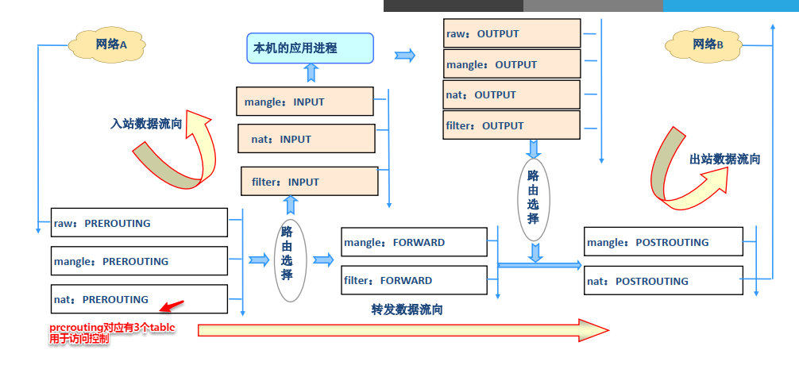
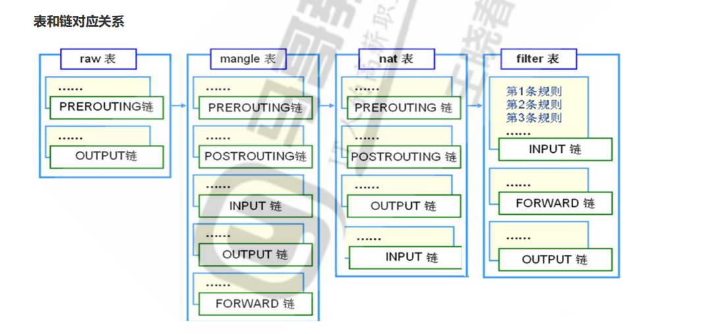
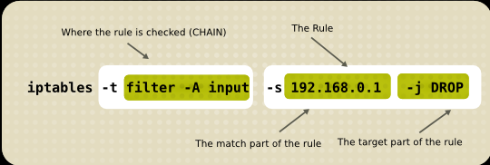

# **Netfilter**

Linux防火墙是由Netfilter组件提供的，Netfilter工作在内核空间，集成在linux内核中。Netfilter 是Linux 2.4.x之后新一代的Linux防火墙机制，是linux内核的一个子系统。Netfilter采用模块化设计，具有良好的可扩充性，提供扩展各种网络服务的结构化底层框架。Netfilter与IP协议栈是无缝契合，并允许对数据报进行过滤、地址转换、处理等操作

Netfilter官网文档：https://netfilter.org/documentation/

```
root@iZj6c9hr0bgawxpm715uauZ:~# grep -m 10 NETFILTER /boot/config-5.4.0-26-generic 
# grep -m 显示前n个
CONFIG_NETFILTER=y
CONFIG_NETFILTER_ADVANCED=y
CONFIG_BRIDGE_NETFILTER=m
CONFIG_NETFILTER_INGRESS=y
CONFIG_NETFILTER_NETLINK=m
CONFIG_NETFILTER_FAMILY_BRIDGE=y
CONFIG_NETFILTER_FAMILY_ARP=y
CONFIG_NETFILTER_NETLINK_ACCT=m
CONFIG_NETFILTER_NETLINK_QUEUE=m
CONFIG_NETFILTER_NETLINK_LOG=m

# Y表示时刻在内核中加载
# M表示可加载模块，他们不需要一直保持，仅在需要的时候加载，它将使您的系统更高效。
```


无论是使用iptables还是firewalld等工具，都是通过内核的netfilter模块功能进行控制的，是一种扩展各种网络服务的结构化底层框架。

## hook(勾子)

内核中设置了五个hook(勾子)，用于提供访问控制，用户可以通过一个命令工具（ iptables）向其写入规则。

```
function(INPUT、 OUTPUT、FORWARD、 PREROUTING、 POSTROUTING)，
```



## 报文流向：

流入本机： PREROUTING --> INPUT-->用户空间进程

流出本机：用户空间进程 -->OUTPUT--> POSTROUTING

转发： PREROUTING --> FORWARD --> POSTROUTING


# **iptables**

由软件包iptables提供的命令行工具，工作在用户空间，用来编写规则，写好的规则被送往netfilter，告诉内核如何去处理信息包


## iptables的组成

iptables提供了5个表和5个链以及一些其他规则用于访问控制。


### 五个内置链（chain）:

iptable中提供的5个链，正好对应的Netfilter组件中的5个hook

```
INPUT
OUTPUT
FORWARD
PREROUTING
POSTROUTING
```

其中每个chain又分别有功能不同的信息过滤表（ table），用于设置不同的访问规则集（ rules）


### 过滤表（ table）

五个表分别是： filter、 nat、 mangle、 raw、 security

```
filter		# 过滤规则表，根据预定义的规则过滤符合条件的数据包
nat			# network address translation 地址转换规则表
mangle		# 修改数据标记位规则表
raw			# 关闭NAT表上启用的连接跟踪机制，加快封包穿越防火墙速度
security	# 用于强制访问控制(MAC)网络规则，由Linux安全模块（如SELinux）实现.

生效优先级由高到低的顺序为： security -->raw-->mangle-->nat-->filter
```




## iptables规则

`man 8 iptables;man iptables-extensions`

iptables会对设置的规则进行==依次匹配==，匹配成功的报文会根据规则中中预先定义的处理动作作出处理，==之后的规则不在生效==

iptables规则添加时考量点

1. 要实现哪种功能：判断添加在哪张表上
2. 报文流经的路径：判断添加在哪个链上
3. 报文的流向：判断源和目的


### 规则格式：

```
iptables [-t table] SUBCOMMAND chain [-m matchname[per-match-options]] \
-j targetname [per-target-options]
```





SUBCOMMAND	# 子命令


### iptables参数

```
# 查看
-L		# list, 列出指定链上的所有规则，本选项须置后
-n		# numberic，以数字格式显示地址和端口号 
-v		# verbose，详细信息
-vv 	# 更详细
-x		# exactly，显示计数器结果的精确值,而非单位转换后的易读值
--line-numbers	# 显示规则的序号

常用组合：
-vnL    # 查看所有规则
-vvnxL --line-numbers
-S selected	# 以iptables-save 命令格式显示链上规则


# 规则管理
-A		# append追加，追加规则到指定的链
-I		# insert插入，要指明插入至的规则编号，默认为第一条
-D		# delete，删除
		(1) 指明规则序号 iptables -D INPUT 1
        (2) 指明规则本身
-R		# replace替换，替换指定链上的指定规则编号的规则
-F		# flush，清空指定的规则链
-Z		# zero，清除计数器
		iptables的每条规则都有两个计数器
		(1) 匹配到的报文的个数
		(2) 匹配到的所有报文的大小之和	
        
-t		# 指定表
```


### chain链

```
-N： new, 自定义一条新的规则链
-X： delete，删除自定义的空的规则链,需要先解除关联并清空规则
-P： Policy，设置默认策略；对filter表中的链而言，其默认策略有：ACCEPT：接受，DROP：丢弃
示例：iptables -P INPUT DROP    # 将防火墙默认策略设置为拒绝所有访问，不建议
-E：重命名自定义链；引用计数不为0的自定义链不能够被重命名，也不能被删除


# 创建自定义链
iptables -N LANTOWLAN 	# 创建一个叫LANTOWLAN的链

# 向自定义链中添加规则
iptables -A  LANTOWLAN -s 192.168.37.0/24 -j ACCEPT    

# 自定义链需要和系统链关联起来才会生效，类似于写一个函数可以被直接调用
iptables -A FORRWARD -j LANTOWLAN    	# 将处理动作指向自定义链中
```


### 处理动作

`-j targetname [per-target-options]`

```
简单： ACCEPT(接受)， DROP(丢弃)

扩展： 
REJECT： --reject-with:icmp-port-unreachable # 默认动作
RETURN：返回调用链
REDIRECT：端口重定向
LOG：记录日志， dmesg
MARK：做防火墙标记
DNAT：目标地址转换
SNAT：源地址转换
MASQUERADE：拨号地址的转换
...
自定义链：
```


示例：

```
# 拒绝192.168.1.150访问
iptables -t filter -A INPUT -s 192.168.1.150 -j REJECT

# 同时指定多个地址
iptables -t filter -A INPUT -s 192.168.1.150,192.168.1.151 -j REJECT

# 禁止某个网段访问
iptables -t filter -A INPUT -s 192.168.3.0/24  -j REJECT

# 清空规则
iptables -t filter  -F INPUT
```


LOG：

对请求不拒绝和允许,只会将记录日志，保存在/var/log/messages系统日志中

```
--log-level level    # 定义日志级别：debug， info， notice, warning, error, crit,alert,emerg
--log-prefix prefix 日志前缀，用于区别不同的日志，最多29个字符


iptables -I INPUT -s 10.0.1.0/24 -p tcp -m multiport --dports 80,21,22,23
-m state --state NEW -j LOG --log-prefix "new connections: "
```


### 匹配条件

```
# [!]表示可以取反

[!]-s, --source address[/mask][,...]			# 匹配源IP地址或范围
[!]-d, --destination address[/mask][,...]：		# 目标IP地址或范围
[!]-p, --protocol protocol	# 指定协议，可使用数字如0（all）
# 协议（protocol）饱含: tcp, udp, icmp, icmpv6, udplite,esp, ah, sctp, mh or“all“
# 参看： /etc/protocols

[!]-i, --in-interface name		# 报文流入的接口,只能应用于数据报文流入环节，只应用于INPUT、 FORWARD、 PREROUTING链
[!]-o, --out-interface name		# 报文流出的接口,只能应用于数据报文流出的环节，只应用于FORWARD、 OUTPUT、 POSTROUTING链
```

示例

```
iptables -t filter -A INPUT -s 192.168.3.0/24  -j REJECT


# 允许192.168.3.0/24中192.168.3.150和151访问
iptables -t filter -I INPUT -s 192.168.3.150,192.168.3.151 -j ACCEPT 

# iptable规则自上向下匹配，匹配到规则之后不在向下匹配，因此需要将92.168.3.150允许访问的规则放在上边
# -I 插入到编号1
```


### 扩展匹配

用于匹配普通模式下不能进行的操作，需要加载扩展模块（ /usr/lib64/xtables/*.so）

https://www.cnblogs.com/wanstack/p/8393035.html


显式扩展：必须使用-m选项指明要调用的扩展模块的扩展机制，要手动加载扩展模块

隐式扩展：在使用-p选项指明了特定的协议时，无需再用-m选项指明扩展模块的扩展机制，不需要手动加载扩展模块


#### tcp协议的扩展选项

端口匹配，或者端口范围

```
[!]--sport port[:port]：匹配报文源端口,可为端口范围

[!]--dport port[:port]：匹配报文目标端口,可为范围


# 允许192.168.1.110访问本机3306端口
iptables -I INPUT -s 192.168.1.100 -p -tcp --dport 3306 -j ACCEPT

 # 指定端口范围
iptables -I INPUT -s 192.168.1.150 -p tcp --dport 700:800 -j ACCEPT   
```

tcp状态匹配

```
[!]--tcp-flags mask comp
				# mask：表示需检查的标志位列表，用,分隔。例如：SYN,ACK,FIN,RST
				# comp：在mask列表中必须为1的标志位列表，无指定则必须为0，用,分隔
# 例如：--tcp-flags SYN,ACK,FIN,RST SYN，检查标志位SYN,ACK,FIN,RST，其中SYN必须为1，余下的必须为0
				
[!]--syn：用于匹配第一次握手	# 相当--tcp-flags SYN,ACK,FIN,RST SYN


# 拒绝192.168.1.110握手
iptables - A INPUT -s 192.168.1.110 -p tcp  --tcp-flags SYN,ACK,FIN,RST SYN -j REJECT
iptables - A INPUT -s 192.168.1.110 -p tcp  --syn -j REJECT
```


#### udp协议的扩展选项

```
[!]--source-port, --sport port[:port]：		# 匹配报文的源端口或端口范围
[!]--destination-port,--dport port[:port]：	# 匹配报文的目标端口或端口范围
```


#### icmp协议扩展选项

```
[!]--icmp-type {type[/code]|typename}
# type/code
# 0/0 echo-reply    icmp应答
# 8/0 echo-request    icmp请求

# 禁止所有人ping自己,但是可以ping别人
iptables -A INPUT -s 0.0.0.0/0 -p icmp --icmp-type 8 -j REJECT
```


#### multiport扩展

可以最多指定15个端口，可以连续

```
[!]--source-ports,--sports port[,port|,port:port]...指定多个源端口
[!]--destination-ports,--dports port[,port|,port:port]...指定多个目标端口
[!]--ports port[,port|,port:port]...多个源或目标端口，不区分sports或dports

# 禁止访问自己139和445端口就
iptables -A INPUT -p tcp -m multiport --dports 139,445 -j ACCEPT

# 禁止访问172.16.0.0/16访问172.16.100.10的20:22,80 端口
iptables -A INPUT -s 172.16.0.0/16 -d 172.16.100.10 -p tcp -m multiport --dports 20:22,80 -j ACCEPT
```


#### iprange扩展

指明连续的（但一般不是整个网络）ip地址范围

```
[!]--src-range from[-to]    源IP地址范围
[!]--dst-range from[-to]    目标IP地址范围

# 指定ip范围
iptables -I INPUT -m iprange --src-range 192.168.1.150-192.168.1.160 -j DROP    
```


#### mac扩展：

指明源MAC地址,适用于： PREROUTING, FORWARD，INPUT链

```
[!]--mac-source XX:XX:XX:XX:XX:XX

# 允许00:50:56:12:34:56 访问自己
iptables -A INPUT -s 172.16.0.100 -m mac --mac-source 00:50:56:12:34:56 -j ACCEPT
```


#### string扩展

对报文中的应用层数据做字符串模式匹配检测

```
--algo {bm|kmp}    # 指定字符串匹配检测算法
--from offset      # 开始匹配的偏移量
--to offset    	   # 结束偏移

[!]--string pattern    		# 要检测的字符串模式
[!]--hex-string pattern		# 要检测字符串模式， 16进制格式

# 拒绝本机访问页面中带taobao字符串的页面
iptables -A OUTPUT -p tcp --sport 80 -m string --algo bm --string "taobao" -j REJECT
```


#### time扩展

据将报文到达的时间与指定的时间范围进行匹配

```
--datestart YYYY[-MM[-DD[Thh[:mm[:ss]]]]] 	# 日期匹配
--datestop YYYY[-MM[-DD[Thh[:mm[:ss]]]]]
--timestart hh:mm[:ss]    # 时间匹配
--timestop hh:mm[:ss]
 
[!] --monthdays day[,day...]	# 每个月的几号
[!] --weekdays day[,day...]		# 星期几， 1 – 7 分别表示星期一到星期日

--kerneltz		# 系统默认使用UTC时区（-8小时）,使用此参数将使用内核设置的时区（不建议）
--localtz		# 指定本地时区(默认)

# 每周六、日 14:30-18:30 拒绝访问
iptables -A INPUT -s 172.16.0.0/16 -d 172.16.100.10 -p tcp --dport 80 -m time --timestart 14:30 --timestop 18:30 --weekdays Sat,Sun --kerneltz -j DROP
```


#### connlimit扩展：

根据每客户端IP做并发连接数数量匹配，可防止Dos(Denial of Service，拒绝服务)攻击，通常分别与默认的拒绝或允许策略配合使用。

```
--connlimit-upto #    并发连接的数量小于等于n时匹配
--connlimit-above #    连接的数量大于n时匹配

# 超过2个连接就断开
iptables -A INPUT -d 172.16.100.10 -p tcp --dport 22 -m connlimit --connlimit-above 2 -j REJECT
```


#### limit扩展

基于收发报文的速率做匹配,也叫令牌桶过滤器

```
--limit #[/second|/minute|/hour|/day]  设置每秒、分钟、小时可收发的包数
--limit-burst number    空闲时间最多可通过数量（默认值5）

# 令牌桶"理论类比我们的命令，
--limit就是用于指定"多长时间生成一个新令牌的"，
--limit-burst就是用于指定"木桶中最多存放几个令牌


假设如下的规则：
iptables -A INPUT -p icmp -m limit --limit 6/m --limit-burst 5 -j ACCEPT
iptables -P INPUT DROP
然后从另一部主机上ping这部主机，就会发生如下的现象：
首先我们能看到前四个包的回应都非常正常，然后从第五个包开始，我们每10秒能收到一个正常的回应。这是因为我们设定了单位时间(在这里是每分钟)内允许通过的数据包的个数是每分钟6个，也即每10秒钟一个；其次我们又设定了事件触发阀值为5，所以我们的前四个包都是正常的，只是从第五个包开始，限制规则开始生效，故只能每10秒收到一个正常回应。

假设我们停止ping，30秒后又开始ping，这时的现象是：
前两个包是正常的，从第三个包开始丢包，这是因为在这里我的允许一个包通过的周期是10秒，如果在一个周期内系统没有收到符合条件的包，系统的触发值就会恢复1，所以如果我们30秒内没有符合条件的包通过，系统的触发值就会恢复到3，如果5个周期内都没有符合条件的包通过，系统都触发值就会完全恢复。
```


state扩展：

根据”连接追踪机制“去检查连接的状态，较耗资源.

`CentOS7 需要加载模块： modprobe nf_conntrack_ipv4`


state扩展使用conntrack机制用来追踪本机上的请求和响应之间的关系，

```
[!] --state state

公有几种状态如下：
NEW：新发出请求；连接追踪信息库中不存在此连接的相关信息条目，因此，将其识别为第一次发出的请求
ESTABLISHED： NEW状态之后，连接追踪信息库中为其建立的条目失效之前期间内所进行的通信状态
RELATED：新发起的但与已有连接相关联的连接，如： ftp协议中的数据连接与命令连接之间的关系
INVALID：无效的连接，如flag标记不正确
UNTRACKED：未进行追踪的连接，如raw表中关闭追踪

# 允许发往172.16.1.10：22,80端口的新链接和ESTABLISHED的连接
iptables -A INPUT -d 172.16.1.10 -p tcp -m multiport --dports 22,80
-m state --state NEW,ESTABLISHED -j ACCEPT

# 允许来自172.16.1.10 22,80端口处于ESTABLISHED状态的连接
iptables -A OUTPUT -s 172.16.1.10 -p tcp -m multiport --sports
22,80 -m state --state ESTABLISHED -j ACCEPT


# 已经追踪到请求会记录并保存到连接信息库
/proc/net/nf_conntrack

# 连接追踪功能所能够容纳的最大连接数量
/proc/sys/net/nf_conntrack_max

# 不同的协议的连接追踪时长
/proc/sys/net/netfilter/
```

iptables的链接跟踪表最大容量为/proc/sys/net/nf_conntrack_max,一般默认的nf_conntrack_max=65535，很快就被塞满了。一旦塞满了就会随机的drop包。在外面看来就是丢包情况非常厉害。

https://www.cnblogs.com/jianyungsun/p/12554455.html

```
解决方法两个：
(1) 加大nf_conntrack_max 值
	vi /etc/sysctl.conf
    net.nf_conntrack_max = 393216
    net.netfilter.nf_conntrack_max = 393216
    
(2) 降低 nf_conntrack timeout时间
 vi /etc/sysctl.conf
    net.netfilter.nf_conntrack_tcp_timeout_established = 300
    net.netfilter.nf_conntrack_tcp_timeout_time_wait = 120
    net.netfilter.nf_conntrack_tcp_timeout_close_wait = 60
    net.netfilter.nf_conntrack_tcp_timeout_fin_wait = 120
    iptables -t nat -L -n
```


### FTP协议配置规则

FTP协议当配置为被动模式时，服务器使用随机端口，防火墙需要追踪ftp相关联的连接来配置规则，需要使用nf_conntrack_ftp进行ftp协议分析，在通过state模块进行关联

```
modprobe nf_conntrack_ftp    

iptables -A INPUT -m state --state ESTABLISHED,RELATED -j ACCEPT # 已连接或相关的连接放行
iptables -A INPUT -p tcp --dport 21 -m state --state NEW -j ACCEPT    # ftp 21端口新请求放行
iptables -A OUTPUT -m state --state ESTABLISHED -j ACCEPT
iptables -P INPUT DROP
iptables -P OUTPUT DROP
```


## 防火墙net地址转换：

nat转换需要配置nat表进行转换

### SNAT：

从内网访问往外的net转换是SNAT，代理服务器会将内网客户端的ip先替换成代理的ip，然后向互联网主机发起请求，服务器收到请求后将response数据发给net服务器，然后net服务器根据地址转换记录找到真正发起请求的主机，然后将数据返还给他。==一般用正向代理。==


```
--to-source [ipaddr[-ipaddr]][:port[-port]]    # 替换的地址,也可以是轮询的地址范围
--random      # 请求时随机访问多个地址
```


#### 固定ip替换

```
iptables -t nat -A POSTROUTING -s 192.168.1.0/24 -j SNAT --to-source 192.168.1.11

iptables -t nat -A POSTROUTING -s 192.168.1.0/24 -j SNAT --to-source 192.168.1.11-192.168.1.13
```


#### 随机ip替换

MASQUERADE    --to-ports port[-port]：使用动态分配ip的网关外网时进行地址转换

```
iptables -t nat -A POSTROUTING -s 192.168.1.0/24 -j MASQUERADE

iptables -t nat -A POSTROUTING -s 192.168.1.0/24 -j MASQUERADE --to-ports 1024-3000
# 只转换1024-3000的端口
```


### DNAT

用于外部计算机访问自己的内部计算机（反向代理），外部客户端向代理发起request请求，代理服务器会将自己的ip替换成外部客户端的ip，然后向内部服务器发起请求，内部服务器将response数据发给代理后，代理服务将内部服务器ip转换成自己的ip然后发还给客户端

需要在在prerouting上设置策略，需要在进入路由之前修改ip否则，否则代理主机检测自己没有相关服务会直接抛弃相关包。

```
# 将访问172.16.0.7主机80的请求 转发到192.168.1.110:80
iptable -t nat -A prerouting -s0/0 -d 172.16.0.7 -p tcp --dport 80 -j DNAT --to-destionation 192.168.1.110:80
```


### REDIRECT：本机端口转发

```
# 将访问主机172.16.100.10的80端口转到本机8080端口上
iptables -t nat -A PREROUTING -d 172.16.100.10 -p tcp --dport 80 -j REDIRECT --to-ports 8080
```


# 防火墙策略保存与恢复

防火墙策略重启后会丢失，需要保存至指定位置


防火墙策略保存

```
# CentOS 7
iptables-save > /PATH/TO/SOME_RULES_FILE

# CentOS 6
service iptables save    # 规则覆盖保存至/etc/sysconfig/iptables文件中
```


防火墙规则导入

```
iptables-restore < /PATH/FROM/SOME_RULES_FILE
# 使用 -n, --noflush：恢复的时候不清除现有规则


# centos6
service iptables restart 会自动从/etc/sysconfig/iptables 重新载入规则
```


自动载入防火墙规则

```
vim /etc/rc.d/rc.local    # 此文件会开机执行
iptables-restore < /PATH/FROM/IPTABLES_RULES_FILE

# CentOS 7 可以安装 iptables-services 实现iptables.service
yum install iptables-services
iptables-save > /etc/sysconfig/iptables
systemctl enable iptables.service
```

