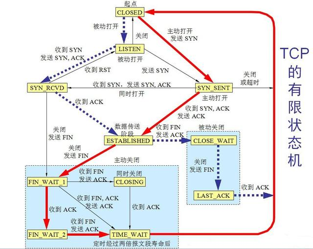
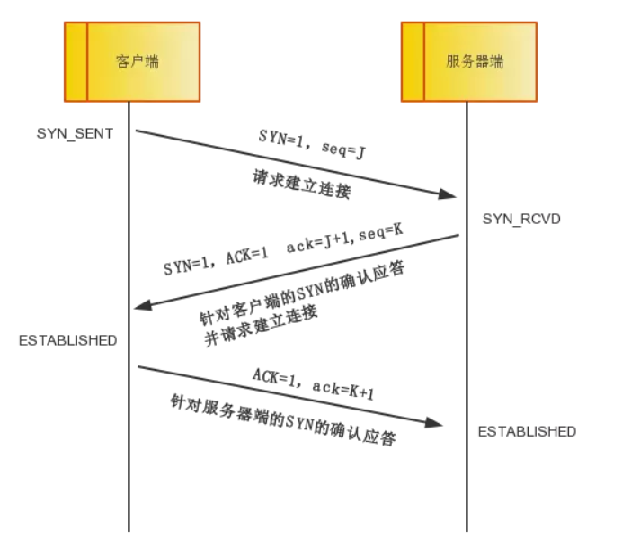
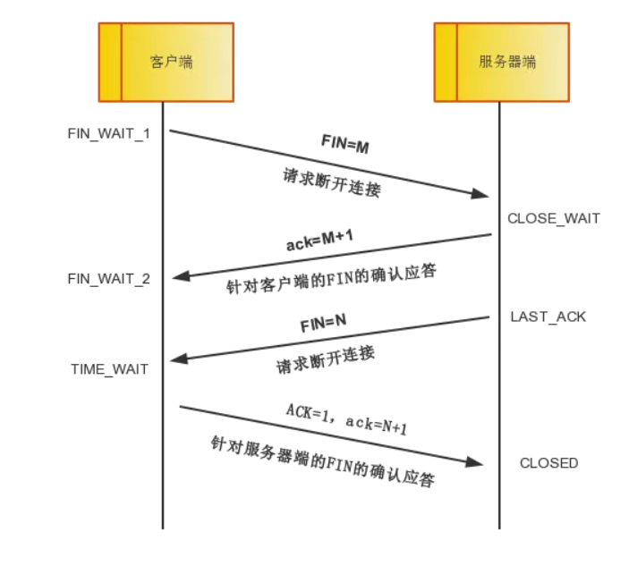
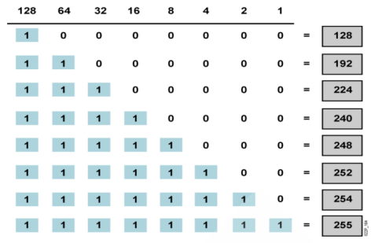
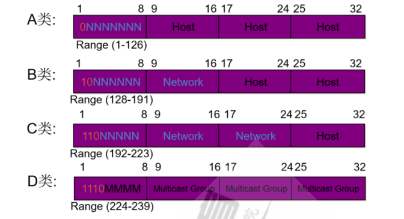
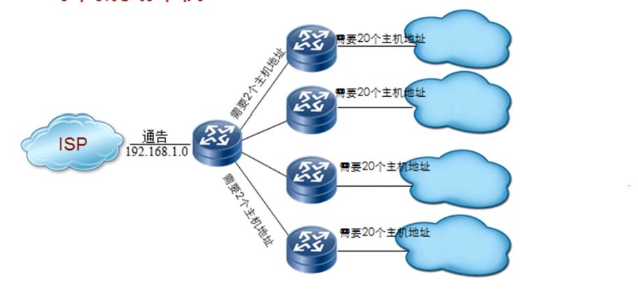
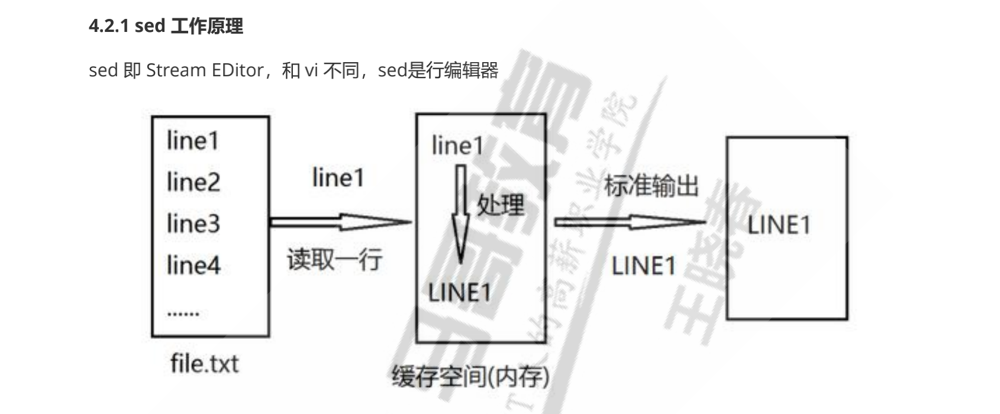

# 	系统进程

## 查看瞬时进程

### ps命令

常用组合: ps -ef  | ps aux

参数含义：-e显示所有运行的进程，-f，扩展输出进程信息 

```
F S UID          PID    PPID  C PRI  NI ADDR SZ WCHAN  STIME TTY          TIME CMD
4 S root           1       0  0  80   0 - 42338 ep_pol 11月29 ?      00:32:17 /sbin/init splas
1 S root           2       0  0  80   0 -     0 kthrea 11月29 ?      00:00:03 [kthreadd]
1 I root           3       2  0  60 -20 -     0 rescue 11月29 ?      00:00:00 [rcu_gp]
1 I root           4       2  0  60 -20 -     0 rescue 11月29 ?      00:00:00 [rcu_par_gp]
1 I root           6       2  0  60 -20 -     0 worker 11月29 ?      00:00:00 [kworker/0:0H-ev
```

各列含义：

- F：内核分配给进程的系统标识
- S：进程的状态
  - O：代表正在运行
  - S：代表正在休眠
  - R：代表可运行，正在等待运行
  - Z：代表僵化，进程已经结束，但父进程已经不存在（僵尸进程，应该尽量减少）
  - T：代表停止
- UID：启动这些进程的用户
- PID：本进程ID
- PPID：父进程的进程号
- C：进程生命周期中的cpu利用率
- PRI：进程的优先级，大部分系统（Linux、UCOSII）都是数字越低优先级越高，进程就优先运行 ， Linux中的PRI（new） = PRI（old） + nice ，其中 ， PRI（old）为系统算法决定 
- NI：进程优先级的修正量（nice值）， -20 ~ 19 ，用户可修改 （root用户可修改nice值-20 ~ 19 ，普通用户只能修改nice值0~19 ）。一般情况下，子进程继承父进程的nice值，由于init进程的nice值为0，所有大部分进程的nice值都为 0，NI值越小越优先
- ADDR：进程的内存地址
- SZ：假如进程被换出，需要的交换空间的大致大小
- WCHAN：进程休眠的内核函数地址
- STIME：进程启动时的系统时间
- TTY：进程启动时的终端设备
- TIME：运行进程所需要的CPU累计时间
- CMD：启动的进程名称

参数含义 a：显示所有终端的进程，x：显示所有后台进程，u：基于用户格式显示

```
root@pi-PowerEdge-R620:~# ps aux
USER         PID %CPU %MEM    VSZ   RSS TTY      STAT START   TIME COMMAND
root           1  0.3  0.0 169352 12916 ?        Ss   11月29  32:14 /sbin/init splash
root           2  0.0  0.0      0     0 ?        S    11月29   0:03 [kthreadd]
root           3  0.0  0.0      0     0 ?        I<   11月29   0:00 [rcu_gp]
root           4  0.0  0.0      0     0 ?        I<   11月29   0:00 [rcu_par_gp]
root           6  0.0  0.0      0     0 ?        I<   11月29   0:00 [kworker/0:0H-events_highp
root          10  0.0  0.0      0     0 ?        I<   11月29   0:00 [mm_percpu_wq]
root          11  0.0  0.0      0     0 ?        S    11月29   0:00 [rcu_tasks_rude_]
root          12  0.0  0.0      0     0 ?        S    11月29   0:00 [rcu_tasks_trace]
root          13  0.0  0.0      0     0 ?        S    11月29 
```

各列含义：

- VSZ：进程在内存中的大小，以千字节（KB）为单位
- RSS：进程在未换出时占用的物理内存。
- STAT：代表当前进程状态的双字符状态码，第一个字符采用了和Unix风格的S列相同的值，表示进程是在休眠，运行还是在等待，第二个列进一步说明了进程状态
  -  <：该进程运行在高优先级上
  - N：该进程运行在低优先级上
  - L：该进程有页面锁定在内存中
  - s：该进程是控制进程
  - l：该进程是多线程的
  - +：该进程运行在前台


## 查看实时进程

ps命令只能显示系统瞬间的进程信息，无法做到跟踪显示进程信息

### TOP命令

top命令在启动时，默认会按照%cpu来对进程排序，也可以在使用交互的方式修改显示方式。

```
top - 22:11:17 up 6 days,  8:55,  2 users,  load average: 0.22, 0.35, 0.35
Tasks: 706 total,   1 running, 702 sleeping,   0 stopped,   3 zombie
%Cpu(s):  0.3 us,  1.0 sy,  0.0 ni, 98.7 id,  0.0 wa,  0.0 hi,  0.0 si,  0.0 st
MiB Mem :  64357.4 total,    371.7 free,   4379.3 used,  59606.4 buff/cache
MiB Swap:    976.0 total,    943.4 free,     32.6 used.  59317.6 avail Mem 

    PID USER      PR  NI    VIRT    RES    SHR S  %CPU  %MEM     TIME+ COMMAND                                           
2077012 root      20   0 7284512   4.0g   3.9g S   9.2   6.3 663:23.13 vmware-vmx                                        
2077293 root      20   0 7284012   4.1g   4.0g S   5.6   6.5 375:57.05 vmware-vmx                                        
2077026 root      20   0 7286748   4.0g   3.9g S   5.3   6.3 375:42.30 vmware
```

#### 第一行显示

```
top - 22:01:59 up 6 days,  8:45,  2 users,  load average: 0.82, 0.54, 0.41
# 分别显示 当前系统时间，运行时间，登录的系统用户，以及当前系统平均负债
# 系统负载有3个值，分别表示最近1分钟、最近5分钟和最近15分钟平均负债
```

值越大，说明负载越高，由于进程短期的突发性活动可能导致1分钟的高负债较为常见，如果15分钟内平均负载较高则说明系统存在问题

#### 第二行显示

```
Tasks: 706 total,   1 running, 702 sleeping,   0 stopped,   3 zombie
```

第二行显示了进程的概要信息，分别显示了进程总数，运行的进程、休眠进程、暂停进程以及僵尸进程的数量。

#### 第三至五行显示

```
%Cpu(s):  0.3 us,  1.0 sy,  0.0 ni, 98.7 id,  0.0 wa,  0.0 hi,  0.0 si,  0.0 st
MiB Mem :  64357.4 total,    371.7 free,   4379.3 used,  59606.4 buff/cache
MiB Swap:    976.0 total,    943.4 free,     32.6 used.  59317.6 avail Mem 
# 显示了cpu的使用情况情况
#	物理内存的使用情况
#	交换分区的使用情况
```

显示了cpu的概要信息，top命令是根据进程的属主（用户还是系统）和进程的状态将cpu利用率分成几类输出。

#### 最后显示

```
    PID USER      PR  NI    VIRT    RES    SHR S  %CPU  %MEM     TIME+ COMMAND                                           
2077012 root      20   0 7284512   4.0g   3.9g S   9.2   6.3 663:23.13 vmware-vmx                                        
2077293 root      20   0 7284012   4.1g   4.0g S   5.6   6.5 375:57.05 vmware-vmx 
```

- PID：进程号
- USER：进程属主
- PR：进程的优先级
- NI：进程的谦让（nice）值
- VIRT：进程占据虚拟内存总量
- RES：进程占用物理内存总量
- SHR：进程和其他进程共享的内存总量
  - S：进程状态
  - O：代表正在运行
  - S：代表正在休眠
  - R：代表可运行，正在等待运行
  - Z：代表僵化，进程已经结束，但父进程已经不存在（僵尸进程，应该尽量减少）
  - T：代表停止
- %CPU：进程的cpu占用率
- %MEM：进程使用的内存占可用内存的比例
- TIME+：自进程启动到目前为止共占用的cpu时间
- COMMAND：进程对应的命令行


## 结束进程

在Linux中，进程之间通过信号来通讯，进程的信号就是预定义好的一个消息，进程能够识别并做出反应，进程如何处理信号是由程序人员在开发时就定义好的，大多数程序都能接受和处理标准的Unix进程的信号。常见的进程信号如下：

| 信号 | 名称 |             描述             |
| :--: | :--: | :--------------------------: |
|  1   | HUB  |             挂起             |
|  2   | INT  |             中断             |
|  3   | QUIT |           结束运行           |
|  9   | KILL |          无条件终止          |
|  11  | SEGV |            段错误            |
|  15  | TERM |          尽可能终止          |
|  17  | STOP |   无条件停止运行，但不终止   |
|  18  | TSTP | 停止或暂停，但继续在后台运行 |
|  19  | CONT |   在STOP或TSTP之后恢复执行   |

在Linux有两个命令可以向运行中的进程发送进程信号。

### kill命令

kill命令可用通过进程编号（PID）给进程发送信号。默认情况下，kill命令会向命令行中列出的全部PID发送一个TERM信号（当前用户需要是root或者进程的属主）。

kill命令不能使用命令名来发送信号，因此有时候不太方便，需要使用其他命令来发送信号。

```
kill 进程编号
如果信号无效，可以使用-s，指定其他信号进行强制终止
kill -s HUP
```


### killall命令

killall命令，支持通过进程名（命令名）来结束进程，而且killall还支持通配符匹配进程。

```
killall http*
```


# 磁盘管理

## 磁盘挂载

### mount命令

用来挂在磁盘到系统目录，mount命令进行磁盘挂载前，磁盘设备需要先创建文件系统。默认情况下，mount命令会输出当前系统上挂载的设备列表和挂载属性

```
root@pi-PowerEdge-R620:~# mount
sysfs on /sys type sysfs (rw,nosuid,nodev,noexec,relatime)
proc on /proc type proc (rw,nosuid,nodev,noexec,relatime)
udev on /dev type devtmpfs (rw,nosuid,noexec,relatime,size=32916176k,nr_inodes=8229044,mode=755,inode64)
devpts on /dev/pts type devpts (rw,nosuid,noexec,relatime,gid=5,mode=620,ptmxmode=000)
tmpfs on /run type tmpfs (rw,nosuid,nodev,noexec,relatime,size=

# (rw,nosuid,nodev,noexec,relatime)里边显示的是挂载属性
```

命令格式

```
mount [-fnrsvw] [-t vfstype] [-o options] device dir

方法1:mount 设备名 挂载点
[root@bogon ~]# mount /dev/sda1 /mnt/sda1
[root@bogon ~]# mount /dev/sda2 /mnt/sda2

方法2：mount -L 卷标名 挂载点

方法3：mount -U uuid 挂载点
```


#### /etc/mtab文件

/etc/mtab文件记录系统挂载情况，实际为/proc/self/mounts的内存信息软连接。当mount命令挂载磁盘时，默认会向/etc/mtab文件进行注册，当使用mount命令显示挂载信息时，实际上就是读取了/etc/mtab文件，但是当用户使用mount -n参数时，系统是不会进行注册的，因此mount命令也无法查看隐藏挂载的磁盘。

通过查看内存进程方式显示挂载情况，能够显示所有隐藏的挂载设备

```
cat /proc/mounts
```


#### **常用选项**

```
-a 挂在/etc/fstab文件中指定的设备和文件系统
-r readonly，只读挂载
-w read and write, 读写挂载
-n 隐藏挂载，不更新/etc/mtab，（df等看不到挂载信息，centos7无效，应为之间看的内存信息）
-a 自动挂载所有支持自动挂载的设备(定义在了/etc/fstab文件中，且挂载选项中有auto功能)
-L 'LABEL'以卷标指定挂载设备
-U 'UUID' 以UUID指定要挂载的设备
-B, --bind绑定目录到另一个目录上（文件夹挂在到文件夹上）
-o 给文件系统添加特定的挂载选项
```

-o options：(挂载文件系统的选项)，多个选项使用逗号分隔

```
defaults：相当于rw, suid, dev, exec, auto, nouser, async
async    异步模式
sync    同步模式,内存更改时，同时写磁盘
atime/noatime    是否记录文件时间戳
diratime/nodiratime    目录的访问时间戳
auto/noauto    是否支持自动挂载,是否支持-a选项
exec/noexec    是否支持将文件系统上运行应用程序(是否能够运行可执行文件)
dev/nodev    是否支持在此文件系统上使用设备文件
suid/nosuid    是否支持suid和sgid权限
remount    重新挂载
ro，norecovery    只读
rw    读写
user/nouser    是否允许普通用户挂载此设备，/etc/fstab使用
acl    启用此文件系统上的acl功能
loop    使用loop设备

```

指定设备挂载属性

```

[root@bogon ~]# mount -r /dev/sda1 /mnt/sda1  # 只读挂载

[root@bogon ~]# touch /mnt/sda1 f1.txt
touch: setting times of ‘/mnt/sda1’: Read-only file system
```


mount命令支持设备在不卸载的情况下进行重新挂载

```
# 以读写方式重新挂载
[root@bogon ~]# mount -o remount,rw /mnt/sda1
[root@bogon ~]# touch /mnt/sda1 f1.txt
```


## 磁盘使用情况

### df命令

```
[root@bogon ~]# df
Filesystem     1K-blocks     Used Available Use% Mounted on
/dev/sda1        3135488    33024   3102464   2% /mnt/sda1
/dev/sda2        3030800     9216   2847916   1% /mnt/sda2

```


### du命令


查看当前文件夹占用大小

```
du -c -h -s 
root@pi-PowerEdge-R620:/# du -c -h -s
du: cannot access './proc/28498/task/28524/fdinfo/71': No such file or directory
du: cannot access './proc/3307683/task/3307683/fd/3': No such file or directory
du: cannot access './proc/3307683/task/3307683/fdinfo/3': No such file or directory
du: cannot access './proc/3307683/fd/4': No such file or directory
du: cannot access './proc/3307683/fdinfo/4': No such file or directory
du: cannot access './proc/3308578': No such file or directory
du: cannot access './proc/3810822/task/3811333/fdinfo/55': No such file or directory
du: cannot access './proc/3812642/task/3813007/fdinfo/17': No such file or directory
879G	.
879G	total
```


 查看文件夹下各文件大小

```
# du -h --max-depth=1 目录
root@pi-PowerEdge-R620:/# du -h --max-depth=1 /var/
4.0K	/var/mail
250G	/var/spool
884K	/var/crash
16G	/var/lib
4.0K	/var/metrics
416M	/var/log
4.3M	/var/backups
1.9M	/var/snap
68K	/var/tmp
4.0K	/var/local
4.0K	/var/opt
450M	/var/cache
266G	/var/
```


# 网络管理

## 网络基础

### TCPIP协议

TCP端口的十一种连接状态

1. CLOSED：端口默认是关闭状态。
2. LISTEN： 服务器程序开始监听一个端口，就是LISTEN状态。
3. SYN_RCVD：三次握手的第二次握手后的端口状态，是收到了客户端发送的SYN_SENT数据包之后的状态，这个状态很短暂，正常在服务器上是很少看到的，除非服务器故意不发送最后一次握手数据包，服务器返回给客户端SYN确认之后就会将在自己的端口置为SYN_RCVD。
4. SYN_SENT：SYN_SENT状态表示客户端已发送SYN=1的请求连接报文，发送之后客户端就会将自己的端口状态置为SYN_SENT。
5. ESTABLISHED：表示已经连接成功，客户端收到服务器的确认报文会回复服务器，然后就将端口置为ESTABLISHED，服务器第三次收到客户端的Ack确认就会将端口置为ESTABLISHED并开始传输数据。
6. FIN_WAIT_1：出现在主动关闭方，FIN_WAIT_1状态实际上是当SOCKET在ESTABLISHED状态时，当任意一方想主动关闭连接，向对方发送了FIN=1的断开连接请求报文，此时该SOCKET即 进入到FIN_WAIT_1状态。而当对方回应ACK报文后，则进入到FIN_WAIT_2状态，当然在实际的正常情况下，无论对方何种情况下，都应该马 上回应ACK报文，所以FIN_WAIT_1状态一般是比较难见到的，而FIN_WAIT_2状态还有时常常可以用netstat看到。
7. FIN_WAIT_2：出现在主动关闭方，当被动方回应FIN_WAIT_1的ACK报文后，则进入到FIN_WAIT_2状态
8. TIME_WAIT：出现在主动关闭方，表示收到了对方的FIN请求关闭报文，并发送出了ACK报文，就等2*MSL(MaxSegment Lifetime)后即可回到CLOSED可用状态了。如果FIN_WAIT_1状态下，收到了对方同时带FIN标志和ACK标志的报文时，可以直接进入到TIME_WAIT状态，而无须经过FIN_WAIT_2状态。
9. CLOSING： 这种状态比较特殊，实际情况中应该是很少见，属于一种比较罕见的例外状态。正常情况下，当你发送FIN报文后，按理来说是应该先收到（或同时收到）对方的 ACK报文，再收到对方的FIN报文。但是CLOSING状态表示你发送FIN报文后，并没有收到对方的ACK报文，反而却也收到了对方的FIN报文。什 么情况下会出现此种情况呢？其实细想一下，也不难得出结论：那就是如果双方几乎在同时close一个SOCKET的话，那么就出现了双方同时发送FIN报 文的情况，也即会出现CLOSING状态，表示双方都正在关闭SOCKET连接。
10. CLOSE_WAIT： 表示在等待关闭端口，这种状态存在于被动关闭的一方。
11. LAST_ACK： 是被动关闭方在主动关闭一方在发送FIN报文后，最后等待对方的ACK报文，当再次收到ACK报文后，也即可以进入到CLOSED可用状态了。


#### 端口转换状态过程

主动端口方：SYN_SENT、FIN_WAIT1、FIN_WAIT2、CLOSING、TIME_WAIT

被动断开方：LISTEN、SYN_RCVD、CLOSE_WAIT、LAST_ACK

都具有的：CLOSED 、ESTABLISHED




#### TCP三次握手

https://www.cnblogs.com/onesea/p/13053697.html

所谓三次握手(Three-way Handshake)，是指建立一个TCP连接时，需要客户端和服务器总共发送3个报文。

三次握手的目的是连接服务器指定端口，建立 TCP 连接，并同步连接双方的序列号和确认号，交换 TCP 窗口大小信息。在 socket 编程中，客户端执行 connect() 时。将触发三次握手。



**第一次握手**：

客户端将TCP报文**标志位SYN置为1**，随机产生一个序号值seq=J，保存在TCP首部的序列号(Sequence Number)字段里，指明客户端打算连接的服务器的端口，并将该数据包发送给服务器端，发送完毕后，客户端进入SYN_SENT状态，等待服务器端确认。


**第二次握手**：

服务器端收到数据包后由标志位SYN=1知道客户端请求建立连接，服务器端将TCP报文**标志位SYN和ACK都置为1**，ack=J+1，随机产生一个序号值seq=K，并将该数据包发送给客户端以确认连接请求，服务器端进入SYN_RCVD状态。

**第三次握手**：

客户端收到确认后，检查ack是否为J+1，ACK是否为1，如果正确则将标志位ACK置为1，ack=K+1，并将该数据包发送给服务器端，服务器端检查ack是否为K+1，ACK是否为1，如果正确则连接建立成功，客户端和服务器端进入ESTABLISHED状态，完成三次握手，随后客户端与服务器端之间可以开始传输数据了。

==注意:我们上面写的ack和ACK，不是同一个概念：==

```
小写的ack代表的是头部的确认号Acknowledge number， 缩写ack，是对上一个包的序号进行确认的号，ack=seq+1。

大写的ACK，则是我们上面说的TCP首部的标志位，用于标志的TCP包是否对上一个包进行了确认操作，如果确认了，则把ACK标志位设置成1
```


#### 四次挥手

四次挥手即终止TCP连接，就是指断开一个TCP连接时，需要客户端和服务端总共发送4个包以确认连接的断开。在socket编程中，这一过程由客户端或服务端任一方执行close来触发。由于TCP连接是全双工的，因此，每个方向都必须要单独进行关闭，这一原则是当一方完成数据发送任务后，发送一个FIN来终止这一方向的连接，收到一个FIN只是意味着这一方向上没有数据流动了，即不会再收到数据了，但是在这个TCP连接上仍然能够发送数据，直到这一方向也发送了FIN。首先进行关闭的一方将执行主动关闭，而另一方则执行被动关闭。


四次挥手过程的示意图如下：



挥手请求可以是Client端，也可以是Server端发起的，我们假设是Client端发起：

**第一次挥手**： 

Client端发起挥手请求，向Server端发送标志位是FIN报文段，设置序列号seq，此时Client端进入FIN_WAIT_1状态，这表示Client端没有数据要发送给Server端了。

**第二次分手**：

Server端收到了Client端发送的FIN报文段，向Client端返回一个标志位是ACK的报文段，ack设为seq加1，Client端进入FIN_WAIT_2状态，Server端告诉Client端，我确认并同意你的关闭请求。

**第三次分手**：

 Server端向Client端发送标志位是FIN的报文段，请求关闭连接，同时Client端进入LAST_ACK状态。

**第四次分手** ：

 Client端收到Server端发送的FIN报文段，向Server端发送标志位是ACK的报文段，然后Client端进入TIME_WAIT状态。Server端收到Client端的ACK报文段以后，就关闭连接。此时，Client端等待**2MSL**的时间后依然没有收到回复，则证明Server端已正常关闭，那好，Client端也可以关闭连接了。


### ARP协议

```
在广播域内，发送ARP广播，询问指定IP主机mac地址是多少，广播内的主机接收到后会对比自己的ip，如果不是找自己就将包丢弃，如果是自己，就将自己的ip和mac返还给用户。

ARP会缓存自己的内存中（一般10分钟）
```


### IP地址

IP地址由32位二进制组成，每8位一组，共4组。

0.0.0.0 -0.0.0.0-0.0.0.0-0.0.0.0，对应10进制每段0-255



IP两部分组成

网络ID：标识网络，每个网段分配一个网络ID，处于高位

主机 ID：标识单个主机，由组织分配给各设备，处于低位


IP地址被划分成5类，




A类：前8位为网络位，必须以0开头，范围1-126

B类：前16位为网络位，必须以10开头，范围128-191

C类：前24位为网络位，必须以110开头，范围192.223

D类：组（多）播地址，以1110开头，范围224-239

其他特殊ip：

- 127.0.0.1：本地回环测试地址
- 255.255.255.255 三层IP全网广播
- 0.0.0.0 代表任何网络


私有地址和公有地址


网段第一地址表示网络位，最会一个表示网段广播地址

网段中可用主机数2^x-2


#### 子网掩码

用子网掩码来区分ip地址的网络位和主机位

```
# 常见掩码
255.255.255.0

11111111 11111111 11111111 00000000

# 1必须连续，表示网络位
# 0 表示主机位


10.1.1.1
255.0.0.0
# 也可以用10.1.1.1/8表示
```


#### 子网划分

借用主机位来创建新的网络

| 网络号       | 子网                   |
| ------------ | ---------------------- |
| 192.168.10.0 | 255.255.255.192（/26） |

```
1.子网数
C类地址掩码为24，现在借用了2位，2^2=4，公有4个子网

2.子网中可用主机数
32-26=6，公有6个主机位，2^6=64，再减去网络位和广播为64-2=62

第一个子网
192.168.10.0  主机位1-62	广播地址63

第二个子网
192.168.10.64	主机位65-126	广播地址127

第三个子网
192.168.10.128	主机位129-190	广播地址191

最后一个子网
192.168.10.192	主机位193-254	广播地址255

```


| 网络号     | 子网                 |
| ---------- | -------------------- |
| 172.16.0.0 | 255.255.192.0（/18） |

```
1.子网数
B类默认掩码16，现在借2位，2^2=4

2.主机数
主机位=32-18=14 2^14-2=16384

第一个子网
172.16.0.0 主机位 172.16.0.1-172.16.63.254	广播位63.255

第二个子网
172.16.64.0	主机位 172.16.64.1-172.16.127.254	广播地址172.16.127.255

第三个子网
172.16.128.0

第四个子网
172.16.192.0
```


| 网络号     | 子网                   |
| ---------- | ---------------------- |
| 172.16.0.0 | 255.255.255.224（/27） |

```
1.子网数
B类默认掩码16，现在借11位，2^11=2048

2.主机数
主机位=32-27=5 2^5=32在减去网络和广播位30

第一个子网
172.16.0.0 主机位 172.16.0.1-172.16.0.30		广播位172.16.0.31

第二个子网
172.16.0.32	主机位 172.16.0.34-172.16.0.62		广播地址172.16.127.255

第三个子网
172.16.0.64 主机位 172.16.0.65-172.16.0.94		广播地址172.16.0.95

第四个子网
172.16.0.96
...


```


子网规划

1.根据需求，一个子网最少需要20个ip地址，也就是最少需要5个主机位，那就是/27掩码进行划分。

主机位=2^5=32

网络位

1. 192.168.1.0/27
2. 192.168.1.32/27
3. 192.168.1.64/27
4. 192.168.1.96/27  # 前4个网段就够用了
5. 192.168.1.128/27  # 给路由分配网段，2个地址就够了，进一步子网划分
   1. 192.168.1.128/30
   2. 192.168.1.132/30
   3. 192.168.1.136/30
   4. 192.168.1.140/30 # 前4个分配个4个路由
   5. 192.168.1.144/30
   6. 192.168.1.148/30
   7. 192.168.1.152/30
   8. 192.168.1.156/24
6. 192.168.1.160/27
7. 192.168.1.192/27
8. 192.168.1.224/27

### CIDR路由汇总

```
192.168.1.0/24	000000|1
192.168.2.0/24	000000|10
192.168.3.0/24	000000|11
# 前16+6位一致，掩码为22
192.168.0.0/22		# 

192.168.8.0/24	00001|000	# 不一样的都设置为0
192.168.9.0/24	00001|001
192.168.10.0/24	00001|10
...
192.168.15.0/24 
# 前16+5位一致，掩码为21位， 网络位
192.168.8.0/21
```


# 文本处理

## vim 工具

vim命令格式:`vim [OPTION]... FILE...`

- 如果该文件存在，文件被打开并显示内容
- 如果该文件不存在，当编辑后第一次存盘时创建它


常用配置

```
# 自动对齐
set autoindent
# tab=4个空格宽度
set ts=4
# 使用空格替代tab
set expandtab
%retab!


# 复制代码自动缩进会错乱，需要先关闭
set paste
```


常用选项:

```
+# 打开文件后，让光标处于第#行的行首，+默认行尾
+/PATTERN 让光标处于第一个被PATTERN匹配到的行行首
-b file 二进制方式打开文件
-d file1 file2… 比较多个文件，相当于 vimdiff
-m file   只读打开文件
-e file   直接进入ex模式，相当于执行ex file 
-y file   Easy mode (like "evim", modeless)，直接可以操作文件，ctrl+o:wq|q! 保存和不
保存退出
```


vim有三种模式：

- 命令或普通(Normal)模式：默认模式，可以实现移动光标，剪切/粘贴文本，没办法打字输入。
- 插入(Insert)或编辑模式：用于修改文本
- 扩展命令(extended command )或命令(末)行模式：保存，退出等


 插入模式：

由命令模式进入插入模式需要按以下按键才能进入

```
i # insert, 在光标所在处输入

I # 在当前光标所在行的行首输入

a # append, 在光标所在处后面输入

A # 在当前光标所在行的行尾输入

o # 在当前光标所在行的下方打开一个新行

O # 在当前光标所在行的上方打开一个新行
```

插入模式 --- ESC-----> 命令模式

命令模式 ---- : ----> 扩展命令模式

```
w 	# 写（存）磁盘文件
wq 	# 写入并退出
x 	# 写入并退出
X   # 加密
q 	# 退出
q！ # 不存盘退出，即使更改都将丢失
r   # filename 读文件内容到当前文件中
w   # filename 将当前文件内容写入另一个文件
!command # 执行命令
r!command # 读入命令的输出
```


### 查找并替换

格式:`s/要查找的内容/替换为的内容/修饰符`

```
要查找的内容：可使用基末正则表达式模式
替换为的内容：不能使用模式，但可以使用\1, \2, ...等后向引用符号；还可以使用“&”引用前面查找时查找到的整个内容

修饰符：
i #忽略大小写
g #全局替换，默认情况下，每一行只替换第一次出现
gc #全局替换，每次替换前询问

范例：
s@/etc@/var@g
s#/boot#/#i

# 查找替换中的分隔符/可替换为其它字符，如：#,@ 
```


### 光标移动快捷键

#### **单词间跳转：**

```
 w：下一个单词的词首
 e：当前或下一单词的词尾
 b：当前或前一个单词的词首
 #COMMAND：由#指定一次跳转的单词数
```


#### **当前页跳转：**

```
 H：页首 M：页中间行 L：页底
 zt：将光标所在当前行移到屏幕顶端
 zz：将光标所在当前行移到屏幕中间
 zb：将光标所在当前行移到屏幕底端
```


#### **行首行尾跳转：**

```
^ 跳转至行首的第一个非空白字符
 0 跳转至行首
 $ 跳转至行尾
```


#### **行间移动：**

```
 #G 或者扩展命令模式下 :# 跳转至由第#行
 G 最后一行
 1G, gg 第一行
```


### 常用操作

#### 字符编辑

```
x 删除光标处的字符
#x 删除光标处起始的#个字符
xp 交换光标所在处的字符及其后面字符的位置
~ 转换大小写
J 删除当前行后的换行符
```


#### 替换命令(replace)

```
r 只替换光标所在处的一个字符
R 切换成REPLACE模式（在末行出现-- REPLACE -- 提示）,按ESC回到命令模式
```


####  删除命令（delete）

```
d 删除命令，可结合光标跳转字符，实现范围删除
d$ 删除到行尾
d^ 删除到非空行首
d0 删除到行首
dw
de
db
#COMMAND
dd： 剪切光标所在的行
#dd 多行删除
D：从当前光标位置一直删除到行尾，等同于d$
```

####  复制命令(yank)

```
y 复制，行为相似于d命令
y$
 y0
y^
ye
yw
yb
#COMMAND
yy：复制行
#yy 复制多行
Y：复制整行
```

#### 粘贴命令(paste)

```
p 缓冲区存的如果为整行，则粘贴当前光标所在行的下方；否则，则粘贴至当前光标所在处的后面
P 缓冲区存的如果为整行，则粘贴当前光标所在行的上方；否则，则粘贴至当前光标所在处的前面
```

#### 改变命令(change)

```
c: 删除后切换成插入模式
 c$
c^
c0
cb
ce
cw
#COMMAND
cc：删除当前行并输入新内容，相当于S
#cc
C：删除当前光标到行尾，并切换成插入模式,相当于c$
```

#### 撤消更改

```
u 撤销最近的更改，相当于windows中ctrl+z
#u 撤销之前多次更改
U 撤消光标落在这行后所有此行的更改
Ctrl - r 重做最后的“撤消”更改，相当于windows中crtl+y
. 重复前一个操作
#. 重复前一个操作#次
```


### 文本查找

```
/PATTERN：从当前光标所在处向文件尾部查找
?PATTERN：从当前光标所在处向文件首部查找
n：与命令同方向
N：与命令反方向
```


## 常用命令

###  cat：查看文本

```
常用选项：cat [OPTION]... [FILE]...

-E：显示行结束符$

-n：对显示出的每一行进行编号

-A：显示所有控制符

-b：非空行编号

-s：压缩连续的空行成一行
```

查看换行位置，能够看出不可见空格

```
[17:10:59 root@centos7 data]#cat -E f1
a$
b $
c  d$
$
```


### tac：倒着查看文本

### nl：类似于cat -b

### rev：翻转每一行

```
[17:23:03 root@centos7 data]#vim f1
abc
123

[17:22:58 root@centos7 data]#rev f1  #翻转每行
cba
321
```


### more：分页显示，到头自动退出

### less：分页显示，到头不自动退出

### head 从头部查看

显示文件开头内容 [OPTION]... [FILE]...，默认显示前10行

```
head [OPTION]... [FILE]...
-c # 指定获取前#字节
-n # 指定获取前#行
-# 同-n
```


### tail 从尾部查看

截取文件尾部内容[OPTION]... [FILE]...、默认显示后10行

```
tail [OPTION]... [FILE]...
-c # 指定获取后#字节
-n # 指定获取后#行
-#  同-n
-f   跟踪显示文件fd新追加的内容,常用日志监，相当于 --follow=descriptor
-F   跟踪文件名，相当于--follow=name --retry
```

tailf：类似tail –f，当文件不增长时并不访问文件


### cut：切割、截取字符

```
cut [OPTION]... [FILE]...
-d DELIMITER: 指明分隔符，默认tab
-f FILEDS:
   \#:       第#个字段
   \#,#[,#]：   离散的多个字段，例如1,3,6
   \#-#：     连续的多个字段, 例如1-6
   混合使用：   1-3,7
-c 按字符切割
--output-delimiter=STRING 指定输出分隔符
\#以指定分隔符输出


#以XX为分隔符
[18:54:49 root@centos7 data]#cut -d: -f1,3 --output-delimiter="XX" /etc/passwd  
rootXX0
binXX1
daemonXX2
```


### tr：压缩替换

文本压缩，替换（注意：输入和输出同一个文件会清空文件）

```
Usage: tr [OPTION]... SET1 [SET2]

Translate, squeeze, and/or delete characters from standard input,  # 读取标准输入，使用指定模式，替换和删除字符
writing to standard output.

 -c, -C, --complement  use the complement of SET1  # 取字符集的补集
 -d, --delete      delete characters in SET1, do not translate  # 删除所有属于第一字符集的字符
 -s, --squeeze-repeats  replace each input sequence of a repeated character  #把连续重复的字符以单独一个字符表示，连续的相同字符只显示一个
              that is listed in SET1 with a single occurrence
              of that character
 -t, --truncate-set1   first truncate SET1 to length of SET2  #将字符对应的替换，超出范围的不替换
   --help   display this help and exit
   --version output version information and exit
```

大小写转换

```
[root@VM_0_17_centos ~]#tr '[:lower:]' '[:upper:]' < /etc/issue
\S
KERNEL \R ON AN \M
```

win文本转换linux文本

```
tr -d '\r' <win.txt >linux.txt
```

压缩重复字符串

```
[root@VM_0_17_centos ~]#tr -s 'ab'
aaaaaaabbbbbbbbbccccccc
abccccccc
```

### paste：合并两个文件同行号的列

```
paste [OPTION]... [FILE]...
-d 分隔符：指定分隔符，默认用TAB
-s : 所有行合成一行显示

[19:19:28 root@centos7 data]#vim f1
1
2
3
4
5

[19:19:44 root@centos7 data]#vim f2
a
b
c
d
e
[19:19:59 root@centos7 data]#paste f1 f2
1    a
2    b
3    c
4    d
5    e
    f


[19:20:02 root@centos7 data]#paste -s f1 f2
1    2    3    4    5
a    b    c    d    e    f    
```


## 文本分析

### wc 统计总数

计数单词总数、行总数、字节总数和字符总数

```
常用选项
-l 只计数行数
-w 只计数单词总数
-c 只计数字节总数
-m 只计数字符总数
-L 显示文件中最长行的长度

[19:45:19 root@centos7 data]#wc f1
6 11 47 f1    #代表6行，11个单词，47字节大小

#统计当前用户数
[19:53:46 root@centos7 data]#getent passwd | wc -l
49

```


### sort：排序

默认按字符顺序排

```
sort [options] file(s)
常用选项
-r 执行反方向（由上至下）整理
-R 随机排序
-n 执行按数字大小整理
-f 选项忽略（fold）字符串中的字符大小写
-u 选项（独特，unique）删除输出中的重复行
-t c 选项使用c做为字段界定符
-k X 选项按照使用c字符分隔的X列来整理能够使用

#按uid排序
 [19:57:18 root@centos7 data]#getent passwd | sort -t: -k3 -n
root:x:0:0:root:/root:/bin/bash
bin:x:1:1:bin:/bin:/sbin/nologin
daemon:x:2:2:daemon:/sbin:/sbin/nologin
adm:x:3:4:adm:/var/adm:/sbin/nologin
lp:x:4:7:lp:/var/spool/lpd:/sbin/nologin
sync:x:5:0:sync:/sbin:/bin/sync
shutdown:x:6:0:shutdown:/sbin:/sbin/shutdown

```


### uniq：去重

从输入中删除前后相接的重复的行

`uniq [OPTION]... [FILE]...`

常见选项

```
-c: 显示每行重复出现的次数
-d: 仅显示重复过的行
-u: 仅显示不曾重复的行
注：连续且完全相同方为重复
常和sort 命令一起配合使用：

```

uniq常和sort 命令一起配合使用：

```
[root@localhost data]# cat userlist.txt
a
b
c
d
e
f
s
a
b
c
# 先进行排序，然后去重复
[root@localhost data]# sort userlist.txt | uniq -c
      1
      2 a
      2 b
      2 c
      1 d
      1 e
      1 f
      1 s
```


范例：

1.统计日志访问量最多的请求

```
[root@centos8 data]#cut -d" " -f1 access_log |sort |uniq -c|sort -nr |head -3
   4870 172.20.116.228
   3429 172.20.116.208
   2834 172.20.0.222
   
[root@centos8 data]#lastb -f btmp-34 | tr -s ' ' |cut -d ' ' -f3|sort |uniq -c 
|sort -nr | head -3
  86294 58.218.92.37
  43148 58.218.92.26
  18036 112.85.42.201
```

2.并发连接最多的远程主机IP

```
[root@centos8 ~]#ss -nt|tail -n+2 |tr -s ' ' : |cut -d: -f6|sort|uniq -c|sort -
nr |head -n2
     7 10.0.0.1
     2 10.0.0.7
```

3.取两个文件的相同和不同的行

```
[root@centos8 data]#cat test1.txt
a
b
1
c
[root@centos8 data]#cat test2.txt
b
e
f
c
1
2
#取文件的共同行
[root@centos8 data]#cat test1.txt test2.txt | sort |uniq -d
1
b
c
#取文件的不同行
[root@centos8 data]#cat test1.txt test2.txt | sort |uniq -u
2
a
e
f
```


## 文本比较

### diff：比较两个文件的不同

用于比较两文件区别，会告诉f1 如何修改变成f2

```
[20:20:30 root@centos7 data]#cat f1
a
b
ccc
ddd

[20:20:35 root@centos7 data]#cat f2
cc
ddd

[20:20:54 root@centos7 data]#diff -u f1 f2
--- f1    2020-06-20 20:20:10.624767375 +0800
+++ f2    2020-06-20 20:20:29.985999392 +0800
@@ -1,5 +1,3 @@     

# -表示第一个文件，+表示第二个文件，这里表示第一个文件1-5行和第二个文件1-3行的对比结果

-a     # f1 第一行删除-a
-b     # f1 第二行删除-b
-ccc   # f1 第三行删除ccc
+cc    # f1 第四行添加cc
ddd    # 第五行不用动


# 可将对比记录输出保存
[20:21:27 root@centos7 data]#diff -u f1 f2 >diff.log
```


### patch：

可以利用diff命令的对比结果进行文件恢复

文件恢复

```
# 删除f2后，f1可利diff.log恢复f2
# 需要-b选项，否则f1文件会被直接修改变成f2内容，源文件会丢失
[20:26:42 root@centos7 data]#patch -b f1 diff.log    
patching file f1

[20:26:45 root@centos7 data]#ll
-rw-r--r--  1 root root 124 Jun 20 20:24 diff.log
-rw-rwxr--+ 1 root root   8 Jun 20 20:26 f1    # 里边是f2的内容
-rw-rwxr--+ 1 root root  13 Jun 20 20:20 f1.orig    # f1原文件
```


### cmp

Linux cmp命令用于比较两个文件是否有差异。

当相互比较的两个文件完全一样时，则该指令不会显示任何信息。若发现有所差异，预设会标示出第一个不同之处的字符和列数编号。若不指定任何文件名称或是所给予的文件名为"-"，则cmp指令会从标准输入设备读取数据。


## 通配符及正则表达式

### 通配符

```
\* ：任意字符出现0次或多次
? ：匹配任何单个字符
~ ：当前用户家目录
~mage ：用户mage家目录
~+ ：当前工作目录 
~- ：前一个工作目录
[0-9] ：匹配数字范围
[a-z] ：字母
[A-Z] ：字母
[wang] ：匹配列表中的任何的一个字符
[^wang] ：匹配列表中的所有字符以外的字符
```

预定义的字符类：man 7 glob

```
[:digit:] ：任意数字，相当于0-9
[:lower:] ：任意小写字母
[:upper:] ：任意大写字母
[:alpha:] ：任意大小写字母
[:alnum:] ：任意数字或字母
[:blank:] ：水平空白字符
[:space:] ：水平或垂直空白字符
[:punct:] ：标点符号
[:print:] ：可打印字符
[:cntrl:] ：控制（非打印）字符
[:graph:] ：图形字符
[:xdigit:] ：十六进制字符
```

示例：

```
#列出当前目录所有文件夹（只列出）
[17:30:35 root@centos7 data]#ls -d */    #只有文件夹才能有后边的/
dira/  dirb/  dirc/  dird/

#显示/var目录下所有以l开头，以一个小写字母结尾，且中间出现至少一位数字的文件或目录
[17:35:09 root@centos7 /]#ls /var/l*[0-9]*[[:lower:]]

#显示/etc目录下以任意一位数字开头，且以非数字结尾的文件或目录
[17:35:18 root@centos7 /]#ls /etc/[0-9]*[^0-9]

#显示/etc/目录下以非字母开头，后面跟了一个字母及其它任意长度任意字符的文件或目录
[17:38:32 root@centos7 /]#ls /etc/[^[:alpha:]][[:alpha:]]*

#显示/etc/目录下所有以rc开头，并后面是0-6之间的数字，其它为任意字符的文件或目录
[17:46:59 root@centos7 /]#ls /etc/rc[0-6]* -d
/etc/rc0.d  /etc/rc1.d  /etc/rc2.d  /etc/rc3.d  /etc/rc4.d  /etc/rc5.d  /etc/rc6.d
```


### 正则表达式

REGEXP： Regular Expressions，由一类特殊字符及文本字符所编写的模式，其中有些字符（元字符）不表示字符字面意义，而表示控制或通配的功能

正则表达式引擎:采用不同算法，检查处理正则表达式的软件模块PCRE（Perl Compatible Regular Expressions）

- 帮助文档：man 7 regex
- 程序支持：grep,sed,awk,vim, less,nginx,varnish等

正则表达式分为两类：

- 基本正则表达式：
- 扩展正则表达式：grep -E, egrep


#### 字符匹配：

```
.     匹配任意单个字符
[]    匹配指定范围内的任意单个字符，示例：[wang] [0-9] [a-z] [a-zA-Z]
[^]  匹配指定范围外的任意单个字符
[:alnum:]   字母和数字
[:alpha:]    代表任何英文大小写字符，亦即 A-Z, a-z
[:lower:]    小写字母 [:upper:] 大写字母
[:blank:]    空白字符（空格和制表符）
[:space:]    水平和垂直的空白字符（比[:blank:]包含的范围广）
[:cntrl:]     不可打印的控制字符（退格、删除、警铃...）
[:digit:]     十进制数字 [:xdigit:]十六进制数字
[:graph:]   可打印的非空白字符
[:print:]     可打印字符
[:punct:]   标点符号
```


#### 匹配次数：

用在要指定次数的字符后面，用于指定前面的字符要出现的次数

```
*     匹配前面的字符任意次，包括0次。贪婪模式：尽可能长的匹配（默认），懒惰模式：匹配到一个就不在继续搜索.
.*      任意长度的任意字符
\?     匹配其前面的字符0或1次
\+    匹配其前面的字符至少1次
\{n\}         匹配前面的字符n次
\{m,n\}     匹配前面的字符至少m次，至多n次
\{,n\}        匹配前面的字符至多n次
\{n,\}        匹配前面的字符至少n次
```


#### 位置锚定：

定位出现的位置

```
^     行首锚定，用于模式的最左侧
$     行尾锚定，用于模式的最右侧
^PATTERN$     用于模式匹配整行
^$       空行
^[[:space:]]*$    空白行
\< 或 \b      词首锚定，用于单词模式的左侧
\> 或 \b      词尾锚定，用于单词模式的右侧
\<PATTERN\>   匹配整个单词
```


#### 分组：(\) 

将一个或多个字符捆绑在一起，当作一个整体处理，如：\(root\)\+

```
分组括号中的模式匹配到的内容会被正则表达式引擎记录于内部的变量中，这些变量的命名方式为: \1, \2, \3, ...

\1 表示从左侧起第一个左括号以及与之匹配右括号之间的模式所匹配到的字符

示例： \(string1\(string2\)\)
	\1=string1\(string2\)
	\2=string2
```


#### “|” 表示或者

```
a\|b            a或b
C\|cat         C或cat
\(C\|c\)at    Cat或cat
```


### 扩展正则表达式

#### 字符匹配元字符

```
. 任意单个字符
[wang] 指定范围的字符
[^wang] 不在指定范围的字符
[:alnum:] 字母和数字
[:alpha:] 代表任何英文大小写字符，亦即 A-Z, a-z
[:lower:] 小写字母,示例:[[:lower:]],相当于[a-z]
[:upper:] 大写字母
[:blank:] 空白字符（空格和制表符）
[:space:] 水平和垂直的空白字符（比[:blank:]包含的范围广）
[:cntrl:] 不可打印的控制字符（退格、删除、警铃...）
[:digit:] 十进制数字
[:xdigit:]十六进制数字
[:graph:] 可打印的非空白字符
[:print:] 可打印字符
[:punct:] 标点符号
```


#### 次数匹配

```
*   匹配前面字符任意次
? 0或1次
+ 1次或多次
{n} 匹配n次
{m,n} 至少m，至多n次
```

#### 位置锚定

```
^ 行首
$ 行尾
\<, \b 语首
\>, \b 语尾
```

#### 分组其它

```
() 分组,后向引用：\1, \2, ...

| 或者
a|b #a或b
C|cat #C或cat
(C|c)at #Cat或cat
```


## 文本三剑客：grep

grep：文本搜索工具，根据用户指定的“模式”对目标文本逐行进行匹配检查，打印匹配到的行

```
grep [OPTIONS] [-e PATTERN | -f FILE] [FILE...] 
 # grep 选项 模式 文件
常用选项：
--color=auto: 对匹配到的文本着色显示
-m #    匹配#次后停止
-v     显示不被pattern匹配到的行
-i     忽略字符大小写
-n     显示匹配的行号
-c     统计匹配的行数
-o     仅显示匹配到的字符串
-q     静默模式，不输出任何信息，$?=0表示找到，1表示未找到
-A #     after, 后#行
-B #     before, 前#行
-C #     context, 前后各#行
-e 实现多个选项间的逻辑or关系 grep –e ‘cat ’ -e ‘dog’ file
-w     匹配整个单词
-E     使用ERE    #拓展正则表达式
-F     相当于fgrep，不支持正则表达式
-f     file 根据模式文件处理
```

从搜索含有root的行

```
[root@VM_0_17_centos ~]#cat /etc/passwd | grep root
root:x:0:0:root:/root:/bin/bash
operator:x:11:0:operator:/root:/sbin/nologin
```


使用变量搜索

```
[root@VM_0_17_centos ~]#getent passwd | grep $USER
root:x:0:0:root:/root:/bin/bash
operator:x:11:0:operator:/root:/sbin/nologin
[root@VM_0_17_centos ~]#
```

只显示匹配到的前n行

```
[root@VM_0_17_centos ~]#getent passwd | grep -m 3 nologin
bin:x:1:1:bin:/bin:/sbin/nologin
```


实现多个选项间的逻辑or关系 grep –e ‘cat ’ -e ‘dog’ file

```
[root@VM_0_17_centos data]#grep -e root -e bash  /etc/passwd
root:x:0:0:root:/root:/bin/bash
operator:x:11:0:operator:/root:/sbin/nologin
pi:x:1000:1000::/home/pi:/bin/bash
```


根据模式文件搜索，文件模式使用或逻辑，满足任意条件就会打印。

```
[root@VM_0_17_centos data]#grep -f grep.f1  /etc/passwd
root:x:0:0:root:/root:/bin/bash
bin:x:1:1:bin:/bin:/sbin/nologin
daemon:x:2:2:daemon:/sbin:/sbin/nologin
```

截取ip地址

```
ifconfig eth0 | grep netmask | tr -s " " | cut -d " " -f3
172.17.0.17
```


## 文本三剑客：sed



Sed是从文件或管道中读取一行，处理一行，输出一行；再读取一行，再处理一行，再输出一行，直到

最后一行。每当处理一行时，把当前处理的行存储在临时缓冲区中，称为模式空间（PPattern

Space），接着用sed命令处理缓冲区中的内容，处理完成后，把缓冲区的内容送往屏幕。接着处理下

一行，这样不断重复，直到文件末尾。

一次处理一行的设计模式使得sed性能很高，sed在读取大文件时不会出现卡顿的现象。如果使用vi命令打开几十M上百M的文件，明显会出现有卡顿的现象，这是因为vi命令打开文件是一次性将文件加载到内存，然后再打开。Sed就避免了这种情况，一行一行的处理，打开速度非常快，执行速度也很快

参考网站：http://www.gnu.org/software/sed/manual/sed.html

### sed基本格式

`sed [option]... 'script...' inputfile...`

常用选项：

```
-n 不输出模式空间内容到屏幕，即不自动打印
-e 多点编辑
-f /PATH/SCRIPT_FILE 从指定文件中读取编辑脚本
-r, -E 使用扩展正则表达式
-i.bak 备份文件并原处编辑
```

#### script格式：

script由地址和命令组成,地址表示sed对哪些行进行操作，命令表示对匹配到的行执行哪些操作。

```
# sed命令
p 打印当前模式空间内容，追加到默认输出之后（sed默认会进行打印输出，如果在使用p命令会打印2遍，一般会配合-n使用）
Ip 忽略大小写输出
d 删除模式空间匹配的行，并立即启用下一轮循环
a [\\]text 在指定行后面追加文本，支持使用\n实现多行追加
i [\\]text 在行前面插入文本
c [\\]text 替换行为单行或多行文本
w /path/file 保存模式匹配的行至指定文件
r /path/file 读取指定文件的文本至模式空间中匹配到的行后
= 为模式空间中的行打印行号
! 模式空间中匹配行取反处理

# 高级功能
s/pattern/string/修饰符 查找替换,支持使用其它分隔符，可以是其它形式：s@@@，s###替换修饰符：
支持引用变量
g 行内全局替换
p 显示替换成功的行
w   /PATH/FILE 将替换成功的行保存至文件中
I,i   读取文件忽略大小写
```

#### 地址匹配

##### 不给位置进行匹配的将对全文进行处理

```
FrancdeMacBook-Pro:~ franc$ sed '' /etc/passwd 
# 将直接打印全文，类似于cat命令
```


##### 单行匹配

1.打印指定行

```
cat 1.txt 
1
2
3

# 打印第三行
sed -n '2p' 1.txt 
2
```

2.打印最后一行

```
# 打印最后一行,$表示最后一行
sed -n '$p' 1.txt 
3
```


##### 规则匹配：

支持正则表达式，将对所有匹配到的行进行操作

1.匹配包含netmask的行

```
ifconfig en0
en0: flags=8863<UP,BROADCAST,SMART,RUNNING,SIMPLEX,MULTICAST> mtu 1500
	options=400<CHANNEL_IO>
	ether a0:99:9b:04:d0:c7 
	inet6 fe80::cf8:5bb:bfd7:eb1c%en0 prefixlen 64 secured scopeid 0x4 
	inet 192.168.1.24 netmask 0xffffff00 broadcast 192.168.1.255
	inet6 2409:8a00:9c14:9c00:cb6:7b94:1df6:ce6b prefixlen 64 autoconf secured 
	inet6 2409:8a00:9c14:9c00:c94:f292:8d1e:3d20 prefixlen 64 autoconf temporary 
	nd6 options=201<PERFORMNUD,DAD>
	media: autoselect
	status: active

# 匹配包含netmask的行
ifconfig en0 | sed -n '/netmask/p'
	inet 192.168.1.24 netmask 0xffffff00 broadcast 192.168.1.255

```


2.匹配以dev开头包含sda的行

```
cat 2.txt 
/dev/sda/
/sers/sda/
/dev/sda1/
/dev/sdb/
/dev/sdb2

# /在sed里有特殊含义，当作字符串使用需要转译'\/'
sed -n '/^\/dev\/sda/p' 2.txt 
/dev/sda/
/dev/sda1/
```

3.

##### 区间匹配

```
地址范围：
   #,#     从#行到第#行，3，6 从第3行到第6行
   #,+#   从#行到+#行，3,+4 表示从3行到第7行
   /pat1/,/pat2/
   #,/pat/
   
步进打印：～
  1~2 # 从1行开始打印，每次步进2，表示奇数行
  2~2 # 从2行开始打印，每次步进2，表示偶数行
```

1.打印3-6行之前的数

```
FrancdeMacBook-Pro:test franc$ seq 10 | sed -n '3,6p'
3
4
5
6
```

2.从第3行开始，往后打印2行

```
FrancdeMacBook-Pro:test franc$ seq 10 | sed -n '3,+2p'
3
4
5
```

3.步进打印

```
# 打印奇数行
seq 10 |sed -n '1~2p'		# 从第1行开始打印，每次步进2
1
3
5
7
9
root@ubuntu:~# seq 10 | sed '2~2d'	# 从2开始删除，每次删除2
1
3
5
7
9

# 打印偶数行
seq 10 |sed -n '2~2p'
2
4
6
8
10


```

4.打印d开头和s 开头之间的行

```
root@ubuntu:~# sed -n '/^d/,/^s/p' /etc/passwd
daemon:x:1:1:daemon:/usr/sbin:/usr/sbin/nologin
bin:x:2:2:bin:/bin:/usr/sbin/nologin
sys:x:3:3:sys:/dev:/usr/sbin/nologin
```


#### 常用选项

##### -e：多点编辑

```
# 删除第2行和第5行
root@ubuntu:~# seq 10 | sed -e '2d' -e'5d'
1
3
4
6
7
8
9
10

# -e可以省略，使用另一种写法
root@ubuntu:~# seq 10 | sed '2d;5d'
1
3
4
6
7
8
9
10
```

##### -i：备份并编辑原文件

```
root@ubuntu:~# cat 3.txt 
1
2
3
4
5
# 编辑文件,使用-i后，默认不打印输出
sed -i.bak '2,3d' 3.txt 	# -i指定备份后缀

# 查看文件
root@ubuntu:~# ls
3.txt  3.txt.bak	# 生成.bak的后缀

# 原文件已经被给修改
root@ubuntu:~# cat 3.txt
1
4
5
```

##### -r, -E 使用扩展正则表达式


#### 常用命令：

##### ！：取反

不打印以#开头的行

```
root@ubuntu:~# sed -n '/^#/!p' /etc/fstab	
/dev/disk/by-uuid/189cf946-cd36-4015-a9df-5424e32b5154 / xfs defaults 0 0
/swap.img	none	swap	sw	0	0
```


##### a：追加

在第2行后追加abc

```
root@ubuntu:~# seq 5 | sed '2aabc'
1
2
abc
3
4
5

# a后边的空格不被识别，需要添加转译
root@ubuntu:~# seq 5 | sed '2a   abc'
1
2
abc
3
4
5
root@ubuntu:~# seq 5 | sed '2a\   abc'
1
2
   abc
3
4
5

# 使用\n添加换行
root@ubuntu:~# seq 5 | sed '2a\   abc\nabc'
1
2
   abc
abc
3
4
5

```

##### i：前方插入

```
root@ubuntu:~# seq 5 | sed '2iabc'
1
abc
2
3
4
5
```

##### c：替换字符串只是修改输出，并不会修改源文件

1.将第5行替换成abc

```
root@ubuntu:~# seq 5 | sed '3cabc'
1
2
abc
4
5
```

2.将匹配到的替换

```
# 将/bind 172.16.176.2:9999 替换成bind 172.16.176.2:8888
sed '/bind 172.16.176.2:9999/cbind 172.16.176.2:8888' /etc/haproxy/haproxy.cfg 
```

##### w： 保存模式匹配的行至指定文件

w /path/file 保存模式匹配的行至指定文件

```
sed '/root/w /root/sed-root.log' /etc/passwd

# 查看文件
root@ubuntu:~# cat /root/sed-root.log 
root:x:0:0:root:/root:/bin/bash
```

##### r：读取文件到指定行

```
# 将/etc/hosts 插入之地5行之后
root@ubuntu:~# seq 5 | sed '5r /etc/hosts'
1
2
3
4
5
127.0.0.1 localhost
127.0.1.1 bj-web1

# The following lines are desirable for IPv6 capable hosts
::1     ip6-localhost ip6-loopback
fe00::0 ip6-localnet
ff00::0 ip6-mcastprefix
ff02::1 ip6-allnodes
ff02::2 ip6-allrouters
6
7
8
9
10
```

##### s：查找替换

s/pattern/string/修饰符 查找替换,支持使用其它分隔符，可以是其它形式：s@@@，s###

替换修饰符：

```
# 给网卡使用eth字段命名
root@ubuntu:~# sed -En '/^GRUB_CMDLINE_LINUX=/s/(.*)(")/\1net.ifnames=0\2/p' /etc/default/grub
GRUB_CMDLINE_LINUX="net.ifnames=0"

# - E 扩展正则表达式
# （）分组

sed -En 's/^(GRUB_CMDLINE_LINUX=.*)"/\1net.ifnames=0"/p' /etc/default/grub
```


### 练习

获取ip地址

```
root@ubuntu:~# ip a show ens33 
2: ens33: <BROADCAST,MULTICAST,UP,LOWER_UP> mtu 1500 qdisc fq_codel state UP group default qlen 1000
    link/ether 00:0c:29:17:5c:82 brd ff:ff:ff:ff:ff:ff
    inet 172.16.176.6/24 brd 172.16.176.255 scope global dynamic ens33
       valid_lft 82047sec preferred_lft 82047sec
    inet6 fd15:4ba5:5a2b:1008:20c:29ff:fe17:5c82/64 scope global dynamic mngtmpaddr noprefixroute 
       valid_lft 2591990sec preferred_lft 604790sec
    inet6 fe80::20c:29ff:fe17:5c82/64 scope link 
       valid_lft forever preferred_lft forever

# 空格要\ 转译一下
root@ubuntu:~# ip a show ens33  | sed -En '3s@.*\ (.*)/.*@\1@p'
172.16.176.6

# 第二种写法
root@ubuntu:~# ip a show ens33  | sed -En '3s@[^0-9]+([0-9.]+).*@\1@p'
172.16.176.6
```


获取目录

```
/etc/sysconfig/network-scripts/

# 取direname
root@ubuntu:~# echo "/etc/sysconfig/network-scripts/" | sed -nE 's@(^/.*/)([^/].*/?)@\1@p'
/etc/sysconfig/

# 取basename 
root@ubuntu:~# echo "/etc/sysconfig/network-scripts/" | sed -nE 's@(^/.*/)([^/].*/?)@\2@p'
network-scripts/
```


将非#开头的行加#

```
root@ubuntu:~# sed -rn '/^#/!s@^@#@p' /etc/fstab 
#/dev/disk/by-uuid/189cf946-cd36-4015-a9df-5424e32b5154 / xfs defaults 0 0
#/swap.img	none	swap	sw	0	0
```


统计光盘/misc/cd/Packages下各类cpu架构的软件包数量

```
[root@localhost Packages]# ls
389-ds-base-1.3.9.1-10.el7.x86_64.rpm
389-ds-base-devel-1.3.9.1-10.el7.x86_64.rpm
389-ds-base-libs-1.3.9.1-10.el7.x86_64.rpm
…

[root@localhost Packages]# ls *.rpm | wc -l
10097

# 方法1 rev反转选取第二列
[root@localhost Packages]# ls *.rpm|rev|cut -d . -f2|rev|sort|uniq -c
   2281 i686
   3155 noarch
   4661 x86_64

# 方法2 sed使用正则表达式截取
[root@localhost Packages]# ls *.rpm|sed -r 's/.*\.(.*)\.rpm$/\1/'|sort |uniq -c
   2281 i686
   3155 noarch
   4661 x86_64
```

### 保持空间

sed 中除了模式空间，还另外还支持保持空间（Hold Space）,利用此空间，可以将模式空间中的数据，临时保存至保持空间，从而后续接着处理，实现更为强大的功能。

常见的高级命令

- P 打印模式空间开端至\n内容，并追加到默认输出之前
- h 把模式空间中的内容覆盖至保持空间中
- H 把模式空间中的内容追加至保持空间中
- g 从保持空间取出数据覆盖至模式空间
- G 从保持空间取出内容追加至模式空间
- x 把模式空间中的内容与保持空间中的内容进行互换
- n 读取匹配到的行的下一行覆盖至模式空间
- N 读取匹配到的行的下一行追加至模式空间
- d 删除模式空间中的行
- D 如果模式空间包含换行符，则删除直到第一个换行符的模式空间中的文本，并不会读取新的输入行，而使用合成的模式空间重新启动循环。如果模式空间不包含换行符，则会像发出d命令那样启动正常的新循环

```
# 读取偶数行
sed -n 'n;p' FILE
#  反转输出
sed '1!G;h;$!d' FILE
sed ‘N;D’FILE
seq 10 |sed  '3h;9G;9!d'
sed '$!N;$!D' FILE
sed '$!d' FILE
sed ‘G’ FILE
sed ‘g’ FILE
sed ‘/^$/d;G’ FILE
sed 'n;d' FILE 
sed -n '1!G;h;$p' FILE
```


## 文本三剑客：awk


## 二进制工具

###  hexdump

```
hexdump -C -n 512 /dev/sda
00000000 eb 63 90 10 8e d0 bc 00 b0 b8 00 00 8e d8 8e c0 |.c..............|
echo {a..z} | tr -d ' '|hexdump -C
00000000 61 62 63 64 65 66 67 68 69 6a 6b 6c 6d 6e 6f 70 |abcdefghijklmnop|
00000010 71 72 73 74 75 76 77 78 79 7a 0a                 |qrstuvwxyz.|
0000001b

[root@localhost ~]# hexdump -C /data/dpt
00000000  80 20 21 00 83 9d 24 79  00 08 00 00 00 c8 1d 00  |. !...$y........|
00000010  00 9d 25 79 83 fe ff ff  00 d0 1d 00 00 00 2a 01  |..%y..........*.|
00000020  00 fe ff ff 82 fe ff ff  00 d0 47 01 00 30 77 00  |..........G..0w.|
00000030  00 fe ff ff 05 fe ff ff  00 00 bf 01 00 00 61 01  |..............a.|
00000040  55 aa                                             |U.|
00000042
```


### od

1.以16进制显示文件

```
[root@localhost ~]# od -t x /data/dpt 
0000000 00212080 79249d83 00000800 001dc800
0000020 79259d00 fffffe83 001dd000 012a0000
0000040 fffffe00 fffffe82 0147d000 00773000
0000060 fffffe00 fffffe05 01bf0000 01610000
0000100 0000aa55
0000102
```


### xxd

```
[root@localhost ~]# xxd /data/dpt
0000000: 8020 2100 839d 2479 0008 0000 00c8 1d00  . !...$y........
0000010: 009d 2579 83fe ffff 00d0 1d00 0000 2a01  ..%y..........*.
0000020: 00fe ffff 82fe ffff 00d0 4701 0030 7700  ..........G..0w.
0000030: 00fe ffff 05fe ffff 0000 bf01 0000 6101  ..............a.
0000040: 55aa                                     U.
```


# Shell基础

## shell登录方式：

### 交互式登录：

```
1. 直接通过终端输入账号密码登录
2. 使用“su - UserName” 切换的用户

交互式登录配置文件加载顺数:
/etc/profile --> /etc/profile.d/*.sh --> ~/.bash_profile -->~/.bashrc --> /etc/bashrc
```

### 非交互式登录：

```
1. su UserName
2. 图形界面下打开的终端
3. 执行脚本内切换
4. 任何其它的bash实例

非交互式配置文件加载顺序：
/etc/profile.d/*.sh --> /etc/bashrc -->~/.bashrc
```

### 交互式和非交互式登录的区别

1.交互式登录加载 ~/.bash_profile文件，非交互式不加载

```
[root@tx-server data]# vim ~/.bash_profile
echo haha    # 添加打印哈哈

# 使用交互式登录
[root@tx-server data]# su - root   
Last login: Sat Aug 29 11:44:20 CST 2020 from 1.203.77.182 on pts/3
Last failed login: Sat Aug 29 16:29:24 CST 2020 from 218.75.121.74 on ssh:notty
There were 570 failed login attempts since the last successful login.
haha    # 系统会加载打印

# 非交互登录
[root@tx-server ~]# su root
[root@tx-server ~]#    什么也没打印
```


2. su和su- 的区别

```
[root@tx-server data]# su pi
[pi@tx-server data]$     # 临时切换身份，不完全登录，仍处在切换时的工作目录


[root@tx-server data]# su - pi
Last login: Sat Aug 29 16:19:09 CST 2020 on pts/0
[pi@tx-server ~]$    # 完全登录，直接切换到登录用户的家目录
```


## shell环境配置

全局配置：

- /etc/profile
- /etc/profile.d/*.sh
- /etc/bashrc

个人配置：

- ~/.bash_profile
- ~/.bashrc

==环境变量推荐存放/etc/profile 或 ~/.bash_profile中==

### profile类配置文件：

为交互式登录的shell提供配置，用于定义环境变量，运行命令或脚本

全局生效：/etc/profile, /etc/profile.d/*.sh

个人生效：~/.bash_profile


### bashrc类配置文件：

一般用于定义命令别名、函数和本地变量

全局：/etc/bashrc

个人：~/.bashrc


### 修改生效

修改profile和bashrc文件后需生效有3种方法:

1.重新启动shell进程

2.`. ~/.bashrc`

3.`source ~/.bashrc`


## 命令扩展

### { }扩展

1.打印1-10

```\
[23:12:56 root@centos7 ~]#echo {1..10}    
1 2 3 4 5 6 7 8 9 10
```

2.打印1-10，步进为2

```
[21:44:58 root@centos7 ~]#echo {1..10..2}    
1 3 5 7 9
```

3.自定义格式打印

```
[21:48:22 root@centos7 ~]#echo {000..20..2}
000 002 004 006 008 010 012 014 016 018 020
```

4.打印a-z扩展

```
[21:45:17 root@centos7 ~]#echo {a..z} 
a b c d e f g h i j k l m n o p q r s t u v w x y z
```

5.乘积输出

```
[21:46:35 root@centos7 ~]#echo {a,b,c}.{1,2,3} 
a.1 a.2 a.3 b.1 b.2 b.3 c.1 c.2 c.3

[21:47:04 root@centos7 ~]#echo {a..f}.{1,2}    
a.1 a.2 b.1 b.2 c.1 c.2 d.1 d.2 e.1 e.2 f.1 f.2
```

6.打印10个文件名

```
[21:50:53 root@centos7 ~]#echo file{1..10}
file1 file2 file3 file4 file5 file6 file7 file8 file9 file10
```


**防止扩展：**

```
# \符号进行转译
[root@tx-server data]# echo Your cost: \$5.00    # $5不会被当做变量替换
Your cost: $5.00

# 使用‘’将变量或者命令括起来
[22:51:37 root@ansible ~]#echo Your cost:'$5.00'
Your cost:$5.00
[23:24:40 root@ansible ~]#echo 'hostname'    # 只显示字符串本身
hostname
```

### bash如何展开命令行（运行顺序）

1. 把命令行分成单个命令词
2. 展开别名
3. 展开{}（大括号）声明
4. 展开~（波浪符）声明
5. 命令替换$() 和 ``
6. 再次把命令行分成命令词
7. 展开文件通配（*、?、[abc]等等）
8. 准备I/0重导向（<、>）
9. 运行命令


## 变量引用


##### 弱引用：

使用" " ，表示弱引用。双引号中引用的`变量`和`命令`会被替换成他们的值

使用${name} 或 $name可以输出变量的值

```
#  $name写法
[22:12:54 root@centos7 ~]#echo "echo $PATH"    
echo /usr/local/sbin:/usr/local/bin:/usr/sbin:/usr/bin:/root/bin

# ${PATH}写法
root@pi-PowerEdge-R620:~# echo ${PATH}
/usr/lib/jvm/jdk1.8.0_202/bin:/usr/local/sbin:/usr/local/bin:/usr/sbin:/usr/bin:/sbin:/bin:/usr/games:/usr/local/games:/snap/bin
```

==推荐使用${name}来引用变量==


``或者$()： 用户命令置换，输出信息变更为其中的命令结果

```
1. $()
[23:07:08 root@ansible ~]#echo $(hostname)
ansible

2. ``
[23:07:43 root@ansible ~]#echo `hostname`    # 被替换成了hostname结果
ansible
```


\： 只有在其后跟随$ ` " \和<newline>的时候才作为特例，否则就是字符本身

```
root@pi-PowerEdge-R620:~# echo "\123"	
\123	# 打印\本身
root@pi-PowerEdge-R620:~# echo "\$123"
$123	# 不在打印主机，而是将$转义成字符，而不是打印变量

```


!： 只有在其后跟随$ ` " \和<newline>的时候才作为特例，否则就是字符本身


##### 强引用

' '  强引用，单引号中的变量引用不会被替换变量值，而是保持原字符串。==单引号里不能再有单引号==

```
root@pi-PowerEdge-R620:~# echo '${PATH}'
${PATH}
# 直接输出，变量不会被值替换
```


## ()、(())、[]、[[]]、{}的作用：

**shell中各种括号的作用()、(())、[]、[[]]、{}：** https://blog.csdn.net/taiyang1987912/article/details/39551385


1.shell中（）内的操作将会在子shell中运行，不会影响父shell环境变量，当括号中的命令执行完毕后，期间修改的状态不会保存下

```
[15:49:44 root@centos7 ~]#umask
0022
[15:49:50 root@centos7 ~]#(umask 066;touch f1.txt)    # 创建f1文件，权限为600
[15:50:33 root@centos7 ~]#ll f1.txt    
-rw------- 1 root root 0 Jan  9 15:50 f1.txt    # 查看权限为600，符合umask
# 再次查看umask
[15:54:58 root@centos7 ~]#umask
0022    # 未收到影响

```


2.使用{  }将不开启子进程

```
[root@tx-server data]# echo 1 2 3 | read x y z 
[root@tx-server data]# echo $x

# 管道将会开启子进程，程序结束后，子进程将会退，所以父进程中没有x变量，所有为空
[root@tx-server data]# echo 1 2 3 | { read x y z ; echo $x ;} 
1	# 使用{  }将不开启子进程
```


## 查看进程编号

查看当前shell编号：

```
echo $BASHPID
```

查看父shell的PID

```
echo $PPID
```


## 历史命令

### history使用

```
[09:40:35 root@centos7 ~]#help history
history: history [-c] [-d offset] [n] or history -anrw [filename] or history -ps arg [arg...]
    Display or manipulate the history list.
    Display the history list with line numbers, prefixing each modified
    entry with a `*'.  An argument of N lists only the last N entries.
    Options:
      -c    clear the history list by deleting all of the entries    
      # 清空历史记录（内存中记录）
      -d offset    delete the history entry at offset OFFSET.    
      # 删除指定历史记录    -d 编号
      -a    append history lines from this session to the history file
      -n    read all history lines not already read from the history file    
      # 删除最近的n条记录
      -r    read the history file and append the contents to the history    
      # 将内存历史记录同步到记录文件中
        list
      -w    write the current history to the history file and append them to the history list
      # 将历史记录 保存到指定文件
        
    
      -p    perform history expansion on each ARG and display the result without storing it in the history list
       # 执行命令，但不保存到历史记录中
      -s    append the ARGs to the history list as a single entry    
      # 保存到历史记录中，但是不执行次命令
    
    If FILENAME is given, it is used as the history file.  Otherwise,
    if $HISTFILE has a value, that is used, else ~/.bash_history.

    If the $HISTTIMEFORMAT variable is set and not null, its value is used
    as a format string for strftime(3) to print the time stamp associated
    with each displayed history entry.  No time stamps are printed otherwise.
    
Exit Status:
    Returns success unless an invalid option is given or an error occurs.
```

### 配置信息

命令历史记录存放位置`~/.bash_history`文件中，默认最大可以保存1000条信息，可以通过修改环境进行增减

```
# 历史记录存储数量设置
[09:44:37 root@centos7 ~]#echo $HISTSIZE    #当前可保存的历史记录长度
1000
[09:45:17 root@centos7 ~]#vim /etc/profile    #此文件定义了历史记录长度
HISTSIZE=1000
```

历史记录添加时间轴

```
vim /etc/profile.d/env.sh
[10:02:28 root@centos7 ~]#HISTTIMEFORMAT="%F %T `whoami` "    
[10:02:59 root@centos7 ~]#history
    1  2020-06-01 23:07:57 init 5
    2  2020-06-01 23:07:57 clear
```

不保存以指定字符开头的命令

```
HISTIGNORE="str1:str2*:… "# 忽略str1命令，str2开头的历史
```

其他环境变量

```
环境变量：HISTCONTROL
ignoredups 默认，忽略重复的命令，连续且相同为“重复”
ignorespace 忽略所有以空白开头的命令
ignoreboth 相当于ignoredups, ignorespace的组合
erasedups 删除重复命令
```

### 搜索历史命令

```
ctrl-r：进入历史搜索
ctrl+g：退出历史搜索
```

### 执行历史命令

```
!n			# 执行第n条命令
-!n 		# 执行倒数第n条命令
!!			# 执行上一条
!stirng		# 执行记录中最近一个以指定字符串开头的命令
!string:p	# 仅打印命令历史，而不执行
!?string	# 重复前一个包含string的命令
!:0			# 执行前一条命令不带参数
!:-			# 执行前一条命令去掉最后一个参数
^string		# 删除上一条命令中的第一个指定匹配字符串
^string1^string2		# 将上一条命令中的第一个string1替换为string2
!:gs/string1/string2	# 将上一条命令中所有的string1都替换为 string2
```

### 调用历史参数

```
!^			# 引用上一条命令第一个参数
!$			# 引用上一个命令最后一个参数 (快捷键：按一下esc，松开后按.或者alt+.)
!$:p		# 打印输出 !$ （上一条命令的最后一个参数）的内容
!*			# 引用上一条命令的所有参数
!*:P		# 打印输出（上一条命令的所有参数）的内容
!:n			# 利用上一个命令的第n个参数做cmd的参数
!n:^		# 调用第n条命令的第一个参数
!n:$		# 调用第n条命令的最后一个参数
!n:n		# 调用第n条命令的第m-x个参数
!n:*		# 调用第n条命令的所有参数
!string:^	# 从命令历史中搜索以string 开头的命令，并获取它的第一个参数
!string:$	# 从命令历史中搜索以string 开头的命令,并获取它的最后一个参数
!string:n		# 从命令历史中搜索以string 开头的命令，并获取它的第n个参数
!string:*		# 从命令历史中搜索以string 开头的命令，并获取它的所有参数
```


## bash快捷键

```
Ctrl + l 	# 清屏，相当于clear命令
Ctrl + o 	# 执行当前命令，并重新显示本命令
Ctrl + s 	# 阻止屏幕输出，锁定
Ctrl + q 	# 允许屏幕输出
Ctrl + c 	# 终止命令
Ctrl + z 	# 挂起命令
Ctrl + a 	# 光标移到命令行首，相当于Home
Ctrl + e 	# 光标移到命令行尾，相当于End
Ctrl + f 	# 光标向右移动一个字符
Ctrl + b 	# 光标向左移动一个字符
Alt + f 	# 光标向右移动一个单词尾
Alt + b 	# 光标向左移动一个单词首
Ctrl + xx 	# 光标在命令行首和行尾之间移动
Ctrl + u 	# 从光标处删除至命令行首
Ctrl + k 	# 从光标处删除至命令行尾
Alt + r 	# 删除当前整行
Ctrl + w 	# 从光标处向左删除至单词首
Alt + d 	# 从光标处向右删除至单词尾
Ctrl + d 	# 删除光标处的一个字符
Ctrl + h 	# 删除光标前的一个字符
Ctrl + y 	# 将删除贴至光标后
Alt + c 	# 从光标处开始向右更改为首字母大写的单词
Alt + u		# 从光标处开始，将右边一个单词更改为大写
Alt + l 	# 从光标处开始，将右边一个单词更改为小写
Ctrl + t 	# 交换光标处和之前的字符位置
Alt + t 	# 交换光标处和之前的单词位置
Alt + N 	# 提示输入指定字符后，重复显示该字符N次
```

注意：Alt组合快捷键经常和其它软件冲突


# Shell脚本

shell脚本格式要求：首行声明机制，

```
#!/bin/bash    # 这行要有，不添加可能会出现未知错误

# 语法检查：shell提供语法检查和调试功能，可以用来拍错
bash -n：语法检查，避免后续语法问题，造成程序不正确
bash -x：单步执行，每次执行一行，并返回运行结果，用户排错
```


## 算术运算

bash对数字默认不会进行运算，单纯使用会当做字符进行合并

```
root@pi-PowerEdge-R620:/etc/kubeasz# echo 1+2
1+2
```

需要使用算数符才能进行运算，常见有4中方法

==常见算数符：* +, -, *, /, %取模（取余）, **（乘方），乘法符号有些场景中需要转义==

1. let var=算术表达式

   ```
   [root@tx-server ~]#let c=10+20
   [root@tx-server ~]#echo $c
   30
   ```

2. $[算术表达式]

   ```
   [root@tx-server ~]#echo $[10*20]
   200
   ```

3. $((算术表达式))

   ```
   root@pi-PowerEdge-R620:/# echo $((20*20))
   400
   ```

4. 使用expr命令进行四则运算

   ```
   root@pi-PowerEdge-R620:/# expr 20 + 20	# 中间要有运算符左右要有空格
   40
   
   root@pi-PowerEdge-R620:/# expr 3 \* 5	# 需要转义*
   15
   ```

5. declare –i var = 数值

   ```
   # declare -i 声明变量为整数后，可以直接进行运算取得值
   a=10
   b=5
   
   declare -i result='a + b'
   echo $result
   15
   
   ```

6. echo ‘算术表达式’ | bc

   ```
   root@pi-PowerEdge-R620:/# echo "15+32-5"|bc
   42
   ```


### 增强型赋值

```
# +=, -=, *=, /=, %= 自增、自减、自乘等
例如:let count+=3 自加3，后自赋值

自增1
* let var+=1
* let var++

自减1：
* let var-=1
* let var--

++i和i++的区别，++i表示先自增1在做运算，i++表示先做运算后自增
[root@tx-server ~]#i=10
[root@tx-server ~]#let n=i++
[root@tx-server ~]#echo $n;echo $i
10
11


[root@tx-server ~]#i=10
[root@tx-server ~]#let n=++i
[root@tx-server ~]#echo $n;echo $i
11
11
```


### 逻辑运算


真假判断

```
true=1
false=0

$?=0表示执行成功
```

 https://blog.csdn.net/timo1160139211/article/details/74079553


与运算:

```
# 全为1时，值为1，否则为0
1 与 1 = 1
1 与 0 = 0
0 与 1 = 0
0 与 0 = 0
```

或运算

```
# 任何一个值为1，结果等于1，否则为0
1 或 1 = 1
1 或 0 = 1
0 或 1 = 1
0 或 0 = 0
```

取反运算

```
# 使用！号表示

! 1 = 0
! true = fa;se
! 0 = 1
! false = true
```


短路运算

```
短路与 ：&&
	第一个为0，结果必定为0
	第一个为1，第二个必须要参与运算

短路或：||
	第一个为1，结果必定为1
	第一个为0，第二个必须要参与运算
```


异或运算

```
# 使用^运算符

异或的两个值，相同为假，不同为真
a^b=c，c异或a或b任意一个值都能，都能得到另外一个值
```


不使用第三个变量，交换变量值

```
[root@tx-server ~]#x=10;y=12;x=$[x^y];y=$[x^y];x=$[x^y];echo $x;echo $y
12
10

# 运算过程
x = 10 = 1010
y = 12 = 1100
x^y  =   0110 = 6
```


## 条件判断

```
# 支持三种表达式
test EXPRESSION
[ EXPRESSION ]
[[ EXPRESSION ]]	# 支持正则表达式，EXPRESSION前后必须有空白字符
```

https://www.cnblogs.com/include/archive/2011/12/09/2307905.html

### 数值判断:

```
-gt 是否大于
-ge 是否大于等于
-eq 是否等于	# 也可以写作==
-ne 是否不等于
-lt 是否小于
-le 是否小于等于
```

判断磁盘利用率

```bash
#!/bin/bash
use_disk=$(df | grep "^/dev/vda"|grep -o '[[:digit:]]\+%'|tr -d %| sort -nr|head -1)
[ ${use_disk} -ge 80 ] && echo 磁盘大于80% || echo 磁盘小于80%
```


### 字符串判断

```
= 是否等于
> ascii码是否大于ascii码
< 是否小于
!= 是否不等于
=~ 左侧字符串是否能够被右侧的PATTERN所匹配  # 此表达式一般用于[[ ]]中；扩展的正则表达式

-z "STRING“ 字符串是否为空，空为真，不空为假
-n "STRING“字符串是否不空，不空为真，空为假

# 用于字符串比较时的用到的操作数都应该使用引号
```


判断变量是否为空：

```
[root@tx-server data]#temp=
[root@tx-server data]#[ $temp ]
[root@tx-server data]#echo $?
1    # 空为假，返回1

[root@tx-server data]#[ $temp ] && echo "非空" || echo “空值”
“空值”
```


### 文件判断

```
test File1 –ef File2 两个文件是否为同一个文件，可用于硬连接。主要判断两个文件是否指向同一个inode;
test File1 –nt File2 判断文件1是否比文件2新 
test File1 –ot File2 判断文件1比是否文件2旧 

# 文件类别判断
test –b File #文件是否块设备文件 
test –c File #文件并且是字符设备文件 
test –L File #文件是否是一个符号链接（同-h） 
test –h File #文件是否是一个符号链接（同-L）
test –p File #文件是一个命名管道 

test –e File #文件是否存在（常用）
test –d File #文件存在并且是目录 
test –f File #文件是否为普通文件 （常用） 

test –g File #文件是否是设置了组ID 
test –G File #文件属于的有效组ID 
test –o File #文件的属于有效用户ID 


test –s File #文件是否是非空白文件 
test –t FD #文件描述符是在一个终端打开的 

# 权限判断
test –r File #文件是否可读 
test –w File #文件是否存在并可写 
test –x File #文件属否存在并可执行
test –u File #文件存在并且设置了它的set-user-id位 
test –k File #文件是否设置了Sticky bit位

```

### 多条件组合判断

第一种写法：

- EXPRESSION1 -a EXPRESSION2 并且
- EXPRESSION1 -o EXPRESSION2 或者
- ! EXPRESSION	取反

此种方法不支持不支持[[ ]] 写法


第二种写法：

- COMMAND1 && COMMAND2 并且，短路与，代表条件性的AND THEN
- COMMAND1 || COMMAND2 或者，短路或，代表条件性的OR ELSE
- ! COMMAND 非

例如`[ -f “$FILE” ] && [[ “$FILE”=~ .*\.sh$ ]]`


1.判断是否为.sh文件，并且有执行权限

```
file=/data/test.sh; [[ $file =~ \.sh$ ]] && [ -x "$file" ]
```

2.判断是否可读写

```
[root@tx-server data]# [ -r $file -a -w $file ] && echo "可读可写"
可读可写
```

3.如果用户不存在就创建

```
#!/bin/bash
[ $# == 0 ] && echo 输入添加用户名 && exit 100
id $1  &> /dev/null
[ $? == 0 ] && echo 用户已存在 && exit 110
useradd $1 -p 123456 && passwd -e $1 && echo 用户创建成功，默认密码123456 || echo “ 发生错误 ”
```

4.测试主机是否开机

```
ping -c1 -W2 host1 &> /dev/null && echo "host1 is up" \
|| { echo "host1 is down";exit 1 }
```


## shell变量

### 变量赋值与引用

变量表示被命名的内存空间，因为shell为弱类型语言。因此不需要提前定义变量类型

#### 变量数值类型：

- 字符类型
- 数值类型：整数、浮点


#### 变量命名规则

1. 不能使程序中的保留字：例如if, for
2. 只能使用数字、字母及下划线，且不能以数字开头
3. 统一命名规则：驼峰命名法：每个单词词首都大写

建议规则：变量名大写（环境变量），局部变量小写，函数名小写。


#### 变量赋值：

变量可以直接进行复制，也可以使用其他变量的值或者命令的结果

```
# 用其他变量值赋值
name="$USER"   

# 命令结果赋值
name=`command`

name=$(command)   # 使用命令结果赋值
```


#### 查看和删除变量

- 显示已定义的所有变量：set
- 删除变量：unset name


### 变量作用范围

#### 环境变量

环境变量生效范围为当前shell进程及其子进程，子进程修改环境变量不会影响父进程的值

##### 定义环境变量

`declare -x name =value`

`export name = value`

==环境变量推荐存放置/etc/profile 或 ~/.bash_profile==

##### 显示所有环境变量：

```
env
printenv
export
declare -x
```

#### 局部变量

生效范围为当前shell进程；对当前shell之外的其它shell进程，包括当前shell的子shell进程均无效，切换用户也无效

`name = value`


#### 本地变量 local

生效范围为当前shell进程中某代码片断，通常指脚本内函数内设置的变量

```
作用范围：本地变量只能在函数内部定义，并且只在函数内部有效
[18:13:55 root@centos7 data]#num=200;func_test(){ num=100;echo $num; }
[18:14:36 root@centos7 data]#func_test 
100
[18:14:44 root@centos7 data]#echo $num
100				# 函数内定义的普通变量，会影响了函数外变量的值
[18:14:56 root@centos7 data]#


# 定义本地变量
[18:14:56 root@centos7 data]#num=200;func_test(){ local num=100;echo $num; }
[18:17:44 root@centos7 data]#func_test 
100
[18:17:50 root@centos7 data]#echo $num
200				# 函数内使用关键字local生成的本地变量，只在本函数内有效
```


#### 只读变量

只能声明，但不能修改和删除

```
readonly name
# 或者
declare -r name
```


### 脚本传参

在shell脚本中，通过命令行传递参数给脚本，跟在命令行后边的就是参数，每个参数用空格隔开

`bash test1.sh arg1 arg2 arg3`

```
$1, $2, ...对应第1、第2等参数，shift [n]换位置
$0     命令本身
$*     传递给脚本的所有参数，全部参数合为一个字符串
$@    传递给脚本的所有参数，每个参数为独立字符串.
# 注意：$@ $* 只在被双引号包起来的时候才会有差异
$#     传递给脚本的参数的个数
set -- 清空所有位置变量
```


#### $*和$@的具体区别：

1.使用$*传参测试

```
[root@tx-server data]#vim son.sh
#!/bin/bash
echo "1st arg is $1"    # 只打印第一个参数

# 在父脚本中调用子脚本
[root@tx-server data]#vim farther.sh
#!/bin/bash
echo all arg ar $*    # 打印所有参数
./son.sh "$*"    # 将参数传给儿子脚本

# 执行fater脚本
[root@tx-server data]#./farther.sh a b c
all arg ar a b c
1st arg is a b c    
```

son脚本中，本应该只打印第一个参数，但却把所有的参数都给打出来了，应为$*实际是将所有参数作为一个字符串，直接传给son脚本了


2.使用$@传参测试

```
# 使用$@参数
修改fater脚本，将$*改成$@
[root@tx-server data]#vim farther.sh
#!/bin/bash
echo all arg ar $*
./son.sh "$@"

#再次调用father函数
[root@tx-server data]#./farther.sh a b c
all arg ar a b c
1st arg is a    # 这次正确打印第一个参数
```

$*是将所有参数作为一个整体打印输出，#@是将每个参数分别输出


## read命令

使用read命令用来接受输入，把输入值分配给一个或多个shell变量。

```
常用选项：
* -p 指定要显示的提示
* -s 静默输入，一般用于密码
* -n N 指定输入的字符长度N
* -d ‘字符’ 输入结束符
* -t N TIMEOUT为N秒
```


当read 从标准输入中读取值，给每个单词分配一个变量，所有剩余单词都被分配给最后一个变量

```
# read命令后面不跟变量，默认会存储到$RELPY变量中
[root@tx-server data]# read
ooxx    # 键盘输入变量
[root@tx-server data]# echo $REPLY
ooxx

1.使用变量接受单个值输入
[root@tx-server data]# read NAME
francis
[root@tx-server data]# echo $NAME
francis

2.多个变量接受值输入
[root@tx-server data]# read NAME AGE
wang 30
[root@tx-server data]# echo $NAME;echo $AGE
wang
30

3.当输入值个数比 变量多，多出的值将会一块存储到最后一个变量中
[root@tx-server data]# read NAME AGE
wang 25 beijing
[root@tx-server data]# echo $NAME;echo $AGE
wang
25 beijing

4.输入信息提示
#!/bin/bash
read -p "please in input youre name:" NAME
echo Youre name is $NAME

[root@tx-server data]# ./read_test.sh
please in input youre name:wang  
Youre name is wang
```


判断用户输入yes or no

```
#!/bin/bash
read -p "输入 yes or no:" answer
[[ $answer =~ ^[Yy]([Ee][Ss])?$ ]] && { echo ok;exit; }
[[ $answer =~ ^[Nn][Oo]?$ ]] && { echo no;exit; }
echo "please input yes or no"
```


## if 和case判断

### if 判断

单分支结构：

```
if 判断条件;then
     条件为真的分支代码
fi


# bash中写在一行
if [ $? -eq 0 ]; then echo ok; else echo "not ok"; fi
```


多分支：逐条件进行判断，执行分支代码后结束

```
if 判断条件; then
    条件为真的分支代码
elif 判断条件;then
    条件为真的分支代码
# 可写多个elif
else
    条件为假的分支代码
fi
```


### case 判断

```
case $env in        # 变量引用，$变量名
PAT1)    # 匹配模式
    分支1
    ;;
PAT2)
    分支2
    ;;
    ...    
*)
    默认分支    # 未成功匹配其他条件执行
    ;;
esac
```


case支持通配符模式匹配

```
# case支持glob风格的通配符：

*: 任意长度任意字符
?: 任意单个字符
[]：指定范围内的任意单个字符
a|b: a或b
```


判断输入yes or no

```
#!/bin/bash
read -p "输入 yes or no:" answer
case $answer in
[Yy]|[Yy][Ee][Ss])
    echo yes
    ;;
[Nn]|[Nn][Oo])
    echo no
    ;;
*)
    echo please input yes or no
    ;;
esac
```


## 函数


### 函数声明

```
# 写法1
f_name(){ 
  ...函数体... 
}


# 写法2
function f_name{
  ...函数体... 
}

# 写法3
function f_name (){
  ...函数体...
}
```


### 查看声明的函数

```
delare -f #显示系统中定义的函数名，及函数定义 

delare -F #仅显示系统中定义的函数名
```


### 函数引用

```bash
# 脚本中定义函数
vim funcs.sh
#/bin/bash
func_os_version(){
  sed -nr 's/.*([0-9]+)\..*/\1/p' /etc/redhat-release
}

# 在脚本中引用前天脚本
vim func_reference.sh
#!/bin/bash
source funcs.sh
echo "system version `func_os_version`"	# 进行函数调用
```

### return：返回值

```bash
# 判断是否为数字
func_is_digit(){
  if [ ! "$1" ];then
    echo "Usage:func_is_digit number"
    return 10 # 返回10 没有传递参数
  elif [[ $1 =~ ^[[:digit:]]+$ ]];then
    return 0 #为数字
  else
    return 1
  fi
}

# 调用函数
#!/bin/bash
source funcs.sh # 引用函数
read -p "输入数字-->" num
func_is_digit $num # 函数传递参数
flag=$? # 保存函数返回值
if [ $flag -eq 1 ];then
  echo "不是数字"
elif [ $flag -eq 0 ];then
  echo “是数字”
else
  echo 没有传参数
fi
```


## 循环

### for循环

```
# 方法1：
for 变量名 in 列表;do
  循环体
done

# 方法2
for((i=1; 判断条件; i++));do
  循环体
done
```

练习

1.1..100求和：

```bash
# 写法1
declare -i sum=0
for i in {1..100};do
  let sum+=i
done
echo sum=$sum

# 写法2
for((i=1;i<=100,i++));do
  lset sum+=i
done
echo sum=$sum
```

2 1..100奇数求和

```bash
#!/bin/bash
declare -i sum=0 #声明int变量
for i in {1..100};do
  if [ $[i%2] -eq 1 ];then
    let sum+=i
  fi
done 

echo sum=$sum
```

3 批量添加用户

```bash
cat userlist.txt
ifranc
baook
aston
kkoo
shuaiguo

#!/bin/bash
passwd=123456
for user in `cat ./userlist.txt`;do
  # 获取随机8位数字作为密码
  # pass=`tr -dc '[:alnum:]' < /dev/urandom | head -c 8`
  useradd $user &> /dev/null
  echo "$user:$pass"|tee -a useradd.log|chpasswd
  passwd -e $user
  echo "User:$user is created"
done
```


4 将全部文件后缀修改为.abc

```bash
#!/bin/bash
dir="/data/test"
for file in `ls $dir`;do
  mv $dir/$file $dir/$(echo $file | sed -r 's/(.*)\.(.*)/\1.abc/')
done
```


5 扫描网段内开机的主机

```bash
#!/bin/bash
Network=192.168.1
for HostID in {1..254};do
  {
  if ping -c1 -W1 $Network.$HostID &> /dev/null ;then
    echo $Network.$HostID is up | tee -a hostlist.txt
  fi
  }&
done

wait 
```

6 九九乘法表

```bash
#!/bin/bash
for i in {1..9};do
  for j in `seq $i`;do
    echo -e "$j*$i=$[j*i]\t\c "	# \t表示table \c 不换行
  done
  echo	# 换行
done
```

7 打印三角形

```
#!/bin/bash
read -p "Please in put line-->" line
for((i=1;i<=line;i++));do	# 控制行数
  for((j=line-1;j>=i;j--));do		# 空格输出
    echo -e " \c"
  done
  for((k=1;k<=i*2-1;k++));do	# 控制+输出
    echo -e "+\c"
  done
  echo	# 换行
done


# 输出结果
Please in put line-->5
    +
   +++
  +++++
 +++++++
+++++++++

```


### while循环

```
while 条件判断;do 
  循环体 
done
```


1、循环10次随机数，打印最大值和最小值

```bash
#!/bin/bash
i=0
max=
min=
while [ $i -lt 10 ];do
  tem=$RANDOM
  echo $tem
  if [ ! $max ];then
     max=$tem;min=$tem
  elif [ $tem -gt $max ];then
    max=$tem
  elif [ $tem -lt $min ];then
    min=$tem
  fi
  let i++
done

echo "Max=$max Min=$min"
```

2、while_read利用管道输入

```
echo a b c | while read x y z;do echo x=$x,y=$y,z=$z;done
x=a,y=b,z=c
```

3、读取文件重定向读取每行内容

```
[root@VM_0_17_centos data]# cat f.txt 
1 2 3
a b c
zz dd kk
   sd  fd             gse       # 空格个数无所谓
 
[root@VM_0_17_centos data]# cat f.txt | while read x y z;do echo x=$x,y=$y,z=$z;done
x=1,y=2,z=3
x=a,y=b,z=c
x=zz,y=dd,z=kk
x=sd,y=fd,z=gse
```

4、读取磁盘使用率

```
#!/bin/bash
waring=15
df | sed -rn '/^\/dev\/sd/s#^([^[:space:]]+).* ([[:digit:]]+)%.*#\1 \2#p' | while read part use;do
	if [ $use -gt $waring ];then
		echo $part will full,use:$use
	fi
done

[10:55:44 root@centos7 ~]#bash while_read_checkdisk.sh   # 执行
/dev/sda1 will full,use:17
```


5、检查ssh统计登录失败

```
#!/bin/bash
# Mar 23 10:03:51 VM_0_17_centos sshd[18651]: Failed password for invalid user he from 116.196.70.88 port 49894 ssh2

sed -nr '/Failed/s#.* from (.*) port.*#\1#p' /var/log/secure |sort |uniq -c >   failed_login_ip_list.txt  # 匹配登录失败ip 和失败次数 写入文件se
while read count ip;do
	if [ $count -gt 50 ];then
		echo $ip Failed $count >> crack.log    #读取判断登录失败次数 大于50 写入黑名单
	fi
done < failed_login_ip_list.txt

# 查看写入
[root@VM_0_17_centos ~]# cat crack.log 
111.229.200.65 Failed 537
111.229.32.71 Failed 591
121.229.2.190 Failed 52
150.136.41.106 Failed 146
218.95.37.198 Failed 96
111.229.200.65 Failed 537
111.229.32.71 Failed 591
121.229.2.190 Failed 52
150.136.41.106 Failed 146
218.95.37.198 Failed 97
```


### select循环

```bash
select 变量名 in [ 菜单列表]
do
        指令1....
don


#!/bin/bash
. /etc/init.d/functions
ROOT=0
path=/usr/local/src
if [ "$UID" -ne $ROOT ];then
   action "请您使用root用户..." /bin/false
   exit 1
fi
 
function main(){
        PS3=`echo "请您输入你想安装的服务:"`
        select var in "[install Apache]" "[install Nginx]" "[install LNMP]"
          do
                case "$var" in
                      "[install Apache]")
                        echo  开始安装Apache!
                        ;;
                      "[install Nginx]")
                        echo 开始安装Nginx!
                        ;;
                      "[install LNMP]")
                        echo 开始安装LNMP
                        ;;
                esac
        done
}
main
```


### 循环中断：

continue ：跳过本次循环，不继续往下执行，直接进入下次循环，continue+数字，可以跳过出多层嵌套

break：直接跳出当前循环


## 字符串操作

### 字符串切片：

1、从后往前取：

```
语法：${var: -length} 
str=abcdefg
{str: -3}=efg		#从后往前去三个，注意-3前的空格
```

2、跳过前后取中间：

```
语法：${var:offset:length}
str=abcdefg
${str:1:-1}=bcdef
```

3、从后往前取，取length个长度，再从后往前跳过offset个数后取值

```
str=abcdefg
${str: -4: -2}=de	#注意-4: -2前有空格
```


### 基于模式取字符串：

1、从前往后匹配

```
file="var/log/messages"
${file#*/}=log/messages	    # 懒惰模式，匹配到的第一个/之前全部删除
${file##*/}=messages		# 贪婪模式，匹配到最后一个/全部删除
```

2、从后往前匹配

```
file="var/log/messages"
${file%/*}=/var/log
${file%%/*}=var				# 贪婪模式
```

3、截取url

```
url=http://www.baidu.com:80
${url##*:}=80
${url$$:*}=http
```

### 搜索替换：

1、替换第一个被匹配到的字符串

```
str="abcroot:x:0:0:root:/root:/bin/bash"
echo ${str/root/admin}		#admin替换第一个root
abcadmin:x:0:0:root:/root:/bin/bash
```

2、替换所有被匹配到的字符串

```
str="abcroot:x:0:0:root:/root:/bin/bash"
echo ${str//root/admin}		#admin替换所有的root
abcadmin:x:0:0:admin:/admin:/bin/bash
```

3、替换行首被匹配到的字符串

```
str="abcroot:x:0:0:root:/root:/bin/bash"
echo ${str/#abc/ABC}		#必须以abc开头，不是abc开头无效
ABCroot:x:0:0:root:/root:/bin/bash
```

4、替换行尾被匹配到的字符串

```
str="abcroot:x:0:0:root:/root:/bin/bash"
echo ${str/%bash/BASH}		#必须以bash结尾的，不是bash结尾无效
abcroot:x:0:0:root:/root:/bin/BASH
```

### 搜索删除

1、删除匹配到的第一个

```
str="abcroot:x:0:0:root:/root:/bin/bash"
echo ${str/root}
abc:x:0:0:root:/root:/bin/bash
```

2、删除匹配到的所有

```
str="abcroot:x:0:0:root:/root:/bin/bash"
echo ${str//root}
abc:x:0:0::/:/bin/bash
```

3、删除行首匹配的字符串

```
str="abcroot:x:0:0:root:/root:/bin/bash"
echo ${str/#abc}		#必须以abc开头，不是abc开头无效
root:x:0:0:root:/root:/bin/bash
```

4、删除航伟匹配的字符串

```
str="abcroot:x:0:0:root:/root:/bin/bash"
echo ${str/%bash}		#必须以bash结尾
abcroot:x:0:0:root:/root:/bin/
```

### 大小写转换

1、大写转换

```	
str="abcroot:x:0:0:root:/root:/bin/bash"
echo ${str^^}
ABCROOT:X:0:0:ROOT:/ROOT:/BIN/BASH
```

2、小写转换

```
STR="ABCROOT:X:0:0:ROOT:/ROOT:/BIN/BASH"
echo ${STR,,}
abcroot:x:0:0:root:/root:/bin/bash
```


## 数组

存储多个元素的连续内存空间，变量的集合

### 数组索引：

```
数值索引：编号从0开始


# 类似于词典
关联索引：索引可支持自定义格式，不仅是数值格式，bash4.0版本之后开始支持 
declare -A menu
menu=([大盘鸡]=30 [海参]=50 [鲍鱼]=30)		# []里的就是索引,根字典差不多

echo ${menu[鲍鱼]}
30
```


### 数组声明：

```
deleare -a array_name		# 可以不声明直接使用。
deleare -A arrary_name	# 关联数组，使用必须先声明。
#数值数组和关联数组不可相互转换。

# 查看所有数组的定义
declare -a 
```


### 数组赋值：

```
# 一次赋值一个元素：array_namep[index]=value
weekdays[0]="sunday";weekdays[4]="thursday"

# 一次赋值多个元素：array_name=("val1""val2""val3"...)
weekday=("Monday"Tuesday""Wednesday""Thursday""Friday")

# 给特定元素赋值：array_name=([index]="val1"...)
weekdays=([0]="sunday")
# 使用read接受数组：read -a array 每个元素用空格分开
```


### 数组引用：

1、引用数组中单个元素：${array_name[index]}	省略[index]表示下标为0的元素

```
Title[0]=ceo;Title[1]=coo;Title[2]=cto
[root@VM_0_17_centos ~]# echo ${Title[0]}
ceo
```


2、引用数组所有的元素：${array_name[*]}或者${array_name[@]}

```
[root@VM_0_17_centos ~]# echo ${Title[@]}
ceo coo cto eeo
```


3、获得数组的元素个数：${#array_name[*]}或者${#array_name[@]}

```
[root@VM_0_17_centos ~]# Title[0]=ceo;Title[1]=coo;Title[2]=cto
[root@VM_0_17_centos ~]# echo ${#Title[*]}
3
```


4、数组追加元素：array[#array[*]]=value

```
Title[0]=ceo;Title[1]=coo;Title[2]=cto
[root@VM_0_17_centos ~]# Title[${#Title[*]}]=eeo	# 就是先获取数据个数，在往里边添加
[root@VM_0_17_centos ~]# echo ${Title[3]}
eeo
```


### 数组删除：

    # 删除数组中的某个元素
    unset array[index]
    
    # 删除整个数组
    unset array


### 数组切片：

语法：${array[@]:offset:number}  offset:要跳过的元素格式	number：要取出的元素个数

```

[root@VM_0_17_centos data]# num=({1..10})
[root@VM_0_17_centos data]# echo ${num[@]:2}	#不设置取出个数，默认到元素最后
3 4 5 6 7 8 9 10
[root@VM_0_17_centos data]# echo ${num[@]:2:3}
3 4 5
```


### 练习

1、利用数组存储磁盘使用率

```
#!/bin/bash
declare -A DISK
Waring=10
df | grep '^/dev/vda' > df.log
while read line ;do
        index=`echo $line | sed -rn 's#^([^[:space:]]+) .*#\1#p'`
        val=`echo $line | sed -rn 's#.* ([0-9]+)%.*#\1#p'`
        DISK[$index]=$val
        if [ ${DISK[$index]} -gt $Waring ];then
                wall $index : ${DISK[$index]}
        fi
done < df.log
```

2、数组创建10个元素，并获得最大值和最小值：

```  bash
declare -a Rand
for((i=0;i<10;i++));do
	Rand[$i]=$RANDOM
	if [ $i -eq 0 ];then
		Max=${Rand[$i]}
		Min=$Max
	else
		[ ${Rand[$i]} -gt $Max ] && { Max=${Rand[$i]};continue; }
		[ ${Rand[$i]} -lt $Min ] $$ Min=${Rand[$i]}
	fi
done
echo Max=$Max Min=$Min
```


3、定义数组、数组元素中值为/var/log目录下所有以.log结尾的文件；统计出其下表为偶数的文件中的行数之和

```bash
#!/bin/bash
declare -a files
files=(/var/log/*.log)		# 给数组赋值
declare -i lines=0		 # 用于计算行数
for ((i=0;i<${#files[*]};i++));do
	if[ $[$i%2] -eq 0 ];then
		let lines += $(wc -l ${files[$i]} | cut -d'' -f1)
	fi
done
echo "Lines:$lines"
```

4、数组排序


## trap：信号捕捉

linux信号

```
root@iZj6c9hr0bgawxpm715uauZ:~# kill -L
 1) SIGHUP	 2) SIGINT	 3) SIGQUIT	 4) SIGILL	 5) SIGTRAP
 6) SIGABRT	 7) SIGBUS	 8) SIGFPE	 9) SIGKILL	10) SIGUSR1
11) SIGSEGV	12) SIGUSR2	13) SIGPIPE	14) SIGALRM	15) SIGTERM
16) SIGSTKFLT	17) SIGCHLD	18) SIGCONT	19) SIGSTOP	20) SIGTSTP
21) SIGTTIN	22) SIGTTOU	23) SIGURG	24) SIGXCPU	25) SIGXFSZ
26) SIGVTALRM	27) SIGPROF	28) SIGWINCH	29) SIGIO	30) SIGPWR
31) SIGSYS	34) SIGRTMIN	35) SIGRTMIN+1	36) SIGRTMIN+2	37) SIGRTMIN+3
38) SIGRTMIN+4	39) SIGRTMIN+5	40) SIGRTMIN+6	41) SIGRTMIN+7	42) SIGRTMIN+8
43) SIGRTMIN+9	44) SIGRTMIN+10	45) SIGRTMIN+11	46) SIGRTMIN+12	47) SIGRTMIN+13
48) SIGRTMIN+14	49) SIGRTMIN+15	50) SIGRTMAX-14	51) SIGRTMAX-13	52) SIGRTMAX-12
53) SIGRTMAX-11	54) SIGRTMAX-10	55) SIGRTMAX-9	56) SIGRTMAX-8	57) SIGRTMAX-7
58) SIGRTMAX-6	59) SIGRTMAX-5	60) SIGRTMAX-4	61) SIGRTMAX-3	62) SIGRTMAX-2
63) SIGRTMAX-1	64) SIGRTMAX	
```


trap 常用操作

```
trap '自定义操作' 信号		# 捕捉指定信号后，用自定义操作替换原信号指令
trap '' 信号			   # 捕获信号，不执行任何操作
trap '-' 信号			   # 恢复原信号指令
trap -p					# 打印自定义信号指令
trap finish EXIT		# 当脚本退出时(任何情况退出)，执行finish函数
```


示例

```
!/bin/bash
trap 'echo SIGINT ctrl+c' int quit	# 捕捉了int和quit信号，也就是2和3信号，使用echo替换
trap -p 	# 打印自定义信号指令
for ((i=0;i<=10;i++));do
	echo $i
	sleep 1			# 期间按ctrl+c程序不会中断，会打印会echo SIGINT ctrl+c
done


trap '' 2		# 捕获2信号，并忽略
for((i=11;i<=20;i++));do
	echo $i
	sleep 1			# 期间按ctrl+c程序不会中断，不会执行任何操作
done
trap '-' 2			# 恢复原本信号2的系统操作，中断程序
for((i=21;i<=30;i++));do
	echo $i
	sleep 1			# 期间按ctrl+c程序将会中断退出。
done
```


trap finish EXIT 调度用

```
finish(){
	echo finish is excuted
}

trap finish exit
for((i=0;i<=10;i++));do
	echo $i
	sleep 1
done

# bash中执行，意外中断后会调用finish函数
[21:49:04 root@centos7 data]#bash finish.sh 
0
1
^Cfinish is excuted
```


## expect

代替交互式，自动化输入。需要安装expect命令

相关命令

```
spawn	# 启动新的进程
send	# 用于向进程发送字符串
expect	# 从进程接受字符串
interact	# 允许用户交互
exp_continue	# 匹配多个字符串在制定动作后加入此命令
```


```
[root@VM_0_17_centos ~]# expect
expect1.1> expect "hello" { send "you said hello" } \  # 注意空格不能少
+> "hehe" { send "hehe ni mei" }
haha nihao
hehe					# 匹配到hehe触发
hehe ni meiexpect1.2> 	

# 第二种写法
expect{
"hello" { send "you said hello\n" }
"hehe" { send "hehe ni mei\n" }
}
```


1、scp自动输入密码

```
#!/usr/bin/expect			# 调用expect命令
spawn scp /etc/fstab 192.168.1.10:/data
expect{	# 开启捕捉
	"yes/no" { send "yes\n";exp_continue }	# 捕捉到yes/no 就发送yes，使用exp_continue继续捕捉
	"password" { send "123456\n" }
}
expect eof  #结束expect匹配
```


2、远程添加用户创建用户

```
#!/bin/bash
ip=$1
user=$2
passwd=$3
expect << EOF # 调用expect
set timeout 20
spawn ssh $user@$ip
expect{
	"yes/no" { send "yes\n";exp_continue }
	"password" { send "$password\n" }
}
expect "]#" { send "useradd test\n" }
expect "]#" { send "echo 123456 | passwd --stdin test\n" }
expect eof	#结束expect匹配
EOF
```

3、操控多台主机自动登录并添加用户

```
#!/bin/bash
while read ip;do
user=root
password=123456	#密码
expect << EOF #调用expect
set timeout 20
spawn ssh $user@$ip
expect{
	"yes/no" { send "yes\n";exp_continue }
	"password" { send "$password\n" }
}
expect "]#" { send "useradd test\n" }
expect "]#" { send "echo 123456 | passwd --stdin test\n" }
expect eof	#结束expect匹配
EOF
done < hostlist.txt	#读取主机列表
```


# 未归类


su - wang -c "python.sh"	# 已wang身份用运行脚本，无法登录的用户无法使用


下边这种方法

sudo -u sshd "echo"	

su -s /bin/bash -c "/apps/tomcat/bin/catalina.sh start" www

https://www.cnblogs.com/vasks/p/12858044.html


man 
man -k 关键字	# 可以进行搜索
man 2 intro	# man 可以选择需要查看的章节
info	# 也可以查看帮助信息


ls -F 	# 能够区分文件夹、文件，显示*表示可执行文件
ls -R 	# 递归显示

ls -s --time=atime 	# 查看最近访问时间，ls默认显示的是修改时间

file 文件名	# 查看文件类型，

cat -n |-b 	# 显示行号
cat -T  	#  使用^I替换tab制表符

less | more	# 用于分页查看


nc命令：将数据发送给ip：端口

删除当下文件名中的空格

```
#!/bin/bash
for file in *; do
old_file_name=${file}
#echo $old_file_name
new_file_name=`echo ${old_file_name} | tr -d " "`
mv "${old_file_name}" "${new_file_name}"
done

```

