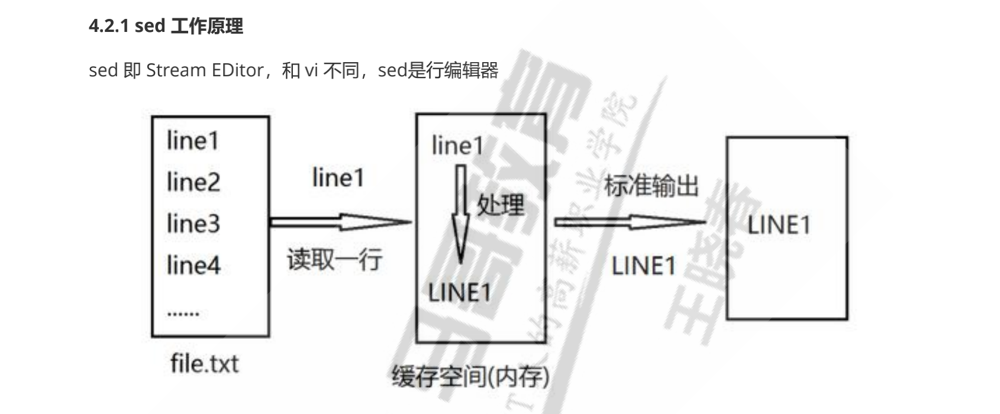

# 	系统进程

## 查看瞬时进程

### ps命令

常用组合: ps -ef  | ps aux

参数含义：-e显示所有运行的进程，-f，扩展输出进程信息 

```
F S UID          PID    PPID  C PRI  NI ADDR SZ WCHAN  STIME TTY          TIME CMD
4 S root           1       0  0  80   0 - 42338 ep_pol 11月29 ?      00:32:17 /sbin/init splas
1 S root           2       0  0  80   0 -     0 kthrea 11月29 ?      00:00:03 [kthreadd]
1 I root           3       2  0  60 -20 -     0 rescue 11月29 ?      00:00:00 [rcu_gp]
1 I root           4       2  0  60 -20 -     0 rescue 11月29 ?      00:00:00 [rcu_par_gp]
1 I root           6       2  0  60 -20 -     0 worker 11月29 ?      00:00:00 [kworker/0:0H-ev
```

各列含义：

- F：内核分配给进程的系统标识
- S：进程的状态
  - O：代表正在运行
  - S：代表正在休眠
  - R：代表可运行，正在等待运行
  - Z：代表僵化，进程已经结束，但父进程已经不存在（僵尸进程，应该尽量减少）
  - T：代表停止
- UID：启动这些进程的用户
- PID：进程ID
- PPID：夫进程的进程号
- C：进程生命周期中的cpu利用率
- PRI：进程的优先级，大部分系统（Linux、UCOSII）都是数字越低优先级越高，进程就优先运行 ， Linux中的PRI（new） = PRI（old） + nice ，其中 ， PRI（old）为系统算法决定 
- NI：进程优先级的修正量（nice值）， -20 ~ 19 ，用户可修改 （root用户可修改nice值-20 ~ 19 ，普通用户只能修改nice值0~19 ）。一般情况下，子进程继承父进程的nice值，由于init进程的nice值为0，所有大部分进程的nice值都为 0，NI值越小越优先
- ADDR：进程的内存地址
- SZ：假如进程被换出，需要的交换空间的大致大小
- WCHAN：进程休眠的内核函数地址
- STIME：进程启动时的系统时间
- TTY：进程启动时的终端设备
- TIME：运行进程所需要的CPU累计时间
- CMD：启动的进程名称

参数含义 a：显示所有终端的进程，x：显示所有后台进程，u：基于用户格式显示

```
root@pi-PowerEdge-R620:~# ps aux
USER         PID %CPU %MEM    VSZ   RSS TTY      STAT START   TIME COMMAND
root           1  0.3  0.0 169352 12916 ?        Ss   11月29  32:14 /sbin/init splash
root           2  0.0  0.0      0     0 ?        S    11月29   0:03 [kthreadd]
root           3  0.0  0.0      0     0 ?        I<   11月29   0:00 [rcu_gp]
root           4  0.0  0.0      0     0 ?        I<   11月29   0:00 [rcu_par_gp]
root           6  0.0  0.0      0     0 ?        I<   11月29   0:00 [kworker/0:0H-events_highp
root          10  0.0  0.0      0     0 ?        I<   11月29   0:00 [mm_percpu_wq]
root          11  0.0  0.0      0     0 ?        S    11月29   0:00 [rcu_tasks_rude_]
root          12  0.0  0.0      0     0 ?        S    11月29   0:00 [rcu_tasks_trace]
root          13  0.0  0.0      0     0 ?        S    11月29 
```

各列含义：

- VSZ：进程在内存中的大小，以千字节（KB）为单位
- RSS：进程在未换出时占用的物理内存。
- STAT：代表当前进程状态的双字符状态码，第一个字符采用了和Unix风格的S列相同的值，表示进程是在休眠，运行还是在等待，第二个列进一步说明了进程状态
  -  <：该进程运行在高优先级上
  - N：该进程运行在低优先级上
  - L：该进程有页面锁定在内存中
  - s：该进程是控制进程
  - l：该进程是多线程的
  - +：该进程运行在前台


## 查看实时进程

ps命令只能显示系统瞬间的进程信息，无法做到跟踪显示进程信息

### TOP命令

top命令在启动时，默认会按照%cpu来对进程排序，也可以在使用交互的方式修改显示方式。

```
top - 22:11:17 up 6 days,  8:55,  2 users,  load average: 0.22, 0.35, 0.35
Tasks: 706 total,   1 running, 702 sleeping,   0 stopped,   3 zombie
%Cpu(s):  0.3 us,  1.0 sy,  0.0 ni, 98.7 id,  0.0 wa,  0.0 hi,  0.0 si,  0.0 st
MiB Mem :  64357.4 total,    371.7 free,   4379.3 used,  59606.4 buff/cache
MiB Swap:    976.0 total,    943.4 free,     32.6 used.  59317.6 avail Mem 

    PID USER      PR  NI    VIRT    RES    SHR S  %CPU  %MEM     TIME+ COMMAND                                           
2077012 root      20   0 7284512   4.0g   3.9g S   9.2   6.3 663:23.13 vmware-vmx                                        
2077293 root      20   0 7284012   4.1g   4.0g S   5.6   6.5 375:57.05 vmware-vmx                                        
2077026 root      20   0 7286748   4.0g   3.9g S   5.3   6.3 375:42.30 vmware
```

#### 第一行显示

```
top - 22:01:59 up 6 days,  8:45,  2 users,  load average: 0.82, 0.54, 0.41
# 分别显示 当前系统时间，运行时间，登录的系统用户，以及当前系统平均负债
# 系统负载有3个值，分别表示最近1分钟、最近5分钟和最近15分钟平均负债
```

值越大，说明负载越高，由于进程短期的突发性活动可能导致1分钟的高负债较为常见，如果15分钟内平均负载较高则说明系统存在问题

#### 第二行显示

```
Tasks: 706 total,   1 running, 702 sleeping,   0 stopped,   3 zombie
```

第二行显示了进程的概要信息，分别显示了进程总数，运行的进程、休眠进程、暂停进程以及僵尸进程的数量。

#### 第三至五行显示

```
%Cpu(s):  0.3 us,  1.0 sy,  0.0 ni, 98.7 id,  0.0 wa,  0.0 hi,  0.0 si,  0.0 st
MiB Mem :  64357.4 total,    371.7 free,   4379.3 used,  59606.4 buff/cache
MiB Swap:    976.0 total,    943.4 free,     32.6 used.  59317.6 avail Mem 
# 显示了cpu的使用情况情况
#	物理内存的使用情况
#	交换分区的使用情况
```

显示了cpu的概要信息，top命令是根据进程的属主（用户还是系统）和进程的状态将cpu利用率分成几类输出。

#### 最后显示

```
    PID USER      PR  NI    VIRT    RES    SHR S  %CPU  %MEM     TIME+ COMMAND                                           
2077012 root      20   0 7284512   4.0g   3.9g S   9.2   6.3 663:23.13 vmware-vmx                                        
2077293 root      20   0 7284012   4.1g   4.0g S   5.6   6.5 375:57.05 vmware-vmx 
```

- PID：进程号
- USER：进程属主
- PR：进程的优先级
- NI：进程的谦让（nice）值
- VIRT：进程占据虚拟内存总量
- RES：进程占用物理内存总量
- SHR：进程和其他进程共享的内存总量
  - S：进程状态
  - O：代表正在运行
  - S：代表正在休眠
  - R：代表可运行，正在等待运行
  - Z：代表僵化，进程已经结束，但父进程已经不存在（僵尸进程，应该尽量减少）
  - T：代表停止
- %CPU：进程的cpu占用率
- %MEM：进程使用的内存占可用内存的比例
- TIME+：自进程启动到目前为止共占用的cpu时间
- COMMAND：进程对应的命令行


## 结束进程

在Linux中，进程之间通过信号来通讯，进程的信号就是预定义好的一个消息，进程能够识别并做出反应，进程如何处理信号是由程序人员在开发时就定义好的，大多数程序都能接受和处理标准的Unix进程的信号。常见的进程信号如下：

| 信号 | 名称 |             描述             |
| :--: | :--: | :--------------------------: |
|  1   | HUB  |             挂起             |
|  2   | INT  |             中断             |
|  3   | QUIT |           结束运行           |
|  9   | KILL |          无条件终止          |
|  11  | SEGV |            段错误            |
|  15  | TERM |          尽可能终止          |
|  17  | STOP |   无条件停止运行，但不终止   |
|  18  | TSTP | 停止或暂停，但继续在后台运行 |
|  19  | CONT |   在STOP或TSTP之后恢复执行   |

在Linux有两个命令可以向运行中的进程发送进程信号。

### kill命令

kill命令可用通过进程编号（PID）给进程发送信号。默认情况下，kill命令会向命令行中列出的全部PID发送一个TERM信号（当前用户需要是root或者进程的属主）。

kill命令不能使用命令名来发送信号，因此有时候不太方便，需要使用其他命令来发送信号。

```
kill 进程编号
如果信号无效，可以使用-s，指定其他信号进行强制终止
kill -s HUP
```


### killall命令

killall命令，支持通过进程名（命令名）来结束进程，而且killall还支持通配符匹配进程。

```
killall http*
```


# 磁盘管理

## 磁盘挂载

### mount命令

用来挂在磁盘到系统目录，mount命令进行磁盘挂载前，磁盘设备需要先创建文件系统。默认情况下，mount命令会输出当前系统上挂载的设备列表和挂载属性

```
root@pi-PowerEdge-R620:~# mount
sysfs on /sys type sysfs (rw,nosuid,nodev,noexec,relatime)
proc on /proc type proc (rw,nosuid,nodev,noexec,relatime)
udev on /dev type devtmpfs (rw,nosuid,noexec,relatime,size=32916176k,nr_inodes=8229044,mode=755,inode64)
devpts on /dev/pts type devpts (rw,nosuid,noexec,relatime,gid=5,mode=620,ptmxmode=000)
tmpfs on /run type tmpfs (rw,nosuid,nodev,noexec,relatime,size=

# (rw,nosuid,nodev,noexec,relatime)里边显示的是挂载属性
```

命令格式

```
mount [-fnrsvw] [-t vfstype] [-o options] device dir

方法1:mount 设备名 挂载点
[root@bogon ~]# mount /dev/sda1 /mnt/sda1
[root@bogon ~]# mount /dev/sda2 /mnt/sda2

方法2：mount -L 卷标名 挂载点

方法3：mount -U uuid 挂载点
```


#### /etc/mtab文件

/etc/mtab文件记录系统挂载情况，实际为/proc/self/mounts的内存信息软连接。当mount命令挂载磁盘时，默认会向/etc/mtab文件进行注册，当使用mount命令显示挂载信息时，实际上就是读取了/etc/mtab文件，但是当用户使用mount -n参数时，系统是不会进行注册的，因此mount命令也无法查看隐藏挂载的磁盘。

通过查看内存进程方式显示挂载情况，能够显示所有隐藏的挂载设备

```
cat /proc/mounts
```


#### **常用选项**

```
-a 挂在/etc/fstab文件中指定的设备和文件系统
-r readonly，只读挂载
-w read and write, 读写挂载
-n 隐藏挂载，不更新/etc/mtab，（df等看不到挂载信息，centos7无效，应为之间看的内存信息）
-a 自动挂载所有支持自动挂载的设备(定义在了/etc/fstab文件中，且挂载选项中有auto功能)
-L 'LABEL'以卷标指定挂载设备
-U 'UUID' 以UUID指定要挂载的设备
-B, --bind绑定目录到另一个目录上（文件夹挂在到文件夹上）
-o 给文件系统添加特定的挂载选项
```

-o options：(挂载文件系统的选项)，多个选项使用逗号分隔

```
defaults：相当于rw, suid, dev, exec, auto, nouser, async
async    异步模式
sync    同步模式,内存更改时，同时写磁盘
atime/noatime    是否记录文件时间戳
diratime/nodiratime    目录的访问时间戳
auto/noauto    是否支持自动挂载,是否支持-a选项
exec/noexec    是否支持将文件系统上运行应用程序(是否能够运行可执行文件)
dev/nodev    是否支持在此文件系统上使用设备文件
suid/nosuid    是否支持suid和sgid权限
remount    重新挂载
ro，norecovery    只读
rw    读写
user/nouser    是否允许普通用户挂载此设备，/etc/fstab使用
acl    启用此文件系统上的acl功能
loop    使用loop设备

```

指定设备挂载属性

```

[root@bogon ~]# mount -r /dev/sda1 /mnt/sda1  # 只读挂载

[root@bogon ~]# touch /mnt/sda1 f1.txt
touch: setting times of ‘/mnt/sda1’: Read-only file system
```


mount命令支持设备在不卸载的情况下进行重新挂载

```
# 以读写方式重新挂载
[root@bogon ~]# mount -o remount,rw /mnt/sda1
[root@bogon ~]# touch /mnt/sda1 f1.txt
```


## 磁盘使用情况

### df命令

```
[root@bogon ~]# df
Filesystem     1K-blocks     Used Available Use% Mounted on
/dev/sda1        3135488    33024   3102464   2% /mnt/sda1
/dev/sda2        3030800     9216   2847916   1% /mnt/sda2

```


su - wang -c "python.sh"	# 已wang身份用运行脚本，无法登录的用户无法使用

sudo -u sshd "echo"	# 这个才是正解


man 
man -k 关键字	# 可以进行搜索
man 2 intro	# man 可以选择需要查看的章节
info	# 也可以查看帮助信息


ls -F 	# 能够区分文件夹、文件，显示*表示可执行文件
ls -R 	# 递归显示

ls -s --time=atime 	# 查看最近访问时间，ls默认显示的是修改时间

file 文件名	# 查看文件类型，

cat -n |-b 	# 显示行号
cat -T  	#  使用^I替换tab制表符

less | more	# 用于分页查看

du -c -h -s 	# 查看当前目录文件占用磁盘情况


nc命令：将数据发送给ip：端口

删除当下文件名中的空格

```
#!/bin/bash
for file in *; do
old_file_name=${file}
#echo $old_file_name
new_file_name=`echo ${old_file_name} | tr -d " "`
mv "${old_file_name}" "${new_file_name}"
done

```


# 文本处理

## 常用命令

###  cat：查看文本

```
常用选项：cat [OPTION]... [FILE]...

-E：显示行结束符$

-n：对显示出的每一行进行编号

-A：显示所有控制符

-b：非空行编号

-s：压缩连续的空行成一行
```

查看换行位置，能够看出不可见空格

```
[17:10:59 root@centos7 data]#cat -E f1
a$
b $
c  d$
$
```


### tac：倒着查看文本

### nl：类似于cat -b

### rev：翻转每一行

```
[17:23:03 root@centos7 data]#vim f1
abc
123

[17:22:58 root@centos7 data]#rev f1  #翻转每行
cba
321
```


### more：分页显示，到头自动退出

### less：分页显示，到头不自动退出

### head 从头部查看

显示文件开头内容 [OPTION]... [FILE]...，默认显示前10行

```
head [OPTION]... [FILE]...
-c # 指定获取前#字节
-n # 指定获取前#行
-# 同-n
```


### tail 从尾部查看

截取文件尾部内容[OPTION]... [FILE]...、默认显示后10行

```
tail [OPTION]... [FILE]...
-c # 指定获取后#字节
-n # 指定获取后#行
-#  同-n
-f   跟踪显示文件fd新追加的内容,常用日志监，相当于 --follow=descriptor
-F   跟踪文件名，相当于--follow=name --retry
```

tailf：类似tail –f，当文件不增长时并不访问文件


### cut：切割、截取字符

```
cut [OPTION]... [FILE]...
-d DELIMITER: 指明分隔符，默认tab
-f FILEDS:
   \#:       第#个字段
   \#,#[,#]：   离散的多个字段，例如1,3,6
   \#-#：     连续的多个字段, 例如1-6
   混合使用：   1-3,7
-c 按字符切割
--output-delimiter=STRING 指定输出分隔符
\#以指定分隔符输出


#以XX为分隔符
[18:54:49 root@centos7 data]#cut -d: -f1,3 --output-delimiter="XX" /etc/passwd  
rootXX0
binXX1
daemonXX2
```


### tr：压缩替换

文本压缩，替换（注意：输入和输出同一个文件会清空文件）

```
Usage: tr [OPTION]... SET1 [SET2]

Translate, squeeze, and/or delete characters from standard input,  # 读取标准输入，使用指定模式，替换和删除字符
writing to standard output.

 -c, -C, --complement  use the complement of SET1  # 取字符集的补集
 -d, --delete      delete characters in SET1, do not translate  # 删除所有属于第一字符集的字符
 -s, --squeeze-repeats  replace each input sequence of a repeated character  #把连续重复的字符以单独一个字符表示，连续的相同字符只显示一个
              that is listed in SET1 with a single occurrence
              of that character
 -t, --truncate-set1   first truncate SET1 to length of SET2  #将字符对应的替换，超出范围的不替换
   --help   display this help and exit
   --version output version information and exit
```

大小写转换

```
[root@VM_0_17_centos ~]#tr '[:lower:]' '[:upper:]' < /etc/issue
\S
KERNEL \R ON AN \M
```

win文本转换linux文本

```
tr -d '\r' <win.txt >linux.txt
```

压缩重复字符串

```
[root@VM_0_17_centos ~]#tr -s 'ab'
aaaaaaabbbbbbbbbccccccc
abccccccc
```

### paste：合并两个文件同行号的列

```
paste [OPTION]... [FILE]...
-d 分隔符：指定分隔符，默认用TAB
-s : 所有行合成一行显示

[19:19:28 root@centos7 data]#vim f1
1
2
3
4
5

[19:19:44 root@centos7 data]#vim f2
a
b
c
d
e
[19:19:59 root@centos7 data]#paste f1 f2
1    a
2    b
3    c
4    d
5    e
    f


[19:20:02 root@centos7 data]#paste -s f1 f2
1    2    3    4    5
a    b    c    d    e    f    
```


## 文本统计

### wc

计数单词总数、行总数、字节总数和字符总数

```
常用选项
-l 只计数行数
-w 只计数单词总数
-c 只计数字节总数
-m 只计数字符总数
-L 显示文件中最长行的长度

[19:45:19 root@centos7 data]#wc f1
6 11 47 f1    #代表6行，11个单词，47字节大小

#统计当前用户数
[19:53:46 root@centos7 data]#getent passwd | wc -l
49

```


### sort：排序

默认按字符顺序排

```
sort [options] file(s)
常用选项
-r 执行反方向（由上至下）整理
-R 随机排序
-n 执行按数字大小整理
-f 选项忽略（fold）字符串中的字符大小写
-u 选项（独特，unique）删除输出中的重复行
-t c 选项使用c做为字段界定符
-k X 选项按照使用c字符分隔的X列来整理能够使用

#按uid排序
 [19:57:18 root@centos7 data]#getent passwd | sort -t: -k3 -n
root:x:0:0:root:/root:/bin/bash
bin:x:1:1:bin:/bin:/sbin/nologin
daemon:x:2:2:daemon:/sbin:/sbin/nologin
adm:x:3:4:adm:/var/adm:/sbin/nologin
lp:x:4:7:lp:/var/spool/lpd:/sbin/nologin
sync:x:5:0:sync:/sbin:/bin/sync
shutdown:x:6:0:shutdown:/sbin:/sbin/shutdown

```


### uniq：

从输入中删除前后相接的重复的行

```
uniq [OPTION]... [FILE]...
-c: 显示每行重复出现的次数
-d: 仅显示重复过的行
-u: 仅显示不曾重复的行
注：连续且完全相同方为重复
常和sort 命令一起配合使用：

[root@localhost data]# cat userlist.txt
a
b
c
d
e
f
s
a
b
c
	
[root@localhost data]# sort userlist.txt | uniq -c
      1
      2 a
      2 b
      2 c
      1 d
      1 e
      1 f
      1 s
```


### diff：比较两个文件的不通

```
#用于比较两文件区别，会告诉f1 如何修改变成f2
[20:20:30 root@centos7 data]#cat f1
a
b
ccc
ddd
[20:20:35 root@centos7 data]#cat f2
cc
ddd
[20:20:54 root@centos7 data]#diff -u f1 f2
--- f1    2020-06-20 20:20:10.624767375 +0800
+++ f2    2020-06-20 20:20:29.985999392 +0800
@@ -1,5 +1,3 @@     #-表示第一个文件，+表示第二个文件，这里表示第一个文件1-5行和第二个文件1-3行的对比结果
-a    #f1 第一行删除-a
-b    #f1 第二行删除-b
-ccc    #f1 第三行删除ccc
+cc    #f1 第四行添加cc
ddd    #第五行不用动

#可将对比记录输出保存
[20:21:27 root@centos7 data]#diff -u f1 f2 >diff.log

#删除f2后，f1可利diff.log恢复f2
[20:26:42 root@centos7 data]#patch -b f1 diff.log    #需要-b选项，否则f1文件会被直接修改变成f2内容，源文件会丢失
patching file f1    #升级至f2成功
[20:26:45 root@centos7 data]#ll
-rw-r--r--  1 root root 124 Jun 20 20:24 diff.log
-rw-rwxr--+ 1 root root   8 Jun 20 20:26 f1    #里边是f2的内容
-rw-rwxr--+ 1 root root  13 Jun 20 20:20 f1.orig    #f1原文件

```

### patch：


## 通配符及正则表达式


### 通配符

```
\* ：任意字符出现0次或多次
? ：匹配任何单个字符
~ ：当前用户家目录
~mage ：用户mage家目录
~+ ：当前工作目录 
~- ：前一个工作目录
[0-9] ：匹配数字范围
[a-z] ：字母
[A-Z] ：字母
[wang] ：匹配列表中的任何的一个字符
[^wang] ：匹配列表中的所有字符以外的字符
```

预定义的字符类：man 7 glob

```
[:digit:] ：任意数字，相当于0-9
[:lower:] ：任意小写字母
[:upper:] ：任意大写字母
[:alpha:] ：任意大小写字母
[:alnum:] ：任意数字或字母
[:blank:] ：水平空白字符
[:space:] ：水平或垂直空白字符
[:punct:] ：标点符号
[:print:] ：可打印字符
[:cntrl:] ：控制（非打印）字符
[:graph:] ：图形字符
[:xdigit:] ：十六进制字符
```


### 正则表达式

REGEXP： Regular Expressions，由一类特殊字符及文本字符所编写的模式，其中有些字符（元字符）不表示字符字面意义，而表示控制或通配的功能

正则表达式引擎:采用不同算法，检查处理正则表达式的软件模块PCRE（Perl Compatible Regular Expressions）

- 帮助文档：man 7 regex
- 程序支持：grep,sed,awk,vim, less,nginx,varnish等

正则表达式分为两类：

- 基本正则表达式：
- 扩展正则表达式：grep -E, egrep


#### 匹配规则

##### 字符匹配：

```
.     匹配任意单个字符
[]    匹配指定范围内的任意单个字符，示例：[wang] [0-9] [a-z] [a-zA-Z]
[^]  匹配指定范围外的任意单个字符
[:alnum:]   字母和数字
[:alpha:]    代表任何英文大小写字符，亦即 A-Z, a-z
[:lower:]    小写字母 [:upper:] 大写字母
[:blank:]    空白字符（空格和制表符）
[:space:]    水平和垂直的空白字符（比[:blank:]包含的范围广）
[:cntrl:]     不可打印的控制字符（退格、删除、警铃...）
[:digit:]     十进制数字 [:xdigit:]十六进制数字
[:graph:]   可打印的非空白字符
[:print:]     可打印字符
[:punct:]   标点符号
```


##### 匹配次数：

用在要指定次数的字符后面，用于指定前面的字符要出现的次数

```
*     匹配前面的字符任意次，包括0次。贪婪模式：尽可能长的匹配（默认），懒惰模式：匹配到一个就不在继续搜索.
.*      任意长度的任意字符
\?     匹配其前面的字符0或1次
\+    匹配其前面的字符至少1次
\{n\}         匹配前面的字符n次
\{m,n\}     匹配前面的字符至少m次，至多n次
\{,n\}        匹配前面的字符至多n次
\{n,\}        匹配前面的字符至少n次
```


##### 位置锚定：

定位出现的位置

```
^     行首锚定，用于模式的最左侧
$     行尾锚定，用于模式的最右侧
^PATTERN$     用于模式匹配整行
^$       空行
^[[:space:]]*$    空白行
\< 或 \b      词首锚定，用于单词模式的左侧
\> 或 \b      词尾锚定，用于单词模式的右侧
\<PATTERN\>   匹配整个单词
```


##### 分组：(\) 

将一个或多个字符捆绑在一起，当作一个整体处理，如：\(root\)\+

```
分组括号中的模式匹配到的内容会被正则表达式引擎记录于内部的变量中，这些变量的命名方式为: \1, \2, \3, ...

\1 表示从左侧起第一个左括号以及与之匹配右括号之间的模式所匹配到的字符

示例： \(string1\(string2\)\)
	\1=string1\(string2\)
	\2=string2
```


##### “|” 表示或者

```
a\|b            a或b
C\|cat         C或cat
\(C\|c\)at    Cat或cat
```


## 文本三剑客：grep

grep：文本搜索工具，根据用户指定的“模式”对目标文本逐行进行匹配检查，打印匹配到的行

```
grep [OPTIONS] [-e PATTERN | -f FILE] [FILE...] 
 # grep 选项 模式 文件
常用选项：
--color=auto: 对匹配到的文本着色显示
-m #    匹配#次后停止
-v     显示不被pattern匹配到的行
-i     忽略字符大小写
-n     显示匹配的行号
-c     统计匹配的行数
-o     仅显示匹配到的字符串
-q     静默模式，不输出任何信息，$?=0表示找到，1表示未找到
-A #     after, 后#行
-B #     before, 前#行
-C #     context, 前后各#行
-e 实现多个选项间的逻辑or关系 grep –e ‘cat ’ -e ‘dog’ file
-w     匹配整个单词
-E     使用ERE    #拓展正则表达式
-F     相当于fgrep，不支持正则表达式
-f     file 根据模式文件处理
```

从搜索含有root的行

```
[root@VM_0_17_centos ~]#cat /etc/passwd | grep root
root:x:0:0:root:/root:/bin/bash
operator:x:11:0:operator:/root:/sbin/nologin
```


使用变量搜索

```
[root@VM_0_17_centos ~]#getent passwd | grep $USER
root:x:0:0:root:/root:/bin/bash
operator:x:11:0:operator:/root:/sbin/nologin
[root@VM_0_17_centos ~]#
```

只显示匹配到的前n行

```
[root@VM_0_17_centos ~]#getent passwd | grep -m 3 nologin
bin:x:1:1:bin:/bin:/sbin/nologin
```


实现多个选项间的逻辑or关系 grep –e ‘cat ’ -e ‘dog’ file

```
[root@VM_0_17_centos data]#grep -e root -e bash  /etc/passwd
root:x:0:0:root:/root:/bin/bash
operator:x:11:0:operator:/root:/sbin/nologin
pi:x:1000:1000::/home/pi:/bin/bash
```


根据模式文件搜索，文件模式使用或逻辑，满足任意条件就会打印。

```
[root@VM_0_17_centos data]#grep -f grep.f1  /etc/passwd
root:x:0:0:root:/root:/bin/bash
bin:x:1:1:bin:/bin:/sbin/nologin
daemon:x:2:2:daemon:/sbin:/sbin/nologin
```

截取ip地址

```
ifconfig eth0 | grep netmask | tr -s " " | cut -d " " -f3
172.17.0.17
```


## 文本三剑客：sed



Sed是从文件或管道中读取一行，处理一行，输出一行；再读取一行，再处理一行，再输出一行，直到

最后一行。每当处理一行时，把当前处理的行存储在临时缓冲区中，称为模式空间（PPattern

Space），接着用sed命令处理缓冲区中的内容，处理完成后，把缓冲区的内容送往屏幕。接着处理下

一行，这样不断重复，直到文件末尾。

一次处理一行的设计模式使得sed性能很高，sed在读取大文件时不会出现卡顿的现象。如果使用vi命令打开几十M上百M的文件，明显会出现有卡顿的现象，这是因为vi命令打开文件是一次性将文件加载到内存，然后再打开。Sed就避免了这种情况，一行一行的处理，打开速度非常快，执行速度也很快

参考网站：http://www.gnu.org/software/sed/manual/sed.html

### sed基本格式

`sed [option]... 'script...' inputfile...`

常用选项：

```
-n 不输出模式空间内容到屏幕，即不自动打印
-e 多点编辑
-f /PATH/SCRIPT_FILE 从指定文件中读取编辑脚本
-r, -E 使用扩展正则表达式
-i.bak 备份文件并原处编辑
```

#### script格式：

script由地址和命令组成,地址表示sed对哪些行进行操作，命令表示对匹配到的行执行哪些操作。

```
# sed命令
p 打印当前模式空间内容，追加到默认输出之后（sed默认会进行打印输出，如果在使用p命令会打印2遍，一般会配合-n使用）
Ip 忽略大小写输出
d 删除模式空间匹配的行，并立即启用下一轮循环
a [\\]text 在指定行后面追加文本，支持使用\n实现多行追加
i [\\]text 在行前面插入文本
c [\\]text 替换行为单行或多行文本
w /path/file 保存模式匹配的行至指定文件
r /path/file 读取指定文件的文本至模式空间中匹配到的行后
= 为模式空间中的行打印行号
! 模式空间中匹配行取反处理

# 高级功能
s/pattern/string/修饰符 查找替换,支持使用其它分隔符，可以是其它形式：s@@@，s###替换修饰符：
支持引用变量
g 行内全局替换
p 显示替换成功的行
w   /PATH/FILE 将替换成功的行保存至文件中
I,i   读取文件忽略大小写
```

#### 地址匹配

##### 不给位置进行匹配的将对全文进行处理

```
FrancdeMacBook-Pro:~ franc$ sed '' /etc/passwd 
# 将直接打印全文，类似于cat命令
```


##### 单行匹配

1.打印指定行

```
cat 1.txt 
1
2
3

# 打印第三行
sed -n '2p' 1.txt 
2
```

2.打印最后一行

```
# 打印最后一行,$表示最后一行
sed -n '$p' 1.txt 
3
```


##### 规则匹配：

支持正则表达式，将对所有匹配到的行进行操作

1.匹配包含netmask的行

```
ifconfig en0
en0: flags=8863<UP,BROADCAST,SMART,RUNNING,SIMPLEX,MULTICAST> mtu 1500
	options=400<CHANNEL_IO>
	ether a0:99:9b:04:d0:c7 
	inet6 fe80::cf8:5bb:bfd7:eb1c%en0 prefixlen 64 secured scopeid 0x4 
	inet 192.168.1.24 netmask 0xffffff00 broadcast 192.168.1.255
	inet6 2409:8a00:9c14:9c00:cb6:7b94:1df6:ce6b prefixlen 64 autoconf secured 
	inet6 2409:8a00:9c14:9c00:c94:f292:8d1e:3d20 prefixlen 64 autoconf temporary 
	nd6 options=201<PERFORMNUD,DAD>
	media: autoselect
	status: active

# 匹配包含netmask的行
ifconfig en0 | sed -n '/netmask/p'
	inet 192.168.1.24 netmask 0xffffff00 broadcast 192.168.1.255

```


2.匹配以dev开头包含sda的行

```
cat 2.txt 
/dev/sda/
/sers/sda/
/dev/sda1/
/dev/sdb/
/dev/sdb2

# /在sed里有特殊含义，当作字符串使用需要转译'\/'
sed -n '/^\/dev\/sda/p' 2.txt 
/dev/sda/
/dev/sda1/
```

3.

##### 区间匹配

```
地址范围：
   #,#     从#行到第#行，3，6 从第3行到第6行
   #,+#   从#行到+#行，3,+4 表示从3行到第7行
   /pat1/,/pat2/
   #,/pat/
   
步进打印：～
  1~2 # 从1行开始打印，每次步进2，表示奇数行
  2~2 # 从2行开始打印，每次步进2，表示偶数行
```

1.打印3-6行之前的数

```
FrancdeMacBook-Pro:test franc$ seq 10 | sed -n '3,6p'
3
4
5
6
```

2.从第3行开始，往后打印2行

```
FrancdeMacBook-Pro:test franc$ seq 10 | sed -n '3,+2p'
3
4
5
```

3.步进打印

```
# 打印奇数行
seq 10 |sed -n '1~2p'		# 从第1行开始打印，每次步进2
1
3
5
7
9
root@ubuntu:~# seq 10 | sed '2~2d'	# 从2开始删除，每次删除2
1
3
5
7
9

# 打印偶数行
seq 10 |sed -n '2~2p'
2
4
6
8
10


```

4.打印d开头和s 开头之间的行

```
root@ubuntu:~# sed -n '/^d/,/^s/p' /etc/passwd
daemon:x:1:1:daemon:/usr/sbin:/usr/sbin/nologin
bin:x:2:2:bin:/bin:/usr/sbin/nologin
sys:x:3:3:sys:/dev:/usr/sbin/nologin
```


#### 常用选项

##### -e：多点编辑

```
# 删除第2行和第5行
root@ubuntu:~# seq 10 | sed -e '2d' -e'5d'
1
3
4
6
7
8
9
10

# -e可以省略，使用另一种写法
root@ubuntu:~# seq 10 | sed '2d;5d'
1
3
4
6
7
8
9
10
```

##### -i：备份并编辑原文件

```
root@ubuntu:~# cat 3.txt 
1
2
3
4
5
# 编辑文件,使用-i后，默认不打印输出
sed -i.bak '2,3d' 3.txt 	# -i指定备份后缀

# 查看文件
root@ubuntu:~# ls
3.txt  3.txt.bak	# 生成.bak的后缀

# 原文件已经被给修改
root@ubuntu:~# cat 3.txt
1
4
5
```

##### -r, -E 使用扩展正则表达式


#### 常用命令：

##### ！：取反

不打印以#开头的行

```
root@ubuntu:~# sed -n '/^#/!p' /etc/fstab	
/dev/disk/by-uuid/189cf946-cd36-4015-a9df-5424e32b5154 / xfs defaults 0 0
/swap.img	none	swap	sw	0	0
```


##### a：追加

在第2行后追加abc

```
root@ubuntu:~# seq 5 | sed '2aabc'
1
2
abc
3
4
5

# a后边的空格不被识别，需要添加转译
root@ubuntu:~# seq 5 | sed '2a   abc'
1
2
abc
3
4
5
root@ubuntu:~# seq 5 | sed '2a\   abc'
1
2
   abc
3
4
5

# 使用\n添加换行
root@ubuntu:~# seq 5 | sed '2a\   abc\nabc'
1
2
   abc
abc
3
4
5

```

##### i：前方插入

```
root@ubuntu:~# seq 5 | sed '2iabc'
1
abc
2
3
4
5
```

##### c：替换字符串只是修改输出，并不会修改源文件

1.将第5行替换成abc

```
root@ubuntu:~# seq 5 | sed '3cabc'
1
2
abc
4
5
```

2.将匹配到的替换

```
# 将/bind 172.16.176.2:9999 替换成bind 172.16.176.2:8888
sed '/bind 172.16.176.2:9999/cbind 172.16.176.2:8888' /etc/haproxy/haproxy.cfg 
```

##### w： 保存模式匹配的行至指定文件

w /path/file 保存模式匹配的行至指定文件

```
sed '/root/w /root/sed-root.log' /etc/passwd

# 查看文件
root@ubuntu:~# cat /root/sed-root.log 
root:x:0:0:root:/root:/bin/bash
```

##### r：读取文件到指定行

```
# 将/etc/hosts 插入之地5行之后
root@ubuntu:~# seq 5 | sed '5r /etc/hosts'
1
2
3
4
5
127.0.0.1 localhost
127.0.1.1 bj-web1

# The following lines are desirable for IPv6 capable hosts
::1     ip6-localhost ip6-loopback
fe00::0 ip6-localnet
ff00::0 ip6-mcastprefix
ff02::1 ip6-allnodes
ff02::2 ip6-allrouters
6
7
8
9
10
```

##### s：查找替换

s/pattern/string/修饰符 查找替换,支持使用其它分隔符，可以是其它形式：s@@@，s###

替换修饰符：

```
# 给网卡使用eth字段命名
root@ubuntu:~# sed -En '/^GRUB_CMDLINE_LINUX=/s/(.*)(")/\1net.ifnames=0\2/p' /etc/default/grub
GRUB_CMDLINE_LINUX="net.ifnames=0"

# - E 扩展正则表达式
# （）分组

sed -En 's/^(GRUB_CMDLINE_LINUX=.*)"/\1net.ifnames=0"/p' /etc/default/grub
```


### 练习

获取ip地址

```
root@ubuntu:~# ip a show ens33 
2: ens33: <BROADCAST,MULTICAST,UP,LOWER_UP> mtu 1500 qdisc fq_codel state UP group default qlen 1000
    link/ether 00:0c:29:17:5c:82 brd ff:ff:ff:ff:ff:ff
    inet 172.16.176.6/24 brd 172.16.176.255 scope global dynamic ens33
       valid_lft 82047sec preferred_lft 82047sec
    inet6 fd15:4ba5:5a2b:1008:20c:29ff:fe17:5c82/64 scope global dynamic mngtmpaddr noprefixroute 
       valid_lft 2591990sec preferred_lft 604790sec
    inet6 fe80::20c:29ff:fe17:5c82/64 scope link 
       valid_lft forever preferred_lft forever

# 空格要\ 转译一下
root@ubuntu:~# ip a show ens33  | sed -En '3s@.*\ (.*)/.*@\1@p'
172.16.176.6

# 第二种写法
root@ubuntu:~# ip a show ens33  | sed -En '3s@[^0-9]+([0-9.]+).*@\1@p'
172.16.176.6
```


获取目录

```
/etc/sysconfig/network-scripts/

# 取direname
root@ubuntu:~# echo "/etc/sysconfig/network-scripts/" | sed -nE 's@(^/.*/)([^/].*/?)@\1@p'
/etc/sysconfig/

# 取basename 
root@ubuntu:~# echo "/etc/sysconfig/network-scripts/" | sed -nE 's@(^/.*/)([^/].*/?)@\2@p'
network-scripts/
```


将非#开头的行加#

```
root@ubuntu:~# sed -rn '/^#/!s@^@#@p' /etc/fstab 
#/dev/disk/by-uuid/189cf946-cd36-4015-a9df-5424e32b5154 / xfs defaults 0 0
#/swap.img	none	swap	sw	0	0
```


统计光盘/misc/cd/Packages下各类cpu架构的软件包数量

```
[root@localhost Packages]# ls
389-ds-base-1.3.9.1-10.el7.x86_64.rpm
389-ds-base-devel-1.3.9.1-10.el7.x86_64.rpm
389-ds-base-libs-1.3.9.1-10.el7.x86_64.rpm
…

[root@localhost Packages]# ls *.rpm | wc -l
10097

# 方法1 rev反转选取第二列
[root@localhost Packages]# ls *.rpm|rev|cut -d . -f2|rev|sort|uniq -c
   2281 i686
   3155 noarch
   4661 x86_64

# 方法2 sed使用正则表达式截取
[root@localhost Packages]# ls *.rpm|sed -r 's/.*\.(.*)\.rpm$/\1/'|sort |uniq -c
   2281 i686
   3155 noarch
   4661 x86_64
```

### 保持空间

sed 中除了模式空间，还另外还支持保持空间（Hold Space）,利用此空间，可以将模式空间中的数据，临时保存至保持空间，从而后续接着处理，实现更为强大的功能。

常见的高级命令

- P 打印模式空间开端至\n内容，并追加到默认输出之前
- h 把模式空间中的内容覆盖至保持空间中
- H 把模式空间中的内容追加至保持空间中
- g 从保持空间取出数据覆盖至模式空间
- G 从保持空间取出内容追加至模式空间
- x 把模式空间中的内容与保持空间中的内容进行互换
- n 读取匹配到的行的下一行覆盖至模式空间
- N 读取匹配到的行的下一行追加至模式空间
- d 删除模式空间中的行
- D 如果模式空间包含换行符，则删除直到第一个换行符的模式空间中的文本，并不会读取新的输入行，而使用合成的模式空间重新启动循环。如果模式空间不包含换行符，则会像发出d命令那样启动正常的新循环

```
# 读取偶数行
sed -n 'n;p' FILE
#  反转输出
sed '1!G;h;$!d' FILE
sed ‘N;D’FILE
seq 10 |sed  '3h;9G;9!d'
sed '$!N;$!D' FILE
sed '$!d' FILE
sed ‘G’ FILE
sed ‘g’ FILE
sed ‘/^$/d;G’ FILE
sed 'n;d' FILE 
sed -n '1!G;h;$p' FILE
```


## vim 工具

vim命令格式:`vim [OPTION]... FILE...`

- 如果该文件存在，文件被打开并显示内容
- 如果该文件不存在，当编辑后第一次存盘时创建它


常用选项:

```
+# 打开文件后，让光标处于第#行的行首，+默认行尾
+/PATTERN 让光标处于第一个被PATTERN匹配到的行行首
-b file 二进制方式打开文件
-d file1 file2… 比较多个文件，相当于 vimdiff
-m file   只读打开文件
-e file   直接进入ex模式，相当于执行ex file 
-y file   Easy mode (like "evim", modeless)，直接可以操作文件，ctrl+o:wq|q! 保存和不
保存退出
```


vim有三种模式：

- 命令或普通(Normal)模式：默认模式，可以实现移动光标，剪切/粘贴文本，没办法打字输入。
- 插入(Insert)或编辑模式：用于修改文本
- 扩展命令(extended command )或命令(末)行模式：保存，退出等


 插入模式：

由命令模式进入插入模式需要按以下按键才能进入

```
i # insert, 在光标所在处输入

I # 在当前光标所在行的行首输入

a # append, 在光标所在处后面输入

A # 在当前光标所在行的行尾输入

o # 在当前光标所在行的下方打开一个新行

O # 在当前光标所在行的上方打开一个新行
```

插入模式 --- ESC-----> 命令模式

命令模式 ---- : ----> 扩展命令模式

```
w 	# 写（存）磁盘文件
wq 	# 写入并退出
x 	# 写入并退出
X   # 加密
q 	# 退出
q！ # 不存盘退出，即使更改都将丢失
r   # filename 读文件内容到当前文件中
w   # filename 将当前文件内容写入另一个文件
!command # 执行命令
r!command # 读入命令的输出
```


### 查找并替换

格式:`s/要查找的内容/替换为的内容/修饰符`

```
要查找的内容：可使用基末正则表达式模式
替换为的内容：不能使用模式，但可以使用\1, \2, ...等后向引用符号；还可以使用“&”引用前面查找时查找到的整个内容

修饰符：
i #忽略大小写
g #全局替换，默认情况下，每一行只替换第一次出现
gc #全局替换，每次替换前询问

范例：
s@/etc@/var@g
s#/boot#/#i

# 查找替换中的分隔符/可替换为其它字符，如：#,@ 
```

