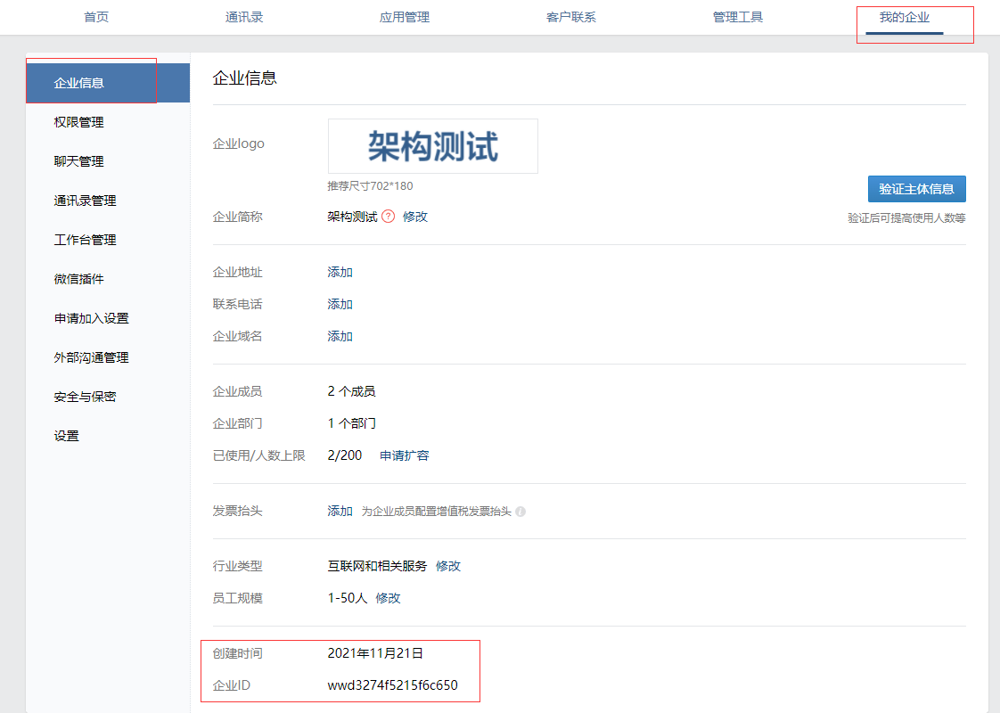
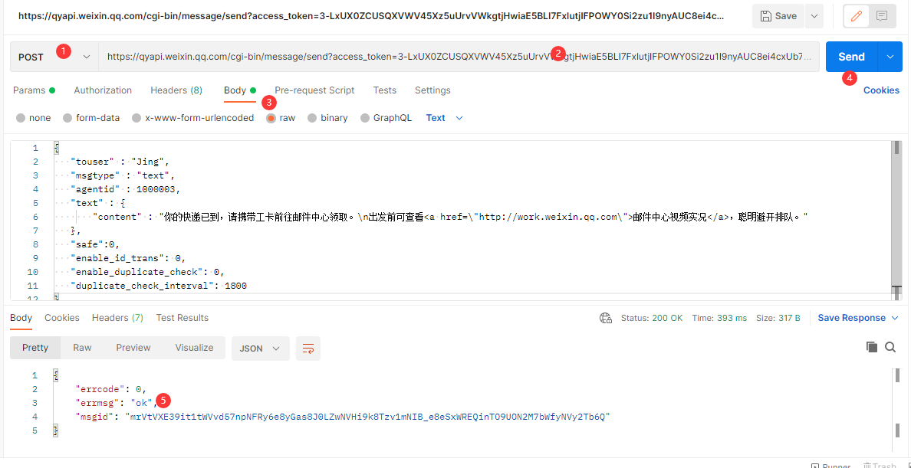

## 通知管理

### 邮件通知

管理（左侧列表）——报警媒介类型——创建媒体类型（右上角）


然后创建一个动作，设置触发条件去发送邮件提醒


==**qq邮箱需要开启独立密码才能发送邮件，否则无法使用（被坑了好久）**==


### 短息通知

==回头补上==


### 微信通知

企业微信官方地址:https://work.weixin.qq.com/

首先需要先注册一个企业微信，登录之后需要创建一个应用

应用（左上）——自建——创建应用


填写应用名称，在添加一个图标


查看企业ID



企业ID和Secret会在发送微信报警信息的时候调用

```
corpid：wwd3274f5215f6c650
Secret：lYky5UiJAy9kKnvIIYG6xblhTzGvYxxx5pJ6a4MTaP0
AgentId:1000003
```


**成员信息**

添加成员后，每个成员都会有一个唯一的账号，类似于微信号，以后发送消息就发给这个账号


#### API调用

微信提供了API接口调用，可以构建一个url请求，将想要的信息直接推送出去。

官方接口说明：https://work.weixin.qq.com/api/doc/90000/90003/90487

##### 获取access_token

```
# 获取token的API地址
https://qyapi.weixin.qq.com/cgi-bin/gettoken?corpid=ID&corpsecret=SECRET

# 将corpid=ID&corpsecret=SECRET替换成自己的值
https://qyapi.weixin.qq.com/cgi-bin/gettoken?corpid=wwd3274f5215f6c650&corpsecret=lYky5UiJAy9kKnvIIYG6xblhTzGvYxxx5pJ6a4MTaP0
```


```
token=3-LxUX0ZCUSQXVWV45Xz5uUrvVWkgtjHwiaE5BLI7FxlutjIFPOWY0Si2zu1I9nyAUC8ei4cxUb728vjFS6hxFqkoUIESLS1BPab0EayQNAg7NH2_GVy6aJRn2SPWhjTe8a1gS0RZRP991pliN3H-tGKx4ADZ5ZnwHbUhVtizpOIPtYR_uWuWjbb7suaQqTQJYpeDALA4NA0bhxTcRir_A
```

##### 发送测试

```
# API地址
https://qyapi.weixin.qq.com/cgi-bin/message/send?access_token=3-LxUX0ZCUSQXVWV45Xz5uUrvVWkgtjHwiaE5BLI7FxlutjIFPOWY0Si2zu1I9nyAUC8ei4cxUb728vjFS6hxFqkoUIESLS1BPab0EayQNAg7NH2_GVy6aJRn2SPWhjTe8a1gS0RZRP991pliN3H-tGKx4ADZ5ZnwHbUhVtizpOIPtYR_uWuWjbb7suaQqTQJYpeDALA4NA0bhxTcRir_A

# body
{
   "touser" : "Jing",
   "msgtype" : "text",
   "agentid" : 1000003,
   "text" : {
       "content" : "你的快递已到，请携带工卡前往邮件中心领取。\n出发前可查看<a href=\"http://work.weixin.qq.com\">邮件中心视频实况</a>，聪明避开排队。"
   },
   "safe":0,
   "enable_id_trans": 0,
   "enable_duplicate_check": 0,
   "duplicate_check_interval": 1800
}


```



##### 构建脚本

```
# apt install python3-pip
# pip3 install requests

# 脚本固定路径
vim /usr/lib/zabbix/alertscripts/wx_message.py
#!/usr/bin/python3
#coding:utf-8
import requests
import sys
import os
import json
import logging


logging.basicConfig(level = logging.DEBUG, format = '%(asctime)s, %(filename)s, %(levelname)s, %(message)s',
datefmt = '%a, %d %b %Y %H:%M:%S',
filename = os.path.join('/tmp','weixin.log'),
filemode = 'a')

# ID 信息
corpid='wwd3274f5215f6c650'
appsecret="lYky5UiJAy9kKnvIIYG6xblhTzGvYxxx5pJ6a4MTaP0"
agentid="1000003"

# 获取token
token_url='https://qyapi.weixin.qq.com/cgi-bin/gettoken?corpid=' + corpid + '&corpsecret=' + appsecret
req=requests.get(token_url)
accesstoken=req.json()['access_token']

# message url
msgsend_url='https://qyapi.weixin.qq.com/cgi-bin/message/send?access_token=' + accesstoken

touser=sys.argv[1]
subject=sys.argv[2]
message=sys.argv[2] + "\n\n" +sys.argv[3]

# 构建消息体
params={
"touser": touser,
"msgtype": "text",
"agentid": agentid,
"text": {
"content": message
},
"safe":0
}

req=requests.post(msgsend_url, data=json.dumps(params))
logging.info('sendto:' + touser + ';;subject:' + subject + ';;message:' + message)


# 发送测试
 ./wx_message.py WangDa "这是主题" "这是内容"
```

#### zabbix调用脚本

##### 新建报警媒介


创建完了别忘了点击右边测试一下


##### 用户添加微信报警

管理——用户——选择用户——报警媒介——添加


##### 创建动作

添加动作出发条件


添加操作


断开服务器测试一下吧

