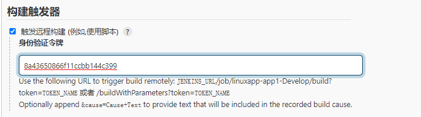
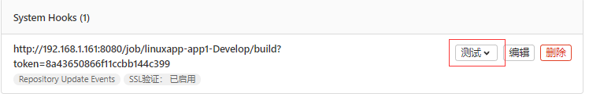
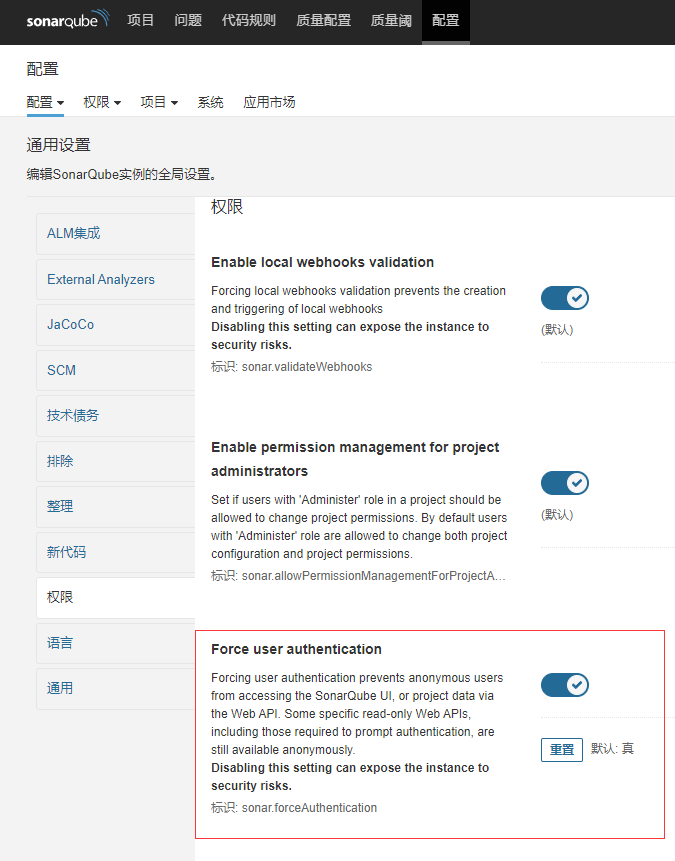

# 二、Gitlab部署和使用

### 2.1Gitlab简介

Linus 在 1991 年创建了开源的 Linux 内核，从此 Linux 便不断快速发展，不过 Linux 的壮大是离不开全世界的开发者的参与，这么多人在世界各地为 Linux 编写代码，那Linux 内核的代码是如何管理的呢？事实是，在 2002 年以前，世界各地的志愿者把源代码文件通过 diff 的方式发给 Linus，然后由 Linus 本人通过手工方式合并代码！你也许会想，为什么 Linus 不把 Linux 代码放到版本控制系统里呢？不是有 CVS、SVN 这些免费的版本控制系统吗？因为 Linus 坚定地反对 CVS 和 SVN，这些集中式的版本控制系统不但速度慢，且必须联网才能使用，但是也有一些商用的版本控制系统，虽然比CVS、SVN 好用，但那是付费的，和 Linux 的开源精神不符,不过，到了 2002 年，Linux系统已经发展了十年了，代码库之大让 Linus 很难继续通过手工方式管理了，社区的弟兄们也对这种方式表达了强烈不满，于是 Linus 选择了一个商业的版本控制系统BitKeeper，BitKeeper 的东家 BitMover 公司出于人道主义精神，授权 Linux 社区免费使用这个版本控制系统,但是安定团结的大好局面在 2005 年就被打破了，原因是 Linux社区牛人聚集，不免沾染了一些梁山好汉的江湖习气，开发 Samba 的 Andrew 试图破解 BitKeeper 的协议（这么干的其实也不只他一个），被 BitMover 公司发现了（监控工作做得不错！），于是 BitMover 公司怒了，要收回 Linux 社区的免费使用权,这时候其实 Linus 可以向 BitMover 公司道个歉，保证以后严格管教弟兄们，但这是不可能的，而且实际情况是 Linus 自己花了两周时间自己用 C 写了一个分布式版本控制系统，这就是 Git！一个月之内，Linux 内核的源码已经由 Git 管理了！牛是怎么定义的呢？大家可以体会一下,然后Git迅速成为最流行的分布式版本控制系统，尤其是 2008年，GitHub网站上线了，它为开源项目免费提供 Git存储，无数开源项目开始迁移至GitHub，包括 jQuery，PHP，Ruby 等等


### 2.2Gitlab安装

#### 官方文档及硬件要求

Gitlab 服务的安装文档https://about.gitlab.com/install/ 

安装环境要求https://docs.gitlab.com/ce/install/requirements.html 

安装包下载地址：https://packages.gitlab.com/gitlab/gitlab-ce 

rpm 包国内下载地址：https://mirrors.tuna.tsinghua.edu.cn/gitlab-ce/yum/

ubuntu 国内下载地址：https://mirrors.tuna.tsinghua.edu.cn/gitlab-ce/ubuntu/pool/


##### **中央处理器**

CPU 要求取决于用户数量和预期工作负载。您的确切需求可能更多，具体取决于您的工作量。您的工作负载受多种因素影响，例如（但不限于）您的用户的活跃程度、您使用的自动化程度、镜像和存储库/更改大小。

以下是针对少数示例 GitLab 用户群大小的推荐最低 CPU 硬件指南。

- **4 核**是**推荐的**最少核数，最多支持 500 个用户
- 8核最多支持1000个用户
- 更多用户？请参阅[参考架构页面](https://docs.gitlab.com/ee/administration/reference_architectures/index.html)

##### **内存**

内存要求取决于用户数量和预期工作负载。您的确切需求可能更多，具体取决于您的工作量。您的工作负载受多种因素影响，例如（但不限于）您的用户的活跃程度、您使用的自动化程度、镜像和存储库/更改大小。

以下是一些示例 GitLab 用户群大小的推荐最低内存硬件指南。

- 4GB RAM是所需的最小内存大小，最多支持 500 个用户
- 8GB RAM 最多支持 1000 个用户
- 更多用户？请参阅[参考架构页面](https://docs.gitlab.com/ee/administration/reference_architectures/index.html)

除了上述内容之外，我们通常建议您的服务器上至少有 2GB 的交换空间，即使您目前有足够的可用 RAM。如果可用内存发生变化，交换有助于减少发生错误的机会。我们还建议将内核的 swappiness 设置配置为较低的值`10`，以便在需要时仍可使用交换空间的同时充分利用您的 RAM。


##### **数据库**

PostgreSQL 是唯一受支持的数据库，它与 Omnibus GitLab 软件包捆绑在一起。您还可以使用[外部 PostgreSQL 数据库](https://docs.gitlab.com/omnibus/settings/database.html#using-a-non-packaged-postgresql-database-management-server)。GitLab 12.1 中删除了对 MySQL 的支持。建议使用 GitLab 和 MySQL/MariaDB 的现有用户在升级前[迁移到 PostgreSQL](https://docs.gitlab.com/ee/update/mysql_to_postgresql.html)


#### Ubuntu系统安装

先选择版本下载对应的安装包，然后直接使用dpkg 命令安装即可,安装包中已集成了所有需要的服务，不需要在单独安装。

环境：ubuntu20.04LTS

gitlab：gitlab-ce_14.4.2-ce.0_amd64.deb

```
root@localhost:~# dpkg -i gitlab-ce_14.4.2-ce.0_amd64.deb 
Selecting previously unselected package gitlab-ce.
(Reading database ... 76254 files and directories currently installed.)
Preparing to unpack gitlab-ce_14.4.2-ce.0_amd64.deb ...
Unpacking gitlab-ce (14.4.2-ce.0) ...
Setting up gitlab-ce (14.4.2-ce.0) ...
It looks like GitLab has not been configured yet; skipping the upgrade script.

       *.                  *.
      ***                 ***
     *****               *****
    .******             *******
    ********            ********
   ,,,,,,,,,***********,,,,,,,,,
  ,,,,,,,,,,,*********,,,,,,,,,,,
  .,,,,,,,,,,,*******,,,,,,,,,,,,
      ,,,,,,,,,*****,,,,,,,,,.
         ,,,,,,,****,,,,,,
            .,,,***,,,,
                ,*,.
     _______ __  __          __
    / ____(_) /_/ /   ____ _/ /_
   / / __/ / __/ /   / __ `/ __ \
  / /_/ / / /_/ /___/ /_/ / /_/ /
  \____/_/\__/_____/\__,_/_.___/
  
Thank you for installing GitLab!
GitLab was unable to detect a valid hostname for your instance.
Please configure a URL for your GitLab instance by setting `external_url`
configuration in /etc/gitlab/gitlab.rb file.
Then, you can start your GitLab instance by running the following command:
  sudo gitlab-ctl reconfigure

For a comprehensive list of configuration options please see the Omnibus GitLab readme
https://gitlab.com/gitlab-org/omnibus-gitlab/blob/master/README.md

Help us improve the installation experience, let us know how we did with a 1 minute survey:
https://gitlab.fra1.qualtrics.com/jfe/form/SV_6kVqZANThUQ1bZb?installation=omnibus&release=14-4
```

#### Centos系统安装

==暂时掠过==

#### 相关安装目录：

```
/etc/gitlab #配置文件目录
/run/gitlab #运行 pid 目录
/opt/gitlab #安装目录
/var/opt/gitlab #数据目录
/var/log/gitlab #日志目录
```


### 2.3 初始化服务

#### 配置文件

安装完毕后，系统会提示需要去/etc/gitlab/gitlab.rb配置启动页面url

```
root@localhost:~# vim /etc/gitlab/gitlab.rb
##!external_url 'http://gitlab.example.com'
external_url 'http://192.168.1.253'	# 可以写域名
```

#### 邮箱通知

还可以配置邮箱信息，用于用户的注册和密码重置

```
gitlab_rails['smtp_enable'] = true
gitlab_rails['smtp_address'] = "smtp.163.com"
gitlab_rails['smtp_port'] = 465
gitlab_rails['smtp_user_name'] = "francisaston"
gitlab_rails['smtp_password'] = "RNQQPJOIERLKUVYV"
gitlab_rails['smtp_domain'] = "163.com"
gitlab_rails['smtp_authentication'] = :login
gitlab_rails['smtp_enable_starttls_auto'] = true
gitlab_rails['smtp_tls'] = true
gitlab_rails['gitlab_email_from'] = "francisaston@163.com"
```


#### 初始化

修改完配置文件之后，需要使用 gitlab-ctl reconfigure对系统进行初始化操作，以后每次修改配置文件都需要执行。

```
root@localhost:~# gitlab-ctl reconfigure

# gitlab会执行一系列安装需要时间可能比较长
Notes:
Default admin account has been configured with following details:
Username: root
Password: You didn't opt-in to print initial root password to STDOUT.
Password stored to /etc/gitlab/initial_root_password. This file will be cleaned up in first reconfigure run after 24 hours.

NOTE: Because these credentials might be present in your log files in plain text, it is highly recommended to reset the password following https://docs.gitlab.com/ee/security/reset_user_password.html#reset-your-root-password.

gitlab Reconfigured!
```

初始化账号为root，初始化密码保存在/etc/gitlab/initial_root_password
初始化的密码需要在24小时内重置

```
root@localhost:~# cat /etc/gitlab/initial_root_password 
# WARNING: This value is valid only in the following conditions
#          1. If provided manually (either via `GITLAB_ROOT_PASSWORD` environment variable or via `gitlab_rails['initial_root_password']` setting in `gitlab.rb`, it was provided before database was seeded for the first time (usually, the first reconfigure run).
#          2. Password hasn't been changed manually, either via UI or via command line.
#
#          If the password shown here doesn't work, you must reset the admin password following https://docs.gitlab.com/ee/security/reset_user_password.html#reset-your-root-password.

Password: CcOncGCM3QHOJFsv2GCvanUXSTwGo+PSlk5Ow0wGdvo=

# NOTE: This file will be automatically deleted in the first reconfigure run after 24 hours.

```

登录

修改密码


#### 中文设置

GitLab默认已经支持了中文环境，只需要在偏好设定中修改即可。


### 2.4 管理命令

#### gitlab-rails 

gitlab-rails 用于启动控制台进行特殊操作，比如修改管理员密码、打开数据库控制台( gitlab-rails dbconsole)等

```
root@gitlab:~# gitlab-rails dbconsole 
psql (9.6.11)
Type "help" for help.
gitlabhq_production=>
# gitlab-rails --help
```


#### gitlab-psql 

数据库命令行

```
root@s1:~# gitlab-psql 
psql (9.6.11)
Type "help" for help.
gitlabhq_production=# \db
 List of tablespaces
 Name | Owner | Location 
------------+-------------+----------
pg_default | gitlab-psql | 
pg_global | gitlab-psql | 
(2 rows)
```

####  gitlab-rake 

gitlab-rake 数据备份恢复等数据操作

#### gitlab-ctl 

客户端命令行操作行

```
# gitlab-ctl stop #停止 gitlab
# gitlab-ctl start #启动 gitlab
# gitlab-ctl restar #重启 gitlab
# gitlab-ctl status #查看组件运行状态
# gitlab-ctl tail nginx #查看某个组件的日志
```


### 2.5部署和使用

####  创建用户

安装完毕后系统默认允许用户进行注册，为了方便管理，一般将账号注册功能关闭，由管理员统一创建账户


管理员创建用户


注册后系统会网邮箱发送邮件进行确认，并且会在用户首次登录时强制进行密码修改。

#### 创建组

使用管理员 root 创建组，一个项目组里面可以创建多个项目（project ），可以将开发添加到组里面进行设置权限，不同的组就是公司不同的开发项目或者服务模块，不同的组添加不同的开发即可实现对开发设置权限的管理。


将用户添加到项目组


#### 创建项目（project ）


##### 创建项目文件

通过web页面，创建个文件


#### 项目克隆

在项目仓库右上角有改项目的地址信息，gitlib共提供2种克隆方法


##### SSH克隆

暂时略过

##### HTTP克隆

使用git clone命令克隆，输入用户账号和密码信息

```
root@localhost:~# git clone http://192.168.1.253/xiaomiaoweb/locationfind.git
Cloning into 'locationfind'...
Username for 'http://192.168.1.253': wangda
Password for 'http://wangda@192.168.1.253': 
remote: Enumerating objects: 12, done.
remote: Counting objects: 100% (12/12), done.
remote: Compressing objects: 100% (7/7), done.
remote: Total 12 (delta 1), reused 0 (delta 0), pack-reused 0
Unpacking objects: 100% (12/12), 1.00 KiB | 256.00 KiB/s, done.


# 默认被下载到了当前目录“项目名称”的文件夹下
root@localhost:~# ll locationfind
total 24
drwxr-xr-x 3 root root 4096 Nov 24 21:07 ./
drwx------ 6 root root 4096 Nov 24 21:07 ../
-rw-r--r-- 1 root root   12 Nov 24 21:07 findmiaomiao.jsp
drwxr-xr-x 8 root root 4096 Nov 24 21:07 .git/
-rw-r--r-- 1 root root   22 Nov 24 21:07 index.html
-rw-r--r-- 1 root root   71 Nov 24 21:07 README.md
```

#### 项目提交

SVN 与 CVS：每次提交的文件都单独保存，即按照文件的提交时间区分不同的版本，保存至不同的逻辑存储区域，每个版本都将所有文件都打包备份，有的后期恢复的时候直接基于选择的版本恢复。占用磁盘空间较大，每个版本独立存在不依赖于其他版本文件。

Gitlab 与 SVN 的数据保存方式不一样，gitlab 虽然也会在内部对数据进行逻辑划分保存，但是当后期提交的数据如果和之前提交过的数据没有变化，其就直接快照之前的文件，而不是在将所有文件重新上传一份在保存一遍，这样既节省了空间又加快了代码提交速度。


对文件进行修改

```
root@localhost:~# cd locationfind/
root@localhost:~/locationfind# vim index.html 
<h1>测试页面</h1>
<h1>v2测试页面</h1>
```

提交项目

```
# 先添加文件修改
root@localhost:~/locationfind# git add ./*


# 提交到本地暂存区	
root@localhost:~/locationfind# git commit -m "V2 update"
[main 8f5c690] V2 update
 1 file changed, 1 insertion(+)


# 提交到服务器
root@localhost:~/locationfind# git push
Username for 'http://192.168.1.253': wangda	# 输入用户和密码
Password for 'http://wangda@192.168.1.253': 
Enumerating objects: 5, done.
Counting objects: 100% (5/5), done.
Delta compression using up to 4 threads
Compressing objects: 100% (2/2), done.
Writing objects: 100% (3/3), 279 bytes | 279.00 KiB/s, done.
Total 3 (delta 1), reused 0 (delta 0)
To http://192.168.1.253/xiaomiaoweb/locationfind.git
   89c9d37..8f5c690  main -> main
```

去网页仓库查看


默认情况下develop及以下角色是无法push代码到mast分支上的。可以在在项目的【Setting】中的【Protected branches】可以设置哪些分支是被保护的，默认情况下【master】分支是处于被保护状态下的，develop角色的人是无法提交到master分支的，在下面的【Developers can push】打上钩就可以了。

### 2.6 git命令使用


#### git工作流程


##### 缓存区与工作区等概念

工作区：clone 的代码或者开发自己编写的代码文件所在的目录，通常是代码所在的一个服务的目录名称。

暂存区：在工作区中修改过的文件会先保存在这，使用 git add 将文件添加到此其。

本地仓库：在工作区和暂存区中改过的文件提交后保存的地方，使用 git commi 提交。

远程仓库：多个开发共同协作提交代码的仓库，即 gitlab 服务器，使用git push推送到服务器


#### 添加全局账号信息

git使用需要先设置一个账户信息设置，默认会用作所有的项目的创建和推送，如果不设置会报警告信息。

```
*** Please tell me who you are.
Run
  git config --global user.email "you@example.com"
  git config --global user.name "Your Name"
  
to set your account's default identity.
Omit --global to set the identity only in this repository.

fatal: unable to auto-detect email address (got 'root@localhost.(none)')
root@localhost:~/locationfind# git config --global user.email "francis.aston@icloud.com"
root@localhost:~/locationfind# git config --global user.name "wangda"
```

查看全局账号设置

```
root@localhost:~# git config --list
user.email=francis.aston@icloud.com
user.name=wangda

# 账号信息文件默认保存在用户家目录下隐藏文件
root@localhost:~# cat .gitconfig 
[user]
	email = francis.aston@icloud.com
	name = wangda
```


#### git add

对于修改过的文件需要提交，先要将文件添加到暂存区域，可以单独添加修改的文件，一般直接对目录内所有的文件都添加进去

```
git add index.html / .   # 添加指定文件、目录或当前目录下所有数据到暂存区

# 添加所有文件
git add ./*
git add --all
```

#### git status 工作区状态

git status 可以查看工作区的状态，可以查看具体提交哪些文件进行了修改

```
# 当无文件修改时
root@localhost:~/locationfind# git status
On branch main
Your branch is up to date with 'origin/main'.

nothing to commit, working tree clean


# 当修改文件后
root@localhost:~/locationfind# git status
On branch main
Your branch is up to date with 'origin/main'.
Changes not staged for commit:
  (use "git add <file>..." to update what will be committed)
  (use "git restore <file>..." to discard changes in working directory)
	modified:   index.html
no changes added to commit (use "git add" and/or "git commit -a")

```


####  git commit 项目提交

将暂存区的数据保存到本地仓库，在提交项目的同时，可以对本次提交的项目进行版本说明

git commit -m “版本信息“

文件提交前需要现将修改的文件使用git add 保存到暂存区，才能提交

```
root@localhost:~/locationfind# git commit -m"V3 修改了index主页"
On branch main
Your branch is up to date with 'origin/main'.

Changes not staged for commit:
  (use "git add <file>..." to update what will be committed)
  (use "git restore <file>..." to discard changes in working directory)
	modified:   index.html

# 添加文件
root@localhost:~/locationfind# git add --all


# 再次提交
root@localhost:~/locationfind# git commit -m"V3 修改了index主页"
[main 088fcc9] V3 修改了index主页
 1 file changed, 2 insertions(+)
```


#### git push 推送项目

将本地仓库推送至gitlab 仓库

```
root@localhost:~/locationfind# git push
Username for 'http://192.168.1.253': wangda
Password for 'http://wangda@192.168.1.253': 
Enumerating objects: 5, done.
Counting objects: 100% (5/5), done.
Delta compression using up to 4 threads
Compressing objects: 100% (3/3), done.
Writing objects: 100% (3/3), 314 bytes | 314.00 KiB/s, done.
Total 3 (delta 1), reused 0 (delta 0)
To http://192.168.1.253/xiaomiaoweb/locationfind.git
   8f5c690..088fcc9  main -> main
```


#### git pull 拉取项目

更新本地仓库，团队中会有多人开发负责同一个项目，需要从gitlib仓库中拉取别人上传的最新代码,使用git pull不必每次都重新克隆完整代码，较少同步时间。

```
root@localhost:~/locationfind# git pull
Username for 'http://192.168.1.253': wangda
Password for 'http://wangda@192.168.1.253': 
Already up to date.
```

#### git fetch

#### git log 操作日志

查看当前项目的操作日志。可以查看项目每次提交的人员信息、时间、tag号等信息。

```
root@localhost:~/locationfind# git log
commit 088fcc93d0a3170098ce8ef3825071023727187d (HEAD -> main, origin/main, origin/HEAD)
Author: wangda <francis.aston@icloud.com>
Date:   Wed Nov 24 23:53:50 2021 +0800

    V3 修改了index主页

commit 8f5c69033ca4681111e06cc3c234a0c543150bc2
Author: wangda <francis.aston@icloud.com>
Date:   Wed Nov 24 21:22:10 2021 +0800

    V2 update

commit 89c9d375e2403527cf91ae4854f24b5855abfaea
Author: 王 达 <francis.aston@icloud.com>
Date:   Wed Nov 24 13:00:59 2021 +0000

    主要文件

commit 92720a633979507f09d656e9e609bdabaa89dd6c
Author: 王 达 <francis.aston@icloud.com>
Date:   Wed Nov 24 12:51:02 2021 +0000

    测试页面

commit 513d14d668f50bcd5588a9775b145991f2e4ebd7
Author: Administrator <admin@example.com>
Date:   Wed Nov 24 12:14:37 2021 +0000

    Update README.md

```

#### .gitignore文件

定义忽略文件，在项目工作目录中，不同的系统或者软件可能会产生一些临时文件，这些文件不属于项目的一部分，无需提交的项目中去，因此可以添加此文件，定义那些文件在提交项目时进行忽略。

[以k8s项目为例：](https://github.com/kubernetes/kubernetes/blob/master/.gitignore)

.gitignore文件内支持通配符、正则表达式等多种匹配规则

```
cat .gitignore

# OSX leaves these everywhere on SMB shares
._*

# OSX trash
.DS_Store

# Eclipse files
.classpath
.project
.settings/**

# Files generated by JetBrains IDEs, e.g. IntelliJ IDEA
.idea/
*.iml

# Vscode files
.vscode

# This is where the result of the go build goes
/output*/
/_output*/
/_output

# Emacs save files
*~
\#*\#
.\#*
```

#### git reset 回滚

当项目提交遇到问题是，可以使用git reset命令进行项目回滚。git支持依次回滚到上一版本，或者直接回滚到指定版本。

##### 回滚到上一版本

```
git reset --hard HEAD^^ 	# git 版本回滚， HEAD 为当前版本，加一个^为上一个，^^为上上一个版本
```

##### 回滚到指定版本

```
git reset --hard 5ae4b06 # 退到指定id的版本
```

#### git reflog 版本号查询

用于查询每次提交的版本的tag号信息

```
root@localhost:~/locationfind# git reflog 
1f04f16 (HEAD -> main, origin/main, origin/HEAD) HEAD@{0}: commit: v4 增加定位功能
088fcc9 HEAD@{1}: commit: V3 修改了index主页
8f5c690 HEAD@{2}: clone: from http://192.168.1.253/xiaomiaoweb/locationfind.git
```


### 2.7 分支管理

仓库中可以创建不同的分支，日常开发时项目提交不会直接提交到mast主分钟中，mast一般用作生产环境的仓库，日常工作中会先创建一个development分支作为开发环境，日常项目提交都会提交此分支中。


#### git branch 查看所属分支

```
root@localhost:~/locationfind# git branch
* main
```

#### git checkout   分支切换

创建并切换到一个新分支

```
git checkout -b develop	# -b,如果分支不存在，就会创建并切换分支
```

切换分支

```
git checkout develop # 切换分支
```

#### 分支合并

当develop分支已经大幅领先master分支后，经过测试后可以申请合并到master

发起申请


管理人员批准并点击合并


### 2.8 gitlab数据备份和恢复

#### 数据备份

数据备份需要先暂停gitlab的2个服务

```
root@localhost:~#  gitlab-ctl stop unicorn
root@localhost:~# gitlab-ctl stop sidekiq
ok: down: sidekiq: 1s, normally up
```

手动备份数据，可以在任意命令执行备份操作，备份文件默认会保存到/var/opt/gitlab/backups/文件夹。

可以在/etc/gitlab/gitlab.rb 文件修改“backup_path”参数自定义备份路径。

（例如gitlab_rails['backup_path'] = '/backup'）

```
root@localhost:/data/back/gitlab# gitlab-rake gitlab:backup:create
...
2021-11-25 13:13:12 +0800 -- done
2021-11-25 13:13:12 +0800 -- Dumping uploads ... 
2021-11-25 13:13:12 +0800 -- done
2021-11-25 13:13:12 +0800 -- Dumping builds ... 
2021-11-25 13:13:12 +0800 -- done
2021-11-25 13:13:12 +0800 -- Dumping artifacts ... 
2021-11-25 13:13:12 +0800 -- done
2021-11-25 13:13:12 +0800 -- Dumping pages ... 
2021-11-25 13:13:12 +0800 -- done
2021-11-25 13:13:12 +0800 -- Dumping lfs objects ... 
2021-11-25 13:13:12 +0800 -- done
Deleting old backups ... skipping
Warning: Your gitlab.rb and gitlab-secrets.json files contain sensitive data 
and are not included in this backup. You will need these files to restore a backup.
Please back them up manually.
Backup task is done.

警告信息：大意就是在gitlab.rb和gitlab-secrets.json文件中包含敏感数据，在备份中并没有包含这两个文件，需要手动保存一下，在恢复备份的时候会需要这两个文件（如果是在本机更新，则不备份这两个文件也没关系，如果是备份了在另一台机器安装gitlab并恢复数据，则需要在另一台机器覆盖这两个文件）。这两个文件放在/etc/gitlab目录下。
```

备份文件会根据备份时间自动生成时间戳，不会重复

```
root@localhost:/data/back/gitlab# ll /var/opt/gitlab/backups/
-rw-------  1 git  git  327680 Nov 25 13:13 1637817192_2021_11_25_14.4.2_gitlab_backup.tar
```

备份完毕后需要重新启动服务

```
root@localhost:/etc/gitlab# gitlab-ctl start
ok: run: alertmanager: (pid 14693) 76981s
ok: run: gitaly: (pid 14731) 76979s
ok: run: gitlab-exporter: (pid 14662) 76983s
ok: run: gitlab-workhorse: (pid 14643) 76985s
ok: run: grafana: (pid 14713) 76980s
ok: run: logrotate: (pid 170561) 1618s
ok: run: nginx: (pid 14121) 77105s
ok: run: node-exporter: (pid 14653) 76984s
ok: run: postgres-exporter: (pid 14703) 76980s
ok: run: postgresql: (pid 13820) 77200s
ok: run: prometheus: (pid 14671) 76983s
ok: run: puma: (pid 14034) 77123s
ok: run: redis: (pid 13632) 77213s
ok: run: redis-exporter: (pid 14664) 76983s
ok: run: sidekiq: (pid 173029) 1s
```

#### 数据恢复

需要恢复的文件

```
/var/opt/gitlab/backups/ # Gitlab 数据备份目录，需要使用命令备份的
/var/opt/gitlab/nginx/conf #nginx 配置文件
/etc/gitlab/gitlab.rb #gitlab 配置文件
/etc/gitlab/gitlab-secrets.json #key 文件

root@localhost:~# ll /var/opt/gitlab/backups/
1637817192_2021_11_25_14.4.2_gitlab_backup.tar
```

数据恢复,先暂停服务

```
gitlab-ctl stop unicorn
gitlab-ctl stop sidekiq # 恢复数据之前停止服务

# root@s1:~# gitlab-rake gitlab:backup:restore BACKUP=备份文件名
gitlab-rake gitlab:backup:restore BACKUP=1637817192_2021_11_25_14.4.2Be sure to stop Puma, Sidekiq, and any other process that
connects to the database before proceeding. For Omnibus
installs, see the following link for more information:
https://docs.gitlab.com/ee/raketasks/backup_restore.html#restore-for-omnibus-gitlab-installations

Before restoring the database, we will remove all existing
tables to avoid future upgrade problems. Be aware that if you have
custom tables in the GitLab database these tables and all data will be
removed.
# 会先清除数据要求确认
Do you want to continue (yes/no)? yes	# 需要确认
Removing all tables. Press `Ctrl-C` within 5 seconds to abort

Deleting backups/tmp ... done
Warning: Your gitlab.rb and gitlab-secrets.json files contain sensitive data 
and are not included in this backup. You will need to restore these files manually.
Restore task is done.
# 需要手动恢复一些文件
```


# 三、Web环境部署

==**之前搭建的，回头再补**==

## 3.3 部署Tomcat服务器

一般网站服务器避免权限问题都使用www用户来运行，为Tomcat创建用户

```
groupadd -g 1200 www
useradd -g 1200 -u 1200  -s /bin/bash  www
```

安装脚本要用的程序包

```
apt-get install net-tools
```

创建代码目录

```
mkdir /data/tomcat/applib -p #保存 web 压缩包
mkdir /data/tomcat/appdir #保存解压后的web 目录
mkdir /data/tomcat/webapps #tomcat app 目录
mkdir webapps/myapp && echo hello > webapps/myapp/index.html

# 修改权限
chown www.www /data/tomcat -R
chown www.www /usr/local/tomcat -R
chown www.www /usr/local/apache-tomcat-8.5.42/  -R
```

修改server配置文件

```
# 修改代码位置
   <Host name="localhost"  appBase="/data/tomcat/tomcat_webapps"
            unpackWARs="true" autoDeploy="true">
```

准备启动脚本

```
vim /etc/init.d/tomcat
#!/bin/bash
JDK_HOME=/usr/lib/jvm/jdk1.8.0_202
CATALINA_HOME=/usr/local/tomcat
export JDK_HOME CATALINA_HOME
source /etc/profile
source /etc/profile.d/*
#PID=`ps -ef  | grep  -v grep  | grep java | awk  '{print $2}'`
#NUM=`ps -ef  | grep  -v grep  | grep java | awk  '{print $2}' | wc -l`

#case $1 in
start() {
    	echo "正在判断服务状态，请稍等！"	
    	echo "请稍等3秒钟"
    	echo "3";sleep 1;echo "2";sleep 1;echo "1";sleep 1
   	if	netstat -an | grep 8080 | grep LISTEN >/dev/null
     	then
   		echo "Tomcat已经正在运行了！"  
  	else 
   		echo "Tomcat没有运行，1秒后启动！"
		echo 1;sleep 1  
  		$CATALINA_HOME/bin/catalina.sh start 
  		echo  "Tomcat 已经成功启动完成,5秒后判断是否启动成功"
  		echo "5";sleep 1;echo "4";sleep 1
        echo "3";sleep 1;echo "2";sleep 1;echo "1";sleep 1
	if  netstat -an | grep 8080 | grep LISTEN >/dev/null
	    then
		PID=`ps -ef | grep  tomcat | grep jdk | awk '{print $2}'`
		NUM=`ps -ef | grep  tomcat | grep jdk | awk '{print $2}' | wc -l`
		echo "Tomcat 已经成功启动${NUM} 个Tomcat进程!,PID为${PID}"
	    else
		echo "Tomcat启动失败，请重新启动！"
        	echo 1
	fi
 	fi
	}
stop() {
		PID=`ps -ef  | grep  -v grep  | grep java | awk  '{print $2}'`
		NUM=`ps -ef | grep  -v "color"  | grep tomcat | awk '{print $2}' | wc -l`
		echo "正在判断服务状态，请稍等3秒钟！"	
		echo "3";sleep 1;echo "2";sleep 1;echo "1";sleep 1
	if  netstat -an | grep 8080 | grep LISTEN >/dev/null 
	   then	
		echo "Tomcat运行中，1秒后关闭！"
		echo  1;sleep 1 
		echo "即将关闭Tomcat服务，请稍等！" 
        $CATALINA_HOME/bin/catalina.sh stop ;echo "已经执行关闭命令,正在检查关闭了多少Tomcat进程，请稍等30秒钟！"
		sleep 27
        echo "3";sleep 1;echo "2";sleep 1;echo "1";sleep 1
		pkill java && pkill tomcat
		if  netstat -an | grep 8080 | grep LISTEN >/dev/null;then
			PID=`ps -ef  | grep  -v grep  | grep java | awk  '{print $2}'`
			NUM=`ps -ef | grep  -v "color"  | grep tomcat | awk '{print $2}' | wc -l`
			kill -9 $PID ;echo "已成功关闭${NUM} 个tomcat进程"
		else
  			echo  "Tomcat 已经关闭完成！" 
        	echo "3";sleep 1;echo "2";sleep 1;echo "1";sleep 1 
		fi
	else
		echo "Tomcat 没有运行"
		echo 1
	fi
	if  netstat -an | grep 8080 | grep LISTEN >/dev/null;then
            PID=`ps -ef  | grep  -v grep  | grep java | awk  '{print $2}'`
            #NUM=`ps -ef | grep  -v "color"  | grep tomcat | awk '{print $2}' | wc -l`
            echo "关闭失败，即将强制删除tomcat进程!"
            sleep 2
            pkill tomcat ;sleep 2 
            if  netstat -an | grep 8080 | grep LISTEN >/dev/null;then
                echo "强制关闭失败，即将再次强制删除tomcat进程!"
                pkill java; sleep 2
            fi
	fi
	}
restart() {
	stop 
	start 
 }

case "$1" in 
start) 
start 
;; 

stop) 
stop 
;; 

restart) 
restart 
;; 

*) 
echo $"Usage: $0 {start|stop|restart|status}" 
esac

```

测试能否正常显示http://192.168.1.131:8080/myapp/

# 四、jenkins部署和使用


## 4.1 jenkins简介


## 4.2 jenkins安装

安装版本：jenkins_2.303

java版本：jdk-8u202

中小公司推荐配置：2c 4g 60g

 Jenkins数据保存在/var/lib/jenkins/目录。推荐使用数据盘单独挂载

#### 准备java环境

```
root@localhost:/usr/src# ll jdk-8u202-linux-x64.tar.gz 
-rw-r--r-- 1 root root 194042837 Nov 26 16:11 jdk-8u202-linux-x64.tar.gz

# 解压
tar xvf jdk-8u202-linux-x64.tar.gz 

# 创建软连接
ln -s /usr/src/jdk1.8.0_202/ /usr/local/jdk
ln -s /usr/local/jdk/bin/java /usr/bin/		# 一定要提前设好环境变量否则会jenkins安装会报错
```

准备环境变量

```
vim /etc/profile
export JAVA_HOME=/usr/local/jdk
export PATH=$JAVA_HOME/bin:$JAVA_HOME/jre/bin:$PATH
export CLASSPATH=.$CLASSPATH:$JAVA_HOME/lib:$JAVA_HOME/jre/lib:$JAVA_HOME/lib/tools.jar

# 重新引用
source /etc/profile

# 测试
root@localhost:/usr/src# java -version
java version "1.8.0_202"
Java(TM) SE Runtime Environment (build 1.8.0_202-b08)
Java HotSpot(TM) 64-Bit Server VM (build 25.202-b08, mixed mode)

```

#### 开始安装

官方下载地址:https://jenkins.io/zh/download/

下载地址：[Index of /jenkins/debian-stable/ | 清华大学开源软件镜像站 | Tsinghua Open Source Mirror](https://mirrors.tuna.tsinghua.edu.cn/jenkins/debian-stable/)

```
# 安装依赖
apt install daemon net-tools

# 安装jenkins
dpkg -i jenkins_2.303.3_all.deb
```

##### jenkins配置文件

通过dep包安装的配置文件默认位置在/etc/default/jenkins

```
root@jenkins-node1:~# grep "^[a-Z]" /etc/default/jenkins
NAME=jenkins
JAVA_ARGS="-Djava.awt.headless=true"
PIDFILE=/var/run/$NAME/$NAME.pid
JENKINS_USER=root	# 方便实验修改成root
JENKINS_GROUP=root
JENKINS_WAR=/usr/share/$NAME/$NAME.war
JENKINS_HOME=/var/lib/$NAME
RUN_STANDALONE=true
JENKINS_LOG=/var/log/$NAME/$NAME.log
JENKINS_ENABLE_ACCESS_LOG="no"
MAXOPENFILES=8192
HTTP_PORT=8080
PREFIX=/$NAME
JENKINS_ARGS="--webroot=/var/cache/$NAME/war --httpPort=$HTTP_PORT"

# 可选的启动参数
JENKINS_JAVA_OPTIONS="--server -Xms1g -Xmx1g -Xss512k -Xmn1g
-XX:CMSInitiatingOccupancyFraction=65
-XX:+UseFastAccessorMethods
-XX:+AggressiveOpts -XX:+UseBiasedLocking
-XX:+DisableExplicitGC -XX:MaxTenuringThreshold=10
-XX:NewSize=2048M -XX:MaxNewSize=2048M -XX:NewRatio=2
-XX:PermSize=128m -XX:MaxPermSize=512m -XX:CMSFullGCsBeforeCompaction=5
-XX:+ExplicitGCInvokesConcurrent -XX:+UseConcMarkSweepGC -XX:+UseParNewGC
-XX:+CMSParallelRemarkEnabled -Djava.awt.headless=true
-Dcom.sun.management.jmxremote
-Dcom.sun.management.jmxremote.port=12345
-Dcom.sun.management.jmxremote.authenticate=false
-Dcom.sun.management.jmxremote.ssl=false
-Djava.rmi.server.hostname="192.168.7.102"
```

启动服务

```
systemctl start jenkins
systemctl enable jenkins

root@localhost:/usr/src# ps -ef | grep jenkins
jenkins     3770       1  0 16:24 ?        00:00:00 /lib/systemd/systemd --user
jenkins     3771    3770  0 16:24 ?        00:00:00 (sd-pam)
jenkins     4427       1  0 16:25 ?        00:00:00 /usr/bin/daemon --name=jenkins --inherit --env=JENKINS_HOME=/var/lib/jenkins --output=/var/log/jenkins/jenkins.log --pidfile=/var/run/jenkins/jenkins.pid -- /bin/java -Djava.awt.headless=true -jar /usr/share/jenkins/jenkins.war --webroot=/var/cache/jenkins/war --httpPort=8080
jenkins     4429    4427 24 16:25 ?        00:00:37 /bin/java -Djava.awt.headless=true -jar /usr/share/jenkinsjenkins.war --webroot=/var/cache/jenkins/war --httpPort=8080
root        4791    2382  0 16:27 pts/0    00:00:00 grep --color=auto jenkins

```

**查看启动日志**

```
oot@jenkins-node1:~# tail -f /var/log/jenkins/jenkins.log 
68763d78fb5f448996df4cf575fb9459

This may also be found at: /var/lib/jenkins/secrets/initialAdminPassword

*************************************************************
*************************************************************
*************************************************************

2021-11-26 08:36:02.627+0000 [id=27]	INFO	jenkins.InitReactorRunner$1#onAttained: Completed initialization
2021-11-26 08:36:02.645+0000 [id=21]	INFO	hudson.WebAppMain$3#run: Jenkins is fully up and running

```

##### 通过 jar包方式启动

```
jenkins： # java \
 -Dcom.sun.management.jmxremote \
 -Dcom.sun.management.jmxremote.port=12345 \ 
 -Dcom.sun.management.jmxremote.authenticate=false \ 
 -Dcom.sun.management.jmxremote.ssl=false \ 
 -Djava.rmi.server.hostname="192.168.8.2 " \ 
 -jar jenkins-2.138.3.war &
```

##### 通过tomcat方式启动

通过tomcat 8.5.46运行

```
# sudo apt-get install libxrender-dev libxtst-dev 
# mkdir /apps 
# cp /usr/local/src/apache-tomcat-8.5.46.tar.gz /apps/ 
# tar xf apache-tomcat-8.5.46.tar.gz
# cp /usr/local/src/jenkins-2.204.4.war /apps/apache-tomcat-8.5.46
# 如果没开自动部署，需要手动解压war包

# /apps/apache-tomcat-8.5.46/bin/catalina.sh start
```


**访问web界面：**

地址：http://ip:8080


填入密码后继续

#### 离线问题


jenkins安装后进行初始化，jenkins会先检查网络连接，然后去远端服务器下载插件，应为服务器在国外会出现网络问题。需要替换成国内镜像服务器进行加速

##### **修改国内镜像**

```
root@jenkins-node1:~# vim /var/lib/jenkins/hudson.model.UpdateCenter.xml 
<?xml version='1.1' encoding='UTF-8'?>
<sites>
  <site>
    <id>default</id>
    <url>https://mirrors.tuna.tsinghua.edu.cn/jenkins/updates/update-center.json</url>
  </site>
</sites>  

# 重启下服务
systemctl restart jenkins.service


# 镜像居然指向google验证网络是否通
{"connectionCheckUrl":"http://www.google.com/"

# 修改hosts遮蔽google地址
root@jenkins-node1:~# vim /etc/hosts
127.0.0.1 localhost
127.0.1.1 localhost
192.168.1.1 www.google.com
```


##### **设置代理加速**

虽然替换了镜像，但是镜像内下载插件的地址仍然是国外的，使用反向代理将请求的地址重定向到国内镜像源

```
apt install nginx
vim /etc/nginx/nginx.conf
    location /download/plugins {
      proxy_set_header Host mirrors.tuna.tsinghua.edu.cn;
      proxy_set_header X-Real-IP $remote_addr;
      proxy_set_header X-Forwarded-For $proxy_add_x_forwarded_for;
      rewrite /download/plugins(.*) /jenkins/plugins/$1 break;
      proxy_pass http://mirrors.tuna.tsinghua.edu.cn;
    }
# 启动服务
root@jenkins-node1:~# systemctl start nginx
root@jenkins-node1:~# systemctl enable nginx
Synchronizing state of nginx.service with SysV service script with /lib/systemd/systemd-sysv-install.
Executing: /lib/systemd/systemd-sysv-install enable nginx


# 修改hosts文件，将updates.jenkins-ci.org指向本机
vim /etc/hosts
# 127.0.0.1 updates.jenkins-ci.org  目前域名已修改
127.0.0.1  updates.jenkins.io

```


#### 安装插件

点击安装推荐的插件


部分插件安装失败先继续

创建用户


确定后下一步


进入管理页面，查看插件安装失败原因，一般适应为版本低，之后更新就可以了


在最下边有个自动更新，或者手动下载jenkins的war包替换一下也可以


系统会自动更新版本，并安装之前失败的插件


##### 安装可选插件

jenkins的功能都是基于插件来实现的，需要根据需要安装不同的插件

系统管理-插件管理-可选插件

###### gitlab相关插件

[GitLab ](https://plugins.jenkins.io/gitlab-plugin)	 构建触发器，用于源码变动自动部署

[GitLab Authentication](https://plugins.jenkins.io/gitlab-oauth)	认证相关	

[Gitlab Hook](https://plugins.jenkins.io/gitlab-hook)	源码管理相关

[Gitlab API](https://plugins.jenkins.io/gitlab-api)	API调用

勾选后 选择之间安装


###### [Blue Ocean](https://plugins.jenkins.io/blueocean)	代码更新界面展示

###### [Role-based Authorization Strategy](https://plugins.jenkins.io/role-strategy)	用户权限管理

插件会存在依赖关系，jenkins会自动解决依赖，安装后会自动重启


##### 插件安装目录

jenkins所有的插件都会以目录的方式存放在/var/lib/jenkins/plugins/文件夹内

## 4.3 部署和使用

### 用户管理

#### 创建用户

用户所有的信息都保存在/var/lib/jenkins/users/中以xml格式保存。


#### 用户权限管理

jenkins默认没有权限控制，每个用户都拥有admin用户权限，需要先安装Role-based Authorization Strategy插件，实现针对每个用户的权限控制。

##### 启用权限控制

选择系统管理-全局安全配置-授权策略 

选择role-based后保存


再次进入系统管理-安全-Manage and Assign Roles  开启角色管理


**先创建一些任务作为演示**，用作区分不同权限可以查看的内容


##### 创建角色

针对不同的权限需求可对系统级别和任务级别创建不同的角色分配不同的权限，然后将角色分配到不同用户身上


##### 分配角色

针对不同用户职位权限分配不同的角色


##### 查看权限

wangda用户登录后不在具有管理员权限，且只能看见分配的任务


### 邮箱配置

配置jenkins的通知邮箱

系统管理-系统配置 


在最下边找到邮箱配置


### 配置ssh key

在镜像拉取的时候自动化需要非交互方式，需要先配置ssh密码到git服务器，然后将私钥交给jenkins。

生成ssh秘钥

```
#生成ssh秘钥
root@jenkis-node1:~# ssh-keygen 
Generating public/private rsa key pair.
Enter file in which to save the key (/root/.ssh/id_rsa): 
Enter passphrase (empty for no passphrase): 
Enter same passphrase again: 
Your identification has been saved in /root/.ssh/id_rsa
Your public key has been saved in /root/.ssh/id_rsa.pub
...

root@jenkis-node1:~# cat /root/.ssh/id_rsa.pub 
ssh-rsa AAAAB3NzaC1yc2EAAAADAQABAAABgQCyWOJ8vh1Iq4SMS/o1TIv3I8oFSib35dUlpFQ4N4jnv6uXa7zEIpIPgbNGZR93SmLSvDuaN7M6+CGfg8pp8mhhcLMKRbVjF60aSwif3jbvmBCB4izifMkHmqP7daJ7IUEVtv/q+mnjaPUTRrdXCw1saNhQBdESlSalhwGXxpsFvqmxcnb8DV4zocwX4ngqetl6pAN3wsUWJN8T39VpsTvScSgiFVotJOO0zeGG/hoosjlpoWwRxNr22xCt+v/cuK1Z2e2bnSLGYVT/vjhaROULOx+0mzRWBuCMW2UpiEv6n1908sq7WbCTcsq0teWRdhHkW5/dHO6D//G/K31e5r4r99f++Qx027xl3lk0ssI2iTgR0ZamyfxxWGeSKYwLZGUbLk7Ggq2OauptPbdWMU3lv2Tjsn1z4xJ9GpkbbZQER3FkJgngOEJ1a5AqQl5l/n1jB87kdcsbxSClb3vEMcRwu/GzldEYLsXctSRY2DUQvKJuLvl3J0mSaiwSPRhsi/E= root@jenkis-node1
```

#### 上传ssh 公钥到gitlib服务器

用户设置-ssh秘钥  。

将公钥复制进去


现在本地拉取一下镜像测试是否成功

```
# 先删除之前的文件夹
root@jenkis-node1:~# rm -rf app1/
# 重新拉取
root@jenkis-node1:~# git clone git@192.168.1.253:linuxweb/app1.git
Cloning into 'app1'...
remote: Enumerating objects: 6, done.
remote: Total 6 (delta 0), reused 0 (delta 0), pack-reused 6
Receiving objects: 100% (6/6), done.
```

#### ssh登录到web服务器

```
# 创建家目录
mkdir /home/www
cp /etc/skel/. /home/www/ -r
chown www.www -R /home/www/
# 修改密码
passwd www 123456

# copy ssh key
ssh-copy-id -i ~/.ssh/id_rsa.pub  www@192.168.1.131
ssh-copy-id -i ~/.ssh/id_rsa.pub  www@192.168.1.131
ssh-copy-id -i ~/.ssh/id_rsa.pub  www@192.168.1.131

```


### 任务部署

#### 创建jenkins任务

选择新建任务-构建一个自由风格的软件

**（每个任务的所有信息都存放在/var/lib/jenkins/jpos中，包含自定义的脚本等，推荐单独挂载保存数据）**


**每个分支都要单独创建一个任务**


根据git上不同的项目,在jenkins创建不同的存储目录

```
mkdir /data/git/linuxapp/app{1,2}{Develop,Master} -p	# 分别部署linuxapp项目的测试和正式版本的发布
mkdir /data/git/linuxweb/web{1,2}{Develop,Master} -p
root@jenkis-node1:/data/git# tree
├── linuxapp
│   ├── app1Develop
│   ├── app1Master
│   ├── app2Develop
│   └── app2Master
└── linuxweb
    ├── web1Develop
    ├── web1Master
    ├── web2Develop
    └── web2Master
```


#### 通过脚本方式拉取镜像部署

选择相应的项目-单击配置

在最下方选择构建-执行shell


tomcat服务前期一定得是www用户开启的，否则会有权限问题

```
# 将自定义脚本放入页面中
# 需要先gitlib中配置sshkey，并且选择ssh方式克隆
cd /data/git/linuxapp/app1Develop/ && rm -rf * && git clone -b "Develop" git@192.168.1.253:linuxapp/app1.git

# 暂停tomcat服务
ssh www@192.168.1.131 "/etc/init.d/tomcat stop"
ssh www@192.168.1.132 "/etc/init.d/tomcat stop"
ssh www@192.168.1.133 "/etc/init.d/tomcat stop"

# 删除原来的代码
ssh www@192.168.1.131 "rm -rf /data/tomcat/webapps/app1"
ssh www@192.168.1.132 "rm -rf /data/tomcat/webapps/app1"
ssh www@192.168.1.133 "rm -rf /data/tomcat/webapps/app1"
# 复制源码到tom服务器
scp -r /data/git/linuxapp/app1Develop/* www@192.168.1.131:/data/tomcat/webapps/
scp -r /data/git/linuxapp/app1Develop/* www@192.168.1.132:/data/tomcat/webapps/
scp -r /data/git/linuxapp/app1Develop/* www@192.168.1.133:/data/tomcat/webapps/

# 重新开启tomcat
ssh www@192.168.1.131 "/etc/init.d/tomcat start"
ssh www@192.168.1.132 "/etc/init.d/tomcat start"
ssh www@192.168.1.133 "/etc/init.d/tomcat start"
```

点击立即构建，jenkins会自动拉取代码并部署到服务器


控制台能否输出具体的信息


#### 通过jenkis拉取镜像部署（推荐使用脚本部署）

###### 添加key

点击系统管理右侧找到


点击全局-添加凭证


点击确定添加完毕


###### 配置包拉取方式

选择相应的项目-单击配置-源码管理中选择git方式


**代码默认会下载到/var/lib/jenkins/workspace/目录**

```
root@jenkis-node1:/data# ll /var/lib/jenkins/workspace/
drwxr-xr-x  3 root    root    4096 Nov 28 21:39  linuxapp-app1-Develop/
```


#### 构建后操作

系统构建完成后可以调用其他任务，可以将一个复杂的任务分成几个任务进行执行，这样一些重复步骤可以进行服用。


### 构建触发器

触发器用于当Develop分支发生代码变动时，实现自动代码更新（生产环境不要用）


需要安装Gitlab Hook 和 Gitlab Authentication插件

Gitlab Hook插件存在安全问题，安装后会出现一下提示，应为hook配置信息是以明文方式保存，且可能会出现安全问题，且还需要修改一下安全配置


#### 触发配置

在系统管理-全局安全设置中修改授权策略


高版本无法直接关闭，需要修改配置文件

```
vim /etc/default/jenkins 
JAVA_ARGS="-Djava.awt.headless=true -Dhudson.security.csrf.GlobalCrumbIssuerConfiguration.DISABLE_CSRF_PROTECTION=true"
# 重启服务
systemctl restart jenkins
```


#### 准备url和token

```
root@jenkis-node1:~#  openssl rand -hex 12
8a43650866f11ccbb144c399
```



url结构为：JENKINS_URL`/job/linuxapp-app1-Develop/build?token=`TOKEN_NAME

url：http://192.168.1.161:8080/job/linuxapp-app1-Develop/build?token=8a43650866f11ccbb144c399

测试一下

```
curl http://192.168.1.161:8080/job/linuxapp-app1-Develop/build?token=8a43650866f11ccbb144c399
# 如果没有返回纤细且代码已经开始构建表明成功
```


#### 配置gitlab自动触发

登录管理员账号：管理员-系统钩子添加


测试一下：




### 视图管理

当任务数量过多数时，在操作时不方便找到相应的项目，可以在视图中对不同的项目创建分组，

#### 新建视图


勾选相应的任务


**查看试图**

#### 编辑视图

当新增任务后需要手动添加任务到视图中，需要对视图进行编辑

选择相应的试图左侧点击便是视图


### 参数化构建


## 4.4 分布式服务

在众多 Job 的场景下，单台 jenkins master 同时执行代码 clone、编译、打包及构建，其性能可能会出现瓶颈从而会影响代码部署效率，影响 jenkins 官方提供了 jenkins 分布式构建，将众多 job 分散运行到不同的 jenkins slave 节点，大幅提高并行 job 的处理能力。

### 创建agent节点

Slave 服务器创建工作目录，如果 slave 需要执行编译 job，则也需要配置 java 环境并 且安装 git、svn、maven 等与 master 相同的基础运行环境，另外也要创建与 master 相同的数据目录，因为脚本中调用的路径只有相对一 master 的一个路径，此路径在master 与各 node 节点必须保持一致。

agent部署，不需安装任何客户端，master主机会基于ssh在agent执行代码部署任务。==需要保持时间同步==

#### 安装java环境


#### 创建目录和ssh

server执行任务需要的程序和目录都需要在agnet上安装和创建，同时agent需要去远程git服务器上拉去代码还有去web服务器部署代码，都需要做ssh key认证。

```
mkdir -p /var/lib/jenkins

# 安装常用命令
apt install git maven curl-devel expat-devel gettext-devel openssl-devel zlib-devel

# 基于ssh key 认证
```


### 主机添加agent

选择左侧系统管理-找到节点管理


**配置节点**


最后保存就可以了。

#### 查看日志

配置完成之后最好查看一下日志，避免出现错误


#### agent任务绑定


## 4.5 代码回滚

新建一个任务，脚本中拉取上一个版本的代码在部署就可以了，或者每次都保留之前的代码，直接替换

git reset --hard HEAD^


##  4.6 build pipeline

先安装插件。官方介绍https://www.jenkins.io/doc/book/pipeline/

### 简介

pipline 是帮助 Jenkins 实现 CI 到 CD 转变的重要角色，是运行在 jenkins 2.X 版本的核 心插件，简单来说 Pipline 就是一套运行于 Jenkins 上的工作流框架，将原本独立运行于单个或者多个节点的任务连接起来，实现单个任务难以完成的复杂发布流程，从而实现单个任务很难实现的复杂流程编排和任务可视化，Pipeline 的实现方式是一套Groovy DSL，任何发布流程都可以表述为一段 Groovy 脚本。

pipline 优势： 

- 自动为所有分支和拉取请求创建流水线构建过程。
- 流水线上的代码审查/迭代（以及剩余的源代码）。
- 管道的审计跟踪。
- 管道的单一事实来源 [ [3](https://www.jenkins.io/doc/book/pipeline/#_footnotedef_3) ]，可以由项目的多个成员查看和编辑。
- 可持续性：jenkins 的重启或者中断后不影响已经执行的 Pipline Job
- 支持暂停：pipline 可以选择停止并等待人工输入或批准后再继续执行。
- 可扩展：通过 groovy 的编程更容易的扩展插件。
- 并行执行：通过 groovy 脚本可以实现 step，stage 间的并行执行，和更复杂的相互依赖关系。


### 语法格式

**pipeline 支持两种语法格式**以下流水线代码框架说明了[声明式流水线语法](https://www.jenkins.io/doc/book/pipeline/#declarative-pipeline-fundamentals)和 [脚本式流水线语法](https://www.jenkins.io/doc/book/pipeline/#scripted-pipeline-fundamentals)之间的根本区别。

#### 声明式管道基础知识

在声明式流水线语法中，`pipeline`块定义了在整个流水线中完成的所有工作。

```groovy
Jenkinsfile（声明式管道）
pipeline {
    agent any  # 选定由那个anget执行任务
    stages {
        stage('Build') { 	# 定义步骤名称
            steps {
                // # 执行具体的操作
            }
        }
        stage('Test') { 	# 定义测试步骤
            steps {
                // 
            }
        }
        stage('Deploy') { 	# 定义部署步骤
            steps {
                // 
            }
        }
    }
}
```

#### 脚本化流水线基础

在脚本化流水线语法中，一个或多个`node`块在整个流水线中完成核心工作。虽然这不是 Scripted Pipeline 语法的强制性要求，但将流水线的工作限制在`node` 块内有两件事：

1. 通过将项目添加到 Jenkins 队列来安排块中包含的步骤运行。只要节点上的执行程序空闲，这些步骤就会运行。
2. 创建一个工作区（特定于该特定管道的目录），可以在其中对从源代码管理检出的文件进行工作。
   **注意：**根据您的 Jenkins 配置，某些工作区在一段时间不活动后可能不会自动清理。有关更多信息，请参阅从[JENKINS-2111](https://issues.jenkins.io/browse/JENKINS-2111)链接的票证和讨论 。

```groovy
Jenkinsfile（脚本化管道）
node {  
    stage('Build') { 
        // 
    }
    stage('Test') { 
        // 
    }
    stage('Deploy') { 
        // 
    }
}
```


### 创建pipeline任务


脚本位置


参考脚本

```
node('jenkins-slave1'){
    stage("clone 代码"){
    sh label: '', script: 'cd /var/lib/jenkins/workspace/linux39-web1-master-pipline && rm -rf ./*'
    git credentialsId: '10dfca8b-f943-4626-bf82-a2f82101589e', url: 'git@172.31.0.101:linux39/web1.git'
    }
    
    stage("代码打包"){
    sh 'cd /var/lib/jenkins/workspace/linux39-web1-master-pipline && tar czvf myapp.tar.gz  ./*'
    }
    stage("停止web服务"){
    sh 'ssh www@172.31.0.106 "/etc/init.d/tomcat stop"'
    sh 'ssh www@172.31.0.107 "/etc/init.d/tomcat stop"'
    }
    
    stage("代码copy"){
    sh 'cd /var/lib/jenkins/workspace/linux39-web1-master-pipline && scp  myapp.tar.gz www@172.31.0.106:/data/tomcat/tomcat_appdir/'
    sh 'cd /var/lib/jenkins/workspace/linux39-web1-master-pipline && scp  myapp.tar.gz www@172.31.0.107:/data/tomcat/tomcat_appdir/'
    }

   stage("代码部署"){
    sh 'ssh  www@172.31.0.106 "cd /data/tomcat/tomcat_appdir && rm -rf   /data/tomcat/tomcat_webapps/myapp/* && tar xvf myapp.tar.gz  -C /data/tomcat/tomcat_webapps/myapp/"'
    sh 'ssh  www@172.31.0.107 "cd /data/tomcat/tomcat_appdir && rm -rf   /data/tomcat/tomcat_webapps/myapp/* && tar xvf myapp.tar.gz  -C /data/tomcat/tomcat_webapps/myapp/"'
   }
   
    stage("启动web服务"){
    sh 'ssh www@172.31.0.106 "/etc/init.d/tomcat start"'
    sh 'ssh www@172.31.0.107 "/etc/init.d/tomcat start"'
    }
}
```

# 五、SonarQube

## 5.1 简介

官方站点：https://www.sonarqube.org/

SonarQube 是一个用于代码质量管理的开放平台，主要用于代码质量扫描，通过插件机制，SonarQube可以集成不同的测试工具，代码分析工具，以及持续集成工具，例如 Hudson/Jenkins 等。

功能插件目录：

/opt/sonarqube/lib/extensions/


## 5.2 安装

安装文档：https://docs.sonarqube.org/8.9/requirements/requirements/

本次安装以最新版8.9LTS版本

### 安装要求

硬件：最低2c，内存4g以上

java环境：

| Java       | Server                                                     | Scanners                                                   |
| :--------- | :--------------------------------------------------------- | :--------------------------------------------------------- |
| Oracle JRE |  11 |  11 |
|            |  8  |  8  |
| OpenJDK    |  11 |  11 |
|            |  8  |  8  |

数据库：不支持muysql

[PostgreSQL](http://www.postgresql.org/) 9.6-13

[Microsoft SQL Server](http://www.microsoft.com/sqlserver/) 2014-2019

[Oracle](http://www.oracle.com/database/) 12c 18c 19c

**Linux系统参数**

If you're running on Linux, you must ensure that:

- `vm.max_map_count` is greater than or equal to 524288
- `fs.file-max` is greater than or equal to 131072
- the user running SonarQube can open at least 131072 file descriptors
- the user running SonarQube can open at least 8192 threads

```
# 设置系统参数
sysctl -w vm.max_map_count=524288
sysctl -w fs.file-max=131072

#  you must insert this line in /etc/security/limits.d/99-sonarqube.conf (or /etc/security/limits.conf as you wish):
sonarqube   -   nofile   131072
sonarqube   -   nproc    8192
```

**seccomp filter**

需要内核开启此功能

```
grep SECCOMP /boot/config-$(uname -r)
# 如果显示下边三行信息表示功能已开启
CONFIG_SECCOMP=y
CONFIG_HAVE_ARCH_SECCOMP_FILTER=y
CONFIG_SECCOMP_FILTER=y


# 如果关闭，需要手动打开
vim $SONARQUBEHOME/conf/sonar.properties_:
# 添加以下字段
sonar.search.javaAdditionalOpts=-Dbootstrap.system_call_filter=false
```

==**SonarQube服务不允许使用root账户启动**==


### 安装java环境

```
# 偷个懒直接apt
sudo apt install openjdk-11-jdk
```


### 安装PostgreSQL

```
apt install postgresql

# 修改监听地址
vim /etc/postgresql/12/main/postgresql.conf 
listen_addresses = '*'          # what IP address(es) to listen on;

# 添加访问权限
vim /etc/postgresql/12/main/pg_hba.conf
# IPv4 local connections:
host    all             all             0.0.0.0/0            md5

# 启动服务
root@localhost:/opt/sonarqube# systemctl start postgresql
root@localhost:/opt/sonarqube# systemctl enable postgresql
Synchronizing state of postgresql.service with SysV service script with /lib/systemd/systemd-sysv-install.
Executing: /lib/systemd/systemd-sysv-install enable postgresq
```


创建账号并授权

```
# 切换账号
su - postgres
psql -U postgres

# 创建数据库
postgres=# CREATE DATABASE sonar; 

# 创建账号并授权
postgres=# CREATE USER sonar WITH ENCRYPTED PASSWORD '123456'; 
postgres=# ALTER DATABASE sonar OWNER TO sonar; 
```

### 修改内核参数

```
vim /etc/sysctl.conf
vm.max_map_count=524288
fs.file-max=131072
root@localhost:~# sysctl -p

vim /etc/security/limits.conf 
sonarqube   -   nofile   131072
sonarqube   -   nproc    8192
```


### 安装SonarQube

解压安装包

```
# 解压
root@localhost:/usr/local/src# unzip sonarqube-8.9.3.48735.zip

# 做好软连接
ln -s /usr/local/src/sonarqube-8.9.3.48735 /opt/sonarqube
```

创建用户

```
groupadd -g 1300 sonarqube
useradd -g 1300 -u 1300  -s /usr/sbin/nologin -r sonarqube

# 修改所有者
chown  sonarqube.sonarqube -R  /usr/local/src/sonarqube-8.9.3.48735
chown  sonarqube.sonarqube  -R  /opt/sonarqub
```

修改配置文件

```
vim /opt/sonarqube/conf/sonar.properties
sonar.jdbc.username=sonar
sonar.jdbc.password=123456

sonar.jdbc.url=jdbc:postgresql://192.168.1.119/sonar
```


启动脚本

```
[Unit]
Description=SonarQube service
After=syslog.target network.target

[Service]
Type=simple
User=sonarqube
Group=sonarqube
PermissionsStartOnly=true
ExecStart=/usr/bin/nohup /usr/bin/java -Xms2500m -Xmx2500m -Djava.net.preferIPv4Stack=true -jar /opt/sonarqube/lib/sonar-application-8.9.3.48735.jar
StandardOutput=syslog
LimitNOFILE=131072
LimitNPROC=8192
TimeoutStartSec=5
Restart=always
SuccessExitStatus=143

[Install]
WantedBy=multi-user.target

# 启动脚本
systemctl restart sonarqube.service 
systemctl enable sonarqube.service 

root@localhost:/opt/sonarqube# systemctl status sonarqube.service 
 sonarqube.service - SonarQube service
     Loaded: loaded (/lib/systemd/system/sonarqube.service; enabled; vendor preset: enabled)
     Active: active (running) since Tue 2021-11-30 11:49:35 CST; 2min 26s ago
   Main PID: 14712 (java)
      Tasks: 165 (limit: 4583)
     Memory: 1.7G
```

登录：http://192.168.1.119:9000/account/reset_password

默认账户名：admin 密码： admin首次登录会提示修改密码


#### 设置中文

.

在下方找到plugins，搜索chinese安装即可


如果网络有问题可以离线下载安装包，

下载地址：https://github.com/xuhuisheng/sonar-l10n-zh/tags

然后将安装包放在/opt/sonarqube/extensions/downloads/sonar-l10n-zh-plugin-8.9.jar


## 5.3 代码扫描


### 安装sonar-scanner扫描器

sonarQube代码扫描功能是需要sonar-scanner软件进行实现的，需要单独下载程序

下载地址：https://binaries.sonarsource.com/Distribution/sonar-scanner-cli/

官方文档：https://docs.sonarqube.org/latest/analysis/scan/sonarscanner/

```
wget https://binaries.sonarsource.com/Distribution/sonar-scanner-cli/sonar-scanner-cli-4.6.2.2472-linux.zip
# 解压
unzip sonar-scanner-cli-4.6.2.2472-linux.zip
```


### 生成tonken

新版本服务器提交扫描结果需要进行安全认证，需要提前在服务生成token，并添加到扫描器的配置文件中

点击我的账号-安全


服务配置

```
cd sonar-scanner-4.6.2.2472-linux/
# 编辑
vim conf/sonar-scanner.properties 
sonar.host.url=http://192.168.1.119:9000	# 指定服务器位置
sonar.login=3d4509b3ccd8ddda8b9526a05e2a1ecc3c5be671	# 生成的token
sonar.sourceEncoding=UTF-8	# 指定编码

# 配置软连接
ln -s /usr/local/src/sonar-scanner-4.6.2.2472-linux/bin/sonar-scanner /usr/bin/

```

#### 关闭强制认证

当然也可以进行关闭




### **测试代码**

官网提供了测试用的程序,拿来直接用或者测试自己写的代码

#### sonar-project.properties文件

在运行sonar-scanner程序时，当前工作目录必须有一个sonar-project.properties文件，此文件中用于定义此次扫描任务的任务信息，包括测试版本，代码目录等。

一般此文件都源码一起打包放到gitlab中

```
vim sonar-project.properties 
sonar.projectKey=org.sonarqube:python-simple-sonar-scanner	# 描述信息
sonar.projectName=Python :: Simple Project : SonarQube Scanner	# name 项目名称
sonar.projectVersion=1.0	# 测试项目版本

# Comma-separated paths to directories with sources (required)
sonar.sources=src	# 代码所在目录（相对于此文件）

# Language
sonar.language=py	# 程序语言

# Encoding of the source files
sonar.sourceEncoding=UTF-8
```

运行扫描

```
ls
-rw-r--r-- 1 root root  461 Jul 25  2016 README.md
drwxr-xr-x 2 root root 4096 Nov 30 21:18 .scannerwork/
-rw-r--r-- 1 root root  338 Jul 25  2016 sonar-project.properties
drwxr-xr-x 5 root root 4096 Jul 25  2016 src/
-rw-r--r-- 1 root root  290 Jul 25  2016 validation.txt

sonar-scanner
# 第一次运行会下载一堆插件
NFO: Scanner configuration file: /usr/local/src/sonar-scanner-4.6.2.2472-linux/conf/sonar-scanner.properties
INFO: Project root configuration file: /data/sonar-examples-master/projects/languages/python/python-sonar-runner/sonar-project.properties
INFO: SonarScanner 4.6.2.2472
INFO: Java 11.0.11 AdoptOpenJDK (64-bit)
INFO: Linux 5.4.0-90-generic amd64
...
NFO: Analysis report uploaded in 621ms
INFO: ANALYSIS SUCCESSFUL, you can browse http://192.168.1.119:9000/dashboard?id=org.sonarqube%3Apython-simple-sonar-scanner
INFO: Note that you will be able to access the updated dashboard once the server has processed the submitted analysis report
INFO: More about the report processing at http://192.168.1.119:9000/api/ce/task?id=AX1w_0OOWQUvS0v3vCoX
# 运行完毕
INFO: Analysis total time: 15.005 s
INFO: ------------------------------------------------------------------------
INFO: EXECUTION SUCCESS
INFO: ------------------------------------------------------------------------
INFO: Total time: 19.367s
INFO: Final Memory: 7M/27M
INFO: -------------------------------
```

登入服务器查看运行结果


## 5.4 jenkins进行代码扫描

jenkins 安装 SonarQube 插件 ：

插件管理中安装插件 SonarQube Scanner


### 添加SonarQube

Jenkins—系统管理—系统设置—SonarQube servers： 


### 添加Sonarscanner

让 jenkins 添加 Sonarscanner 扫描器：

系统管理-全局工作配置


### 构建扫描器

选择自己的项目（linuxNN-job1-develop）-构建-execute sonarqube scanner，


将原本sonar-project.properties文件中配置扫描内容填入


==别忘了构建顺序要移一下，把他放在部署第一步，部署完了在测试就没意义了。==


保存以后，点亮了一个新图标。


# 六、服务编译

maven 部署准备：

Maven 翻译为"专家"、"内行"，是 Apache 基金会旗下的一个纯 Java 开发的开源项目，Maven 是一个项目管理工具，可以对 Java 项目进行构建、解决打包依赖等。

POM( Project Object Model，项目对象模型 ) 是 Maven 工程的基本工作单元，是一个 XML 文件，包含了项目的基本信息，用于描述项目如何构建，声明项目依赖等，在执行任务或目标时，Maven 会在当前目录中查找 pom 文件，通过读取 pom 文件获取所需的配置信息，然后执行目标。

Pom 文件中可以指定以下配置：

```
- 项目依赖
- 插件
- 执行目标
- 项目构建 profile
- 项目版本
- 项目开发者列表
- 相关邮件列表信息
```

http://maven.apache.org/install.html

http://mirrors.tuna.tsinghua.edu.cn/apache/maven #清华镜像源

https://archive.apache.org/dist/maven/maven-3/ #官方各版本下载地址，推荐使用次新版本


java 环境：

Maven 是一个基于 Java 的工具所以服务器要安装 jdk 环境，版本要求如下：

Maven 3.3 要求 JDK 1.7 或以上

Maven 3.2 要求 JDK 1.6 或以上

Maven 3.0/3.1 要求 JDK 1.5 或以上


Maven 部署：

```
https://archive.apache.org/dist/maven/maven-3/3.6.2/binaries/apache-maven-3.6.2-bin.tar.gz
tar xvf apache-maven-3.6.2-bin.tar.gz 

# 环境变量
root@tomcat-node1:/usr/local/src# vim /etc/profile.d/maven.sh
export PATH=/usr/local/src/apache-maven-3.6.2/bin/:$PATH

root@tomcat-node1:/usr/local/src# export PATH=/usr/local/src/apache-maven-3.6.2/bin/:$PATH

# 测试一下是否可用
root@tomcat-node1:/usr/local/src# mvn -v
Apache Maven 3.6.2 (40f52333136460af0dc0d7232c0dc0bcf0d9e117; 2019-08-27T23:06:16+08:00)
Maven home: /usr/local/src/apache-maven-3.6.2
Java version: 1.8.0_202, vendor: Oracle Corporation, runtime: /usr/lib/jvm/jdk1.8.0_202/jre
Default locale: en_US, platform encoding: UTF-8
OS name: "linux", version: "5.4.0-90-generic", arch: "amd64", family: "unix
```


执行 java 代码编译：

```
Maven 的打包命令
1.进入到包含有“pom.xml”的路径，执行：
 mvn clean install package

2.有的时候受到测试的干扰，导致无法正在进行编译，这时候可以选择跳过测试：
 mvn clean install package -Dmaven.test.skip=true
 " -Dmaven.test.skip=true"：跳过测试，并且不编译测试下的源代码；
 "-DskipTests"：不执行测试，但是会进行测试代码的编译；
 
3.如果需要编译的代码异常庞大，需要考虑对编译环境做一些处理，提成编译效率：
 启动多线程编译：mvn -T 4 clean install package -Dmaven.test.skip=true
 分配编译的CPU个数：mvn -T 2C clean install package -Dmaven.test.skip=true
 启用多线程编译：mvn clean install package -Dmaven.test.skip=true -Dmaven.compile.fork=true
 
4.所有的Maven都是建立在JVM上的，所以进行编译的时候还需要考虑JVM参数优化：
 如果是 windows 找到“maven/bin/mvn.cmd”
 如果linux 找到“maven/bin/mvn”
 # 里边有个配置项，可以调用$MAVEN_OPTS环境变量添加资源限制
 MAVEN_OPTS="`concat_lines "$MAVEN_PROJECTBASEDIR/.mvn/jvm.config"` $MAVEN_OPTS"
 
 vim /etc/profile
 追加一个配置项：export MAVEN_OPTS="-Xmx6g -Xms6g"
 使配置立即生效：source /etc/profile
```


常见报错：

内存过小：

```
[ERROR] Killed


服务器增加内存(推荐 4G 或以上)，避免被内核 OOM
```

网络问题：

```
[ERROR] npm ERR! code ELIFECYCLE
[ERROR] npm ERR! errno 137
[ERROR] npm ERR! dubbo-admin-ui@1.0.0 build: `node build/build.js`
[ERROR] npm ERR! Exit status 137
[ERROR] npm ERR! 
[ERROR] npm ERR! Failed at the dubbo-admin-ui@1.0.0 build script

# 解决方法

# 服务器修改 node.js 源为淘宝源，加速资源下载，或者本地镜像
root@web2:/opt/dubbo-admin# npm config get registry
https://registry.npmjs.org/
root@web2:/opt/dubbo-admin# npm config set registry 
https://registry.npm.taobao.org
```


# 七、实战情况
