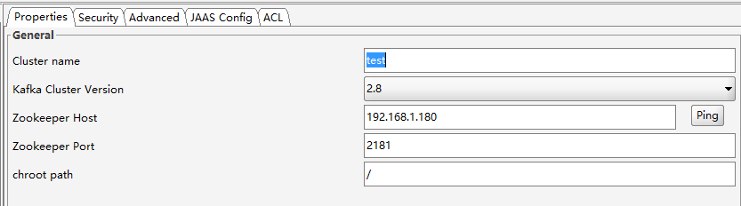

# 一、简介

消息（Message）是指在应用间传送的数据。消息可以非常简单，比如只包含文本字符串，也可以更复杂，可能包含嵌入对象。

消息队列（Message Queue）是一种应用间的通信方式，消息发送后可以立即返回，由消息系统来确保消息的可靠传递。消息发布者只管把消息发布到 MQ 中而不用管谁来取，消息使用者只管从 MQ 中取消息而不管是谁发布的。这样发布者和使用者都不用知道对方的存在。

消息队列是一种应用间的异步协作机制，那什么时候需要使用 MQ 呢？

以常见的订单系统为例，用户点击【下单】按钮之后的业务逻辑可能包括：扣减库存、生成相应单据、发红包、发短信通知。在业务发展初期这些逻辑可能放在一起同步执行，随着业务的发展订单量增长，需要提升系统服务的性能，这时可以将一些不需要立即生效的操作拆分出来异步执行，比如发放红包、发短信通知等。这种场景下就可以用 MQ ，在下单的主流程（比如扣减库存、生成相应单据）完成之后发送一条消息到 MQ 让主流程快速完结，而由另外的单独线程拉取MQ的消息（或者由 MQ 推送消息），当发现 MQ 中有发红包或发短信之类的消息时，执行相应的业务逻辑。

以上是用于业务解耦的情况，其它常见场景包括最终一致性、广播、错峰流控等等。


消息队列作为高并发系统的核心组件之一，能够帮助业务系统结构提升开发效率和系统稳定性，消息队列主要具有以下特点：

削峰填谷（主要解决瞬时写压力大于应用服务能力导致消息丢失、系统奔溃等问题）

系统解耦（解决不同重要程度、不同能力级别系统之间依赖导致一死全死）

提升性能（当存在一对多调用时，可以发一条消息给消息系统，让消息系统通知相关系统）

蓄流压测（线上有些链路不好压测，可以通过堆积一定量消息再放开来压测）

目前主流的消息队列软件有 RabbitMQ、kafka、ActiveMQ、RocketMQ 等

# 二、RabbitMQ

官方站点：[Messaging that just works — RabbitMQ](https://www.rabbitmq.com/)

RabbitMQ 是一个由 Erlang 语言开发的 AMQP 的开源实现。

AMQP ：Advanced Message Queue，高级消息队列协议。它是应用层协议的一个开放标准，为面向消息的中间件设计，基于此协议的客户端与消息中间件可传递消息，并不受产品、开发语言等条件的限制。

具体特点包括：

可靠性（Reliability）
 RabbitMQ 使用一些机制来保证可靠性，如持久化、传输确认、发布确认。

灵活的路由（Flexible Routing）
 在消息进入队列之前，通过 Exchange 来路由消息的。对于典型的路由功能，RabbitMQ 已经提供了一些内置的 Exchange 来实现。针对更复杂的路由功能，可以将多个 Exchange 绑定在一起，也通过插件机制实现自己的 Exchange 。

- 消息集群（Clustering）：多个 RabbitMQ 服务器可以组成一个集群，形成一个逻辑 Broker 。
- 高可用（Highly Available Queues）： 队列可以在集群中的机器上进行镜像，使得在部分节点出问题的情况下队列仍然可用。
- 多种协议（Multi-protocol）：RabbitMQ 支持多种消息队列协议，比如 STOMP、MQTT 等等。
- 多语言客户端（Many Clients）: RabbitMQ 几乎支持所有常用语言，比如 Java、.NET、Ruby 等等。
- 管理界面（Management UI）:RabbitMQ 提供了一个易用的用户界面，使得用户可以监控和管理消息 Broker 的许多方面。
- 跟踪机制（Tracing）: 如果消息异常，RabbitMQ 提供了消息跟踪机制，使用者可以找出发生了什么。
- 插件机制（Plugin System）:RabbitMQ 提供了许多插件，来从多方面进行扩展，也可以编写自己的插件。

https://www.jianshu.com/p/79ca08116d57

## 2.1 概念模型

​	所有 MQ 产品从模型抽象上来说都是一样的过程：消费者（consumer）订阅某个队列。生产者（producer）创建消息，然后发布到队列（queue）中，最后将消息发送到监听的消费者


上面只是最简单抽象的描述，具体到 RabbitMQ 则有更详细的概念需要解释。上面介绍过 RabbitMQ 是 AMQP 协议的一个开源实现，所以其内部实际上也是 AMQP 中的基本概念：


1. Message：消息，消息是不具名的，它由消息头和消息体组成。消息体是不透明的，而消息头则由一系列的可选属性组成，这些属性包括routing-key（路由键）、priority（相对于其他消息的优先权）、delivery-mode（指出该消息可能需要持久性存储）等。
2. Publisher：消息的生产者，也是一个向交换器发布消息的客户端应用程序。
3. Exchange：交换器，用来接收生产者发送的消息并将这些消息路由给服务器中的队列，message 到达 broker 的第一站，根据分发规则，匹配查询表中的 routing key，分发消息到 queue 中去。
4. Binding ：用于消息队列和交换器之间的关联，一个绑定就是基于路由键将交换器和消息队列连接起来的路由规则，所以可以将交换器理解成一个由绑定构成的路由表。信息被保存到 exchange 中的查询表中，用于 message 的分发依据。
5. Queue：消息队列，用来保存消息直到发送给消费者。它是消息的容器，也是消息的终点。一个消息可投入一个或多个队列。消息一直在队列里面，等待消费者连接到这个队列将其取走。
6. Connection: publisher／consumer 和 broker 之间的 TCP 连接
7. Channel: 信道，多路复用连接中的一条独立的双向数据流通道。信道是建立在真实的TCP连接内地虚拟连接，AMQP 命令都是通过信道发出去的，不管是发布消息、订阅队列还是接收消息，这些动作都是通过信道完成。因为对于操作系统来说建立和销毁 TCP 都是非常昂贵的开销，所以引入了信道的概念，以复用一条 TCP 连接。
8. Consumer：消息的消费者，表示一个从消息队列中取得消息的客户端应用程序。
9. Broker: 表示消息队列服务器实体，接收和分发消息的应用，RabbitMQ Server 就是 Message Broker。
10. Virtual host: 虚拟主机，表示一批交换器、消息队列和相关对象。虚拟主机是共享相同的身份认证和加密环境的独立服务器域。每个 vhost 本质上就是一个 mini 版的 RabbitMQ 服务器，拥有自己的队列、交换器、绑定和权限机制。vhost 是 AMQP 概念的基础，必须在连接时指定，RabbitMQ 默认的 vhost 是 / 。


## 2.2 AMQP 中的消息路由

AMQP 中消息的路由过程和 Java 开发者熟悉的 JMS 存在一些差别，AMQP 中增加了 Exchange 和 Binding 的角色。生产者把消息发布到 Exchange 上，消息最终到达队列并被消费者接收，而 Binding 决定交换器的消息应该发送到那个队列。


### Exchange 类型

Exchange分发消息时根据类型的不同分发策略有区别，目前共四种类型：direct、fanout、topic、headers 。headers 匹配 AMQP 消息的 header 而不是路由键，此外 headers 交换器和 direct 交换器完全一致，但性能差很多，目前几乎用不到了，所以直接看另外三种类型：

#### direct


消息中的路由键（routing key）如果和 Binding 中的 binding key 一致， 交换器就将消息发到对应的队列中。路由键与队列名完全匹配，如果一个队列绑定到交换机要求路由键为“dog”，则只转发 routing key 标记为“dog”的消息，不会转发“dog.puppy”，也不会转发“dog.guard”等等。它是完全匹配、单播的模式。

#### fanout


每个发到 fanout 类型交换器的消息都会分到所有绑定的队列上去。fanout 交换器不处理路由键，只是简单的将队列绑定到交换器上，每个发送到交换器的消息都会被转发到与该交换器绑定的所有队列上。很像子网广播，每台子网内的主机都获得了一份复制的消息。fanout 类型转发消息是最快的。

#### topic


topic 交换器通过模式匹配分配消息的路由键属性，将路由键和某个模式进行匹配，此时队列需要绑定到一个模式上。它将路由键和绑定键的字符串切分成单词，这些单词之间用点隔开。它同样也会识别两个通配符：符号“#”和符号“*”。#匹配0个或多个单词，*匹配不多不少一个单词。


## 2.3 单机部署

官方地址：[Downloading and Installing RabbitMQ — RabbitMQ](https://www.rabbitmq.com/download.html)

git:[Releases · rabbitmq/rabbitmq-server (github.com)](https://github.com/rabbitmq/rabbitmq-server/releases)

RabbitMQ 需要 Erlang/OTP 才能运行。标准 Debian 和 Ubuntu 存储库中的 Erlang/OTP 软件包可能已过时，[并且不受现代 RabbitMQ 版本的支持](https://www.rabbitmq.com/which-erlang.html)。


系统：ubuntu20.04LTS

rabbitmq:3.9.11

### 域名解析

==安装rabbitmq需要dns能够解析到自己主机名对应的ip地址，因此需要配置dns或者手动修改hosts文件==

==安装以后，千万不要随便改主机名，会造成服务无法启动==

```
vim /etc/hosts
192.168.1.180 RabbitMQ-node1
192.168.1.181 RabbitMQ-node2
192.168.1.182 RabbitMQ-node3
```


安装脚本

```
#!/usr/bin/sh

sudo apt-get install curl gnupg apt-transport-https -y

## Team RabbitMQ's main signing key
curl -1sLf "https://keys.openpgp.org/vks/v1/by-fingerprint/0A9AF2115F4687BD29803A206B73A36E6026DFCA" | sudo gpg --dearmor | sudo tee /usr/share/keyrings/com.rabbitmq.team.gpg > /dev/null
## Launchpad PPA that provides modern Erlang releases
curl -1sLf "https://keyserver.ubuntu.com/pks/lookup?op=get&search=0xf77f1eda57ebb1cc" | sudo gpg --dearmor | sudo tee /usr/share/keyrings/net.launchpad.ppa.rabbitmq.erlang.gpg > /dev/null
## PackageCloud RabbitMQ repository
curl -1sLf "https://packagecloud.io/rabbitmq/rabbitmq-server/gpgkey" | sudo gpg --dearmor | sudo tee /usr/share/keyrings/io.packagecloud.rabbitmq.gpg > /dev/null

## Add apt repositories maintained by Team RabbitMQ
sudo tee /etc/apt/sources.list.d/rabbitmq.list <<EOF
## Provides modern Erlang/OTP releases
##
## "bionic" as distribution name should work for any reasonably recent Ubuntu or Debian release.
## See the release to distribution mapping table in RabbitMQ doc guides to learn more.
deb [signed-by=/usr/share/keyrings/net.launchpad.ppa.rabbitmq.erlang.gpg] http://ppa.launchpad.net/rabbitmq/rabbitmq-erlang/ubuntu bionic main
deb-src [signed-by=/usr/share/keyrings/net.launchpad.ppa.rabbitmq.erlang.gpg] http://ppa.launchpad.net/rabbitmq/rabbitmq-erlang/ubuntu bionic main

## Provides RabbitMQ
##
## "bionic" as distribution name should work for any reasonably recent Ubuntu or Debian release.
## See the release to distribution mapping table in RabbitMQ doc guides to learn more.
deb [signed-by=/usr/share/keyrings/io.packagecloud.rabbitmq.gpg] https://packagecloud.io/rabbitmq/rabbitmq-server/ubuntu/ bionic main
deb-src [signed-by=/usr/share/keyrings/io.packagecloud.rabbitmq.gpg] https://packagecloud.io/rabbitmq/rabbitmq-server/ubuntu/ bionic main
EOF

## Update package indices
sudo apt-get update -y

## Install Erlang packages
sudo apt-get install -y erlang-base \
                        erlang-asn1 erlang-crypto erlang-eldap erlang-ftp erlang-inets \
                        erlang-mnesia erlang-os-mon erlang-parsetools erlang-public-key \
                        erlang-runtime-tools erlang-snmp erlang-ssl \
                        erlang-syntax-tools erlang-tftp erlang-tools erlang-xmerl

## Install rabbitmq-server and its dependencies
sudo apt-get install rabbitmq-server -y --fix-missing

```


ubuntu安装完毕后默认自动启动服务

```
root@RabbitMQ-node1:/usr/local/src# ps -ef | grep rabbitmq
rabbitmq    3324       1  6 22:50 ?        00:00:11 /usr/lib/erlang/erts-12.1.5/bin/beam.smp -W w -MBas ageffcbf -MHas ageffcbf -MBlmbcs 512 -MHlmbcs 512 -MMmcs 30 -P 1048576 -t 5000000 -stbt db -zdbbl 128000 -sbwt none -sbwtdcpu none -sbwtdio none -- -root /usr/lib/erlang -progname erl -- -home /var/lib/rabbitmq -- -pa  -noshell -noinput -s rabbit boot -boot start_sasl -syslog logger [] -syslog syslog_error_logger false
rabbitmq    3350    3324  0 22:50 ?        00:00:00 erl_child_setup 32768
rabbitmq    3409    3350  0 22:50 ?        00:00:00 inet_gethost 4
rabbitmq    3410    3409  0 22:50 ?        00:00:00 inet_gethost 4
root        4035    1404  0 22:53 pts/0    00:00:00 grep --color=auto rabbitmq
```


### 服务端口

```
5672：消费者访问的 端口
15672：web 管理端口
25672：集群状态通信端口
```


### web 管理

rabbitmq 支持通过插件方式进行系统管理，默认所有的插件都已经安装在服务中，只需要手动开启就可以了

```
# 启动管理插件
rabbitmq-plugins enable rabbitmq_management

# 启动插件不需要重启服务

```

登录：http://192.168.1.180:15672/


默认账号：user:gest		passwd:gest

rabbitmq 从 3.3.0 开始禁止使用 guest/guest 权限通过除 localhost 外的访问，需要修改配置文件允许外网登录

```
vim /usr/lib/rabbitmq/lib/rabbitmq_server-3.9.11/plugins/rabbit-3.9.11/ebin/rabbit.app

# 定义了默认账号和权限等等
 35         {default_user, <<"guest">>},
 36         {default_pass, <<"guest">>},
 37         {default_user_tags, [administrator]},
 38         {default_vhost, <<"/">>},
 39         {default_permissions, [<<".*">>, <<".*">>, <<".*">>]},
 # 这里进行了限制guset登录需要修改一下
 40         {loopback_users, [<<"guest">>]},
 # 改成这个样子
 			{loopback_users, []},


# 修改完毕需要重启服务
```

登录之后会显示当前系统状态


#### 创建用户

一般一个服务创建一个账户就好了


可以给账户分配不同的权限


进一步分配权限

点击选中的用户，可以进一步进行设置，如设置权限，更新密码，删除用户等操作


## 2.4 集群部署

Rabbitmq 集群分为二种方式：

- 普通模式：创建好 RabbitMQ 集群之后的默认模式。
- 镜像模式：把需要的队列做成镜像队列。


**普通集群模式**：queue 创建之后，如果没有其它 policy，消息实体只存在于其中一个节点，A、B 两个 Rabbitmq 节点仅有相同的元数据，即队列结构，但队列的数据仅保存有一份，即创建该队列的 rabbitmq 节点（A 节点），当消息进入 A 节点的 Queue 中后，consumer 从 B 节点拉取时，RabbitMQ 会临时在 A、B 间进行消息传输，把 A 中的消息实体取出并经过 B 发送给 consumer，所以 consumer 可以连接每一个节点，从中取消息，该模式存在一个问题就是当 A 节点故障后，B节点无法取到 A 节点中还未消费的消息实体。类似于redis集群，每个节点都单独存储自己的数据，但是节点损坏后，数据将丢失。

**镜像集群模式：**把需要的队列做成镜像队列，存在于多个节点，属于 RabbitMQ 的 HA 方案（镜

像模式是在普通模式的基础上，增加一些镜像策略）该模式解决了普通模式中的数据丢失问题，其实质和普通模式不同之处在于，消息实体会主动在镜像节点间同步，而不是在 consumer 取数据时临时拉取，该模式带来的副作用也很明显，除了降低系统性能外，如果镜像队列数量过多，加之大量的消息进入，集群内部的网络带宽将会被这种同步通讯大大消耗掉，所以在对可靠性要求较高的场合中适用，一个队列想做成镜像队列，需要先设置 policy，

然后客户端创建队列的时候，rabbitmq 集群根据“队列名称”自动设置是普通集群模式或镜像队列。（）


**集群中节点类型**：

- 内存节点：只将数据保存到内存
- 磁盘节点：保存数据到内存和磁盘

内存节点虽然不写入磁盘，但是它执行性能比磁盘节点要好，集群中，只需要一个磁盘节点来保存数据就足够了，如果集群中只有内存节点，那么不能全部停止它们，否则所有数据消息在服务器全部停机之后都会丢失。


**推荐设计架构**：

在一个 rabbitmq 集群里，有 3 台或以上机器，其中 1 台使用磁盘模式，其它节点使用内存模式，内存节点无访问速度更快，由于磁盘 IO 相对较慢，因此可作为数据备份使用。


### 配置集群

准备三台主机并安装rabbitMQ，并且配好hosts文件互相能够解析ip

```
vim /etc/hosts
192.168.1.180 RabbitMQ-node1
192.168.1.181 RabbitMQ-node2
192.168.1.182 RabbitMQ-node3
```

Rabbitmq 的集群是依赖于 erlang 的集群来工作的，所以必须先构建起 erlang 的集群环境,而 Erlang 的集群中各节点是通过一个 magic cookie 来实现的，这个cookie 存放在 /var/lib/rabbitmq/.erlang.cookie 中，文件是 400 的权限,所以必须保证各节点 cookie 保持一致，否则节点之间就无法通信。

```
scp /var/lib/rabbitmq/.erlang.cookie  192.168.1.181:/var/lib/rabbitmq/.erlang.cookie
root@192.168.1.181's password: 
.erlang.cookie                                                                          100%   20    14.2KB/s   00:00    
scp /var/lib/rabbitmq/.erlang.cookie  192.168.1.182:/var/lib/rabbitmq/.erlang.cookie
root@192.168.1.182's password: 
.erlang.cookie

# 重启服务
```

查看单节点状态

```
Cluster status of node rabbit@RabbitMQ-node1 ...
Basics
Cluster name: rabbit@RabbitMQ-node1
Disk Nodes
rabbit@RabbitMQ-node1
Running Nodes
rabbit@RabbitMQ-node1
Versions
rabbit@RabbitMQ-node1: RabbitMQ 3.9.11 on Erlang 24.1.7
Maintenance status
Node: rabbit@RabbitMQ-node1, status: not under maintenance
...
# 过长省略一部分
```


向集群中添加主机

在node2、3中执行操作者，将自己添加到node1中

```
# 先停止app服务、然后清空元数据
rabbitmqctl stop_app
Stopping rabbit application on node rabbit@RabbitMQ-node2 ...
rabbitmqctl reset
Resetting node rabbit@RabbitMQ-node2 ...

# 向node1进行注册
rabbitmqctl join_cluster rabbit@RabbitMQ-node1 --ram	# 不加--ram 默认是磁
盘节点
rabbitmqctl start_app
rabbitmqctl cluster_status


```

错误：[error] Node 'rabbit@RabbitMQ-node3' thinks it's clustered with node 'rabbit@RabbitMQ-node1', but 'rabbit@RabbitMQ-node1' disagrees

总是出现这个，但是实际上集群已经加进去了，而且所有主机的集群状态都是正常的


### **镜像模式：**

再集群中任意一台主机执行即可

```
rabbitmqctl set_policy ha-all "#" '{"ha-mode":"all"}'
Setting policy "ha-all" for pattern "#" to "{"ha-mode":"all"}" with priority "0" for 
vhost "/" ...
```


## 2.5 管理命令

```
/usr/lib/rabbitmq/lib/rabbitmq_server-3.9.11/sbin/

rabbitmqctl*	# 创建用户等、服务管理、清除数据等
rabbitmq-defaults*
rabbitmq-diagnostics*
rabbitmq-env*
rabbitmq-plugins*	# 插件管理
rabbitmq-queues*
rabbitmq-server*
rabbitmq-streams*
rabbitmq-tanzu*
rabbitmq-upgrade*
```


### rabbitmqctl

https://docs.openstack.org/mitaka/zh_CN/install-guide-ubuntu/environment-messaging.html


	#创建 vhost
	root@mq-server1:~# rabbitmqctl add_vhost magedu 
	Adding vhost "magedu" ...
	
	#列出所有 vhost
	root@mq-server1:~# rabbitmqctl list_vhosts 
	Listing vhosts ...
	name
	magedu
	
	#列出所有队列
	root@mq-server1:~# rabbitmqctl list_queues 
	Timeout: 60.0 seconds ...
	Listing queues for vhost / ...
	
	#删除指定 vhost
	root@mq-server1:~# rabbitmqctl delete_vhost magedu 
	Deleting vhost "magedu" ...
	
	#添加账户 jack 密码为 123456
	root@mq-server1:~# rabbitmqctl add_user jack 123456 
	Adding user "jack" ...
	
	#更改用户密码
	root@mq-server1:~# rabbitmqctl change_password jack 654321
	Changing password for user "jack" ...
	
	#设置 jack 用户对 magedu 的 vhost 有读写权限，三个点为配置正则、读和写
	root@mq-server1:~# rabbitmqctl set_permissions -p magedu jack ".*" ".*" ".*"
	Setting permissions for user "jack" in vhost "magedu" ...
	
	# 查看所有插件
	rabbitmq-plugins list 


## 2.6 API: 

### 集群状态监控

```
#!/bin/env python3
#coding:utf-8

import subprocess
running_list = []
error_list = []
false = "false"
true = "true"
def get_status():
  obj = subprocess.Popen(("curl -s -u guest:guest http://localhost:15672/api/nodes &> /dev/null"), shell=True,stdout=subprocess.PIPE)
  data = obj.stdout.read()
  data1 = eval(data)
  for i in data1:
    if i.get("running") == "true":
      running_list.append(i.get("name"))
    else:
      error_list.append(i.get("name"))

def count_server():
  if len(running_list) < 3: # 可以判断错误列表大于 0 或者运行列表小于 3，3未总计的节点数量
    print(101) # 100 就是集群内有节点运行不正常了
  else:
    print(50) # 50 为所有节点全部运行正常

def main():
  get_status()
  count_server()

if __name__ == "__main__":
"rabbit_cluster_monitor.py" 30L, 812C                                                                                     1,1           Top
#!/bin/env python3
#coding:utf-8

import subprocess
running_list = []
error_list = []
false = "false"
true = "true"
def get_status():
  obj = subprocess.Popen(("curl -s -u guest:guest http://localhost:15672/api/nodes &> /dev/null"), shell=True,stdout=subprocess.PIPE)
  data = obj.stdout.read()
  data1 = eval(data)
  for i in data1:
    if i.get("running") == "true":
      running_list.append(i.get("name"))
    else:
      error_list.append(i.get("name"))

def count_server():
  if len(running_list) < 3: # 可以判断错误列表大于 0 或者运行列表小于 3，3未总计的节点数量
    print(101) # 100 就是集群内有节点运行不正常了
  else:
    print(50) # 50 为所有节点全部运行正常

def main():
  get_status()
  count_server()

if __name__ == "__main__":
  main()
```


内存使用监控:

```
#!/bin/env python3
#coding:utf-8
import subprocess
import sys
running_list = []
error_list = []
false = "false"
true = "true"
def get_status():
    obj = subprocess.Popen(("curl -s -u guest:guest http://localhost:15672/api/nodes &> /dev/null"), shell=True,stdout=subprocess.PIPE)
    data = obj.stdout.read()
    data1 = eval(data)
    # print(data1)
    for i in data1:
        if i.get("name") == sys.argv[1]:
            print(i.get("mem_used"))

def main():
    get_status()

if __name__ == "__main__":
    main()


root@RabbitMQ-node1:/usr/local/src# python3 rabbit_memory.py rabbit@RabbitMQ-node1
148852736

```


# 三、ZooKeeper 

官方站点：https://zookeeper.apache.org/

ZooKeeper 是一个分布式服务框架，它主要是用来解决分布式应用中经常遇到的一些数据管理问题，如：命名服务、状态同步、配置中心、集群管理等。

**命名服务：**

命名服务是分布式系统中比较常见的一类场景。命名服务是分布式系统最基本的公共服务之一。在分布式系统中，被命名的实体通常可以是集群中的机器、提供的服务地址或远程对象等——这些我们都可以统称它们为名字（Name），其中较为常见的就是一些分布式服务框架（如 RPC、RMI）中的服务地址列表，通过使用命名服务，客户端应用能够根据指定名字来获取资源的实体、服务地址和提供者的信息等。

状态同步：

每个节点除了存储数据内容和 node 节点状态信息之外，还存储了已经注册的APP 的状态信息，当有些节点或 APP 不可用，就将当前状态同步给其他服务。

**配置中心：**

现在我们大多数应用都是采用的是分布式开发的应用，搭建到不同的服务器上，我们的配置文件，同一个应用程序的配置文件一样，还有就是多个程序存在相同的配置，当我们配置文件中有个配置属性需要改变，我们需要改变每个程序的配置属性，这样会很麻烦的去修改配置，那么可用使用 ZooKeeper 来实现配置中心，ZooKeeper 采用的是推拉相结合的方式： 客户端想服务端注册自己需要关注的节点，一旦该节点的数据发生变更，那么服务端就会向相应的客户端发送Watcher 事件通知，客户端接收到这个消息通知后，需要主动到服务端获取最新的数据。

**集群管理：**

所谓集群管理，包括集群监控与集群控制两大块，前者侧重对集群运行时状态的收集，后者则是对集群进行操作与控制，在日常开发和运维过程中，我们经常会有类似于如下的需求


相对于直接调用方式：
IP地址是相对固定的，不能随意更换地址，当有服务宕机或不可用时需要手动去修改

对于容器环境不好解决IP固定的问题，不好横向扩容增加服务数量

解决了服务的动态发现，以及后端服务的高可用情况。


ZooKeeper 具有以下两大特性

```
客户端如果对 ZooKeeper 的一个数据节点注册 Watcher 监听，那么当该数据节点的内容或是其子节点列表发生变更时，ZooKeeper 服务器就会向订阅的客户端发送变更通知。

对在 ZooKeeper 上创建的临时节点，一旦客户端与服务器之间的会话失效，那么该临时节点也就被自动清除。
```


Watcher（事件监听器），是 Zookeeper 中的一个很重要的特性。Zookeeper 允许用户在指定节点上注册一些 Watcher，并且在一些特定事件触发的时候，

ZooKeeper 服务端会将事件通知到感兴趣的客户端上去，该机制是 Zookeeper实现分布式协调服务的重要特性。


工作流程：

1. 生产者启动
2. 生产者注册至 zookeeper
3.  消费者启动并订阅频道
4. zookeeper 通知消费者事件
5. 消费者调用生产者
6. 监控中心负责统计和监控服务状态


## 3.2 安装部署

### java环境

官方介绍：https://zookeeper.apache.org/doc/r3.4.14/zookeeperAdmin.html#sc_requiredSoftware

```
ZooKeeper runs in Java, release 1.7 or greater (JDK 7 or greater, FreeBSD support requires openjdk7)
```

安装Java

```
apt install openjdk-8-jdk -y

root@RabbitMQ-node1:/usr/local/src# java -version
openjdk version "1.8.0_292"
OpenJDK Runtime Environment (build 1.8.0_292-8u292-b10-0ubuntu1~20.04-b10)
OpenJDK 64-Bit Server VM (build 25.292-b10, mixed mode)
```


ZooKeeper下载地址：https://archive.apache.org/dist/zookeeper/ 

### 单机部署：

版本：zookeeper-3.4.14.tar.gz

```
 tar xvf zookeeper-3.4.14.tar.gz
 ln -sv /usr/local/src/zookeeper-3.4.14 /usr/local/zookeeper
 
 # 复制模板配置文件
cd /usr/local/zookeeper/conf/
cp zoo_sample.cfg zoo.cfg

# 修改配置文件
root@RabbitMQ-node1:/usr/local/zookeeper/conf#  grep ^[a-Z] zoo.cfg
tickTime=2000
initLimit=10
syncLimit=5
dataDir=/data/zookeeper	# 数据存储目录
clientPort=2181	# 对外服务端口
```

启动服务

```
 /usr/local/zookeeper/bin/zkServer.sh start
```


日志配置：

日志默认存放在/usr/local/src/zookeeper-3.4.14/conf/zookeeper.out

该日志的配置地址在conf/目录下的log4j.properties文件中，该文件中有一个配置项为“zookeeper.log.dir=.”，表示log4j日志文件在与执行程序（zkServer.sh）在同一目录下。当执行zkServer.sh 时，在该文件夹下会产生zookeeper.out日志文件。下面主要介绍事务日志与快照日志。

https://blog.csdn.net/sinat_33201781/article/details/81872917

### 3.3 集群部署


集群特征：集群中需要超过集群数量一半的 zookeeper 工作正常的，集群状态才算正常，否则无法对外提供服务。集群节点一般是以奇数的方式进行部署。3、5、7等。

==**最少三个节点**==

​	假如有 2 台服务器做了一个 zookeeper集群，只要有任何一台故障或宕机，那么这个 zookeeper 集群就不可用了，因为剩下的一台没有超过集群一半的数量，但是假如有三台 zookeeper 组成一个集群，那么损坏一台就还剩两台，大于 3 台的一半，所以损坏一台还是可以正常运行的，但是再损坏一台就只剩一台集群就不可用了。那么要是 4 台组成一个zookeeper 集群，损坏一台集群肯定是正常的，那么损坏两台就还剩两台，那么2 台不大于集群数量的一半，所以 3 台的 zookeeper 集群和 4 台的 zookeeper 集群损坏两台的结果都是集群不可用，以此类推 5 台和 6 台以及 7 台和 8 台都是。

集群结构：


集群角色：


#### 集群配置

```
# 修改配置文件
tickTime=2000 # 服务器与服务器之间的单次心跳检测时间间隔，单位为毫秒
initLimit=10 # 集群中 leader 服务器与 follower 服务器初始连接心跳次数，即多少个 2000 毫秒
syncLimit=5 # leader 与 follower 之间连接完成之后，后期检测发送和应答的心跳次数，如果该 follower 在设置的时间内(5*2000)不能与 leader 进行通信，那么此 follower 将被视为不可用。
dataDir=/usr/local/zookeeper/data # 自定义的 zookeeper 保存数据的目录
clientPort=2181 # 客户端连接 Zookeeper 服务器的端口，Zookeeper 会监听这个端口，接受客户端的访问请求
maxClientCnxns=128 # 单个客户端 IP 可以和 zookeeper 保持的连接数
autopurge.snapRetainCount=3 # 3.4.0 中的新增功能：启用后，ZooKeeper 自动清除功能会将 autopurge.snapRetainCount 最新快照和相应的事务日志分别保留在 dataDir 和 dataLogDir 中，并删除其余部分，默认值为 3。最小值为 3。
autopurge.purgeInterval=1 # 3.4.0 及之后版本，ZK 提供了自动清理日志和快照文件的功能，这个参数指定了清理频率，单位是小时，需要配置一个 1 或更大的整数，默认是 0，表示不开启自动清理功能
server.1=172.18.0.101:2888:3888 # server.服务器编号=服务器 IP:LF 数据同步端口:LF 选举端口
server.2=172.18.0.102:2888:3888
server.3=172.18.0.103:2888:3888

# 将配置文件复制到每个节点
scp zoo.cfg  192.168.1.181:/usr/local/zookeeper/conf/
scp zoo.cfg  192.168.1.182:/usr/local/zookeeper/conf/

# 每个节点创建数据目录
mkdir /data/zookeeper/  -p
```

设置每个节点的集群id

```
# server.1=172.18.0.101:2888:3888
echo "1" > /data/zookeeper/myid

# server.2=172.18.0.101:2888:3888
echo "2" > /data/zookeeper/myid

# server.3=172.18.0.101:2888:3888
echo "3" > /data/zookeeper/myid
/data/zookeeper/myid

```


启动服务：

```
# 每个节点要同时启动服务
/usr/local/zookeeper/bin/zkServer.sh start
```


查看集群状态

```
/usr/local/zookeeper/bin/zkServer.sh status

# server.1
ZooKeeper JMX enabled by default
Using config: /usr/local/zookeeper/bin/../conf/zoo.cfg
Mode: follower

# server.2
ZooKeeper JMX enabled by default
Using config: /usr/local/zookeeper/bin/../conf/zoo.cfg
Mode: follower

# server.3
ZooKeeper JMX enabled by default
Using config: /usr/local/zookeeper/bin/../conf/zoo.cfg
Mode: leader
```


### 管理命令

zookeeper提供了zkCli.sh的客户端工具，可以连接到集群任意节点进行读写操作

```
/usr/local/zookeeper/bin/zkCli.sh -server 192.168.1.180:2181

# 支持的命令
stat path [watch]
set path data [version]
ls path [watch]
delquota [-n|-b] path
ls2 path [watch]
setAcl path acl
setquota -n|-b val path
history 
redo cmdno
printwatches on|off
delete path [version]
sync path
listquota path
rmr path
get path [watch]
create [-s] [-e] path data acl
addauth scheme auth
quit 
getAcl path
close 
connect host:port
```


写入测试数据

```
[zk: 192.168.1.181:2181(CONNECTED) 1]  create /test "hello"       # 写入数据    
Created /test

get /test 	# 验证数据，可以到其他节点验证数据是否一致
```


数据写入规则：集群人为数据过半节点写入完成，就认为已经写入完毕并反馈给生产者结果。


### 3.4 图形客户端

https://github.com/zzhang5/zooinspector

```
git clone https://github.com/zzhang5/zooinspector.git
cd zooinspector/
apt install maven -y
mvn clean package

# 编译完成后启动
```


登录后能够看到之前写入的数据


# 四、kafka


官方地址：http://kafka.apache.org/

Kafka 被称为下一代分布式消息系统，是非营利性组织 ASF(Apache Software Foundation，简称为 ASF)基金会中的一个开源项目，比如 HTTP Server、Hadoop、ActiveMQ、Tomcat 等开源软件都属于 Apache 基金会的开源软件，类似的消息系统还有 RbbitMQ、ActiveMQ、ZeroMQ


kafka 最主要的优势是其具备分布式功能、并可以结合 zookeeper 可以实现动态扩容，Kafka 是一种高吞吐量的分布式发布订阅消息系统。


**kafka** **优势**：

1. kafka 通过 O(1)[^1]的磁盘数据结构提供消息的持久化，这种结构对于即使数以 TB的消息存储也能够保持长时间的稳定性能。
2. 高吞吐量：即使是非常普通的硬件 Kafka 也可以支持每秒数百万的消息。
3. 支持通过 Kafka 服务器分区消息。
4. 支持 Hadoop 并行数据加载。

## 模型概念


### kafka 角色： 

- Broker：Kafka 集群包含一个或多个服务器，这种服务器被称为 broker。
- Topic ：每条发布到 Kafka 集群的消息都有一个类别，这个类别被称为 topic，（物理上不同 topic 的消息分开存储在不同的文件夹，逻辑上一个 topic 的消息虽然保存于一个或多个 broker 上但用户只需指定消息的 topic 即可生产或消费数据而不必关心数据存于何处），就是订阅频道。
- Partition ：是物理上的概念，每个 topic 包含一个或多个 partition，创建 topic 时可指定 parition 数量，每个 partition 对应于一个文件夹，该文件夹下存储该partition 的数据和索引文件（类似于es服务器的分片，就是几个备份）
- Producer：负责发布消息到 Kafka broker。
- Consumer：消费消息，每个 consumer 属于一个特定的 consuer group（可为每个consumer 指定 group name，若不指定 group name 则属于默认的 group），使用consumer high level API 时，同一 topic 的一条消息只能被同一个 consumer group内的一个 consumer 消费，但多个 consumer group 可同时消费这一消息


### 数据存储：

kafka的集群信息元数据，topic等注册信息都保存在zookper中，但是具体的massige信息都保存自己kafka的节点上

kafka和redis等消息队列软件最大的区别就是数据存储在磁盘上，消费者获取数据后不会立即删除，而是会保存下来，并通过游标来控制数据读取。

num.partitions分区：类似于es服务器的分片，创建几个分区就是在几个节点上保存，有几个分区，就是创建几个备份。

https://cloud.tencent.com/developer/news/625424


## 集群部署

下载地址：[Apache Kafka](https://kafka.apache.org/downloads) 目前最新版3.0，

- Released September 21, 2021
- [Release Notes](https://downloads.apache.org/kafka/3.0.0/RELEASE_NOTES.html)
- Source download: [kafka-3.0.0-src.tgz](https://www.apache.org/dyn/closer.cgi?path=/kafka/3.0.0/kafka-3.0.0-src.tgz) ([asc](https://downloads.apache.org/kafka/3.0.0/kafka-3.0.0-src.tgz.asc), [sha512](https://downloads.apache.org/kafka/3.0.0/kafka-3.0.0-src.tgz.sha512))
- Binary downloads:
  - Scala 2.12  - [kafka_2.12-3.0.0.tgz](https://www.apache.org/dyn/closer.cgi?path=/kafka/3.0.0/kafka_2.12-3.0.0.tgz) ([asc](https://downloads.apache.org/kafka/3.0.0/kafka_2.12-3.0.0.tgz.asc), [sha512](https://downloads.apache.org/kafka/3.0.0/kafka_2.12-3.0.0.tgz.sha512))
  - Scala 2.13  - [kafka_2.13-3.0.0.tgz](https://www.apache.org/dyn/closer.cgi?path=/kafka/3.0.0/kafka_2.13-3.0.0.tgz) ([asc](https://downloads.apache.org/kafka/3.0.0/kafka_2.13-3.0.0.tgz.asc), [sha512](https://downloads.apache.org/kafka/3.0.0/kafka_2.13-3.0.0.tgz.sha512))

kafka使用Scala语言实现，官方提供了多个Scala版本的包，一般根据公司要求选择合适的Scala 版本的包

[Scala（编程语言）_百度百科 (baidu.com)](https://baike.baidu.com/item/Scala/2462287?fr=aladdin)


Kafka 3.0.0 包含许多重要的新功能。以下是一些值得注意的变化的摘要： 目前不推荐生产使用

[弃用 Java 8，Apache Kafka 3.0 发布！|java|应用程序|key|apache|kafka_网易订阅 (163.com)](https://www.163.com/dy/article/GKJFQIJN0511FQO9.html)

- 弃用对 Java 8 和 Scala 2.12 的支持
- Kafka Raft 支持元数据主题的快照以及自我管理仲裁中的其他改进
- 默认启用的 Kafka 生产者提供更强的交付保证
- 弃用消息格式 v0 和 v1
- OffsetFetch 和 FindCoordinator 请求中的优化
- 更灵活的镜像制作器 2 配置和镜像制作器 1 的弃用
- 能够在 Kafka Connect 中的单个呼叫中重新启动连接器的任务
- 连接器日志上下文和连接器客户端覆盖现在默认处于启用状态
- 增强了 Kafka 流中时间戳同步的语义
- 改进了 Stream 的 TaskId 的公共 API
- 默认 serde 在 Kafka 中变为空

安装java环境要求11


```
tar xf kafka_2.13-3.0.0.tgz 
ln -sv /usr/local/src/kafka_2.13-3.0.0 /usr/local/kafka

# 编辑配置文件
cd /usr/local/kafka/config/
vim server.properties 

broker.id=1 每个 broker 在集群中的唯一标识，正整数。
listeners=PLAINTEXT://192.168.1.185:9092 #监听地址
log.dirs=/usr/local/kafka/kafka-logs #kakfa 用于保存数据的目录，所有的消息都会存储在该目录当中
num.partitions=1 # 设置创新新的 topic 默认分区数量
log.retention.hours=168 # 设置 kafka中消息保存时间，默认为 168 小时即 7 天

#zookeeper.connect 指定连接的zk的地址,zk 中存储broker的元数据信息,格式如下
zookeeper.connect=192.168.1.180:2181,192.168.1.181:2181,192.168.1.182:2181
zookeeper.connection.timeout.ms=6000 # 设置连接 zookeeper 的超时时间，默认6秒钟
```

将配置文件复制到每个节点上，并且修改自己的id和监听地址

```
# node 2
broker.id=2
listeners=PLAINTEXT://192.168.1.186:9092

# node 3
broker.id=3
listeners=PLAINTEXT://192.168.1.187:9092
```


启动服务

```
/usr/local/kafka/bin/kafka-server-start.sh  -daemon /usr/local/kafka/config/server.properties
```


进入zookeeper查看kafka的元数据


kafka的元数据

```
1：Broker依赖于Zookeeper，每个Broker的id和Topic、Partition 这些元数据信息都会写入 Zookeeper的ZNode 节点中；

2：Consumer依赖于 Zookeeper，Consumer 在消费消息时，每消费完一条消息，会将产生的offset保存到Zookeeper 中，下次消费在当前 offset 往后继续消费；
# kafka0.9 之前 Consumer 的 offset 存储在 Zookeeper 中，kafka0,9 以后 offset存储在本地。

3：Partition 依赖于 Zookeeper，Partition 完成 Replication 备份后，选举出一个Leader，这个是依托于 Zookeeper的选举机制实现的；
```


创建topic：

```
/usr/local/kafka/bin/kafka-topics.sh --create --bootstrap-server 192.168.1.185:9092  --partitions 3 --replication-factor 3 --topic test
Created topic test.

# 创建3个分区，和3个副本
```

ZooKeeper 中马上就能看见了


去另一台主机查看

```
root@lafila-node2:/usr/local/kafka/config# /usr/local/kafka/bin/kafka-topics.sh --describe --bootstrap-server 192.168.1.186:9092  --topic test

Topic: test	TopicId: FI8TD7kpQGGkQ0U4Dhwlcg	PartitionCount: 3	ReplicationFactor: 3	Configs: segment.bytes=1073741824
	Topic: test	Partition: 0	Leader: 2	Replicas: 2,1,3	Isr: 2,1,3
	Topic: test	Partition: 1	Leader: 3	Replicas: 3,2,1	Isr: 3,2,1
	Topic: test	Partition: 2	Leader: 1	Replicas: 1,3,2	Isr: 1,3,2


# 获取topic：
/usr/local/kafka/bin/kafka-topics.sh --list --bootstrap-server 192.168.1.185:9092
test

```


向topic中发送数据

```
root@lafila-node2:/usr/local/kafka/config# /usr/local/kafka/bin/kafka-console-producer.sh --broker-list 192.168.1.186:9092 --topic test
>msg ohhad
>12345
>hahdafae

```

所有发送的数据保存在配置文件的data目录中

```
root@kafuka-node1:/data/kafka/kafka-logs# ls /data/kafka/kafka-logs/
-rw-r--r-- 1 root root    0 Dec 10 13:38 cleaner-offset-checkpoint
-rw-r--r-- 1 root root    0 Dec 10 13:38 .lock
-rw-r--r-- 1 root root    4 Dec 10 14:48 log-start-offset-checkpoint
-rw-r--r-- 1 root root   88 Dec 10 13:53 meta.properties
-rw-r--r-- 1 root root   31 Dec 10 14:48 recovery-point-offset-checkpoint
-rw-r--r-- 1 root root   31 Dec 10 14:48 replication-offset-checkpoint
drwxr-xr-x 2 root root 4096 Dec 10 14:45 test-0/
drwxr-xr-x 2 root root 4096 Dec 10 14:15 test-1/
drwxr-xr-x 2 root root 4096 Dec 10 14:15 test-2/

# 每个topic都是一个文件夹，test一共3个分区，所以有3个文件夹
```


使用工具查看数据[Offset Explorer (kafkatool.com)](https://www.kafkatool.com/download.html)，

添加zookeeper地址



添加kafka地址


客户端连接如果显示是二进制的数据，改成string就能看。


点击update之后查看数据


消费者读取数据

```
root@kafuka-node3:/data/kafka/kafka-logs# /usr/local/kafka/bin/kafka-console-consumer.sh --from-beginning --bootstrap-server 192.168.1.186:9092 --topic test
msg ohhad
hahdafae
12345

# 生产者发送的数据会很快过来
```


**==使用logstash写入kafuka需要现将数据codec => json==**


# 五、微服务与 dubbo框架

[官网：Apache Dubbo](https://dubbo.apache.org/zh/)

[阿里云微服务：EDAS零侵入支持Spring Cloud和Dubbo - 阿里云 (aliyun.com)](https://promotion.aliyun.com/ntms/act/edasdubbo.html?utm_content=se_1005011324)

[Dubbo概述 (aliyun.com)](https://help.aliyun.com/document_detail/99299.html?spm=5176.261987.1367952.1.6f112f4doomrxR)


工作流程：

Dubbo服务框架的工作流程如下：

1. 提供者在启动时，在注册中心注册服务。
2. 消费者在启动时，在注册中心订阅所需的服务。
3. 注册中心返回提供者地址列表给消费者。如果提供者发生变更，注册中心将推送变更数据给消费者。
4. 消费者基于软负载均衡算法，从提供者地址列表中选一个提供者进行调用。


支持多种服务


duboo框架使用zookeeper注册配置

[Zookeeper 注册中心 | Apache Dubbo](https://dubbo.apache.org/zh/docs/references/registry/zookeeper/)

使用提供的测试包进行测试

 dubbo-demo-provider-2.1.5

```
tar xf dubbo-demo-provider-2.1.5-assembly.tar.gz
vim dubbo-demo-provider-2.1.5/conf/dubbo.properties 

dubbo.container=log4j,spring
dubbo.application.name=demo-provider
dubbo.application.owner=
#dubbo.registry.address=multicast://224.5.6.7:1234
dubbo.registry.address=zookeeper://192.168.1.180:2181 | zookeeper://192.168.1.181:2181 | zookeeper://192.168.1.182:2181
#dubbo.registry.address=redis://127.0.0.1:6379
#dubbo.registry.address=dubbo://127.0.0.1:9090
dubbo.monitor.protocol=registry
dubbo.protocol.name=dubbo
dubbo.protocol.port=20880
dubbo.log4j.file=logs/dubbo-demo-provider.log
dubbo.log4j.level=WARN


```


启动provider服务

需要jdk8

```
# 需要先安装netstat
apt install net-tools
apt-get install netcat


# 启动服务
root@RabbitMQ-node1:~/dubbo-demo-provider-2.1.5# bin/start.sh 
Starting the demo-provider .....OK!
PID: 111754
STDOUT: logs/stdout.log


# 查看启动日志
tial -f  dubbo-demo-provider-2.1.5/logs/stdout.log 

# 查看业务日志
tail -f logs/dubbo-demo-provider.log


# 开发写的程序要在里边添加资源限制
JAVA_MEM_OPTS=" -server -Xmx1g -Xms1g -Xmn256m -XX:PermSize=128m -Xss256k -XX:+DisableExplicitGC -XX:+UseConcMarkSweepGC 
-XX:+CMSParallelRemarkEnabled -XX:+UseCMSCompactAtFullCollection -XX:LargePageSizeInBytes=128m -XX:+UseFastAccessorMethods -XX:+U
seCMSInitiatingOccupancyOnly -XX:CMSInitiatingOccupancyFraction=70 "
```

已经向zookeeper中进行了注册


启动consumer

只需要配置zookeeper的地址，将会自动获取到provider的服务地址

```
vim conf/dubbo.properties 
dubbo.container=log4j,spring
dubbo.application.name=demo-consumer
dubbo.application.owner=
#dubbo.registry.address=multicast://224.5.6.7:1234
dubbo.registry.address=zookeeper://192.168.1.180:2181 | zookeeper://192.168.1.181:2181 | zookeeper://192.168.1.182:2181
#dubbo.registry.address=redis://127.0.0.1:6379
#dubbo.registry.address=dubbo://127.0.0.1:9090
dubbo.monitor.protocol=registry
dubbo.log4j.file=logs/dubbo-demo-consumer.log
dubbo.log4j.level=WARN

# 启动该服务
bin/start.sh
```


服务启动后，消费者了自己获取到了提供者的地址并取得消息

root@RabbitMQ-node2:~/dubbo-demo-consumer-2.1.5# tail -f logs/stdout.log 
[16:30:46] Hello world12, response form provider: 192.168.1.180:20880
[16:30:48] Hello world13, response form provider: 192.168.1.180:20880
[16:30:50] Hello world14, response form provider: 192.168.1.180:20880
[16:30:52] Hello world15, response form provider: 192.168.1.180:20880
[16:30:54] Hello world16, response form provider: 192.168.1.180:20880
[16:30:56] Hello world17, response form provider: 192.168.1.180:20880
[16:30:58] Hello world18, response form provider: 192.168.1.180:20880
[16:31:00] Hello world19, response form provider: 192.168.1.180:20880
[16:31:02] Hello world20, response form provider: 192.168.1.180:20880
[16:31:04] Hello world21, response form provider: 192.168.1.180:20880


### Dubbo Admin

准备一个tomcat服务器

```
# 编辑配置文件
vim /usr/local/tomcat/conf/server.xml 
  <Host name="localhost"  appBase="/data/tomcat/webapps"
            unpackWARs="true" autoDeploy="true">


# 将Dubbo Admin放到配置的目录中去
root@tomcat-node1:/data/tomcat/webapps/ROOT# unzip dubboadmin.wa
root@tomcat-node1:/data/tomcat/webapps/ROOT# mv dubboadmin/* 
rm dubboadmin dubboadmin.war  -rf

# 编辑配置文件，修改注册地址
root@tomcat-node1:/data/tomcat/webapps/ROOT# vim WEB-INF/dubbo.properties 
dubbo.registry.address=zookeeper://192.168.1.180:2181 | zookeeper://192.168.1.181:2181 | zookeeper://192.168.1.182:2181
dubbo.admin.root.password=root	# 默认密码
dubbo.admin.guest.password=guest

/usr/local/tomcat/bin/catalina.sh stop
/usr/local/tomcat/bin/catalina.sh start


```


# 六、Nexus

Nexus 是一个强大的 Maven 仓库管理器，它极大地简化了自己内部仓库的维护和外部仓库的访问。可以将镜像缓存到本地。

http://repo.maven.apache.org # maven 官方仓库：

https://help.sonatype.com/repomanager3/download/download-archives---repository-manager-3 #官方下载页面


推荐4c8g

nexus由java开发，需要java8

```
tar xf nexus-3.37.0-01-unix.tar.gz

 ./bin/nexus start
```

启动后会监听8081端口

可以通过修改配置文件，监听不同的端口，但是一般很少修改配置文件，都是通过网页方式进行配置

```
root@tomcat-node1:/usr/local/src/nexus-3.37.0-01# grep 8081  ./* -R
./etc/nexus-default.properties:application-port=8081
```

等可以后默认的账号是admin 登录后需要重置密码


默认仓库： nexus提供了3个仓库，通常使用proxy来代理内网的apt包加速

```
Hosted：本地仓库，通常我们会部署自己的构件到这一类型的仓库，比如公司的第三方库

Proxy：代理仓库，它们被用来代理远程的公共仓库，如 maven 中央仓库(官方仓库)。 

Group：仓库组，用来合并多个 hosted/proxy 仓库，当你的项目希望在多个repository 使用资源时就不需要多次引用了，只需要引用一个 group 即可。
```


通过 nexus 作为公司内网 yum 仓库,通过阿里云镜像安装包

https://mirrors.aliyun.com/zabbix/zabbix/4.4/rhel/7/x86_64/ 


创建完毕后会提供一个内网的镜像url，复制到yum的镜像源里去


centos 7.x 配置 yum 仓库：

```
[root@localhost ~]# cat /etc/yum.repos.d/zabbix.repo 
[zabbix-nexus]
name=zabbix
baseurl=http://192.168.1.131:8081/repository/zabbix-proxy/
enabled=1
gpgcheck=0
```


**nexus** **数据备份：** 

Nexus 中普通数据信息和元数据是分开存储的，普通数据是保存在 blob 中，而元数据保存在数据库中，所以在备份的时候必须同时进行备份普通数据和元数据，才能在后期恢复数据的时候保证数据的最终完整性。

```
blob 数据：
普通数据信息在Nexus中是保存在blob中的，所以此部分数据必须进行备份，blob的典型配置中，此目录对应着 Nexus的数据目录的blobs子目录。

元数据：
元数据在 Nexus 中是在数据库中进行保存的，为了保证数据的完整性，Nexus需要同时将数据库中的数据进行导出和备份
```

nexus提供了定时备份任务，可以定时备份到指定位置，但是一般直接将程序目录和blob仓库目录直接tar打包备份走就好了。


[^1]: O(1)就是最低的时空复杂度了，也就是耗时/耗空间与输入数据大小无关，无论 输入数据增大多少倍，耗时/耗空间都不变，哈希算法就是典型的 O(1)时间复杂 度，无论数据规模多大，都可以在一次计算后找到目标