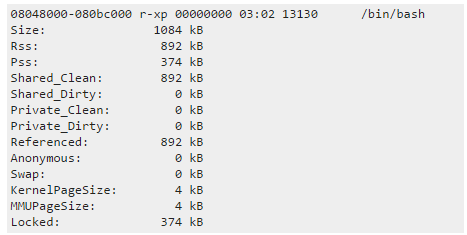

# 系统参数：

# 进程相关：

linux /proc/pid/smaps文件

https://blog.csdn.net/u010902721/article/details/46446031

各字段含义

# 内存相关：

查看哪些文件使用了交换分区

http://northernmost.org/blog/find-out-what-is-using-your-swap/

有内存剩余的情况下，swap被使用的原因

[[转\]找到MySQL发生swap的原因 - 风的_理想 - 博客园 (cnblogs.com)](https://www.cnblogs.com/janehoo/p/7725042.html)

OOM的话就是内存耗尽了，一般和大事务慢查询跑批有关，crash一般和bug有关，bug分已解决的bug和未解决的bug，先去mysql dev上搜是否存在类似已存在的bug，如果查找不到就得用gdb调试定位crash的原因了

# 磁盘相关：

当du和df命令查看磁盘占用不一致情况：

https://www.cnblogs.com/sanduzxcvbnm/p/8081306.html

### 读写测试

IOZone：

https://blog.csdn.net/weixin_42146764/article/details/88692804

# 网络相关：

# 系统启动流程：

ubuntu20.04 引导信息丢失修复

ls 看一下有哪几个设备，我当时用的逻辑卷 在lvm-XXX下边

grub> set root=(hd2,gpt5) 

grub> linxu /boot/vmlinuz-5.0.0-37-generic ro root=/dev/mapper/vgubuntu-root

grub> initrd /boot/initrd.img

grub> boot

sudo grub-install sudo update-grub

https://www.cnblogs.com/battor/p/ubuntu_boot_repair.html

