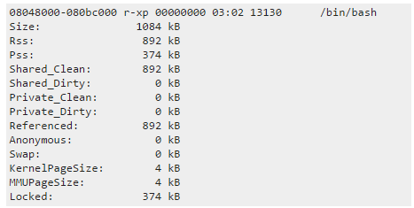

http://northernmost.org/blog/find-out-what-is-using-your-swap/

swap使用情况

linux /proc/pid/smaps各字段含义

https://blog.csdn.net/u010902721/article/details/46446031

[[转\]找到MySQL发生swap的原因 - 风的_理想 - 博客园 (cnblogs.com)](https://www.cnblogs.com/janehoo/p/7725042.html)

OOM的话就是内存耗尽了，一般和大事务慢查询跑批有关，crash一般和bug有关，bug分已解决的bug和未解决的bug，先去mysql dev上搜是否存在类似已存在的bug，如果查找不到就得用gdb调试定位crash的原因了